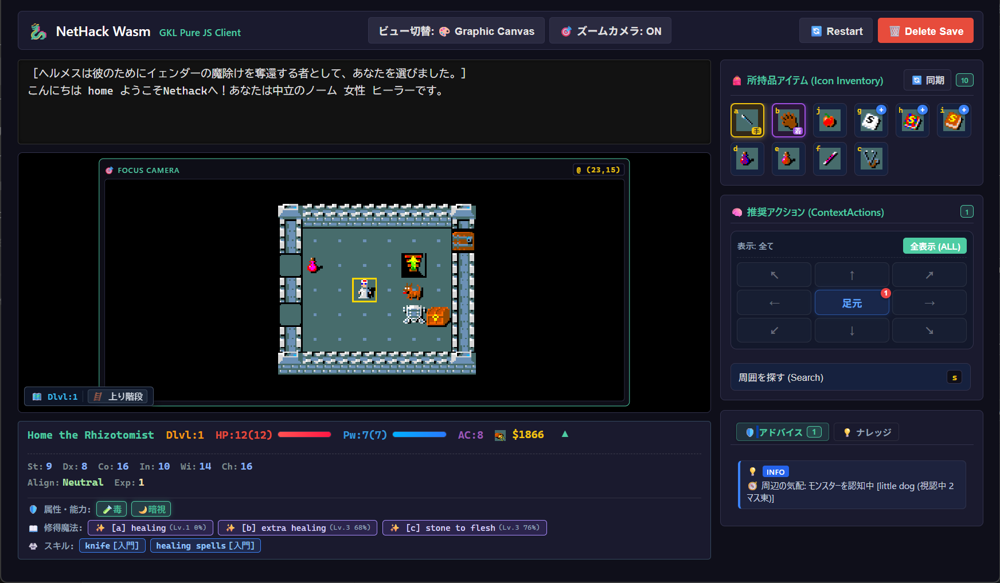
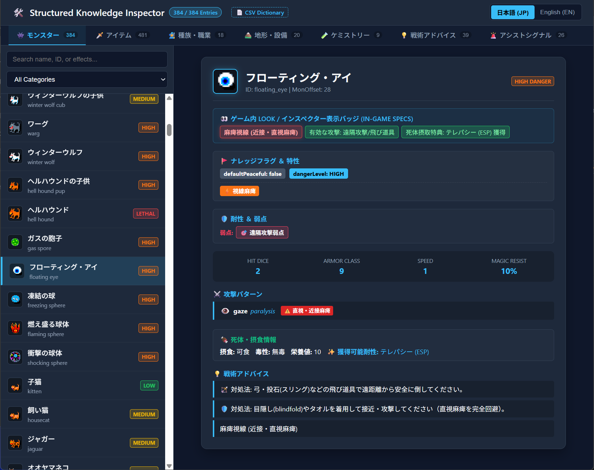

# NetHack WASM WebUI

NetHack 5.0 を WebAssembly にコンパイルし、Web Worker と共通コア `WebUICore` を通じてブラウザ上で動作・操作できるようにしたプロジェクトです。

コア層で入出力や状態管理、日本語翻訳、音響、補助機能（GKL）をまとめて扱えるように設計されており、Pure JS や各種モダンフレームワーク（Vue, React, Svelte, SolidJS）から利用できます。

👉 **[🎮 ブラウザでプレイ (Demo)](https://e3sh.github.io/Nethack-wasm-webUI/)**  
👉 **[🔍 ナレッジインスペクター (GKL 内部知識ベース)](https://e3sh.github.io/Nethack-wasm-webUI/tools/knowledge-inspector.html)**

---

## 📸 画面イメージ & ナレッジインスペクター

| GKL Pure JS クライアント (プレイ画面) | ナレッジインスペクター (GKL 内部知識ベース) |
| :---: | :---: |
|  |  |
| 周辺ズーム、アイコンインベントリ、文脈に応じた推奨アクション | 構造化されたモンスター・アイテム・ハザード・耐性の内部知識ベース |

---

## 📌 主な機能

- **Web Worker による分離実行 (`@nethack/wasm-driver`)**:  
  NetHack のゲーム処理を Web Worker 上で実行し、UI の応答性を維持します。IndexedDB を利用したセーブデータの保存に対応しています。

- **共通コア `WebUICore` による一元管理**:  
  キー入力（修飾キーや方向キーの正規化）、プロンプトダイアログのデータ変換、ゲームのリスタート処理などをコア側で処理します。

- **GKL (Game Knowledge Layer) によるプレイ補助 & 構造化知識ベース**:  
  C言語側の通信データからダンジョン情報（地形・アイテム・モンスター）や所持品をリアルタイム解析し、状況に合わせた推奨行動（掘る、拾う、解錠、対モンスター戦術など）の提示や、プレイヤー周辺のズーム表示をサポートします。  
  さらに、NetHack 5.0 (3.7) の公式データに準拠した **全 384 モンスター・全 481 アイテム・種族/職業の内在能力・地形・相互作用（ケミストリー）を網羅する構造化知識ベース** を内蔵しています。

- **日本語翻訳機能**:  
  辞書データ（`param/nhMessage.js`）をもとに、メッセージやステータス表示をリアルタイムで日本語化します。マスター辞書（`dictionary.csv`）からの変換スクリプトも同梱されています。

- **音響効果 (Web Audio API)**:  
  ゲーム内のアクションに応じた効果音（音声アセットまたは Beep 合成音）を再生します。

---

## 🖥️ クライアント実装例 (`examples/`)

各フレームワークでの実装方法やイベント処理の詳細は、それぞれのディレクトリ内のコードを参照してください。

| ディレクトリ | 構成 | 説明 |
| :--- | :--- | :--- |
| `examples/vue-client` | Vue 3 + TypeScript | 2カラムUI、フォーカスカメラ、GKL連携（アシスト、インベントリ、ナレッジ等）を含む実装例 |
| `examples/react-client` | React 18 + TypeScript | React 18 と Zustand による 2カラムUI ＆ GKL連携の実装例 |
| `examples/solid-client` | SolidJS + TypeScript | SolidJS Signals/Store による 2カラムUI ＆ GKL連携の実装例 |
| `examples/svelte-client` | Svelte + TypeScript | Svelte ストアによる 2カラムUI ＆ GKL連携の実装例 |
| `examples/gkl-pure-js-client` | Vanilla JS / CSS | フレームワーク非依存の純粋な JS / CSS による GKL 連携サンプル |
| `examples/pure-js-client` | Vanilla JS | 最小限の Pure JS 実装 |
| `examples/legacy-client` | Canvas 2D / Touch | Canvas タイル描画とモバイル用バーチャルパッド実装 |

---

## 📁 ディレクトリ構成

```text
Nethack-wasm-webUI/
├── src/                        # 共通ロジック
│   ├── core/                   # WebUICore (入力/翻訳/音響/状態管理/GKL)
│   │   ├── inspector/          # DevTools Inspector (実行時デバッグ・翻訳管理コンソール)
│   │   ├── knowledge/          # GKL (構造化知識ベース・戦術アドバイザー・マップ解析)
│   │   ├── translation/        # リアルタイム翻訳エンジン
│   │   ├── sound/              # Web Audio 音響処理
│   │   ├── input/              # 入力正規化・キーマッパー
│   │   └── lifecycle/          # リスタート・ゲームオーバー処理
│   ├── driver/                 # WASM 実行ドライバー (Web Worker)
│   └── client/                 # クライアント補助コード
├── examples/                   # 各種フロントエンド実装例 (Pure JS, Vue, React, Svelte, Solid)
├── tools/                      # 開発・管理・インスペクターツール
│   ├── knowledge-inspector.html# GKL 構造化知識インスペクター (ゲーム内知識ベース閲覧)
│   ├── dict_converter.py      # 辞書相互変換スクリプト (CSV ⇔ JS)
│   ├── save_manager.html       # セーブデータ管理ツール
│   └── config.html             # 設定ツール
├── assets/                     # 静的アセット (images: スクリーンショット, sounds: 効果音)
├── pict/                       # タイルマップ画像 (nethack_default_32.png 等)
├── docs/                       # 設計仕様書・アーキテクチャドキュメント
├── tests/                      # テストスイート (Vitest)
├── param/                      # 実行時辞書 (nhMessage.js 等)
├── dictionary.csv              # マスター翻訳辞書 (CSV)
└── index.html                  # ポータル画面
```

---

## 🛠️ 開発・実行方法

### 1. ローカルサーバーの起動

静的ファイルとして動作するため、任意のローカル HTTP サーバーで実行できます。

```bash
git clone https://github.com/e3-sh/Nethack-wasm-webUI.git
cd Nethack-wasm-webUI

# ローカルサーバー起動例 (Python)
python -m http.server 8000
```

ブラウザで `http://localhost:8000/` を開くとポータル画面が表示されます。

### 2. テストの実行

```bash
npm install
npm test          # Vitest によるテスト実行
```

---

## 🧰 開発・デバッグ用ツール

### 辞書の更新フロー (`dict_converter.py`)
マスターデータ `dictionary.csv` を編集した後、以下のコマンドで実行用辞書 `param/nhMessage.js` を生成・更新します。

```bash
# dictionary.csv の内容を param/nhMessage.js に反映
python tools/dict_converter.py import
```

### DevTools Inspector & ユーティリティ
ブラウザから利用できる開発・デバッグ用コンソールおよび知識ベース検証ツールです。

- **`tools/knowledge-inspector.html` (Structured Knowledge Inspector)**:  
  GKL が内蔵する全 384 モンスター、全 481 アイテム、種族・職業の内在能力、地形、ケミストリー、戦術アドバイスを網羅的に閲覧・検証できる静的インスペクター。公式タイル拡大表示、日英対訳、耐性・弱点・即死ハザードの確認に対応。
- **`src/core/inspector/inspector_console.html` (DevTools Inspector)**:  
  `BroadcastChannel` でゲーム画面と連動する独立デバッグコンソール。GKL 状態ツリーの閲覧、イベント監視、手動入力注入に加え、「📝 翻訳管理」タブから**未翻訳メッセージのリアルタイム収集**や**日英対比ログの確認・CSVエクスポート**が行えます。
- **`tools/save_manager.html`**: IndexedDB セーブデータのエクスポート・インポート
- **`tools/config.html`**: 表示や操作パラメータの設定

---

## 📚 ドキュメント

詳しい設計や仕様については `docs/` ディレクトリを参照してください。

- [逆引き設定・セーブデータ管理 FAQ / 開発者ガイド](docs/FAQ_and_Configuration_Guide.md)
- [GKL 構造化知識ベース & 戦術統合アーキテクチャ (SSOT)](docs/3_gkl/archive/GKL_Knowledge_SSOT_and_Tactical_Integration_Architecture.md)
- [GKL 仕様書](docs/3_gkl/gkl_documentation.md)
- [WASM Driver 仕様書](docs/1_driver/driver_core_spec.md)
- [WebUICore 利用ガイド](docs/2_client_ui/WebUICore_Usage_Guide.md)
- [翻訳・DevTools Inspector 統合仕様書](docs/9_translation/archive/translation_inspector_integration_plan.md)
- [翻訳辞書運用マニュアル](docs/9_translation/DICTIONARY_OPERATION.md)

---

## 📜 ライセンス

- **NetHack**: [NetHack General Public License](https://www.nethack.org/common/license.html)
- **WebUICore & WebUI 実装**: MIT License
