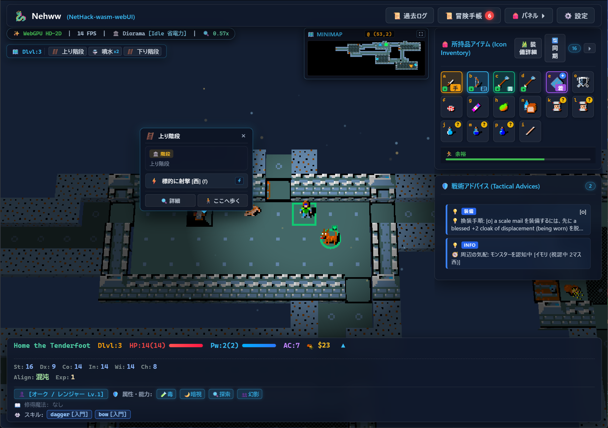
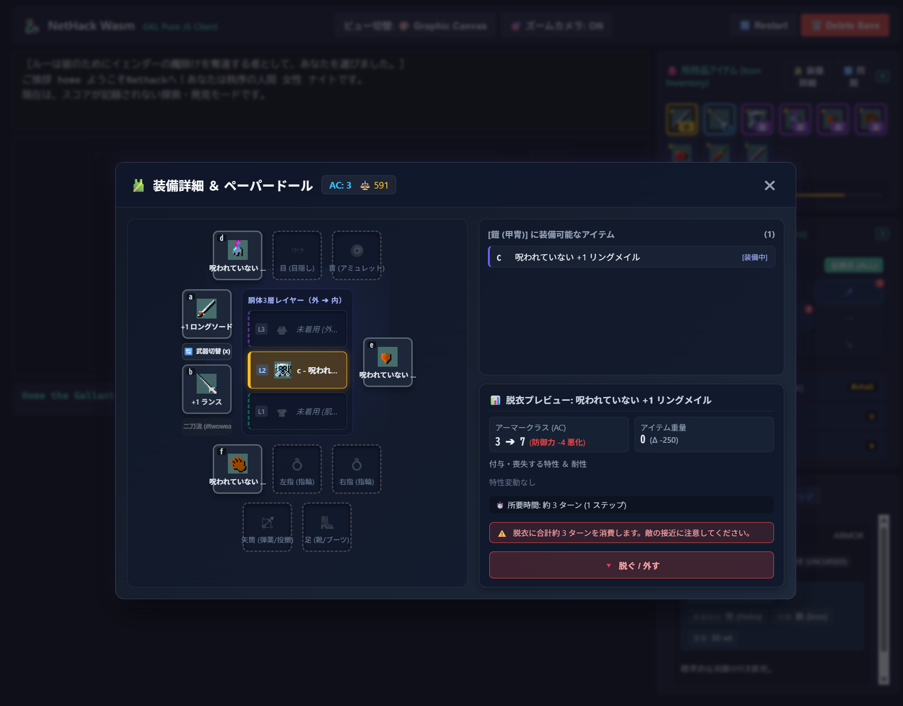
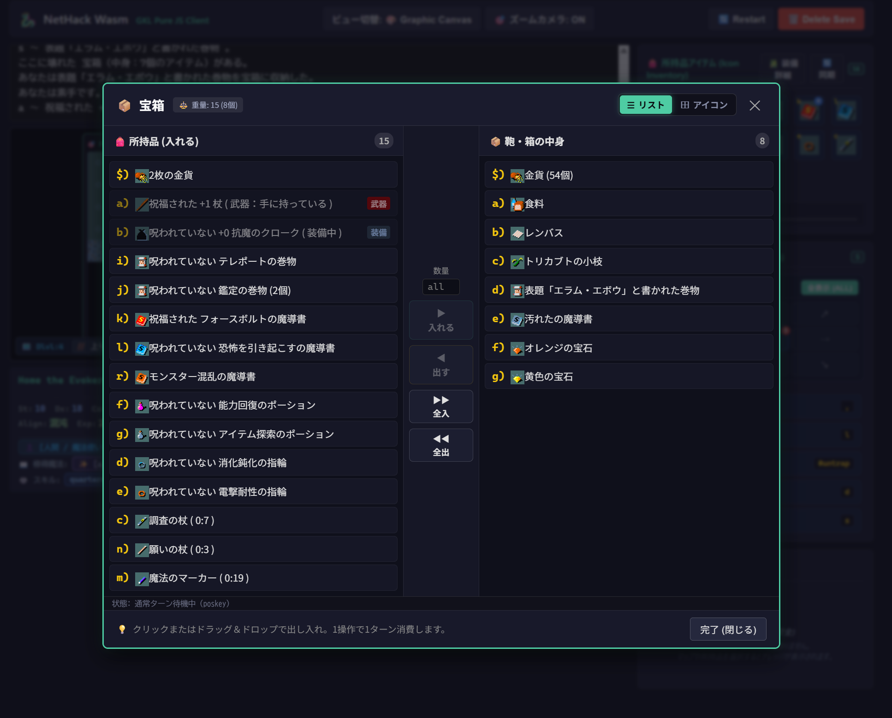
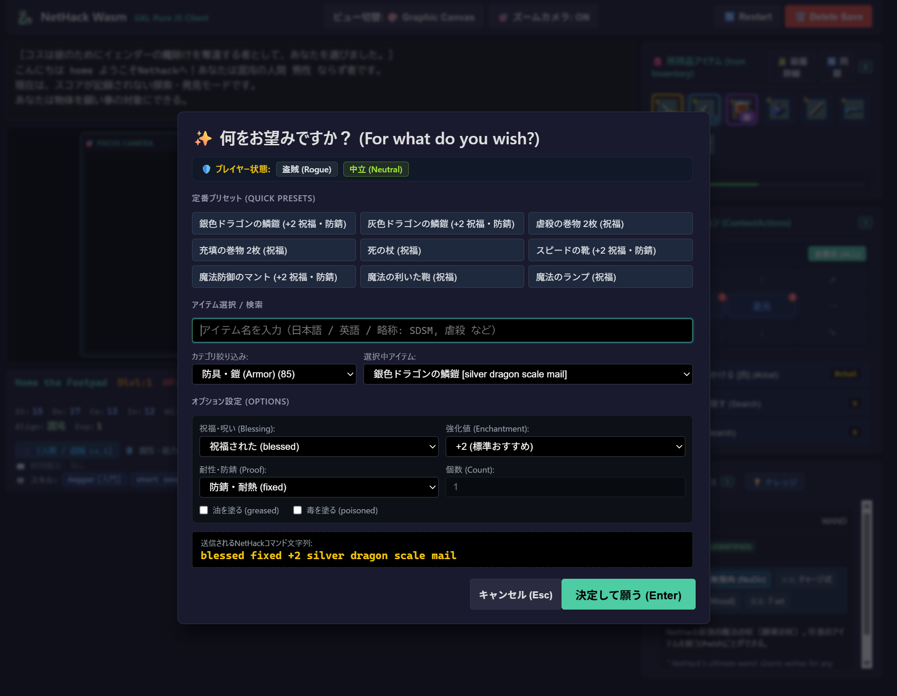
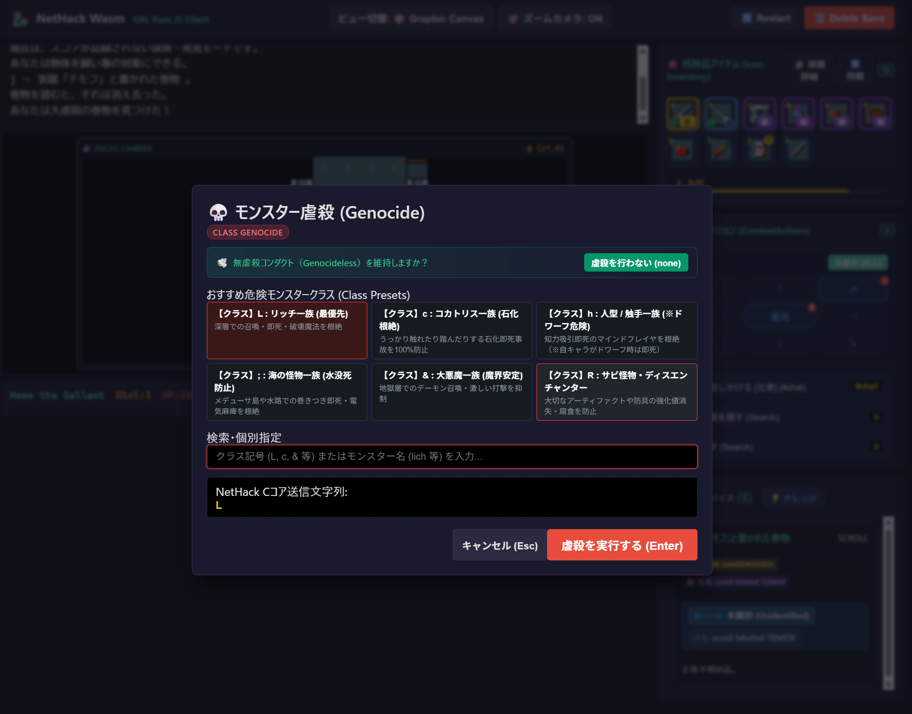
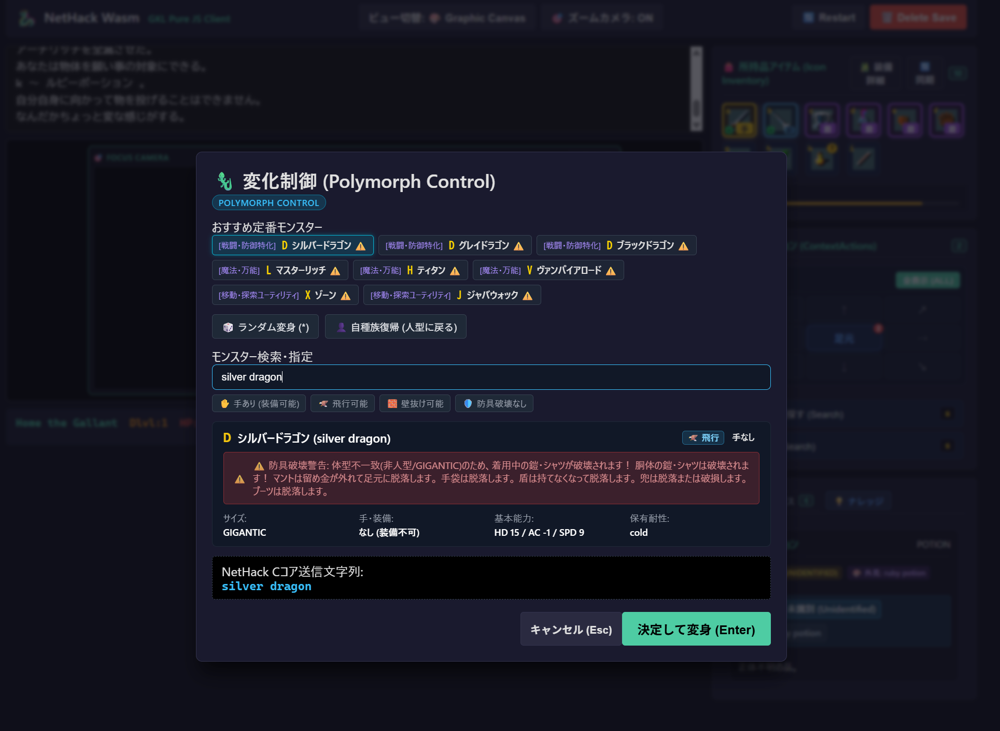
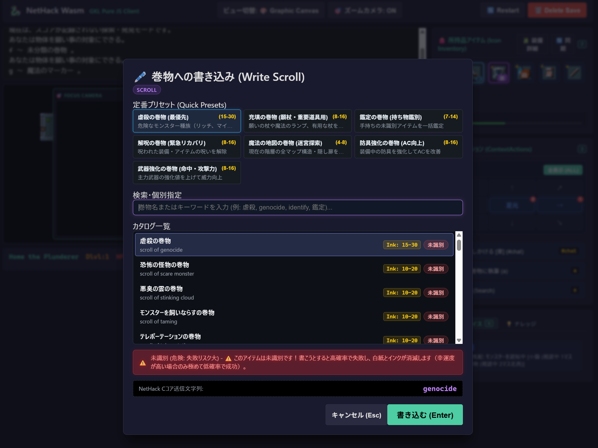
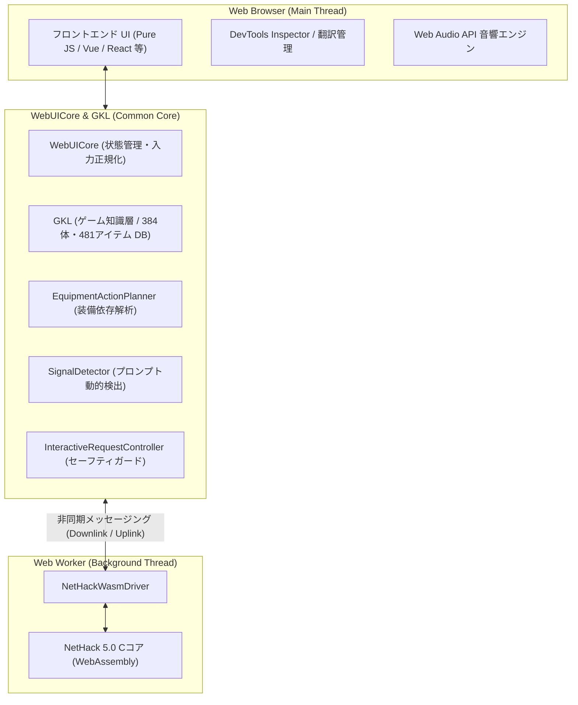

# Nehww (NetHack-wasm-webUI)

NetHack 5.0 を WebAssembly にコンパイルし、Web Worker と共通コア `WebUICore` を通じてブラウザ上で快適に動作・操作できるようにしたモダンな WebUI プロジェクトです。
公式リファレンスクライアントとして **Nehww** を搭載しています。

クラシックな NetHack の深いゲーム性をそのままに、リアルタイム日本語翻訳、リッチなペーパードール装備管理、コンテナ操作、初心者〜中級者の事故死を防ぐ各種入力支援ダイアログ、状況判断支援を行うゲーム知識層（GKL: Game Knowledge Layer）を統合しています。

👉 **[🎮 ブラウザでプレイ (Nehww デモ)](https://e3sh.github.io/Nethack-wasm-webUI/)**  
👉 **[📖 かんたん操作ガイド (Nehww 遊び方・画面の見方)](./examples/gkl-pure-js-client/PLAYER_GUIDE.md)**  
👉 **[🔍 ナレッジインスペクター (GKL 内部知識ベース)](https://e3sh.github.io/Nethack-wasm-webUI/tools/knowledge-inspector.html)**

---

## 📸 画面イメージ & UIギャラリー

### メインゲーム画面 & 直感的なアイテム・装備管理
| 公式リファレンスクライアント「Nehww」(メイン画面) | 装備詳細 & ペーパードール |
| :---: | :---: |
|  |  |
| フォーカスカメラ、リアルタイムHUD、周辺モンスター気配検知、ワンクリック推奨アクション | 胴体3層レイヤー（外套/鎧/シャツ）、AC・重量変化シミュレーション、**脱衣所要ターン数と事故リスク警告** |

| コンテナ操作UI (宝箱・鞄) | Structured Knowledge Inspector |
| :---: | :---: |
|  |  |
| 所持品と箱の2カラムインベントリ、D&D・数量指定・一括出し入れ対応 | 全 384 モンスター・481 アイテムの耐性・弱点・即死ハザードを網羅した公式データ知識ベース |

<details>
<summary><b>🔍 各種入力支援ダイアログのスクリーンショット（願い・虐殺・変化制御・巻物書き込み）を展開する</b></summary>

<br />

| 何をお望みですか？ (願い支援) | モンスター虐殺 (Genocide) |
| :---: | :---: |
|  |  |
| 定番プリセット（SDSM、虐殺、死の杖等）、日本語/英語/略称検索、祝福・強化値のGUI設定と**送信コマンド文字列プレビュー** | 最優先危険クラス（L, c, h, ;, &, R）のワンクリック指定、**無虐殺コンダクト維持ボタン**（※単体モンスター個別虐殺時の専用画面にも対応） |

| 変化制御 (Polymorph Control) | 巻物への書き込み (Write Scroll) |
| :---: | :---: |
|  |  |
| 戦闘・魔法・探索など用途別定番変身、飛行/壁抜け等の特性表示、**体型不一致による防具破壊・脱落の事前警告** | 定番プリセット、必要インク量目安表示、**未識別失敗・白紙ロスト警告**（※魔導書・本への書き込み専用画面にも対応） |

</details>

---

## ✨ 主な機能 & 特長

### 1. 🎮 直感的でモダンなゲームプレイ UI (`examples/gkl-pure-js-client`)
- **全画面マップ ＋ イマーシブHUD (Neo-Retro Dark Glass UI)**:  
  100vw × 100vh の全画面ダンジョンビューに、フロストガラス（透過ブラー ＋ 極細ボーダー）とサイバーシアンのアクセントカラーで統一された本格PCゲームライクなHUDを配置。視界を遮らないフローティングメッセージHUD、キー操作（`Ctrl+P`）やワンタップで展開できる過去ログドロワー（画面左端📌固定対応）、サイドパネルのクイック一時退避・ワンタップ復帰（`Alt+S` / `F2` / 画面右端Peekタブ）を搭載。
- **ペーパードール装備管理**:  
  人体の各スロットおよび NetHack 特有の「胴体3層構造（外：外套 / 中：鎧 / 内：肌着・シャツ）」を視覚化。装備・脱衣に伴う AC の増減、重量変化、および**「脱衣にかかる消費ターン数（敵の接近リスク）」**を事前にプレビューできます。
- **2カラム・コンテナUI**:  
  宝箱や魔法の鞄（Bag of Holding）の中身と所持品を左右に並べ、ドラッグ＆ドロップや数量指定、全入・全出ボタンでスムーズに整理できます。
- **コンテキストアクション（推奨行動ボタン）**:  
  状況をリアルタイム解析し、「ペットに話しかける」「隠し扉・罠を探す」「足元のアイテムを拾う」など、いま実行すべきアクションをワンクリックで提示します。
- **周辺フォーカスカメラ ＆ スムーズズーム**:  
  プレイヤーを中心としたスムーズな追従カメラとマウスホイールによる直感的な拡大縮小により、ダンジョン探索の視認性を飛躍的に高めています。

### 2. 🧙‍♂️ 初心者救済 & 事故死防止の入力支援ダイアログ
NetHack 特有の「英語での正確な文字列入力」や「知識不足による理不尽な死」を防ぐ専用モーダルを完備：
- **願い (Wish)**:  
  定番アイテムのプリセットや、祝福・呪い、+2などの強化値、防錆加工（fixed）をGUIで選択。送信される NetHack コマンド（例: `blessed fixed +2 silver dragon scale mail`）がリアルタイムに確認できます。
- **虐殺 (Genocide)**:  
  初心者キラーであるリッチー（L）、コカトリス（c）、マインドフレイヤ（h）などの危険クラス一括根絶に加え、**単体モンスター個別虐殺時の専用画面・プリセット**にも完全対応。コンダクト（縛りプレイ）プレイヤーのための「虐殺を行わない (none)」も用意。
- **変化制御 (Polymorph)**:  
  シルバードラゴンやマスターリッチなど定番モンスターへの変身をアシスト。変身時に**着用中の防具が破壊・脱落するハザードを赤枠で事前警告**します。
- **巻物・魔導書の書き込み (Write)**:  
  魔法のマーカーでの書き込み時に、必要なインク量目安を表示。**巻物だけでなく魔導書（本）への書き込み画面**も備え、未識別のアイテムを書こうとした際の**消失・大失敗リスクを警告**します。

### 3. 🧠 GKL (Game Knowledge Layer) & 構造化知識ベース
- C言語側の通信データからダンジョン情報（地形・アイテム・モンスター）や所持品をリアルタイム解析。
- 周辺の気配（モンスターの接近・視認状況）や、弱点・有効な攻撃手段をリアルタイムにアドバイス。
- NetHack 5.0 (3.7) 公式データ準拠の **全 384 モンスター・全 481 アイテム・種族/職業の内在能力・地形・ケミストリー（相互作用）** を網羅する構造化知識ベースを内蔵。

### 4. 🌐 Web Worker & WebAssembly アーキテクチャ
- NetHack のゲームコアを Web Worker 上で完全分離実行し、UI の応答性を維持。
- IndexedDB を利用した安定したセーブ・ロードに対応。

### 5. 🇯🇵 完全リアルタイム日本語翻訳
- メッセージログやステータス表示を辞書ベースでリアルタイムに日本語化。
- 辞書コンバーター（CSV ⇔ JS）および未翻訳テキストの収集・管理コンソールを同梱。

### 6. 🔊 Web Audio API による音響効果
- 移動、戦闘、アイテム使用などのゲーム内アクションに応じた効果音（音声アセットまたは合成音）を再生。

---

## 🏗️ アーキテクチャと設計方針

本プロジェクトは、NetHack 本体の C ソースコードを直接改変するのではなく、公式コードの完全性を維持したまま WebAssembly 化し、Web Worker と独立した共通コア層（`WebUICore` / `GKL`）を介して安全に協調動作させる設計をとっています。



### 1. 非侵襲的な多層レイヤー構造
C 言語コアには手を加えず、WASM ドライバー、共通コア（`WebUICore`）、および知識層（`GKL`）を独立して配置しています。これにより、C コア側の保守性を損なうことなく、モダンな Web 技術と連携させています。

### 2. 非同期プロトコルと復帰処理 (`InteractiveRequestController` / `ContainerSafetyGuard`)
C 言語の同期型ブロッキング入力待ちと、ブラウザの非同期 UI イベントを状態管理します。
- **セッションロック**: 連続リクエスト処理中の二重入力を抑止。
- **自動 ESC 復帰ガード**: 通信遅延やゲーム内の予期せぬ分岐で応答待ちが停滞した場合、タイムアウト検知により自動で ESC キー列を送信し、通常状態へ安全に復帰させます。

### 3. プロンプト検出とコマンド生成 (`SignalDetector` / `ActionRecipeFactory`)
C コアが出力するテキストストリームから「願い」「虐殺」「変化」「マーカー書き込み」「コンテナ操作」などのプロンプトを正規表現で検出して構造化データに変換。UI 側での選択内容を NetHack 形式のキーストローク列（アクションレシピ）として生成し、C コアに送信します。

### 4. 装備依存関係の解析 (`EquipmentActionPlanner`)
「外套を脱がなければ鎧は脱げない」「両手が塞がっていると指輪の着脱に制限がある」といった NetHack 独自の装備ルールを解析し、着脱に必要な手順や消費ターン数を事前に算出します。

### 5. 自動テストによる動作検証
Vitest による自動テストスイート（65 スイート / 899 テスト）を配備しています。
- **グリフ走査試験 (`AllGlyphsVerification`)**: 全 9,623 個のグリフ ID を走査し、知識ベースのマッピング欠落や予期せぬ例外の発生を防止。
- **静的整合性監査 (`KnowledgeIntegrityAudit`)**: モンスター・アイテム・戦術アドバイス等の知識ベースとスキーマ定義の整合性を検証。

---

## 🖥️ クライアント実装例 (`examples/`)

用途や採用技術に合わせて複数のフロントエンド実装を用意しています。

| ディレクトリ | 構成 | 説明 |
| :--- | :--- | :--- |
| **`examples/gkl-pure-js-client`** | **Vanilla JS / CSS** | **【推奨・旗艦実装】** ペーパードール、コンテナUI、入力支援ダイアログ群、フォーカスカメラ、GKL戦術アドバイスをフル搭載した最新モダンクライアント |
| `examples/vue-client` | Vue 3 + TypeScript | 2カラムUI、フォーカスカメラ、GKL連携（アシスト、インベントリ、ナレッジ等） |
| `examples/react-client` | React 18 + TypeScript | React 18 と Zustand による 2カラムUI ＆ GKL連携 |
| `examples/solid-client` | SolidJS + TypeScript | SolidJS Signals/Store による 2カラムUI ＆ GKL連携 |
| `examples/svelte-client` | Svelte + TypeScript | Svelte ストアによる 2カラムUI ＆ GKL連携 |
| `examples/pure-js-client` | Vanilla JS | 最小限の Pure JS 実装 |
| `examples/legacy-client` | Canvas 2D / Touch | Canvas タイル描画とモバイル用バーチャルパッド実装 |

---

## 📁 ディレクトリ構成

```text
Nethack-wasm-webUI/
├── src/                        # 共通コアロジック
│   ├── core/                   # WebUICore (入力/翻訳/音響/状態管理/GKL)
│   │   ├── inspector/          # DevTools Inspector (デバッグ・翻訳管理コンソール)
│   │   ├── knowledge/          # GKL (構造化知識ベース・戦術アドバイザー・マップ解析)
│   │   ├── translation/        # リアルタイム翻訳エンジン
│   │   ├── sound/              # Web Audio 音響処理
│   │   ├── input/              # 入力正規化・キーマッパー
│   │   └── lifecycle/          # リスタート・ゲームオーバー処理
│   ├── driver/                 # WASM 実行ドライバー (Web Worker)
│   └── client/                 # クライアント補助コード
├── examples/                   # 各種フロントエンド実装例
│   └── gkl-pure-js-client/     # フル機能搭載の旗艦 Pure JS クライアント
├── tools/                      # 開発・管理・インスペクターツール
│   ├── knowledge-inspector.html# GKL 構造化知識インスペクター (ゲーム内知識ベース閲覧)
│   ├── dict_converter.py       # 辞書相互変換スクリプト (CSV ⇔ JS)
│   ├── save_manager.html       # セーブデータ管理ツール
│   └── config.html             # 設定ツール
├── assets/                     # 静的アセット (images: スクリーンショット, sounds: 効果音)
├── pict/                       # タイルマップ画像 (nethack_default_32.png 等)
├── docs/                       # 設計仕様書・アーキテクチャドキュメント
├── tests/                      # テストスイート (Vitest)
├── param/                      # 実行時辞書 (nhMessage.js 等)
├── dictionary.csv              # マスター翻訳辞書 (CSV)
└── index.html                  # ポータル画面
```

---

## 🛠️ 開発・実行方法

### 1. ローカルサーバーの起動

静的ファイルとして動作するため、任意のローカル HTTP サーバーで即座に実行できます。

```bash
git clone https://github.com/e3-sh/Nethack-wasm-webUI.git
cd Nethack-wasm-webUI

# ローカルサーバー起動例 (Python)
python -m http.server 8000
```

ブラウザで `http://localhost:8000/` を開くとポータル画面が表示されます。

### 2. テストの実行

```bash
npm install
npm test          # Vitest によるテストスイート実行
```

---

## 🧰 開発・デバッグ用ツール

- **`tools/knowledge-inspector.html` (Structured Knowledge Inspector)**:  
  GKL が内蔵する全 384 モンスター、全 481 アイテム、種族・職業の内在能力、地形、ケミストリー、戦術アドバイスを網羅的に閲覧・検証できるスタンドアロンインスペクター。公式タイル拡大表示、日英対訳、耐性・弱点・即死ハザードの確認に対応。
- **`src/core/inspector/inspector_console.html` (DevTools Inspector)**:  
  `BroadcastChannel` でゲーム画面と連動する独立デバッグコンソール。GKL 状態ツリーの閲覧、イベント監視、手動入力注入に加え、「📝 翻訳管理」タブから**未翻訳メッセージのリアルタイム収集**や**日英対比ログの確認・CSVエクスポート**が行えます。
- **`tools/dict_converter.py` (翻訳辞書コンバーター)**:  
  マスターデータ `dictionary.csv` の内容を実行用辞書 `param/nhMessage.js` に反映・変換します。
  ```bash
  python tools/dict_converter.py import
  ```
- **`tools/save_manager.html`**: IndexedDB セーブデータのエクスポート・インポート
- **`tools/config.html`**: 表示や操作パラメータの設定

---

## 📚 ドキュメント

### 🎮 プレイヤー向け
- [【Nehww】かんたん操作ガイド](examples/gkl-pure-js-client/PLAYER_GUIDE.md) - 基本操作、画面の見方、推奨アクション、設定などの完全マニュアル

### 🛠️ アーキテクチャ・開発者向け
詳しい設計や仕様については `docs/` ディレクトリを参照してください。

- **[🗺️ プロジェクト総合ロードマップ＆進捗ダッシュボード](docs/ROADMAP.md)** - 現在進行中のタスク(WIP)、実装待ち構想、現行仕様の一元ダッシュボード
- [📚 ドキュメント総合ポータル (docs/README.md)](docs/README.md)
- [逆引き設定・セーブデータ管理 FAQ / 開発者ガイド](docs/FAQ_and_Configuration_Guide.md)
- [GKL 総合アーキテクチャ仕様書](docs/3_gkl/gkl_documentation.md)
- [WASM Driver 仕様書](docs/1_driver/driver_core_spec.md)
- [WebUICore 利用ガイド](docs/2_client_ui/WebUICore_Usage_Guide.md)
- [翻訳辞書運用マニュアル](docs/9_translation/DICTIONARY_OPERATION.md)

---

## 📜 ライセンス

- **NetHack**: [NetHack General Public License](https://www.nethack.org/common/license.html)
- **WebUICore & WebUI 実装**: MIT License
