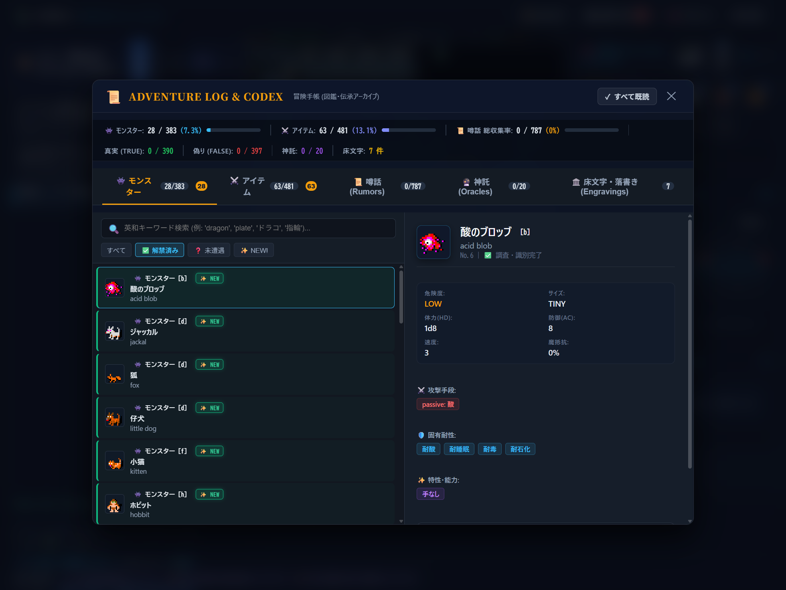
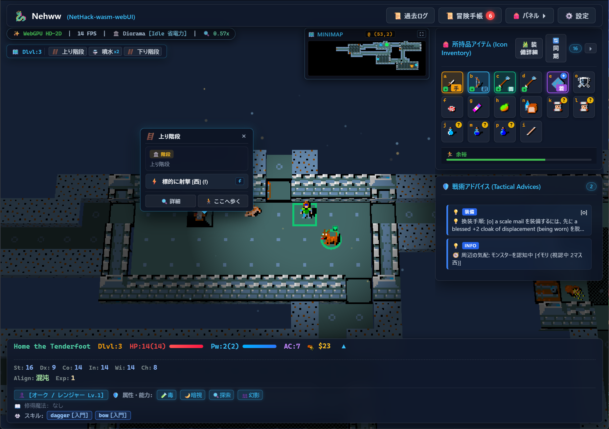
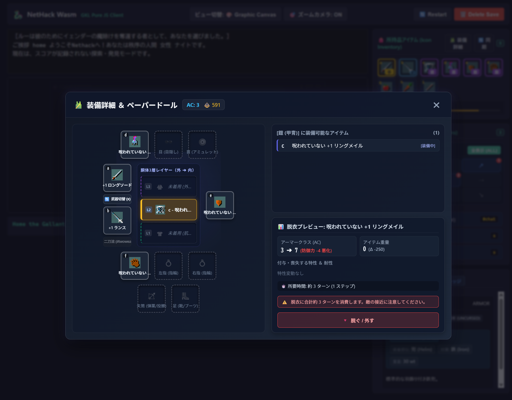
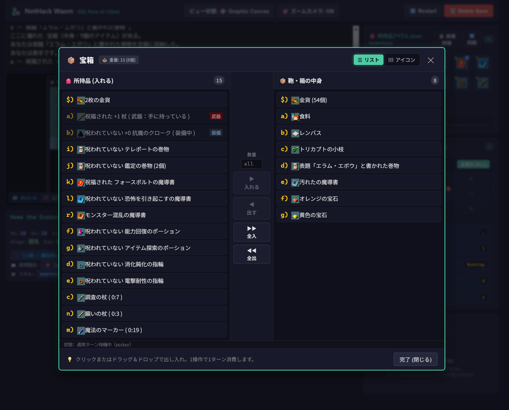
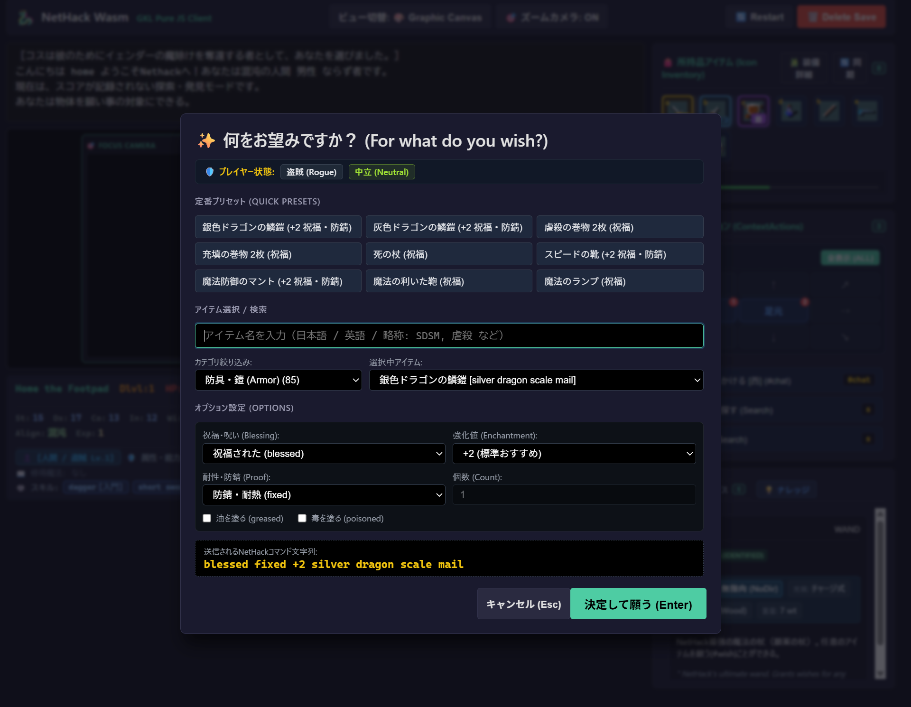
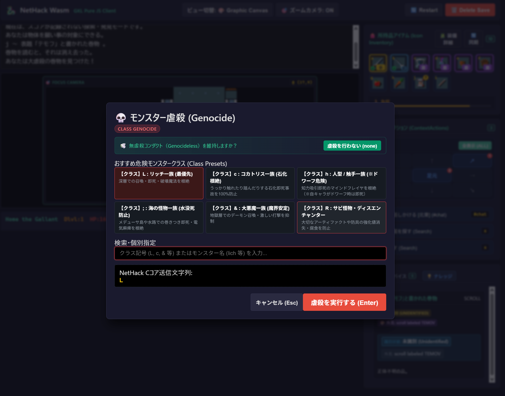
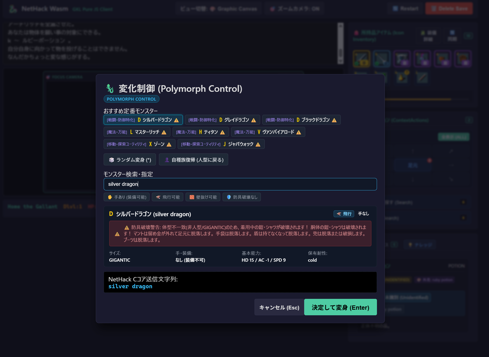
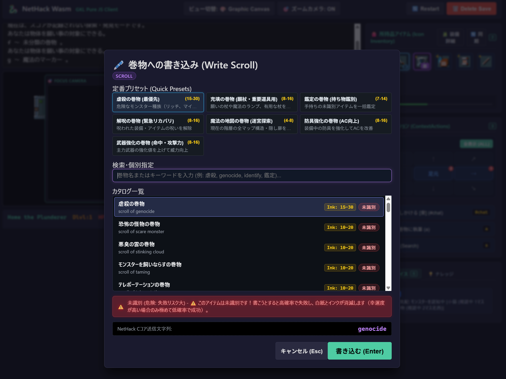
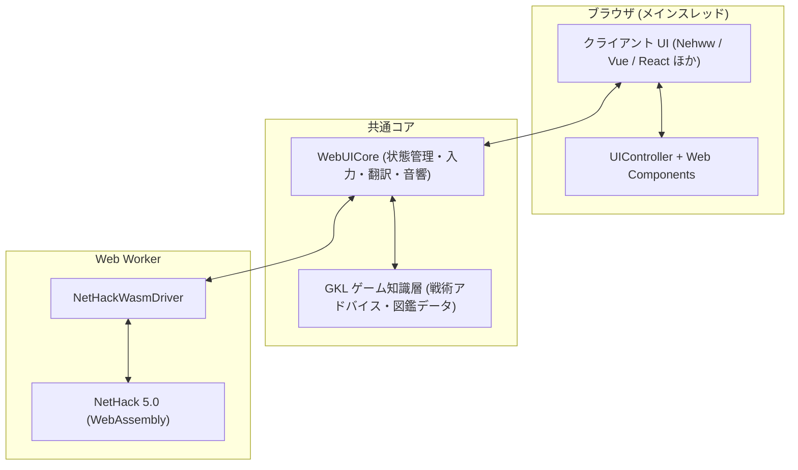
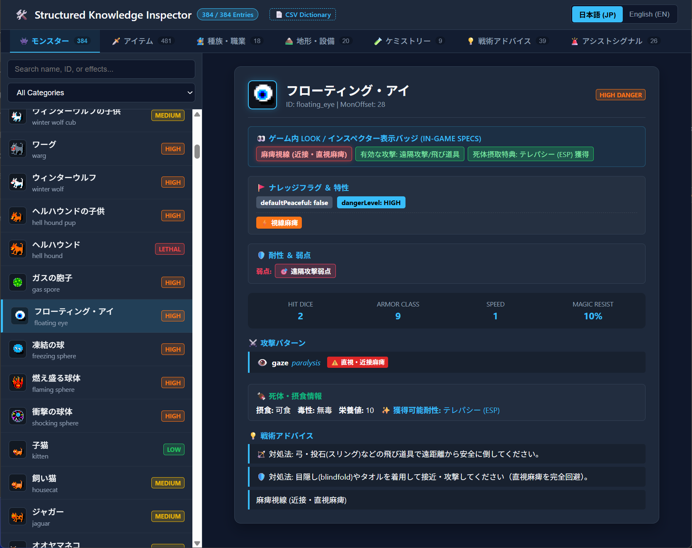

# Nehww (NetHack-wasm-webUI)

**ブラウザですぐ遊べる NetHack 5.0。** 日本語表示、装備やコンテナの直感的な操作、入力支援、そして遊ぶほど埋まっていく**冒険手帳(図鑑)**を備えた、モダンな Web クライアントです。

👉 **[🎮 ブラウザでプレイ](https://e3sh.github.io/Nethack-wasm-webUI/)**  
👉 **[📖 かんたん操作ガイド(遊び方・画面の見方)](./examples/gkl-pure-js-client/PLAYER_GUIDE.md)**

> 公式リファレンスクライアントの名前が **Nehww** です。タイトルメニューから「今すぐプレイ」で始められます。**タイトルメニューと Nehww は、日本語 / English を UI 全体で切り替えられます**(他のサンプルクライアントは実装によります)。

---

## ✨ こんな遊びができます

- 📖 **冒険手帳(図鑑)** — 出会ったモンスター、見つけたアイテム、聞いた噂・神託、床の落書きが記録され、収集率が見える。新しい発見はその場でトースト通知。
- 🇯🇵 **リアルタイム日本語表示** — メッセージログやステータスを日本語化。
- 🧥 **ペーパードール装備管理** — 外套・鎧・シャツの重なりを視覚化。着脱にかかるターン数や AC・重量の変化を事前に確認。
- 🎒 **2 カラムのコンテナ操作** — 宝箱や魔法の鞄を、ドラッグ&ドロップや数量指定でスムーズに整理。
- 🧙 **入力支援ダイアログ** — 願い・虐殺・変化・巻物/魔導書の書き込みを GUI で。危険な選択は事前に警告。
- 💡 **状況に合わせた行動提案** — 今やるべき行動をワンクリックで提示し、モンスターの弱点や注意点もアドバイス。
- 🎥 **見やすい画面** — 全画面マップ、周辺フォーカスカメラ、フローティングメッセージ HUD。
- 🔊 **効果音** — 行動に応じた効果音(外部音源不要の合成音を含む)。

---

## 📸 画面イメージ

### 遊びながら溜まる「冒険手帳」


モンスター・アイテム・噂話・神託・床文字をタブで切り替えて確認でき、収集率が一目でわかります。ゲーム内の冒険手帳では、未遭遇の情報は伏せられるので、ネタバレを避けて楽しめます。

### メイン画面・装備・コンテナ
| メイン画面 | 装備詳細 & ペーパードール |
| :---: | :---: |
|  |  |
| フォーカスカメラ、HUD、周辺の気配検知、ワンクリック推奨アクション | 胴体 3 層、AC・重量の変化、**脱衣ターン数と事故リスク警告** |

| コンテナ操作 |
| :---: |
|  |
| 所持品と箱を左右に並べ、D&D・数量指定・一括出し入れに対応 |

<details>
<summary><b>🔍 入力支援ダイアログ(願い・虐殺・変化制御・巻物書き込み)を見る</b></summary>

<br />

| 何をお望みですか?(願い支援) | モンスター虐殺 |
| :---: | :---: |
|  |  |
| 定番プリセット、日英・略称検索、祝福・強化値の GUI 設定、送信コマンドのプレビュー | 危険クラスのワンクリック指定、虐殺を行わない選択肢(コンダクト維持) |

| 変化制御 | 巻物・魔導書の書き込み |
| :---: | :---: |
|  |  |
| 用途別の定番変身、体型不一致による防具破壊の事前警告 | 必要インク量の目安、未識別アイテムでの失敗リスク警告 |

</details>

---

## 🚀 はじめかた

### プレイする
上のリンクからタイトルメニューを開き、**「今すぐプレイ」** を選ぶだけです。

| メニュー | 内容 |
| :--- | :--- |
| ▶ 今すぐプレイ | Nehww を起動 |
| 📖 冒険手帳・図鑑 | 収集状況の閲覧 (ゲーム内ではヘッダーの「📖 冒険手帳」ボタンからも開けます) |
| ⚙️ 設定・セーブ管理 | 表示・操作の設定、セーブデータの管理 |
| 🛠️ 開発・検証ポータル | 各種クライアントや開発ツールへの入口(開発者向け) |

### ローカルで動かす
静的ファイルなので、任意の HTTP サーバーで動作します。

```bash
git clone https://github.com/e3-sh/Nethack-wasm-webUI.git
cd Nethack-wasm-webUI
python -m http.server 8000   # → http://localhost:8000/
```

---

## 🧩 しくみ(なぜ安全に拡張できるのか)

NetHack 本体の C ソースは**改変せず**、そのまま WebAssembly 化しています。画面表示や補助機能はすべて JavaScript 側で追加しているため、**本家のアップデートに追従しやすい**構成です。


```mermaid
flowchart TD
    subgraph Browser ["ブラウザ (メインスレッド)"]
        UI["クライアント UI (Nehww / Vue / React ほか)"]
        Parts["UIController + Web Components"]
    end
    subgraph Core ["共通コア"]
        WCore["WebUICore (状態管理・入力・翻訳・音響)"]
        GKL["GKL ゲーム知識層 (戦術アドバイス・図鑑データ)"]
    end
    subgraph Worker ["Web Worker"]
        Driver["NetHackWasmDriver"]
        WASM["NetHack 5.0 (WebAssembly)"]
    end
    UI <--> Parts
    UI <--> WCore
    WCore <--> GKL
    WCore <--> Driver
    Driver <--> WASM
```

- **WASM ドライバ** — ゲーム本体を Web Worker で実行し、UI の応答性を維持。セーブは IndexedDB。
- **WebUICore** — 入力・メッセージ・翻訳・音響を担う共通コア。メッセージをシグナルとして検出し、各 UI へ配信。
- **GKL (Game Knowledge Layer)** — モンスター・アイテム・伝承の構造化知識と、状況に応じた戦術アドバイス。図鑑のデータ元。
- **UIController / Web Components** — DOM 非依存のロジック層(`src/ui-controller`)と、共通部品 `<nh-*>` (`src/components`)。

詳しくは [docs/ README](docs/README.md) と [システム現有能力カタログ](docs/SYSTEM_CAPABILITIES.md) を参照してください。

---

## 🖥️ クライアント実装

| クライアント | 構成 | 説明 |
| :--- | :--- | :--- |
| **[`gkl-pure-js-client`](examples/gkl-pure-js-client)** | Vanilla JS / CSS | **【旗艦 / Nehww】** 本 README で紹介している全機能を搭載 |
| [`vue-client`](examples/vue-client) | Vue 3 + TypeScript | 2 カラム UI + GKL 連携 |
| [`react-client`](examples/react-client) | React 18 + TypeScript | Zustand による 2 カラム UI + GKL 連携 |
| [`solid-client`](examples/solid-client) | SolidJS + TypeScript | Signals/Store による 2 カラム UI + GKL 連携 |
| [`svelte-client`](examples/svelte-client) | Svelte + TypeScript | Svelte ストアによる 2 カラム UI + GKL 連携 |
| [`pure-js-client`](examples/pure-js-client) | Vanilla JS | 最小限の実装 |
| [`console-client`](examples/console-client) | コンソール | ドライバ動作確認用 |
| [`web-components-demo`](examples/web-components-demo) | Web Components | `<nh-*>` 部品のデモカタログ |

---

## 🛠️ 開発者向け

### 構成

```text
Nethack-wasm-webUI/
├── src/
│   ├── driver/          # WASM 実行ドライバ (Web Worker)
│   ├── core/            # WebUICore (入力・翻訳・音響・状態・シグナル・inspector)
│   │   └── knowledge/   # GKL (知識・戦術・伝承・冒険手帳)
│   ├── ui-controller/   # Headless UI 制御 (モーダル・入力調停・HUD)
│   ├── components/      # 共通 Web Components <nh-*>
│   └── testing/         # プロトコル検証
├── examples/            # クライアント実装
├── tools/               # 開発・管理ツール
├── tests/               # Vitest テスト
├── docs/                # 設計・仕様ドキュメント
└── index.html           # タイトルメニュー (ポータル)
```

### コマンド

```bash
npm install
npm test                 # Vitest
npm run dev:vue          # 各サンプルクライアントの開発サーバー (react / solid / svelte も同様)
npm run build:all        # テスト + 全サンプルのビルド
```

### 開発・検証ツール
入口は **タイトルメニュー →「開発・検証ポータル」**(`tools/cltest.html` / `tools/dev_tools.html`)です。

| ツール | 用途 |
| :--- | :--- |
| DevTools Inspector (`src/core/inspector/inspector_console.html`) | ゲーム画面と連動する別ウィンドウのデバッグコンソール。状態ツリー、イベント監視、翻訳管理(未翻訳の収集・日英対比・CSV 出力) |
| [Knowledge Inspector](tools/knowledge-inspector.html) | GKL 内蔵の構造化知識(モンスター・アイテム等)の閲覧・検証 <br> |
| `tools/lore_codex.html` | 未開放分も含めた伝承データの閲覧と、他情報との関連タグ付け(ネタバレあり) |
| `tools/scenario-recorder.html` | シナリオの記録 |
| `tools/save_manager.html` | IndexedDB セーブデータの管理 |
| `tools/dict_converter.py` | 翻訳辞書 `dictionary.csv` → 実行用辞書への変換 |

### 品質
Vitest による自動テストを備えています。全グリフの走査試験や、知識ベースの静的整合性監査も含みます。

---

## 📍 開発状況

音響・UI 部品・メッセージシグナル化の大規模リファクタリングを完了し、現在はゲーム内ナレッジの拡充を進めています。
最新の進捗・構想は **[ROADMAP](docs/ROADMAP.md)** を参照してください。

## 📚 ドキュメント
- [かんたん操作ガイド (Nehww)](examples/gkl-pure-js-client/PLAYER_GUIDE.md)
- [ドキュメントポータル](docs/README.md) / [ROADMAP](docs/ROADMAP.md) / [システム現有能力カタログ](docs/SYSTEM_CAPABILITIES.md)
- [設定・セーブデータ FAQ](docs/FAQ_and_Configuration_Guide.md)
- [GKL 仕様](docs/3_gkl/gkl_documentation.md) / [WASM Driver 仕様](docs/1_driver/driver_core_spec.md) / [WebUICore 利用ガイド](docs/2_client_ui/WebUICore_Usage_Guide.md) / [翻訳辞書運用](docs/9_translation/DICTIONARY_OPERATION.md)

## 📜 ライセンス
- **本リポジトリの独自実装**(WebUICore、GKL、UIController、Web Components、各クライアント、ツール、ドキュメント): [MIT License](LICENSE) © 2026 e3sh
- **NetHack 本体および派生データ**(`nethack.wasm` / `nethack.js`、`dat/` 配下): [NetHack General Public License](dat/license)
- 第三者ソフトウェア・ライセンスの帰属詳細は [THIRD_PARTY_NOTICES.md](THIRD_PARTY_NOTICES.md) を参照してください。
