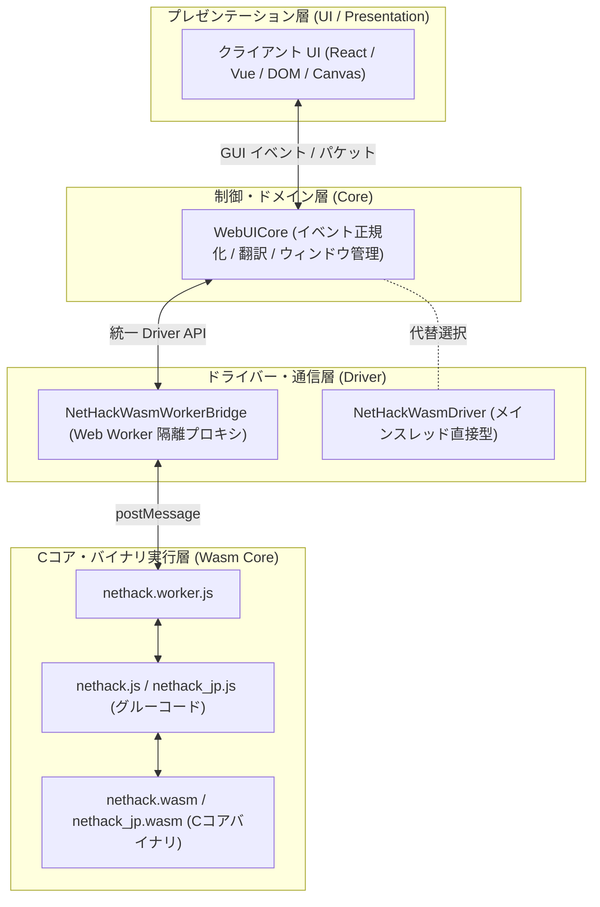

# NetHack Wasm Driver 導入・クイックスタートガイド (Quickstart & Integration Guide)

本ドキュメントは、**`@nethack/wasm-driver` (ドライバーサブシステム)** を新しい Web UI や既存クライアントに組み込み、NetHack Wasm C コアエンジンをロード・起動・バージョン変更するための総合導入ガイドです。

---

## 1. システムアーキテクチャ概要 (Architecture Overview)

NetHack WebUI アーキテクチャは、C言語の Wasm コアからプレゼンテーション UI まで明確な役割分担のもとで層状に分離されています。



### 主なモジュールの役割

- **`WebUICore`**: UI層向けの高次元ファサード。キー入力の正規化、日本語翻訳、モーダルプロンプトの構造化パースなどを担当。
- **`NetHackWasmWorkerBridge`**: Wasm エンジンをバックグラウンドスレッド（Web Worker）で安全に隔離実行し、UIスレッド (60fps) のスムーズな描画を保護する透過プロキシ。
- **`NetHackWasmDriver`**: C コアとのメモリ相互アクセス、Asyncify 入力制御、低レイヤーイベント発行を担うドライバー本体。
- **`nethack.js` / `nethack.wasm`**: Emscripten でコンパイルされた NetHack C コア（Wasm バイナリと JS グルーコード）。

---

## 2. ゼロからの導入手順 (Step-by-Step Integration)

### Step 1: 必要ファイルの配置を確認

プロジェクトのルートまたは適切なディレクトリに以下のファイルが配置されていることを確認します：

- **Wasm バイナリファイル群**:
  - `nethack.js` & `nethack.wasm` （英語版コア）
  - `nethack_jp.js` & `nethack_jp.wasm` （日本語版コア・必要な場合）
- **ドライバーサブシステム** (`src/driver/`):
  - `NetHackWasmWorkerBridge.js`
  - `nethack.worker.js`
  - `NetHackWasmDriver.js`
  - `NetHackMemory.js` / `NetHackFSManager.js` / `InputResolver.js`

---

### Step 2: ドライバーと WebUIcore の初期化・接続

最も標準的かつ推奨される **Web Worker 隔離モデル** での接続コード例です。

```javascript
import { NetHackWasmWorkerBridge } from './src/driver/NetHackWasmWorkerBridge.js';
import { WebUICore } from './src/core/WebUICore.js';

// 1. WorkerBridge インスタンスの作成 (Worker スレッドを起動)
const bridge = new NetHackWasmWorkerBridge('./src/driver/nethack.worker.js');

// 2. WebUICore に WorkerBridge を渡して初期化
const core = new WebUICore({
    driver: bridge,
    translateEnabled: true, // 日本語翻訳エンジンの有効化
    enableInspector: false
});

// 3. UI 描画イベントの受聴 (WebUICore 経由)
core.on('render', (renderPayload) => {
    // Canvas や DOM、フレームワーク UI の画面再描画を実行
    // renderPayload にはマップグリフ情報やテキストウィンドウが含まれます
});

core.on('inputRequired', (promptPayload) => {
    // ダイアログ・プロンプト要求のモーダル表示処理
});
```

---

### Step 3: Wasm コアの初期化とエンジン起動

ロードと起動は **「`initialized` イベントの待機」➔「`bridge.init()`」➔「`bridge.start()`」** の順で行います。

```javascript
// 1. Wasm エンジンの初期化完了を待機するイベントリスナーを登録
bridge.once('initialized', async () => {
    console.log("[App] Wasm エンジンが正常に初期化されました。ゲームを開始します。");
    
    // Wasm C コアの main() を実行起動
    const exitCode = await bridge.start();
    console.log(`[App] ゲームが終了しました (終了コード: ${exitCode})`);
});

// 2. Wasm スクリプトを指定して初期化を実行
// 第1引数に読み込む Wasm JS ファイル名を指定します
const targetWasmJs = 'nethack.js'; // または 'nethack_jp.js'

bridge.init(targetWasmJs, {
    args: ['nethack', '-otime,showexp,showvers,number_pad'], // 起動コマンドライン引数
    extraOptions: 'OPTIONS=dogname:Pochi'                     // 追加環境設定
});
```

---

## 3. Wasm コアの差し替え・バージョンアップ手順 (Upgrading Wasm Core)

NetHack C コアを更新した場合（例: NetHack の新しいバージョンへの更新、独自ビルドの適用、日本語版/英語版の切替など）の手順です。

### 差し替えの手順

1. **新バイナリの配置**:
   - 新しくビルドした `nethack.js` と `nethack.wasm` を配置場所に上書き配置（または `nethack_v5.1.js` などの別名で配置）します。
2. **`bridge.init()` の引数指定変更**:
   - JS コード側で `bridge.init('新ファイル名.js')` を指定します。

```javascript
// 例: 新しいバージョンの Wasm コアを読み込む場合
bridge.init('nethack_v5.1.js', {
    args: ['nethack', '-otime,showexp,showvers,number_pad']
});
```

> [!NOTE]
> **ドライバーや WebUI 側の修正は不要です**
> Wasm コアのバージョンを変更しても、`NetHackWasmWorkerBridge`, `NetHackWasmDriver`, `WebUICore` などの JavaScript ドライバー/UI 層コードを変更する必要はありません。Emscripten JS グルーコードが自動的にペアとなる `.wasm` ファイルを特定・読み込みます。

---

## 4. 動作モードの使い分け (Worker 隔離 vs メインスレッド直打ち)

ドライバーには 2 つの動作モードが存在します。

| 動作モード | 使用クラス | 特徴と用途 |
| :--- | :--- | :--- |
| **Web Worker 隔離モデル**<br/>*(推奨)* | `NetHackWasmWorkerBridge` | **標準の動作モード。**<br/>Wasm C コア処理を Worker 内に分離するため、メインスレッドの DOM/Canvas 描画や 60fps アニメーションがブロックされず極めて滑らかに動作します。 |
| **メインスレッド直接モデル** | `NetHackWasmDriver` | **デバッグ・テスト用モード。**<br/>メインスレッド上で Wasm を直接動かします。DevTools での C コアメモリ監視やステップデバッグ、Worker が利用できない特殊環境 (`file://` 直開きの一部環境など) で使用します。 |

### メインスレッド直接モデルでの起動コード例

```javascript
import { NetHackWasmDriver } from './src/driver/NetHackWasmDriver.js';
import { WebUICore } from './src/core/WebUICore.js';

// メインスレッド直打ちドライバーの作成
const driver = new NetHackWasmDriver({
    wasmModule: window.Module // index.html 等で読み込み済みの Module
});

const core = new WebUICore({ driver });

driver.init(window.Module);
await driver.start();
```

---

## 5. トラブルシューティング & よくある質問

### Q. `Worker initialization failed` エラーが発生する
- **原因**: `nethack.worker.js` への相対パスが正しくないか、CORS 制限（`file://` 直開きなど）に抵触している可能性があります。
- **対策**: ローカル Web サーバー（`npx serve` や Vite / Live Server 等）経由で実行するか、`new NetHackWasmWorkerBridge('/src/driver/nethack.worker.js')` のように絶対パスで指定してください。

### Q. セーブデータが残っていて新規ゲームが始まらない
- **対策**: `driver.deleteSaveFile()` または `core.restart({ clearStorage: true })` を呼び出すことで、IndexedDB および VFS (`/save/`) 内のセーブデータを一括安全削除できます。

---

*関連ドキュメント:*
- 📄 [driver_api_reference.md](file:///c:/Users/e3-sh/Documents/GitHub/Nethack-wasm-webUI/docs/1_driver/driver_api_reference.md) (API 完全リファレンス)
- 📄 [driver_core_spec.md](file:///c:/Users/e3-sh/Documents/GitHub/Nethack-wasm-webUI/docs/1_driver/driver_core_spec.md) (ドライバーコア技術仕様書)
