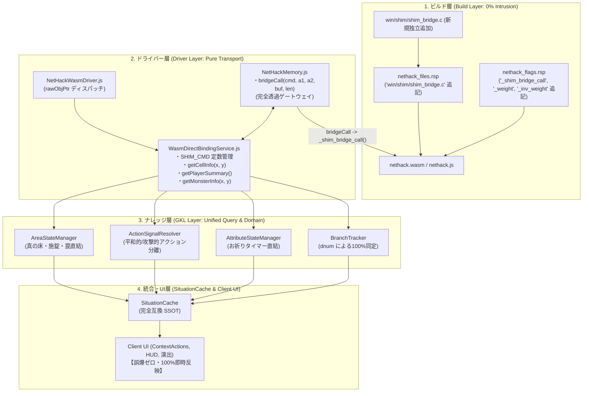

# 📋 公式Shim構造化バインディング＆直接メモリ直結 実装計画書
## (Phase 8: Unified Dispatcher Bridge & Zero-Overhead Memory Access)

---

## 1. 計画概要とアーキテクチャ哲学

### 1.1 目的
従来の「テキストメッセージの正規表現パース」および「画面非表示での自動キー送信（サイレントマクロ）」に依存していたゲーム内情報取得（コンテナ重量、装備・内在耐性、祈りクールダウン、死体鮮度、真の地形・扉施錠・罠状態、モンスター友好度等）を、**公式コード非侵襲の単一汎用ディスパッチャー窓口（`shim_bridge_call`）を用いた「同期・構造化データ直結」へ移行**します。

### 1.2 達成目標と設計原則
1. **公式NetHackコード完全非侵襲（0行改変）**:
   - `win/shim/winshim.c` を含む公式NetHack Cソースコードには **一切手を加えない**。
   - 独立した専用ブリッジファイル **`win/shim/shim_bridge.c`** を 1 つ新規追加し、ビルド時にリンク（`nethack_files.rsp` に追記）する構成とする。
2. **単一汎用窓口ディスパッチャー（Unified Dispatcher Architecture）**:
   - 個別の個別関数（`get_typ`, `get_flags`, `get_dnum`等）を乱立させてエクスポートするのを撤廃。
   - Unixの `ioctl` やシステムコールのように、**`shim_bridge_call(cmd, arg1, arg2, buf, len)` という単一の窓口関数のみをエクスポート**する。
   - **ビルド設定（`.rsp`）の固定化**: 今後どれだけ新しい問い合わせ（所持金、モンスターHP、祭壇属性等）が増えても、`-sEXPORTED_FUNCTIONS` の変更やDriver層の修正は二度と不要。C側の `switch (cmd)` に分岐を足すだけで完結する。
3. **責務の完全分離 ＆ 重複実装防止（グリフ判定 vs メモリ直結の責任境界）**:
   - 既存の `glyphClassifier.js` で既に 100% 判明している情報（ペット `GLYPH_PET_OFF`、祭壇の属性、玉座、PileTop等）はそのまま活かし、メモリ直結を重複させない（オーバーエンジニアリング排除）。
   - **メモリ直結は「グリフでは絶対に不可視な真実」のみに特化**:
     - 敵・アイテム下の「真の床（`levl.typ`）」
     - 扉の「施錠・罠（`levl.flags`）」
     - モンスターの「友好/NPC判定（`mpeaceful`）」
     - 画面に出ない「ブランチID（`dnum`）」「お祈りターン（`ublesscnt`）」「真の重量（`weight`）」
4. **LookInformation（Far Lookマクロ）撤廃によるモダンNPC/敵自動識別**:
   - 従来のように裏で `;`（Far Look）キーを打ってテキストパースするラグ・誤爆を完全排除。
   - 画面に出現した瞬間から、モダンRPGのように **NPC（🕊️/緑ネーム）と敵モンスター（⚔️/赤ネーム）を即座に自動色分け・マーク表示**。

---

## 2. 責任境界マトリクス (グリフ処理 vs メモリ直結)

実装時の重複実装・抜け漏れを防止するための単一の正解（SSOT）です。

| 対象エンティティ | 既存グリフで判定（glyphClassifier） | メモリ直結で取得（shim_bridge_call） | 役割とプレイヤー体験への効果 |
| :--- | :--- | :--- | :--- |
| **モンスター (生物)** | **ペット (766〜1531)**<br>不可視 (1532)<br>モンスター種別 (monOffset) | **友好・NPC判定 (`mpeaceful`)** | 視界に入った瞬間に NPC / 敵を自動識別（Look不要）。攻撃エフェクト誤爆を完全防止。 |
| **地形 (セル)** | 通常の床・壁・ドア・水・溶岩<br>**祭壇の属性 (4006〜4010)**<br>玉座・泉・シンク・墓石<br>階段の向き (上り/下り/梯子) | **真の床 (`levl.typ`)**<br>(敵・アイテム直下)<br>**扉の施錠・罠 (`levl.flags`)** | 仮床推測（3992番）を完全撤廃。<br>扉前のワンタップで「鍵を開ける」「罠を外す」アクションを即座に提示。 |
| **アイテム** | アイテムカテゴリ・種別 (onum)<br>**山積み PileTop (7992〜)** | **真の重量 (`weight`)**<br>祭壇判明BUC (`bknown`) | インベントリ・地面アイテムの負荷（所持重量）を即時確定。 |
| **ダンジョン / 自キャラ** | なし（ステータス行は Dlvl のみ） | **ブランチID (`u.uz.dnum`)**<br>**お祈り残りターン (`ublesscnt`)** | 階層キャッシュの完全分離（`branch:dlvl`）とエリア突入演出。<br>推測誤差ゼロのお祈り安全インジケーター。 |

---

## 3. 単一汎用ブリッジ設計 (`win/shim/shim_bridge.c`)

公式ソースコードには一切触れず、以下の独立ファイルを追加してビルドします。

```c
/* win/shim/shim_bridge.c
 * GKL 専用 統合ディスパッチャーブリッジ
 * 公式NetHack 5.0 完全非侵襲・独立エクステンション
 */
#include "hack.h"

/* コマンドID定義 (GKLとCで共有するEnum) */
enum ShimBridgeCmd {
    /* 1. 地形・マップ系 (0x10〜) */
    SHIM_CMD_GET_CELL_INFO     = 0x10, /* arg1=x, arg2=y -> typ(8b) | flags(8b) | lit(1b) のパック値 */
    SHIM_CMD_DUMP_LEVEL_TERRAIN= 0x11, /* buf=先頭ポインタ, len=80*21 -> 全フロアtypの一括コピー */

    /* 2. マップ上のエンティティ系 (0x20〜) */
    SHIM_CMD_GET_OBJECT_AT     = 0x20, /* arg1=x, arg2=y -> struct obj* ポインタ */
    SHIM_CMD_GET_MONSTER_AT    = 0x21, /* arg1=x, arg2=y -> struct monst* ポインタ */
    SHIM_CMD_GET_MONSTER_INFO  = 0x22, /* arg1=x, arg2=y -> mpeaceful(1b) | mtame(1b) | mid(16b) */

    /* 3. プレイヤー・ダンジョン状態系 (0x30〜) */
    SHIM_CMD_GET_PLAYER_SUMMARY= 0x30, /* buf=long配列 -> [dnum, dlevel, ublesscnt, uluck] 一括取得 */
    SHIM_CMD_GET_PLAYER_PTR    = 0x31, /* -> struct you* ポインタ */
};

/* 唯一のエクスポート窓口関数 */
long shim_bridge_call(int cmd, long arg1, long arg2, void *buf, int len) {
    switch (cmd) {
        /* 単一マスの複合情報: 1回の呼出しで typ(下位8bit), flags(次8bit), lit(次1bit) をパック返却 */
        case SHIM_CMD_GET_CELL_INFO: {
            int x = (int) arg1, y = (int) arg2;
            if (x < 1 || x >= COLNO || y < 0 || y >= ROWNO) return -1;
            return (long) (
                ((unsigned char) levl[x][y].typ) |
                (((unsigned char) levl[x][y].flags) << 8) |
                (((unsigned char) levl[x][y].lit) << 16)
            );
        }

        /* 全フロア地形の一括ダンプ (80x21 byte) */
        case SHIM_CMD_DUMP_LEVEL_TERRAIN: {
            if (!buf || len < (COLNO * ROWNO)) return -1;
            unsigned char *out = (unsigned char*) buf;
            int x, y;
            for (y = 0; y < ROWNO; y++) {
                for (x = 0; x < COLNO; x++) {
                    out[y * COLNO + x] = (unsigned char) levl[x][y].typ;
                }
            }
            return 0;
        }

        /* マス上のモンスター友好度・状態 */
        case SHIM_CMD_GET_MONSTER_INFO: {
            int x = (int) arg1, y = (int) arg2;
            if (x < 1 || x >= COLNO || y < 0 || y >= ROWNO) return -1;
            struct monst *mtmp = svl.level.monsters[x][y];
            if (!mtmp) return 0; /* モンスター不在 */
            return (long) (
                (mtmp->mpeaceful ? 1 : 0) |
                (mtmp->mtame ? 2 : 0) |
                ((mtmp->m_id & 0xFFFF) << 16)
            );
        }

        /* プレイヤーサマリー: 1回の呼出しで主要ステータスを一括格納 */
        case SHIM_CMD_GET_PLAYER_SUMMARY: {
            if (!buf || len < (sizeof(long) * 4)) return -1;
            long *out = (long*) buf;
            out[0] = (long) u.uz.dnum;      /* ブランチID */
            out[1] = (long) u.uz.dlevel;    /* 階層深度 */
            out[2] = (long) u.ublesscnt;    /* お祈り残りターン */
            out[3] = (long) u.uluck;        /* 幸運Luck真値 */
            return 0;
        }

        /* マップ上アイテムの先頭ポインタ */
        case SHIM_CMD_GET_OBJECT_AT: {
            int x = (int) arg1, y = (int) arg2;
            if (x < 1 || x >= COLNO || y < 0 || y >= ROWNO) return 0;
            return (long) svl.level.objects[x][y];
        }

        /* プレイヤー構造体ポインタ */
        case SHIM_CMD_GET_PLAYER_PTR: {
            return (long) &u;
        }

        default:
            return -1; /* 未定義コマンド */
    }
}
```

---

## 4. システムレイヤー別 設計・接続仕様



---

## 5. 段階的マイグレーション・タスクリスト (Task List)

### 【Stage 8.1】単一窓口ブリッジ配備 ＆ ビルド・Driver汎用ゲートウェイ整備
- [ ] `win/shim/shim_bridge.c` を作成（単一エクスポート `shim_bridge_call`）
- [ ] `nethack_files.rsp` に `"win/shim/shim_bridge.c"` を追記
- [ ] `nethack_flags.rsp` の `-sEXPORTED_FUNCTIONS` に以下を追記して再ビルド：
  - `'_shim_bridge_call'`, `'_weight'`, `'_inv_weight'`, `'_container_weight'`
- [ ] `NetHackMemory.js` に `bridgeCall(cmd, arg1, arg2, buf, len)` を 1 つだけ実装
- [ ] `NetHackWasmDriver.js` の `shim_add_menu` で `args[2]` から `rawObjPtr` をディスパッチ

### 【Stage 8.2】コンテナ・アイテム・所持重量の完全直結
- [ ] `src/core/knowledge/schema/NetHackObjectSchema.js` を新設
- [ ] `shim_add_menu` 受信時、`rawObjPtr` から `Module._weight()` を呼び出し正確な重量を即時セット
- [ ] `EncumbranceStateManager.js` に `Module._inv_weight()` を接続し、常時正確な所持重量を反映
- [ ] 地面に落ちているアイテムの BUC 判定（`SHIM_CMD_GET_OBJECT_AT` ➔ `obj->blessed/cursed/bknown`）をナレッジカードへ連携

### 【Stage 8.3】真の地形・扉施錠・罠判定 ＆ モンスターPeaceful直結
- [ ] `src/core/knowledge/services/WasmDirectBindingService.js` を新設（`SHIM_CMD_*` 定数とアンパック群）
- [ ] `AreaStateManager.js`: `getCellInfo(x, y)` により足元の真の床を即時確定（仮床推測をバイパス）
- [ ] `ActionSignalResolver.js`:
  - 扉の `flags`（`D_LOCKED` / `D_TRAPPED`）から最適な解錠・罠解除アクションを即時導出
  - `getMonsterInfo(x, y)` の `mpeaceful` / `mtame` により、攻撃エフェクト誤爆を完全防止し、平和的対話アクションへ瞬時切り替え

### 【Stage 8.4】ブランチ同定・お祈りタイマー・プレイヤー耐性直結
- [ ] `getPlayerSummary()` を毎ターン実行し、`dnum` からブランチを 100% 確定同定（`branch:dlvl` キャッシュ分離と新エリア突入演出 `AREA_ENTERED` 発火）
- [ ] `ublesscnt` をタイムライン燃料計（お祈りタイマー）へ直結（推測誤差ゼロ）
- [ ] `SHIM_CMD_GET_PLAYER_PTR` から `uprops`（耐性配列）を抽出して `AttributeStateManager` へ注入
