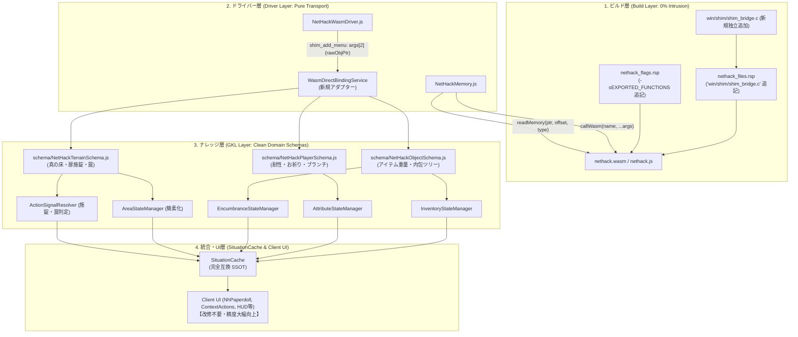

# 📋 公式Shim構造化バインディング＆直接メモリ直結 実装計画書
## (Phase 8: Native Shim Structured Bridge & Zero-Overhead Memory Access)

---

## 1. 計画概要と目的

### 1.1 目的
従来の「テキストメッセージの正規表現パース」および「画面非表示での自動キー送信（サイレントマクロ）」に依存していたゲーム内情報取得（コンテナ重量、装備・内在耐性、祈りクールダウン、死体鮮度、地形・扉・罠状態等）を、**公式コード非侵襲の独立ブリッジファイル（`win/shim/shim_bridge.c`）を用いた「同期・構造化データ直結」へ段階的に移行**します。

### 1.2 達成目標
1. **公式NetHackコード完全非侵襲（0行改変）**:
   - `win/shim/winshim.c` を含む公式NetHack Cソースコードには **一切手を加えない**。
   - 独立した専用ブリッジファイル **`win/shim/shim_bridge.c`** を 1 つ新規追加し、ビルド時にリンク（`nethack_files.rsp` に追記）する構成とする。
   - これにより、公式の将来アップデート時にも衝突（マージコンフリクト）ゼロで追従可能。
2. **C側ラッパーによるGKLスキーマ解釈の劇的簡素化**:
   - JS側でC言語の複雑なビットフィールド（`Bitfield(flags, 5)` 等）やパディング・ポインタ演算に悩む必要を排除。
   - C側でクリーンな型付けヘルパー関数（`shim_get_rm_typ`, `shim_get_rm_flags`, `shim_get_dnum` 等）を提供し、GKLが扱いやすい形式で露出する。
3. **責務の完全分離（CQRS）**:
   - **Driver**: ゲーム知識を持たない純粋なメモリI/O・RPCゲートウェイに徹する。
   - **GKL**: NetHack 5.0 構造体スキーマ・オフセットの解釈とゲームルール意味論を一元管理する。
   - **Client UI**: `SituationCache` 経由でのみ受け取るため、UI側の変更工数を 0 に抑える。

---

## 2. 独立拡張ブリッジ設計 (`win/shim/shim_bridge.c`)

公式ソースコード（`winshim.c` 等）を一切汚さず、以下の独立ファイルを作成してリンクします。

```c
/* win/shim/shim_bridge.c
 * WebUI/GKL 向け 構造化メモリ直結ブリッジ
 * 公式NetHack 5.0 完全非侵襲・独立エクステンション
 */
#include "hack.h"

/* =========================================================================
 * 1. 地形・levl (svl.level.locations) 直結 API
 * ========================================================================= */

/* levl 配列全体の先頭ポインタ取得 */
void* shim_get_levl_base(void) {
    return (void*) levl;
}

/* 指定マスの真の地形タイプ (ROOM, CORR, DOOR, STONE 等)
 * モンスターやアイテムが乗っていても足元の本物の床が即座に判明 */
int shim_get_rm_typ(int x, int y) {
    if (x < 1 || x >= COLNO || y < 0 || y >= ROWNO) return -1;
    return (int) levl[x][y].typ;
}

/* 指定マスのフラグ (扉の施錠 D_LOCKED, 罠 D_TRAPPED, 開閉状態等) */
int shim_get_rm_flags(int x, int y) {
    if (x < 1 || x >= COLNO || y < 0 || y >= ROWNO) return 0;
    return (int) levl[x][y].flags;
}

/* 指定マスの部屋の明るさ (lit: 1 = 明るい, 0 = 暗い) */
int shim_get_rm_lit(int x, int y) {
    if (x < 1 || x >= COLNO || y < 0 || y >= ROWNO) return 0;
    return (int) levl[x][y].lit;
}

/* =========================================================================
 * 2. マップ上のエンティティチェーン API
 * ========================================================================= */

/* 指定マスに落ちているアイテムの先頭ポインタ (struct obj*) */
struct obj* shim_get_objects_at(int x, int y) {
    if (x < 1 || x >= COLNO || y < 0 || y >= ROWNO) return NULL;
    return svl.level.objects[x][y];
}

/* 指定マスにいるモンスターポインタ (struct monst*) */
struct monst* shim_get_monsters_at(int x, int y) {
    if (x < 1 || x >= COLNO || y < 0 || y >= ROWNO) return NULL;
    return svl.level.monsters[x][y];
}

/* =========================================================================
 * 3. プレイヤー・ダンジョン状態 API
 * ========================================================================= */

/* プレイヤー構造体へのポインタ */
struct you* shim_get_u(void) {
    return &u;
}

/* 現在のダンジョンブランチ番号 (0: ダンジョン本流, 1: 鉱山, 2: ソコバン 等) */
int shim_get_dnum(void) {
    return (int) u.uz.dnum;
}

/* お祈りの残りクールダウンターン数 (0 なら安全にお祈り可能) */
long shim_get_ublesscnt(void) {
    return u.ublesscnt;
}
```

---

## 3. システムレイヤー別 設計・接続仕様



---

## 4. 段階的マイグレーション・タスクリスト (Task List)

### 【Stage 8.1】独立ブリッジ配備 ＆ ビルド・Driver汎用ゲートウェイ整備
- [ ] `win/shim/shim_bridge.c` を作成
- [ ] `nethack_files.rsp` に `"win/shim/shim_bridge.c"` を追記
- [ ] `nethack_flags.rsp` の `-sEXPORTED_FUNCTIONS` に以下を追記して再ビルド：
  - `_weight`, `_inv_weight`, `_container_weight`
  - `_shim_get_rm_typ`, `_shim_get_rm_flags`, `_shim_get_rm_lit`, `_shim_get_levl_base`
  - `_shim_get_objects_at`, `_shim_get_monsters_at`
  - `_shim_get_u`, `_shim_get_dnum`, `_shim_get_ublesscnt`
- [ ] `NetHackMemory.js` に `callWasm()`, `readMemory()` を実装
- [ ] `NetHackWasmDriver.js` の `shim_add_menu` で `args[2]` から `rawObjPtr` をディスパッチ

### 【Stage 8.2】コンテナ・アイテム・所持重量の完全直結
- [ ] `src/core/knowledge/schema/NetHackObjectSchema.js` を新設
- [ ] `shim_add_menu` 受信時、`rawObjPtr` から `Module._weight()` を呼び出し正確な重量を即時セット
- [ ] `EncumbranceStateManager.js` に `Module._inv_weight()` を接続し、常時正確な所持重量を反映
- [ ] コンテナ重量計算用の旧マクロシーケンスコードを段階的に廃止

### 【Stage 8.3】真の地形・扉施錠・罠判定直結 ＆ 推奨アクション革新
- [ ] `src/core/knowledge/schema/NetHackTerrainSchema.js` を新設
- [ ] `AreaStateManager.js` に `Module._shim_get_rm_typ(x, y)` を接続し、真の床を 100% 決定論的確定（仮床推測を段階的にバイパス）
- [ ] `Module._shim_get_rm_flags(x, y)` を `ActionSignalResolver` へ接続し、扉の施錠（`D_LOCKED`）や罠（`D_TRAPPED`）に応じた最適なワンタップアクションを即時導出

### 【Stage 8.4】プレイヤー内在耐性 ＆ ブランチ・祈りクールダウン直結
- [ ] `src/core/knowledge/schema/NetHackPlayerSchema.js` を新設
- [ ] `Module._shim_get_u()` から `uprops`（耐性配列）を抽出して `AttributeStateManager` へ直接注入
- [ ] `Module._shim_get_dnum()` でブランチIDを即時確定し、`branch:dlvl` の階層キャッシュ分離とエリア突入演出（`AREA_ENTERED`）をシームレス発火
- [ ] `Module._shim_get_ublesscnt()` をタイムライン燃料計（お祈りタイマー）へ直結
