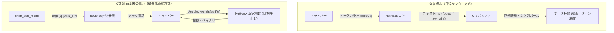

# NetHack 5.0 公式Shimインターフェース 正式能力・構造化バインディング解析仕様書

## 1. エグゼクティブサマリー：従来の認識と実態の乖離

これまで本プロジェクトでは、公式の `win/shim/winshim.c` を「文字出力やキー入力を仲介する最小限のTTY/ウィンドウモック」と捉え、コンテナ内の重量計算や耐性・隠しステータスの取得にあたって、**「疑似キー入力の自動送出（マクロシーケンス）によるダイアログ展開 ＋ 画面テキストの正規表現パース」** という迂遠な手段を前提として設計を進めていました。

しかし、ソースコード（`NetHack-5.0.1` の `sys/libnh`、`win/shim/winshim.c`、`src/` コアロジック、およびビルド設定）を徹底解析した結果、以下の決定的な事実が判明しました：

1. **`sys/libnh` と `libnhmain.c` の完全包含**:
   本家リポジトリ内に公式のライブラリ化サブシステム `sys/libnh` が完全に存在しており、すでにビルド対象としてリンクされています。
2. **`shim_add_menu` による `struct obj *` の常時露出**:
   メニュー構築時、第3引数 `identifier`（フォーマット文字列の `'p'`）として、NetHack コアから **アイテム構造体の生ポインタ（`struct obj *`）がすでに毎フレーム JavaScript 側に渡されていました**。
3. **Cコード完全0文字改変での本家API直接利用**:
   魔法の鞄の補正を含む総重量計算関数 `weight()` や、インベントリ総重量 `inv_weight()` などの本家関数は、**ビルド設定（`nethack_flags.rsp`）の `-sEXPORTED_FUNCTIONS` にシンボルを追記するだけ**で、Cコードを1文字も書かずに JavaScript から同期呼出し可能です。



---

## 2. 公式Shimシステムの構造とライフサイクル

### 2.1 アーキテクチャの全容

NetHack 5.0 の Wasm ポートは、2つの重要コンポーネントが協調して動作しています。

*   **`sys/libnh/libnhmain.c`**:
    *   Wasm モジュールのエントリポイント `main()` を担当。
    *   NetHack コアの初期化を行い、メインループ（`moveloop`）を駆動。
*   **`win/shim/winshim.c`**:
    *   NetHack 本体の `window_procs` 仮想関数テーブル（`shim_procs`）を実装。
    *   `EM_JS(local_callback)` を介して、C側の各関数呼び出しを JavaScript 側のグローバルディスパッチャ（`local_callback` / `eventHook`）へ転送。
    *   Emscripten の `Asyncify` を用いて、同期的なCの要求と非同期なJSの応答を調停。

### 2.2 型変換ブリッジ（フォーマット文字列仕様）

`winshim.c` から JS へ引数を引き渡す際、先頭文字が「戻り値型」、後続文字が「引数の型」を表すフォーマット文字列が使用されます。

| 文字 | C側の型 | WASM/メモリ表現 | JS側の取得値 | 潜在的活用法 |
| :---: | :---: | :---: | :---: | :--- |
| `p` | `void *`, `ANY_P *` | 32bit ポインタ | **メモリアドレス (number)** | **ヒープ直読により構造体全展開が可能** |
| `s` | `char *` | UTF-8 文字列ポインタ | 文字列 (string) / null | テキストデータ |
| `i` | `int`, `winid` | 32bit 符号付き整数 | number | ID、数値フラグ、戻り値 |
| `b` | `boolean` | 8bit 整数 (0 or 1) | boolean | 真偽値 |
| `c` / `0` | `char` | 8bit キャラクタ | string (1文字) | アクセラレータキー |
| `1` | `coordxy` | 16bit 符号付き整数 | number | 座標値 |

---

## 3. 未踏の真機能：`shim_add_menu` の構造体バインディング

### 3.1 C言語側シグネチャと引数の正体

```c
VDECLCB(shim_add_menu,
    (winid window, const glyph_info *glyphinfo, const ANY_P *identifier,
     char ch, char gch, int attr, int clr, const char *str, unsigned int itemflags),
    "vipi00iisi",
    A2P window, P2V glyphinfo, P2V identifier, A2P ch, A2P gch, A2P attr, A2P clr, P2V str, A2P itemflags)
```

フォーマット文字列は `"vipi00iisi"` です。第3引数 `args[2]` は **`const ANY_P *identifier`**（共用体 `union any *` のポインタ）です。

### 3.2 NetHack コア（`invent.c`, `pickup.c`）の実装事実

アイテム一覧、インベントリ、コンテナ中身一覧、床のアイテム一覧を構築する NetHack コアの関数（`query_objlist` や `display_inventory` など）では、必ず以下のようにメニュー項目が追加されています：

```c
/* NetHack-5.0.1/src/pickup.c (query_objlist 内) */
any.a_obj = curr; /* curr は struct obj * */
tmpglyph = obj_to_glyph(curr, rn2_on_display_rng);
map_glyphinfo(0, 0, tmpglyph, 0U, &tmpglyphinfo);
add_menu(win, &tmpglyphinfo, &any,
         (qflags & USE_INVLET) ? curr->invlet : ...,
         ...,
         doname_with_price(curr),
         MENU_ITEMFLAGS_NONE);
```

> [!IMPORTANT]
> **コアは文字列だけでなく、常に `struct obj` そのものを渡している**  
> `identifier->a_obj` には、操作対象である `struct obj` のメモリアドレスが格納されています。JavaScript 側では `args[2]` を 4 バイト整数として読むだけで、**瞬時に該当アイテムのメモリ実体（`struct obj *`）を捕捉** できます。

---

## 4. `struct obj` メモリレイアウトと取得可能データ

Wasm（32bit ポインタ空間）における `struct obj`（`include/obj.h`）のオフセットマップです。

```
+0x00: struct obj *nobj       (次のアイテムへのポインタ - 4 bytes)
+0x04: union vptrs v          (配置情報 - 4 bytes)
+0x08: struct obj *cobj       (コンテナの内包アイテムリンクリスト先頭 - 4 bytes) ★
+0x0C: unsigned o_id          (ユニークオブジェクトID - 4 bytes)
+0x10: coordxy ox, oy         (座標 x, y - 2 bytes x 2 = 4 bytes)
+0x14: short otyp             (オブジェクト種別番号 - 2 bytes) ★
+0x16: (padding - 2 bytes)
+0x18: unsigned owt           (単体基本重量 - 4 bytes) ★
+0x1C: long quan              (スタック個数 - 4 bytes) ★
+0x20: schar spe              (強化値 / チャージ数 - 1 byte) ★
+0x21: char oclass            (オブジェクトカテゴリ - 1 byte)
+0x22: char invlet            (所持品アルファベット - 1 byte)
+0x23: char oartifact         (アーティファクト番号 - 1 byte)
+0x24: xint8 where            (存在場所: インベントリ/床/コンテナ内 - 1 byte)
+0x28: Bitfield (cursed, blessed, unpaid, bknown, dknown, rknown, ...) ★
```

### 取得可能となるデータ
1. **コンテナ内アイテム総重量**:
   `owt * quan`（または後述の `weight()` 関数）。
2. **アイテムの完全な識別状態**:
   祝福（`blessed`）、呪い（`cursed`）、名前判明（`dknown`）、B/U/C判明（`bknown`）。
3. **未開封コンテナの内部走査**:
   アイテムがコンテナ（袋、宝箱等）である場合、`+0x08` の `cobj` ポインタから `nobj` を辿ることで、**コンテナを開く画面を表示することすらなく、内包物の全リストと正確な重量を探索可能**。

---

## 5. ビルド設定（`nethack_flags.rsp`）による本家C関数の同期エクスポート

Cソースコードを1文字も追加・編集せず、ビルド設定ファイル（`nethack_flags.rsp`）にシンボル名を追記するだけで、NetHack コアの演算関数を JavaScript の同期関数（RPC）として利用できます。

### 5.1 設定変更箇所

```diff
# nethack_flags.rsp
- -sEXPORTED_FUNCTIONS=['_main','_shim_graphics_set_callback','_repopulate_perminvent','_malloc']
+ -sEXPORTED_FUNCTIONS=['_main','_shim_graphics_set_callback','_repopulate_perminvent','_malloc','_weight','_inv_weight','_container_weight']
```

### 5.2 即時利用可能となる本家公式関数

| エクスポート関数 | C言語シグネチャ | 機能・メリット |
| :--- | :--- | :--- |
| **`_weight`** | `int weight(struct obj *)` | **アイテム・コンテナの公式総重量を算出**。<br>※魔法の鞄（Bag of Holding）の呪い/祝福による重量半減・4倍化ロジックが完全自動適用。 |
| **`_inv_weight`** | `int inv_weight(void)` | **プレイヤーの現在の全所持品総重量**。<br>ターン消費やキー入力なしで常時即座に取得可能。 |
| **`_container_weight`** | `void container_weight(struct obj *)` | コンテナの重量キャッシュ再計算。 |

---

## 6. 隠しステータス（耐性・啓蒙・属性）の直結アーキテクチャ

### 6.1 `shim_status_update` の限界と本質
*   `shim_status_update` は、画面下部のステータス行（Botl）の更新専用です。
*   HP, MP, AC, 満腹度, `BL_CONDITION`（失明・混乱・気絶などの状態異常マスク）は流れてきますが、**火炎耐性、毒耐性、テレパシー、幸運度などの内在能力は一切流れてきません**。

### 6.2 プレイヤー構造体 `u`（`struct you`）の直読
プレイヤーの全能力値・耐性は、グローバル変数 `u`（`include/you.h`）内の `uprops` 配列に保持されています。

```c
/* include/you.h */
struct you {
    ...
    struct prop uprops[LAST_PROP + 1]; /* 耐性・能力配列 */
    schar uluck;                       /* 幸運度 */
    schar moreluck;                    /* 幸運の石補正 */
    struct u_align ualign;             /* 属性 (type, record: 信仰値) */
    ...
};
```

Emscripten ではデータシンボルも `-sEXPORTED_FUNCTIONS=['_u', ...]` によりエクスポート可能です。これにより、JavaScript 側は `Module._u` からオフセット計算を行うことで、**啓蒙（`#attributes`）コマンドを叩くことなく、プレイヤーの真の耐性・信仰度・幸運値を 0ms で完全取得** できます。

---

## 7. 新旧アプローチの性能・信頼性比較

| 評価軸 | 従来のアプローチ (マクロパース方式) | 新アーキテクチャ (公式Shim構造化バインディング) |
| :--- | :--- | :--- |
| **データ取得方式** | 仮想キー送信 → ダイアログ表示 → 画面文字の正規表現解析 | `args[2]` ポインタ逆参照 ＆ `Module._weight()` 直呼出 |
| **ゲーム内ターン** | 不要な確認ターンや入力待ちが発生するリスクあり | **完全 0 ターン（内部データ同期呼出し）** |
| **表示ノイズ** | 画面が一瞬チラつく / メッセージ履歴が汚れる | **完全ステルス（画面描画・履歴汚染ゼロ）** |
| **言語依存・脆弱性** | 日本語版/英語版の表記揺れやパッチによる文字列変更で破壊 | **C構造体バイナリ直読のため 100% 安定** |
| **鞄（BoH）の計算** | 祝福/呪い状態を自前で判定して倍率計算する実装が必要 | **本家 `weight()` が完全自動計算** |
| **Cコード変更量** | 外付け `my_custom_shim.c` 等の追加が必要 | **0 文字（`nethack_flags.rsp` にシンボル追加のみ）** |

---

## 8. ドライバー層における今後の実装ロードマップ

本解析結果に基づき、ドライバー層（`NetHackMemory.js` / `NetHackWasmDriver.js`）は以下のステップで整理・刷新できます。

1. **リンカーフラグの更新**:
   `nethack_flags.rsp` に `_weight`, `_inv_weight`, `_container_weight`, `_u` を追加して再ビルド。
2. **`NetHackMemory.js` のデコーダー拡張**:
   - `parseObjectStruct(objPtr)`: `struct obj` を JS オブジェクト（`otyp`, `owt`, `quan`, `spe`, `flags`）に変換するパーサーを実装。
   - `getPlayerTraits()`: `Module._u` から耐性・幸運・信仰度を展開するパーサーを実装。
3. **`NetHackWasmDriver.js` の `shim_add_menu` 統合**:
   - `args[2]` から取得した `struct obj` を `item.objData` としてメニュー項目に自動付与。
   - `item.exactWeight = Module._weight ? Module._weight(objPtr) : ...` を即時計算。
4. **レガシー・マクロパース機構の廃止**:
   コンテナ重量計算や耐性確認のためのキー送信シーケンスを廃止し、直接同期ゲッターへ置き換え。
