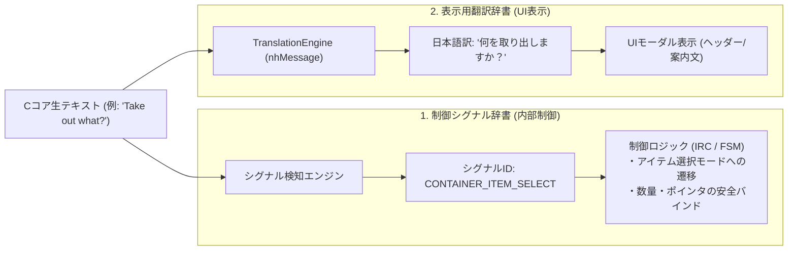

# WebUICore 汎用連続リクエストコントローラ (Interactive Sequence Controller) 基本設計仕様書

## 1. 背景と課題の所在

### 1.1 現状アーキテクチャの課題
NetHack WASM WebUI では、C コア（NetHack C コード）との非同期通信において「連続したキー送信と画面の取得」を行う場面が多数存在します。
しかし現在、その実装方式はレイヤー間で分断され、以下のような構造的限界に達しています：

1. **第1世代: ドライバ固定配列 (`NetHackWasmDriver.queueSequence`)**:
   - 事前に決めた固定トークン配列（例: `['i', ' ', '\x1b']`）を機械的に C コアへ流し込む。
   - **限界**: 途中に動的なプロンプト（「どの箱か」「カテゴリ選択」「数量入力」）や分岐（空箱、未識別アイテム）が挟まると、キーが 1 つズレて即座にデッドロック（ハング）または意図しない誤爆を起こす。
2. **第2世代: 局所的コントローラ (`GKL.RequestController`)**:
   - GKL（知識レイヤー）専用のサブモジュールとして作られ、エラー時の ESC 復帰などを試みるも、GKL プラグインの内部に閉じ込められており、システム全体の基盤になっていない。
3. **第3世代: 専用個別 FSM の乱立 (`ContainerTransactionFSM` 等)**:
   - 基盤層に動的対話をさばく仕組みがないため、機能（コンテナなど）ごとに 1300 行を超える巨大な専用ステートマシンを新設せざるを得ず、コードの重複・保守性低下を招いていた。

### 1.2 改善の目的
- GKL 内に閉じ込められていたコントローラの概念を **`WebUICore` のコア基盤機能へと昇格** させる。
- **「単純な問い合わせ（固定配列）」** と **「動的分岐・変換を伴う高度な対話リクエスト（スクリプト型）」** を単一のエントリポイントで扱えるようにする。
- 散らばっているシーケンス制御を段階的に統合し、システム全体の堅牢性（デッドロック根絶）と拡張性を確立する。

---

## 2. アーキテクチャ構成とレイヤー設計

```mermaid
flowchart TD
    subgraph Client_Features ["上位クライアント機能"]
        GKL["GKL (インベントリ/呪文/属性/スキル同期)"]
        LOOK["OnDemandLookService (見回し解析)"]
        CONT["Container UI (先読み・出し入れ) ※保留中"]
        FUTURE["将来機能 (名前付け / 調整 / 店舗UI等)"]
    end

    subgraph Core_Layer ["WebUICore 基盤レイヤー (新設/昇格)"]
        ISC["InteractiveRequestController (汎用連続リクエストコントローラ)"]
        QSS["querySequenceSilent / executeSequence (統合ファサード)"]
        SAFE["SafetyGuard (タイムアウト・ESC自動復帰・二重送信防止)"]
    end

    subgraph Driver_Layer ["WASM / ドライバレイヤー"]
        DRIVER["NetHackWasmDriver (生トークン送受信・メモリ操作)"]
        WASM["NetHack WASM C-Core (pickup.c, invent.c, etc.)"]
    end

    GKL -->|単純配列 または レシピ| QSS
    LOOK -->|単純配列 または レシピ| QSS
    CONT -.->|対話レシピ (再開時)| QSS
    FUTURE -->|対話レシピ| QSS

    QSS --> ISC
    ISC --> SAFE
    ISC -->|動的相槌 / トークン送出| DRIVER
    DRIVER <-->|inputRequired / respond| WASM
```

---

## 3. インターフェース設計 (API 仕様)

`WebUICore` のパブリック API として提供され、渡される引数の型（配列 or オブジェクト）によって自動的に動作モードを切り替えます。

### 3.1 モード A: 単純問い合わせモード (従来互換)
引数に**トークン配列**を渡した場合。従来の `querySequenceSilent` と 100% 互換の動作をし、C コアの出力バッファを返します。

```javascript
// 例: インベントリ同期
const buffer = await core.querySequenceSilent(['i', ' ', '\x1b'], {
    syncType: 'inventory'
});
// 戻り値: Array<Object> (Cコアが画面に出力したテキスト/メニュー等のバッファ)
```

### 3.2 モード B: インタラクティブ・スクリプトモード (高度対話)
引数に**レシピオブジェクト**を渡した場合。C コアから届く `inputRequired` を監視し、定義されたハンドラルールに基づいて動的に応答・分岐・データ抽出を行います。

```javascript
const result = await core.querySequenceSilent({
    // 1. 初動キー
    start: ['a', 'e'],

    // 2. プロンプト / メニューに応じた動的ハンドラルール (優先順に評価)
    handlers: [
        {
            // 条件: メニューであり、タイトル/プロンプトに "Do what" を含む
            match: { type: 'menu', prompt: /Do what/i },
            action: (ctx) => {
                // 中身があるか空かで分岐
                if (ctx.hasMenuItem('o')) return 'o'; // 取り出しへ
                return 'q'; // 空箱なら即座に抜ける
            }
        },
        {
            // 条件: カテゴリ選択メニュー（挟まらない場合は自動スキップ）
            match: { type: 'menu', prompt: /what type/i },
            action: [{ identifier: -2, count: -1 }] // All types 選択
        },
        {
            // 条件: アイテム一覧メニュー
            match: { type: 'menu', prompt: /Take out what/i },
            action: (ctx) => {
                // その場で必要なデータを抽出してコンテキストに保持
                ctx.data = ctx.menuItems.map(it => ({
                    id: it.identifier,
                    name: it.str,
                    count: it.count
                }));
                return '\x1b'; // 中身を回収したら ESC で戻る
            }
        },
        {
            // 条件: 完了復帰（元の画面に戻ってきたら終了）
            match: { type: 'menu', prompt: /Do what/i, ifState: 'DATA_COLLECTED' },
            action: 'q'
        }
    ],

    // 3. 終了・完了条件 (通常ターン poskey に復帰したら Promise 解決)
    until: { type: 'turn_ready' },

    // 4. セーフティガード
    timeoutMs: 3000,
    onTimeout: 'abortWithESC' // タイムアウト時は ESC を連打して安全復帰
});

// 戻り値: { success: true, data: [...], buffer: [...] }
```

---

## 4. 既存箇所の棚卸しと段階的移行ロードマップ

本改修はシステムの根幹に関わるため、一括置換ではなく**「小さな安全な箇所から順次置き換える」** 段階的アプローチをとります。

### フェーズ一覧

| フェーズ | 対象・内容 | 影響度 / リスク | 実施時期目安 |
| :--- | :--- | :--- | :--- |
| **フェーズ 1** | **設計資料の確定と既存箇所の詳細棚卸し**<br>・各機能のシーケンス呼び出しパターンを完全整理 | なし (ドキュメント) | 即時 |
| **フェーズ 2** | **基盤コントローラの基本実装 (従来互換)**<br>・WebUICore 配下に新設、配列渡しで既存テスト 705 件パス | 極小 (後方互換担保) | 順次・軽量作業時 |
| **フェーズ 3** | **スクリプト実行エンジン（ハンドラ駆動）の実装**<br>・分岐、データ抽出、ESC 自動復帰の単体テスト整備 | 小 (新設コード中心) | 来週以降 |
| **フェーズ 4** | **既存機能の段階的移行（ちょっとずつ置換）**<br>① 属性・スペル・スキル同期（単純）<br>② インベントリ同期（中度）<br>③ 見回し解析（中度） | 中 (1機能ずつ実機検証) | 来週以降 |
| **フェーズ 5** | **コンテナ UI の再開・本接続 (本丸)**<br>・バイパスを解除し、コンテナ操作をレシピ化<br>・数量移動、アイテムレター、床箱投入の根本解決 | 大 (コンテナ本番検証) | コア安定後 |

---

## 5. 既存呼び出し箇所の初期棚卸しリスト

現時点でプロジェクト内で `querySequenceSilent` / `queueSequence` を使用している主要箇所：

1. **`GKLPlugin.js`**:
   - `syncInventorySilent`: `['i', ' ', '\x1b']`
   - `syncSpellsSilent`: `['+', ' ', '\x1b']`
   - `syncAttributesSilent`: `['\x18', ' ', '\x1b']`
   - `syncSkillsSilent`: `['#', 'enhance', ' ', '\x1b']`
2. **`OnDemandLookService.js`**:
   - `executeLookSequence`: `[';', <DIR_KEY>, ..., '\x1b']`（見回し結果の画面パース）
3. **`WebUICore.js`**:
   - `executeExtendedCommand`: `['#', <cmd>, <dir>]`
4. **`ContainerTransactionFSM.js`（※現在バイパス中）**:
   - `syncContentsSilent`: `['a', letter, 'o', 'a', '\x1b']`
   - `transferItems`: 手持ち/床オープンプレフィックス送出後のプロンプト待機

---

## 6. コンテナ再開に向けたアーキテクチャ刷新指針（入口の正常化とセッション境界制御）

本改修の最終ゴールである「フェーズ 5: コンテナ UI の再開」にあたり、これまでの反省を踏まえた根本的な設計指針をここに規定する。

### 6.1 従来の構造的過ち（なぜ複雑化・泥沼化したのか）
- **外側スパイ方式の限界**:
  従来の `ContainerTransactionFSM` は外側からユーザーのキー入力（`a` や `#loot`）を盗み聞き・推測して無理やり割り込んでいた。このため、C コア内部状態マシンとの間で権限の奪い合い、二重送信、プロンプト解釈の齟齬が発生していた。

### 6.2 新アーキテクチャ：正規パイプラインでの入口検知とセッションガード

```mermaid
sequenceDiagram
    autonumber
    actor User as プレイヤー
    participant Core as NetHack C-Core (pickup.c)
    participant PPB as PromptPayloadBuilder
    participant Session as ContainerSessionGuard
    participant UI as ContainerModal (二面パネル)
    participant IRC as InteractiveRequestController

    User->>Core: 鞄を使う ('a', 'e') または 床を漁る ('#loot', '.')
    Core-->>PPB: ACTION_MENU ("Do what with your sack/chest?")
    
    Note over PPB: 【正規の入口検知】<br/>通常モード中にコンテナアクションを検知！<br/>対象コンテナの完全知識 (containerContext) を構築
    PPB->>Session: startSession(containerContext)
    Note over Session: isContainerSessionActive = true<br/>★重要: 以降セッション中の通常プロンプト構築を弾く (サプレス)
    Session->>UI: show(containerContext)

    Note over UI,IRC: 【セッション内部の対話】<br/>出し入れ・数量移動・再同期は<br/>containerContext を用いて IRC レシピで直接安全に対話実行
    UI->>IRC: transferItems(recipe)
    IRC<-->>Core: 動的ディスパッチ (count/ポインタ完全一致)

    User->>UI: 閉じるボタン / ESC
    UI->>Session: endSession()
    Note over Session: isContainerSessionActive = false<br/>通常ターン (poskey) に復帰
```

### 6.3 主要な設計原則

1. **`PromptPayloadBuilder` による正規の入口トリガー**:
   - コンテナのオープンは、キー入力の推測ではなく、C コアが返した `ACTION_MENU` を `PromptPayloadBuilder` が検知することで **`inputType: 'CONTAINER'`** を発行し、正当に開始する。
2. **同一マスに複数コンテナがある場合の自然な解決**:
   - 足元に複数の箱がある場合、C コアはまず `"Loot which containers?"` メニューを返す。
   - これは通常の `inputType: 'MENU'` として一般メニューモーダルに任せ、ユーザーに目的の箱を 1 つ選択させる。
   - 選択された箱の `ACTION_MENU` が届いた瞬間に `PromptPayloadBuilder` が検知して二面パネルを起動する。二面パネル側で「箱選択 UI」を車輪の再発明する必要はない。
3. **`containerContext`（コンテナ同定知識）の引き渡し**:
   - セッション開始時、対象コンテナの完全な知識（手持ちレター、Cコアポインタ `identifier`、床座標 `{x, y}`、箱インデックス、`isBagOfHolding`、`glyphId`）を抽出し、セッションへ引き渡す。
   - これにより、セッション内での Re-open（開け直し）や再同期において、複数箱があっても迷わず確実に同一の箱を指定できる。
4. **セッション境界ガード（ダイアログ内の通常プロンプト遮断）**:
   - コンテナセッション中（`isContainerSessionActive === true`）は、**`PromptPayloadBuilder` による汎用プロンプト・汎用メニューの構築を完全に弾く（サプレス）**。
   - C コアからの `inputRequired` は、すべて二面パネルおよび `InteractiveRequestController` に直通ルーティングし、裏や表で別ダイアログが重複起動するのを 100% 防止する。

---

## 7. 制御シグナル辞書 (Control Signal Catalog) と表示用翻訳辞書の二層構造

### 7.1 メッセージ分類の再定義
NetHack C コアから届くテキストメッセージは、本来その責務によって明確に分類されるべきである：

1. **通常メッセージ**: ゲームログ、戦闘結果、足元情報等（表示用翻訳辞書 `nhMessage` で日本語化）。
2. **メニュー説明文**: アイテム名、ヘッダー、注釈文等（表示用翻訳辞書 `nhEntities/Items` で日本語化）。
3. **制御用プロンプト / メニュー選択肢**: モード遷移や入力待機を引き起こすシグナル（例: "Do what with your sack?", "Take out what?", "How many?"）。

### 7.2 制御シグナル（内部トリガー）と表示用翻訳（UIローカライズ）の協調モデル
制御用メッセージは、**「① 制御シグナル辞書による確実な内部同定」** と **「② 表示用翻訳辞書による美しい日本語UI表示」** の両輪として二層構造化する。



### 7.3 制御シグナル辞書の外出し定義（スキーマ例）
コード内に正規表現をベタ書きするのではなく、JSON / 定義体として宣言的に外出し管理する：

```json
{
  "SIGNALS": {
    "CONTAINER_ACTION_MENU": {
      "pattern": "^Do what with (?:your|the) (?<container>.+)\\?|^The (?<container>.+) is empty\\. +Do what with it\\?",
      "context": "menu",
      "signalId": "CONTAINER_ROOT",
      "meta": { "inputType": "CONTAINER" }
    },
    "CONTAINER_SELECT_FLOOR": {
      "pattern": "^Loot which containers\\?",
      "context": "menu",
      "signalId": "CONTAINER_MULTI_FLOOR",
      "meta": { "inputType": "MENU" }
    },
    "CONTAINER_CATEGORY_SELECT": {
      "pattern": "^(?:Take out|Put in) what type of objects\\?",
      "context": "menu",
      "signalId": "CONTAINER_CATEGORY",
      "defaultAction": [{ "identifier": -2, "count": -1 }]
    },
    "CONTAINER_ITEM_SELECT": {
      "pattern": "^(?:Take out|Put in) what\\?",
      "context": "menu",
      "signalId": "CONTAINER_ITEMS"
    },
    "COUNT_PROMPT": {
      "pattern": "^How many\\?",
      "context": "getlin",
      "signalId": "INPUT_COUNT"
    }
  }
}
```

### 7.4 この二層構造がもたらす決定的なメリット
1. **制御判定の堅牢化**:
   - 制御トリガーは英語原文（生テキスト）に基づきシグナル ID へ正規化されるため、翻訳テキストの揺れによる制御誤爆が構造的にゼロになる。
2. **UI 表示の完全な日本語化**:
   - 制御用メッセージであっても、表示用翻訳辞書に適切な日本語（例: `"Take out what?"` → `"何を取り出しますか？"`）を登録することで、モーダル上の表示は自然な日本語としてレンダリングされる。
3. **C コアバージョンアップ・別バリアントへの即応性**:
   - NetHack のバージョンアップやバリアント対応（Slash'EM 等）で英語プロンプトの文面が変更された場合でも、**JS コードに一切手を触れず、辞書ファイルの正規表現と翻訳エントリを更新するだけ**で全機能が即座に追従できる。

### 7.5 本質的位置づけ：「プレイヤー用辞書」と「機械用（制御用）辞書」の対比
本構想の本質は、**「人間（プレイヤー）が読むための翻訳辞書」と並列して、「プログラム（機械）がシステムを安全・自走制御するための専用辞書」を新設する**という点にある：

| 辞書区分 | 利用者 | 主な目的 | キーと値の構造 |
| :--- | :--- | :--- | :--- |
| **プレイヤー用辞書**<br>(`nhMessage` / `nhEntities`) | **人間 (UI)** | 英語テキストを自然な日本語に変換し、プレイヤーの理解を助ける。 | `英語文面` → `日本語翻訳テキスト` |
| **機械用 (制御用) 辞書**<br>(`ControlSignalCatalog`) | **機械 (WebUICore)** | C コアの生プロンプトを識別・分類し、次にとるべき制御アクションを一意に決定する。 | `正規表現パターン + コンテキスト` → `シグナルID + 制御メタデータ` |

### 7.6 実現に向けた調査＆段階的ロードマップ
影響範囲が WebUICore、PromptPayloadBuilder、InteractiveRequestController 全体に及ぶ極めて基幹的な改修となるため、以下の段階的ステップを踏んで進める：

1. **ステップ 1: C コア生プロンプトの網羅的棚卸し・調査**:
   - 既存コード（`ContainerPromptDetector`、`PromptPayloadBuilder`、`WebUICore`、`GKLPlugin`）に散らばっている正規表現や文字列マッチ（`includes`）を全件抽出・分類。
   - NetHack C コア（`pickup.c`, `invent.c`, `cmd.c` 等）の発行プロンプトと突合し、機械用シグナルとしてのカテゴリ一覧を策定。
2. **ステップ 2: 機械用辞書（`ControlSignalCatalog.json`）のスキーマ策定と初期登録**:
   - コンテナ関連および主要プロンプト（Yes/No、数量、方向、メニュー）を第1弾としてカタログ化。
3. **ステップ 3: 検知エンジン（`SignalDetector`）の試作と単体テスト**:
   - 生プロンプトを与えると、正しい `signalId` と名前付きキャプチャ（`container` 名など）が返ることを独立テストで検証。
4. **ステップ 4: プロンプトビルダー・リクエストコントローラへの段階的接続**:
   - まずはコンテナなどの特定機能から順次シグナル辞書駆動へ切り替え、安全性を確認した上で全プロンプトへ展開する。


