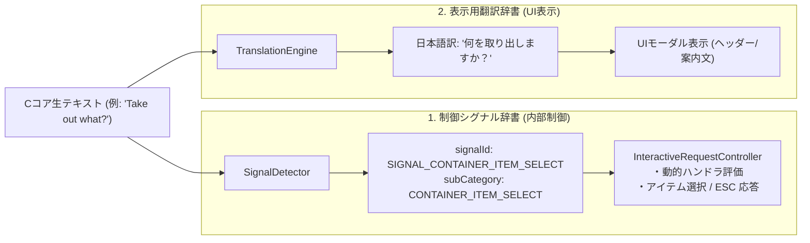
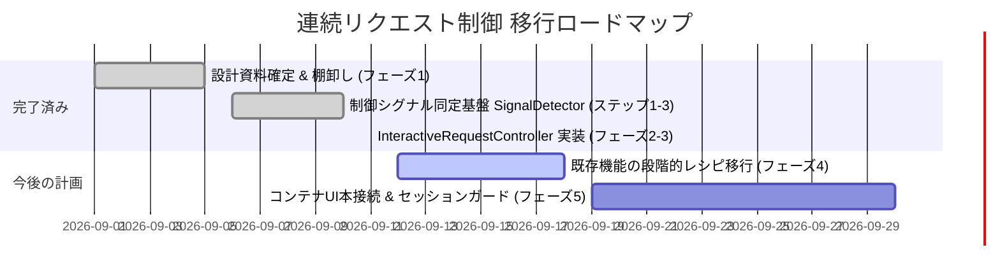

# WebUICore 汎用連続リクエストコントローラ (InteractiveRequestController) & 制御シグナル同定基盤 技術解説仕様書

> **ステータス**: **【基幹実装完了・検証済み】 (Phase 1〜3 & Step 1〜4 完了)**  
> **更新日**: 2026-09-11  
> **対象コード**:  
> - コア実装: `src/core/request/InteractiveRequestController.js`  
> - ファサード統合: `src/core/WebUICore.js`  
> - 制御シグナル同定基盤: `src/core/prompt/SignalDetector.js`, `ControlSignalCatalog.js`, `ControlSignalCatalog.ja.js`  
> - 自動テストスイート: `src/core/request/InteractiveRequestController.test.js`, `src/core/prompt/SignalDetector.test.js`

---

## 1. 背景と解決された構造的課題

### 1.1 従来の課題と限界
NetHack WASM WebUI では、C コア（NetHack C コード）との非同期通信において「連続したキー送信と画面の取得」を行う場面が多数存在します。従来の設計には以下の世代別課題が存在していました：

1. **第1世代: ドライバ固定配列 (`NetHackWasmDriver.queueSequence`)**:
   - 事前に決めた固定トークン配列（例: `['i', ' ', '\x1b']`）を機械的に C コアへ流し込む。
   - **限界**: 途中に動的なプロンプト（「どの箱か」「カテゴリ選択」「数量入力」）や分岐（空箱、未識別アイテム）が挟まると、キーが 1 つズレて即座にデッドロック（ハング）または意図しない誤爆を引き起こしていた。
2. **第2世代: 局所的コントローラ (`GKL.RequestController`)**:
   - GKL（知識レイヤー）専用のサブモジュールとして作られ、エラー時の ESC 復帰などを試みるも、GKL プラグインの内部に閉じ込められており、システム全体の基盤になっていなかった。
3. **第3世代: 専用個別 FSM の乱立 (`ContainerTransactionFSM` 等)**:
   - 基盤層に動的対話をさばく汎用的な仕組みがないため、機能ごとに 1300 行を超える巨大な専用ステートマシンを新設せざるを得ず、コードの重複・二重送信・保守性低下を招いていた。

### 1.2 本実装による解決と到達点
- **WebUICore 基盤への昇格・一元統合**:
  GKL プラグイン内に閉じていたコントローラの概念を WebUICore の基幹機能 `InteractiveRequestController` へ昇格させました。
- **ハイブリッド動作モード**:
  「単純な問い合わせ（固定トークン配列）」と「動的分岐・データ抽出を伴う高度な対話リクエスト（スクリプト・レシピ型）」を単一のエントリポイントで自動判別して処理します。
- **デッドロックの構造的根絶**:
  `SignalDetector` による高精度な機械用制御シグナル同定と、タイムアウト時の `abortWithESC()` によるセーフティガード（ESC連打復帰）により、未知のプロンプトや非同期のズレによるハングを完全に防止します。

---

## 2. システムアーキテクチャと全体構成

```mermaid
flowchart TD
    subgraph Client_Features ["上位クライアント機能 / GKL"]
        GKL["GKL (インベントリ/呪文/属性/スキル同期)"]
        LOOK["OnDemandLookService (見回し解析)"]
        UI_MODAL["UIモーダル (二面パネル等)"]
        FUTURE["将来機能 (名前付け / 調整 / 店舗UI等)"]
    end

    subgraph Core_Layer ["WebUICore 基盤レイヤー (統合完了)"]
        QSS["querySequenceSilent / executeSequence (統合ファサード)"]
        IRC["InteractiveRequestController (汎用連続リクエストコントローラ)"]
        SIG["SignalDetector (機械用制御シグナル同定エンジン)"]
        CATALOG["ControlSignalCatalog (en / ja 独立辞書)"]
        SAFE["SafetyGuard (タイムアウト・abortWithESC・ESC連打復帰)"]
    end

    subgraph Driver_Layer ["WASM / ドライバレイヤー"]
        DRIVER["NetHackWasmDriver (生トークン送受信・メモリ管理)"]
        RESOLVER["InputResolver (safeResolver / Promise ライフサイクル)"]
        WASM["NetHack WASM C-Core (pickup.c, invent.c, etc.)"]
    end

    GKL -->|トークン配列 または レシピ| QSS
    LOOK -->|トークン配列 または レシピ| QSS
    UI_MODAL -.->|対話レシピ (Phase 5)| QSS
    FUTURE -->|対話レシピ| QSS

    QSS --> IRC
    IRC --> SAFE
    IRC <-->|シグナル解析 / 照合| SIG
    SIG --- CATALOG
    IRC -->|動的相槌 / トークン送出| DRIVER
    DRIVER <--> RESOLVER
    RESOLVER <-->|inputRequired / respond| WASM
```

---

## 3. 制御シグナル辞書 (ControlSignalCatalog) とシグナル検知エンジン (SignalDetector)

### 3.1 「機械用辞書」と「プレイヤー用翻訳辞書」の二層分離構造
NetHack C コアから届くプロンプトやメニューは、その責務によって明確に二層分離されています：

| 辞書区分 | 利用者 | 主な目的 | キーと値の構造 | 実装モジュール |
| :--- | :--- | :--- | :--- | :--- |
| **プレイヤー用辞書** | **人間 (UI)** | 英語テキストを自然な日本語に変換し、プレイヤーの理解を助ける。 | `英語文面` → `日本語翻訳テキスト` | `TranslationEngine`<br>(nhMessage / nhEntities) |
| **機械用 (制御用) 辞書** | **機械 (システム)** | C コアの生プロンプトを識別・分類し、次にとるべき制御を一意に決定する。 | `正規表現パターン + コンテキスト` → `シグナルID + 制御メタデータ` | `SignalDetector`<br>(ControlSignalCatalog) |



### 3.2 バリアント・ロケール別辞書の完全分離と WebUICore 設定
パターン衝突を根絶するため、Vanilla NetHack 5.0（英語コア）と JNetHack（日本語コア）で辞書ファイルを物理分離しています：
- 英語 Wasm コア: `src/core/prompt/ControlSignalCatalog.js`
- 日本語 Wasm コア: `src/core/prompt/ControlSignalCatalog.ja.js`
- 動的ファクトリ: `SignalDetector.createForLocale(coreVariant)`

#### 【設計原則】UI 表示言語 (`language`) と C コアバリアント (`variant`) の直交性
WebUICore の初期化時、シグナル検出器は UI 表示言語（`options.language`）ではなく、**Wasm C コアのバリアント種別（`options.variant`、デフォルト `'vanilla'`）** に基づいてカタログを選択します：

```javascript
// WebUICore.js での初期化
const coreVariant = options.variant || (this.driver && this.driver.variant) || 'vanilla';
this.signalDetector = options.signalDetector || SignalDetector.createForLocale(coreVariant);
```

- **なぜ UI 言語を使ってはいけないのか**:  
  UI を日本語表示（`language: 'ja'`）にしていても、動いている Wasm エンジンが Vanilla NetHack 5.0 であれば、C コアから出力される生メッセージは常に英語（例: `"In what direction?"`）です。  
  シグナル検出器が UI 言語に引っ張られて日本語辞書をロードしてしまうと、C コアの英語生プロンプトにマッチせず、制御シグナルが一切検知できなくなります。  
  また、シグナル検出器が UI 翻訳後のテキスト（`"どの方向？"`）を読み取るような実装にすると、翻訳辞書の改修や言い回しの変更によって内部制御が破壊されるため、**シグナル制御層は C コアの生データ（`rawPrompt`, `lastMessage`）のみを対象とする** 原則を徹底しています。

### 3.3 シグナル検知のアルゴリズムと戻り値構造
`SignalDetector.detect(payload, contextInfo)` は以下の多層判定を優先度（`priority` 降順）に従って実行します：
1. **コンテキストフィルタ**: `triggerCommand`, `isTextType`, `categories`, `contexts`, `excludeInventoryMenu` による事前スクリーニング
2. **プリコンパイル済み正規表現マッチング**: 名前付きキャプチャグループ（`(?<containerName>...)`, `(?<count>...)` 等）を展開
3. **paramsMapping**: 宣言的なパラメータ変換
4. **戻り値スキーマ**:
   ```javascript
   {
       matched: true,
       signalId: 'SIGNAL_CONTAINER_ACTION_MENU',
       subCategory: 'CONTAINER_ACTION_MENU',
       inputType: 'CONTAINER',
       params: { containerName: 'sack', direction: 'out' },
       confidence: 1.0,
       rawPrompt: 'Do what with your sack?',
       signalDef: { ... }
   }
   ```

---

## 4. InteractiveRequestController API 仕様と動作解説

クラス: `src/core/request/InteractiveRequestController.js`

### 4.1 モード A: 単純問い合わせモード (従来配列渡し互換)
引数に**トークン配列**を渡した場合。従来の `querySequenceSilent` と **100% 後方互換** の動作をし、C コアが出力したテキスト/メニュー等の実行結果バッファをそのまま返します。

```javascript
// 例: インベントリ同期 (GKL 互換)
const buffer = await core.querySequenceSilent(['i', ' ', '\x1b'], {
    syncType: 'inventory'
});
// 戻り値: Array<Object> (Cコアが画面に出力したテキスト/メッセージバッファ)
```

- **内部処理**:
  1. `driver.queueSequence(tokens, opts)` を直接実行。
  2. 出力バッファ配列 (`Array<Object>`) を解決し、`sequenceFinished` イベントを発火。

---

### 4.2 モード B: インタラクティブ・スクリプトモード (高度動的対話)
引数に**レシピオブジェクト**を渡した場合。C コアから届く `inputRequired` を監視し、定義された `handlers` ルールに基づいて動的に応答・分岐・データ抽出を行います。

```javascript
const result = await core.querySequenceSilent({
    // 1. 初動キー (開始時点で activeResolver があれば直ちに消費)
    start: ['a', 'e'],

    // 2. プロンプト / メニューに応じた動的ハンドラルール (優先順に評価)
    handlers: [
        {
            // 条件: コンテナアクションメニューで中身があれば取り出しへ、空なら終了
            match: {
                subCategory: 'CONTAINER_ACTION_MENU',
                type: 'menu'
            },
            action: (ctx) => {
                if (ctx.hasMenuItem('o')) return 'o'; // 取り出しへ
                return 'q'; // 空箱なら即座に抜ける
            }
        },
        {
            // 条件: カテゴリ選択メニュー（挟まらない場合はスキップ）
            match: {
                subCategory: 'CONTAINER_CATEGORY_SELECT',
                type: 'menu'
            },
            action: [{ identifier: -2, count: -1 }] // 全選択
        },
        {
            // 条件: アイテム一覧メニュー
            match: {
                subCategory: 'CONTAINER_ITEM_SELECT',
                prompt: /Take out what/i
            },
            action: (ctx) => {
                // コンテキスト経由でデータ抽出
                ctx.data = ctx.menuItems.map(it => ({
                    id: it.identifier,
                    name: it.str,
                    count: it.count
                }));
                ctx.state = 'ITEMS_EXTRACTED';
                return '\x1b'; // 取得完了後 ESC で抜ける
            }
        }
    ],

    // 3. 終了・完了条件 (通常ターン poskey に復帰したら Promise 解決)
    until: { type: 'turn_ready' },

    // 4. セーフティガード設定
    timeoutMs: 3000,
    defaultAction: '\x1b' // マッチしない場合の安全フォールバック
});

// 戻り値: { success: true, data: [...], buffer: [...] }
```

### 4.3 コンテキスト `ctx` の提供機能
ハンドラの `action(ctx)` や `until(payload, ctx)` に渡されるコンテキストオブジェクト：
- `ctx.data`: 抽出データを保持するストレージ（初期値 `null`）。
- `ctx.state`: 状態管理文字列（初期値 `'INITIAL'`、任意のステート遷移が可能）。
- `ctx.payload`: 現在受信している `inputRequired` ペイロード。
- `ctx.signal`: `SignalDetector.detect(payload)` によるシグナル解析結果。
- `ctx.menuItems`: メニュー選択肢の配列。
- `ctx.hasMenuItem(selector)`: 文字（`'o'` 等）、正規表現、関数でメニュー項目の有無を判定。
- `ctx.findMenuItem(selector)`: 合致するメニュー項目オブジェクトを取得。
- `ctx.finish(resultData)`: シーケンスを明示的に即時正常完了させるメソッド。

### 4.4 セーフティガード (デッドロック根絶機構)
- **タイムアウト自動復帰 (`abortWithESC`)**:
  指定された `timeoutMs`（デフォルト 3000ms）を超過した場合、または異常発生時：
  1. Driver の実行中シーケンスをキャンセル（`driver.cancelSequence()`）。
  2. 現在待機中の `activeResolver` があれば ESC (`'\x1b'`) で直ちに解放。
  3. さらに **ESC 連打 (`['\x1b', '\x1b', '\x1b']`)** を投入し、C コアの状態を確実にトップレベルの通常ターン（poskey）へ復帰させます。
  4. `{ success: false, error: Error('timed out...'), data, buffer }` を返却。

---

## 5. WebUICore 結合レイヤーのファサード設計

`WebUICore.js` では、以下の通り `InteractiveRequestController` へ委譲されています：

```javascript
// WebUICore コンストラクタ内
this.signalDetector = options.signalDetector || SignalDetector.createForLocale(this.language);
this.interactiveController = options.interactiveController || new InteractiveRequestController({
    driver: this.driver,
    signalDetector: this.signalDetector
});
this.requestController = this.interactiveController;
```

### エントリポイントの振る舞い
1. **`core.querySequenceSilent(sequenceOrRecipe, options)`**:
   - `InteractiveRequestController.querySequenceSilent` に委譲。
   - モードA（配列受領時）: `sequenceFinished` イベントを emit し、バッファ配列を返却。
   - モードB（レシピ受領時）: 結果オブジェクト `{ success, data, buffer }` を返却。
2. **`core.executeSequence(sequenceOrRecipe, options)`**:
   - `InteractiveRequestController.executeSequence` に委譲。
   - アイテム使用キー（`r`, `q`, `z`, `e`, `a` 等）や命名キー（`C`, `#name`）のフラグ追跡と `userActionSent` イベントの発火を維持。
   - 配列受領時は `boolean`、レシピ受領時は `result.success` を返却。

---

## 6. テスト検証と実機等価エミュレーション

本実装の正しさは、単なる静的モックではなく**製品コードと同一の Wasm Driver を用いた実機等価 C-Shim 駆動**によって検証されています。

### 6.1 テストスイート構成
- **`src/core/request/InteractiveRequestController.test.js`**:
  1. **モードA 互換検証**: 配列渡し時の `queueSequence` 呼び出しとバッファ配列返却
  2. **モードB レシピ対話検証**: 初動キー投入、シグナル同定、動的ハンドラ分岐、`ctx.data` 抽出、`until` 完了
  3. **ctx.finish() 検証**: 明示的完了メソッドと戻り値アクション送出の安全性
  4. **セーフティガード検証**: タイマー進行によるタイムアウト発火、`abortWithESC` による ESC 連打投入
  5. **実機等価エミュレーション (Headless C-Shim 駆動)**:
     - 本物の `NetHackWasmDriver` インスタンスを生成。
     - C コアが発火する低レベル Shim（`shim_nh_poskey`, `shim_getlin`, `shim_select_menu`）を実機順序で呼び出し、非同期ループの完走性を検証。
  6. **WebUICore 委譲結合検証**: `WebUICore` 経由での呼び出しと後方互換性
- **全体回帰テスト**:
  - `npx vitest run`: **746 件全件グリーンパス**（既存機能への破壊的影響 0%）。

---

## 7. 今後の段階的移行ロードマップ (Roadmap to Container & Beyond)

コントローラ基幹機能とシグナル辞書化が完了したため、以下のロードマップに従って既存機能の移行を進めます：



### フェーズ 4: 連続コマンド使用箇所の調査と動的アクションのレシピ化
操作がなく表示・参照のみを行う処理と、動的な選択・分岐を伴うアクション処理を明確に区別して整理します：

1. **参照系（固定配列モードAを維持）**:
   - **属性・スペル・スキル同期 (`GKLPlugin.js`)**: `['+', ' ', '\x1b']`, `['\x18', ' ', '\x1b']`, `['#', 'enhance', ' ', '\x1b']`
   - **見回し解析 (`OnDemandLookService.js`)**: `[';', <DIR>, ..., '\x1b']`
   - **方針**: これらは分岐がなく単に画面を開いて閉じるだけの安全な一方通行処理であり、モードA（固定配列渡し）で完全に安定稼働しているため、無理にレシピ化せずそのまま維持します。
2. **動的アクション系（レシピ化の主対象・別Conversationにて詳細調査予定）**:
   - **アイテム直接使用**: 飲食（`e`）、着用（`w`, `W`）、発動（`a`）、投擲（`t`）など（途中で「どれを」「何個」「どの方向」「本当に？」などのサブプロンプトが動的に挟まる操作）。
   - **推奨アクション (ContextAction)**: ドア開放、戦闘、移動など状況に応じたマルチステップキー送信。

### フェーズ 5: コンテナ UI の再開・本接続 (本丸)
従来の外部スパイ方式（キー盗み聞き）を廃止し、**正規パイプラインでの入口検知とセッションガード**によってコンテナ二面パネルを再開します：
1. **正規の入口検知**:
   `PromptPayloadBuilder` が `CONTAINER_ACTION_MENU`（"Do what with your sack/chest?"）を検知し、`inputType: 'CONTAINER'` を発行。
2. **`ContainerSessionGuard` による通常プロンプト遮断**:
   セッション中（`isContainerSessionActive === true`）は、汎用プロンプト・一般メニューのレンダリングをサプレスし、裏でのダイアログ重複起動を 100% 防止。
3. **対話レシピによる出し入れ実行**:
   アイテム移動・数量指定・再同期を `InteractiveRequestController` のレシピを用いて安全・アトミックに実行。

---

## 8. 将来の展望と気付き (Future Note: GKL Variant Adaptation)

### Game Knowledge Layer (GKL) 全体におけるバリアント適応への気付き
本改修では、Wasm C コア通信・プロンプト同定層（`SignalDetector`）において `variant`（`'vanilla'` / `'jnethack'` 等）の物理カタログ分離と、UI 表示言語（`language`）との直交化を確立しました。

しかし、**Game Knowledge Layer (GKL) というコンセプト全体を見渡すと、シグナル辞書にとどまらず、ゲーム知識そのものがバリアント毎に調整・拡張されるべき性質を持つ** という重要な気付きが得られています：

1. **静的エンティティ知識**:
   - `OBJECT_KNOWLEDGE_MAP`, `MONSTER_KNOWLEDGE_MAP` 等の図鑑データやグリフ対応（Slash'EM, JNetHack, dNetHack 等での独自モンスター・新アイテム・外見定義）。
2. **ルール・ドメインサービス**:
   - `ChemistryKnowledge`（調合・錬金）、`WishService`（願い）、`SkillStateManager`（スキル体系）など、バリアント独自のルールセット。
3. **戦術推論**:
   - `ContextActionEngine` におけるバリアント固有コマンド（例: `#technique` 等）の提案。

**将来の方針メモ**:
現時点では過剰設計を避けるため Vanilla NetHack 5.0 を主軸に保ちますが、将来的に多種多様なバリアントへ対応を広げる際は、`WebUICore` の `variant` 指定をキーとして、各知識モジュールを「バリアント知識プロバイダ（Knowledge Provider / Adapter）」としてプラガブルに差し替える設計が自然な拡張パスとなります。
