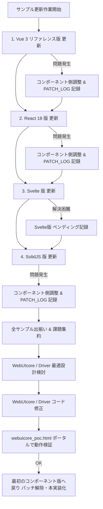

# 📘 モダンWebコンポーネント版 サンプル更新作業ルール & 開発ガイドライン

本ドキュメントは、NetHack Wasm WebUI プロジェクトにおいて、各種モダン Web フロントエンドフレームワーク（Vue 3, React 18, Svelte 4/5, SolidJS 等）のサンプルクライアント（`examples/` 配下）を更新・構築・保守する際に **必ず遵守すべき運用ルール、アーキテクチャ規約、および開発手戻り防止フロー** を定めた参照資料です。

---

## 1. 開発基本方針 & コア凍結原則 (Core Principles)

各モダンWebコンポーネント版のサンプル更新作業における手戻りを防ぎ、全体最適を実現するため、以下のプロセス原則を厳格に適用します。

```text
 +-----------------------------------------------------------------------------------+
 | 1. 各サンプル更新フェーズ (Vue / React / Svelte / Solid)                           |
 |  ・WebUIcore / Driver は原則「完全凍結 (No Modification)」                       |
 |  ・問題発生時はコンポーネント側（パッチ / Adapter クラス等）で調整・回避           |
 |  ・調整内容、泥臭い回避策、コア拡張が必要な理由を「パッチログ」に詳細記録           |
 |  ・解決困難・手詰まり時は即座に「ペンディング (保留)」とし、次のコンポーネント版へ移行|
 +-----------------------------------------------------------------------------------+
                                           │
                                           ▼ (全サンプル一巡)
 +-----------------------------------------------------------------------------------+
 | 2. コア改善 & 統一リファクタリングフェーズ                                         |
 |  ・集約されたパッチログ・未解決課題から、WebUIcore/Driver の最適設計を検討        |
 |  ・WebUIcore / Driver を修正 ➔ `webuicore_poc.html` で正常動作を完全検証            |
 |  ・最初のコンポーネント版に戻り、暫定パッチを解除して標準仕様へ本実装              |
 +-----------------------------------------------------------------------------------+
```

### 規則 1-1: WebUIcore / Driver 変更禁止（凍結原則）
サンプル更新作業中は、`src/core/` (WebUIcore) および `src/driver/` (Driver/Bridge) のコードは変更しません。すべての問題対応はサンプルクライアント側（Webコンポーネント・ストア・中継アダプター）で吸収・実装します。

### 規則 1-2: Webコンポーネント側での調整 & パッチ記録義務（コア不足機能の抽出メカニズム）
動作不良や仕様の不適合が発生した場合、コンポーネント側で調整（パッチ適用、中継クラス/Adapterによる変換など）を行います。
この「あえてコンポーネント側で泥臭く調整し記録する」アプローチの真の目的は、**各フレームワーク（Vue, React, Svelte, Solid）の多様な状態管理・生命周期モデルから `WebUICore` を検証することで、机上設計では見落としていた「コアに必要な真の不足機能・イベント・API設計の穴」を自律的に炙り出すこと**にあります。

「本来コア側で対応すべき事項」や「スマートにいかなかった泥臭い対応」であっても、すべてを『パッチログ』としてコードおよびドキュメントに記録します。

### 規則 1-3: ペンディング（保留）判定と即時移行
特定のコンポーネント版でフレームワーク固有の制約や解決困難な問題が発生した場合は、深追いで時間を浪費せず、該当のコンポーネント版を**「ペンディング (Pending)」**状態として記録し、速やかに次のフレームワーク（例: Vue ➔ React ➔ Svelte ➔ Solid）の開発に移ります。

### 規則 1-4: 全サンプルの出揃い後のコア一括改善サイクル
すべてのコンポーネントサンプルの更新作業が一巡した段階で、蓄積された「パッチ記録・ペンディング課題」を一覧化・分析します。**抽出された機能ギャップをもとに WebUIcore/Driver の最適な機能拡張・仕様整理を一括して実施**し、**`webuicore_poc.html` (PoCポータル) で動作確認が取れた後に、各サンプルクライアントの本実装（パッチ解除）へ戻る**フローを徹底します。

---

## 2. コンポーネント側での調整（パッチ）記録規約

Webコンポーネント側で問題の調整やワークアラウンドを行った場合、後からコアへ還元できるように以下の形式でコードコメントおよびドキュメントに記録します。

### 2-1. コード内パッチコメント規約
中継クラスや Composable / Hook 内部で調整を行った場合は、必ず `[PATCH-WEBCORE]` タグを用いたコメントを残します。

```typescript
// ============================================================================
// [PATCH-WEBCORE] #001: メニュー応答配列のプロキシ解体パッチ
// 理由: SolidJS の Store/Signal がネストしたオブジェクトを Proxy 化するため、
//       Resolver.respond() に渡す際に WASM 側で構造化クローンエラーが発生する。
// 本来あるべきコア機能: WebUICore 側の respond() にて自動 unwrap 処理を行うべき。
// 状態: 暫定回避中 (Webコンポーネント側で deepClone を適用)
// ============================================================================
public sendMenuResponse(selectedIndex: number) {
    const rawItem = JSON.parse(JSON.stringify(this.activeMenuItems[selectedIndex]));
    this.core.respond(rawItem.accelerator);
}
```

### 2-2. サンプルリポジトリ内 `PATCH_LOG.md` の運用
各サンプルディレクトリ（例: `examples/react-client/PATCH_LOG.md`）に、作業中に発生した調整点・未解決事項をリアルタイムで追記します。

| ID | 対象機能 | 発生した問題・現象 | Webコンポーネント側での調整対応（パッチ内容） | 本来 WebUIcore / Driver に求められる改善案 | 状態 |
| :--- | :--- | :--- | :--- | :--- | :--- |
| **#001** | `inputRequired` | React 18 厳格モードで Listener が2回登録されプロンプトが二重発火 | `useRef` で Controller を シングルトン保持し `useEffect` 解除を厳格化 | `WebUICore.off` の一括アンバインド機能強化 | **暫定対応済** |
| **#002** | `map_cleared` | Svelte 5 の Rune 状態更新タイミングと Canvas 再描画が非同期でズレる | `tick()` を挟んで Canvas コンテキストクリアをマニュアル実行 | 描画完了イベント (`renderCompleted`) の定義 | **ペンディング** |

---

## 3. 共通アーキテクチャ & ディレクトリ構造規格

すべてのモダンWebコンポーネントサンプルは、同一の Clean Architecture 構造およびコンポーネント分割に従って構築します。

### 3-1. 標準ディレクトリ構造

```text
examples/[framework]-client/
├── src/
│   ├── assets/              # スプライト画像 (nethack_default_32.png 等)
│   ├── components/          # UIコンポーネント群
│   │   ├── GameCanvas.xxx   # [1] マップ・スプライト/TTY 描画・ターゲットカーソル
│   │   ├── StatusBar.xxx    # [2] キャラクター全ステータス表示
│   │   ├── MessageLog.xxx   # [3] ゲームログ閲覧・自動スクロール
│   │   ├── PromptModal.xxx  # [4] YN / TEXT / MENU / FILE プロンプトモーダル
│   │   ├── GameOverModal.xxx# [5] 勝敗・死因・Top10スコアボード表示
│   │   └── HeaderPanel.xxx  # [6] Restart / Config / Sound / Help コントロール
│   ├── services/            # または composables / hooks
│   │   └── useNetHackDriver # DriverController シングルトン (非Proxy管理)
│   ├── stores/              # Pinia / Zustand / Svelte Store / Solid Store
│   ├── App.xxx              # メインレイアウト統合
│   └── main.xxx             # エントリーポイント
├── PATCH_LOG.md             # 当該フレームワークでのパッチ・ワークアラウンド記録
├── README.md                # 起動手順およびライブデモリンク
└── package.json
```

### 3-2. `driverController` シングルトン管理原則
フレームワークの Reactive State (Vue `reactive()`, React `useState`, Solid `createSignal`) に `WebUICore` インスタンスや Wasm `Resolver` を直接格納しないでください。Proxy による内部状態の破損や二重発火を防ぐため、**クラスインスタンスによる Singleton 管理**を行います。

---

## 4. UI 描画・インタラクション共通ルール

### 4-1. Hybrid Canvas 描画 & マップ全消去の条件
1. **スプライト・TTY描画**:
   - `getTileMapping()` を使用して 32x32 スプライト切り出し描画（`tilesPerRow = 40`）。
   - 未定義セルは 16色 TTY カラー + monospace フォントでフォールバック。
2. **マップ全消去 (`clearMapGrid`) ルール**:
   - 毎ターンの `clear_nhwindow(3)` では全消去を行わず、`print_glyph` 差分更新のみ維持。
   - `map_cleared` イベント（`DLEVEL` 変更時）のみ Canvas 全消去を実行。
3. **ターゲットカーソル表示**:
   - `cursor` イベント受診時、セル内側 1px (`dx + 1.5, dy + 1.5, 13px * 11px`) に枠線描画し、移動時の残像ゴミを防止。

### 4-2. モーダル分岐 (`promptCategory`) & キーボードナビゲーション
`inputRequired` 発火時、`payload.category` に応じて適切な UI を表示します。

- **`'YN'`**: Yes/No ダイアログ (`y/n/q` ボタン & キーボード `y`, `n`, `Esc` 直送)
- **`'TEXT'`**: 1行テキスト入力フォーム (`askname`, `getlin`, `#extcmd`)
- **`'MENU'`**: アイテム選択モーダル。**上下カーソルキー (`↑`/`↓`) でフォーカス移動し `Enter` で選択できるナビゲーションを必須実装**。
- **`'FILE'`**: 閲覧専用テキストモーダル (Help, Top 10等)。`Space / Enter / ESC` で終了。
- **方向入力 (`"direction"`)**: Yes/No モーダルを出さず、移動キー (h, j, k, l, 矢印キー等) を C コアへ直送。

---

## 5. サンプル更新手順 & コア改善サイクルフロー



1. **ステップ 1: 順次更新**:
   - `Vue 3` ➔ `React 18` ➔ `Svelte` ➔ `SolidJS` の順で更新作業を進めます。
   - WebUIcore / Driver は一切変更せず、不具合はコンポーネント側で対処・`PATCH_LOG.md` へ記録。
2. **ステップ 2: ペンディング適用**:
   - フレームワーク固有のブロック等で解決できない場合、そのコンポーネント版を「ペンディング」とし、次へ進む。
3. **ステップ 3: コア改善一括検討**:
   - 全サンプルの完了/ペンディング出揃い後、集約した `PATCH_LOG.md` から WebUIcore/Driver の改修仕様を決定。
4. **ステップ 4: コア検証 & パッチ解除**:
   - コア修正後、`webuicore_poc.html` で全機能の正常動作を確認。
   - 各サンプルクライアントへ戻り、暫定パッチを解消して美しい本実装コードへ統一する。

---

## 6. 検証・品質チェックリスト (Quality Checklist)

各コンポーネント版の作業完了時には、以下の項目を満たしているか確認します。

- [ ] **初期化ガード**: `CoreState.INITIALIZING` 時に操作がガードされローディング画面が表示されること。
- [ ] **マップ描画**: 2D Canvas スプライト描画、TTYフォールバック、ターゲットカーソル枠線が正しく表示されること。
- [ ] **階層消去**: ダンジョン移動時に `map_cleared` によりマップ全体が正常にクリアされること。
- [ ] **モーダル操作**: YN, TEXT, MENU モーダルが正常に機能し、MENU モーダルで上下キー ＋ Enter 操作ができること。
- [ ] **ゲームオーバー & スコア**: 死因ダイアログおよび Top 10 スコアボード表示が正しく機能すること。
- [ ] **即時リトライ**: ページリロードを行わずに `core.restart()` で再ゲームが開始できること。
- [ ] **パッチログ記帳**: コアへ戻すべき全調整事項が `PATCH_LOG.md` に記載されていること。
- [ ] **静的ビルド動作**: `npm run build` がエラーなく成功し、`dist/index.html` でブラウザプレイ可能であること。

---

## 7. 品質向上と手戻り防止のための5つの補助規約 (Auxiliary Guidelines)

ロジック面以外（検証手順・型・CSS・ビルド環境・デバッグ）での手戻りを防ぐため、以下の 5 つの補助規約を適用します。

### 7-1. 【シナリオ固定】7段階標準動作検証シナリオ
検証手順のブレによるバグの漏れを防ぐため、すべてのコンポーネント版で以下の** 7 ステップの標準検証シナリオ**を順番に実行して動作確認を行います。

1. **起動**: ページ読込 ➔ `CoreState.INITIALIZING` ローディング表示 ➔ 自動でゲーム画面に移行。
2. **名前入力**: `askname` プロンプト ➔ プレイヤー名を入力して Enter。
3. **ダンジョン操作**: 移動キー (`h, j, k, l` / 矢印キー) ➔ ターゲットカーソル金枠追従の確認。
4. **インベントリ操作**: `i` キー ➔ `promptCategory: 'MENU'` 表示 ➔ **上下カーソルキーで選択移動 ＆ Enter 決定**。
5. **階層移動**: 階段移動（DLEVEL変化） ➔ マップ全体が一度きれいにクリア (`map_cleared`) されることを確認。
6. **ゲームオーバー & スコア**: `#quit` で討死 ➔ 勝敗ダイアログ ＆ **Top 10 スコアボード (record)** 表示の確認。
7. **即時リトライ**: モーダルから **Restart (`core.restart()`)** ➔ ページリロードなしで即座に再スタート。

### 7-2. 【型安全性】TypeScript 型定義の厳格バインド
- `any` 型の多用による呼び出しプロパティ名ミスを防ぐため、`WebUICore` のイベントペイロード型 (`src/core/index.d.ts`) を厳格に使用します。
- 各サンプルクライアントで `npm run build` または `tsc --noEmit` を実行し、型チェックを自動化します。

### 7-3. 【デザイン共通化】共通 CSS トークン & スタイル定義の利用
- モーダル・ステータスバー・キャンバス枠の見た目のブレやレスポンシブ崩れを防ぐため、デザインルール（CSS 変数・共通クラス名）を統一します。
- レイアウト設計は各フレームワークで個別に作らず、共通の枠組み・スタイル定義を参照します。

### 7-4. 【ビルド標準化】Vite 相対パス設定 (`base: './'`) の統一
- ローカル環境 (`npm run dev`) では動作するが、GitHub Pages (`dist/`) デプロイ時に Worker や画像パスが通らなくなる手戻りを防ぎます。
- `vite.config.ts` に `base: './'` を指定し、Worker / スプライトアセットのパス参照ロジックを全サンプルで標準化します。

### 7-5. 【デバッグ効率化】UI モーダル単体検証用のイベントモック活用
- 特定のゲームオーバー状態や複雑なプロンプト (`TextWindowModal` や `YNPrompt`) を毎回ゲームをプレイして発生させる手間を省きます。
- 開発用デバッグパネル等から `core.emit('inputRequired', mockPayload)` を直接流し込んで UI 単体の表示・スタイル確認を 1 秒で行える仕組みを活用します。

