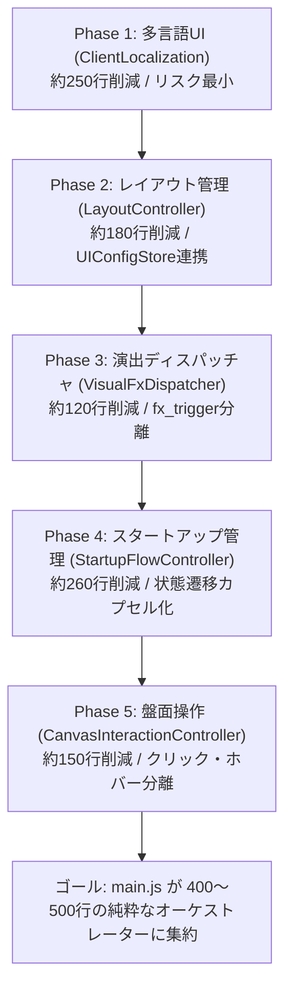

# 🧩 GKL Pure JS Client (main.js) モジュール分割＆オーケストレーター適正化計画書

- **ステータス**: `🚧 in-progress`
- **作成日**: 2026-10-07
- **対象コード**: `examples/gkl-pure-js-client/main.js` (および新規 `modules/` 配下)
- **関連ドキュメント**: [ROADMAP.md](../ROADMAP.md), [SYSTEM_CAPABILITIES.md](../SYSTEM_CAPABILITIES.md)

---

## 1. 概要と背景

`examples/gkl-pure-js-client/` は、NetHack WASM WebUI のフラグシップ参照実装として、GKL (Game Knowledge Layer)、WebGPU HD-2D レンダラー、多言語切り替え (i18n)、動的コンテキストアクション、アドベンチャーログなど最新機能の統合ショーケースを担っています。

一方で、各コンポーネント（StatusView, InventoryView, MinimapHudRenderer 等）のモジュール化が進められたものの、エントリポイントである `main.js`（クラス `GklPureJSClient`）が **2,364 行 / 約 102 KB** にまで肥大化し、以下のような「神クラス (God Object)」状態となっています。

### 現状の主要課題
1. **単一責任の原則 (SRP) の著しい違反**:
   - 起動ウィザード、UI多言語辞書・テキスト適用、盤面クリック/ホバー判定、Visual FXディスパッチ、レイアウト・プリセット管理がすべて `GklPureJSClient` 1クラスに集中。
2. **保守性の低下**:
   - ボタンの文言追加や画面遷移の微調整であっても 2,300 行超のファイルを編集する必要があり、変更の影響範囲が見えにくい。
3. **テスタビリティの欠如**:
   - スタートアップ状態遷移や盤面インスペクト判定ロジックが `main.js` 内部のクロージャやインスタンスプロパティに強く結合しており、単体テストによる保護が困難。

---

## 2. ゴールと指標

| 指標 | 現状 | 目標値 |
| :--- | :---: | :---: |
| **`main.js` 行数** | **2,364 行** | **400 〜 500 行** (約75〜80%削減) |
| **`main.js` の責務** | 5役以上 (起動・翻訳・操作判定・演出・レイアウト) | **純粋な初期化配線・イベント調停（オーケストレーター）のみ** |
| **既存テスト通過率** | 124スイート / 1,533テスト PASS | **100% PASS 維持 (Zero Regression)** |

---

## 3. 現状の行数内訳と分割ターゲット

| セクション | 行範囲 | 現状行数 | 移行先モジュール | 想定削減行数 |
| :--- | :---: | :---: | :--- | :---: |
| **Constructor (配線)** | L37 - L368 | 332 行 | `main.js` に残しつつ初期化メソッドへ整理 | - |
| **Core Events 購読** | L483 - L881 | 399 行 | FX・演出をディスパッチャへ委譲 | 約 120 行 |
| **DOM Events & 盤面操作** | L983 - L1487 | 505 行 | 盤面クリック・ホバー・メニュー判定を分離 | 約 150 行 |
| **多言語 UI 更新** | L1520 - L1772 | 253 行 | `modules/i18n/ClientLocalization.js` | **約 250 行** |
| **スタートアップ・ウィザード** | L1926 - L2185 | 260 行 | `modules/startup/StartupFlowController.js` | **約 260 行** |
| **レイアウト & プリセット** | L2186 - L2364 | 179 行 | `modules/layout/LayoutController.js` | **約 180 行** |
| **ビューモード・その他** | その他 | 残り | 各種マネージャーへ整理 | 約 50 行 |

---

## 4. アーキテクチャ＆新規モジュール構成

既存の `examples/gkl-pure-js-client/modules/` 配下に、責務ごとに明確に分離した独立クラスを新設します。

```
examples/gkl-pure-js-client/modules/
├── components/                 (既存: 各種UIコンポーネント)
├── handlers/                   (既存: KeyHandler)
├── renderers/                  (既存: Viewport, Minimap, HD2D 等)
│
├── i18n/                       ★ 新設: 多言語UIテキスト管理
│   ├── clientDictionary.js     (UIラベル・ツールチップの対訳テーブル)
│   └── ClientLocalization.js   (DOM要素への言語適用コントローラー)
│
├── layout/                     ★ 新設: レイアウト・プリセット管理
│   └── LayoutController.js     (UIConfigStore 連動、サイドパネル退避、チェックボックス同期)
│
├── effects/                    ★ 新設: 演出・FXディスパッチャ
│   └── VisualFxDispatcher.js   (ATTACK_HIT, DAMAGE_FLASH, DEATH_BURST等の2D/3D振り分け)
│
├── startup/                    ★ 新設: 起動・セーブデータ管理
│   └── StartupFlowController.js (段階遷移 INITIALIZING→READY、セーブ検出、リスタート)
│
└── interaction/                ★ 新設: 盤面インタラクション管理
    └── CanvasInteractionController.js (2D/3D/ASCII共通のホバー/クリック、メニュー判定、travelTo)
```

---

## 5. 段階的マイグレーション計画 (Phase 1 〜 Phase 5)

既存の動作を壊さないよう、依存関係が小さく安全性の高いモジュールから順に段階的に実施します。



### Phase 1: 多言語 UI 更新の分離 (`modules/i18n/`)
- **内容**:
  - `onLanguageChanged` (L1520 - L1772) 内の大量の `isEn ? ... : ...` を `clientDictionary.js` に抽出。
  - `ClientLocalization.js` を作成し、言語変更時に各DOM要素のテキスト・titleを一括更新するメソッド群を提供。
- **効果**: `main.js` から約250行を即座に削減。

### Phase 2: レイアウト & プリセット管理の分離 (`modules/layout/`)
- **内容**:
  - `initLayoutConfig`, `applyLayoutConfig`, `setPreset`, `toggleSidePanel` などのレイアウト設定ロジックを `LayoutController.js` に抽出。
  - `UIConfigStore` との購読・同期処理を同コントローラー内で完結。
- **効果**: `main.js` から約180行を削減。

### Phase 3: Visual FX ディスパッチャの分離 (`modules/effects/`)
- **内容**:
  - `core.on('fx_trigger')` (L754 - L859) 内の各エフェクト生成および画面シェイクの振り分け処理を `VisualFxDispatcher.js` へ抽出。
  - `MainViewportRenderer` および `WebGPUHD2DRenderer` への演出登録を集約。
- **効果**: `main.js` から約120行を削減。

### Phase 4: スタートアップ・セーブ管理の分離 (`modules/startup/`)
- **内容**:
  - `setStartupView`, `bootstrapGame`, `startWithProgress`, `transitionToStartupReady`, `completeStartup`, `restartGame`, `deleteSaveFile` を `StartupFlowController.js` へ抽出。
  - `INITIALIZING` → `SELECTION` → `PROGRESS` → `READY` → `PLAYING` のステートマシンをカプセル化。
- **効果**: `main.js` から約260行を削減。

### Phase 5: 盤面インタラクションの分離 (`modules/interaction/`)
- **内容**:
  - 2D Canvas、WebGPU Canvas、ASCII Grid、Zoom Canvas それぞれのクリック・ホバーイベントと、共通判定関数 `handleCanvasInspect`（スマートコンテキスト判定、`travelTo` 呼び出し）を `CanvasInteractionController.js` へ抽出。
- **効果**: `main.js` から約150行を削減。

---

## 6. リファクタリング後の `main.js` の責務
すべてのフェーズ完了後、`main.js` は以下の責務のみを持つ軽量なオーケストレーターとなります：
1. Core（`WebUICore`）およびサブコントローラーのインスタンス化
2. コントローラー間の相互参照の結線（Dependency Injection）
3. Core イベントと各モジュールの中継呼び出し
