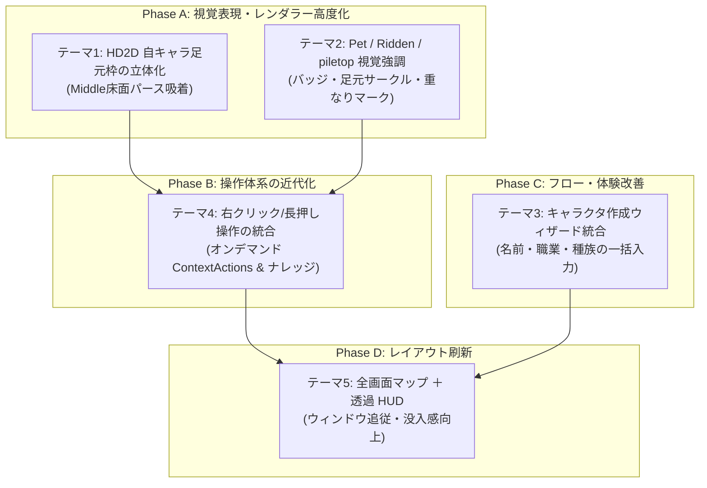

# 🎨 GKL クライアント UI/UX 刷新＆レンダラー表現高度化 実装計画書

本ドキュメントは、NetHack WASM WebUI の代表クライアントである **GKL Pure JS Client** および各レンダラー（WebGPU HD2D、Canvas 2D、ASCII）において、視認性・操作性・画面構成を大幅に進化させるための 5 大改善テーマの実装計画書です。

---

## 📌 1. 背景と全体方針

NetHack は伝統的に CUI をルーツとし、ターミナル由来の断片的なテキストプロンプトや、グリフ（文字）単位での描画体系を持っています。本プロジェクトでは WebAssembly 化および WebGL/WebGPU・近代 Web UI 技術を駆使してリッチなジオラマ体験（HD2D）や各種モーダル機能（ペーパードール、ナレッジ、ダイレクションパッド等）を実現してきました。

本計画では、以下の 3 つの方針のもとでクライアントのさらなる近代化を推し進めます：
1. **空間的一体感（イマーシブ）の向上**: レンダラーの立体パースペクティブと UI オーバーレイの完全調和。
2. **情報の直感的可視化**: ペット・騎乗・アイテム重なり（piletop）等の状況を、グリフ番号の違いを活かしてグラフィカルに明示。
3. **操作のコンテキスト化**: 画面クリック可能化の資産を活かし、右クリックや長押しによるシームレスなアクション・情報取得への誘導。

---

## 🚀 2. 5大改善テーマの詳細設計



---

### テーマ 1: HD2DRenderer 自キャラ足元枠の 3D パースペクティブ化 (Middle床面吸着)

#### 1.1 現状課題
現在、`WebGPUHD2DRenderer.js` の `_renderCursorFrames(ctx, ts, now)` において、自キャラ（`playerX, playerY`）の位置に緑色の枠（死亡時は赤色）を描画しています。
しかし、座標を `worldToScreen(this.playerX, 0.44, this.playerY)` で中心点 1 点のみを取得し、Canvas 2D の `ctx.strokeRect` を実行しているため、**立体ジオラマの床面ではなく、カメラ正面（スクリーン正対）を向いた長方形** として描画され、床やキャラクターの立体感とズレが生じています。

#### 1.2 技術仕様・解決策
床面（$Y = 0.0$、チラつき防止のため $Y = 0.01$）の 4 隅の 3D 空間座標を計算し、レンダラー既存の `worldToScreen` 投影パイプラインを通して 4 つの画面頂点へ変換します。

* **床の 4 隅ワールド座標（1 マスの床タイル枠）**:
  $$P_0 = (playerX - 0.5, 0.01, playerY - 0.5)$$
  $$P_1 = (playerX + 0.5, 0.01, playerY - 0.5)$$
  $$P_2 = (playerX + 0.5, 0.01, playerY + 0.5)$$
  $$P_3 = (playerX - 0.5, 0.01, playerY + 0.5)$$

* **描画パイプライン**:
  ```javascript
  const p0 = this.worldToScreen(this.playerX - 0.48, 0.01, this.playerY - 0.48);
  const p1 = this.worldToScreen(this.playerX + 0.48, 0.01, this.playerY - 0.48);
  const p2 = this.worldToScreen(this.playerX + 0.48, 0.01, this.playerY + 0.48);
  const p3 = this.worldToScreen(this.playerX - 0.48, 0.01, this.playerY + 0.48);

  if (p0 && p1 && p2 && p3) {
    ctx.save();
    ctx.strokeStyle = this.isPlayerDead ? '#ef4444' : '#00e676';
    ctx.lineWidth = 2;
    ctx.beginPath();
    ctx.moveTo(p0.screenX, p0.screenY);
    ctx.lineTo(p1.screenX, p1.screenY);
    ctx.lineTo(p2.screenX, p2.screenY);
    ctx.lineTo(p3.screenX, p3.screenY);
    ctx.closePath();
    ctx.stroke();
    // オプション: ほんのり半透明の足元光プレート (fill)
    ctx.fillStyle = this.isPlayerDead ? 'rgba(239, 68, 68, 0.15)' : 'rgba(0, 230, 118, 0.15)';
    ctx.fill();
    ctx.restore();
  }
  ```
* **メリット**:
  * ジオラマの視点角度（チルト）やトップダウン切り替え、ズームに完全追従したパースペクティブ枠が数行の追加で実現可能。

---

### テーマ 2: Pet / Ridden / piletop アイテムの視覚的識別強調

#### 2.1 現状課題
NetHack では、画面上のモンスターやアイテムは単一のタイル番号に変換されて描画されるため、「どれが飼い慣らしたペット（Tamed）か」「どれに騎乗中（Ridden）か」「足元にアイテムが複数個重なっている（piletop）か」が見た目だけでは識別しづらい課題があります。

#### 2.2 内部判定ロジック（既存資産の活用）
プロジェクトの `src/core/knowledge/engines/glyphClassifier.js` では、すでに以下の通り NetHack の Glyph Offset を用いた完全な同定が可能です：
* **Pet**: `GLYPH_PET_OFF (766)` 〜 `GLYPH_INVIS_OFF` ➔ `{ isPet: true }`
* **Ridden**: `GLYPH_RIDDEN_OFF` 〜 ➔ `{ isRidden: true }`
* **piletop**: `GLYPH_OBJ_PILETOP_OFF (7992)`、`GLYPH_BODY_PILETOP_OFF (8473)`、`GLYPH_STATUE_PILETOP_OFF (8856)` ➔ `{ isPile: true }`

#### 2.3 実装アプローチ比較
1. **案 A: タイルスプライトシートの動的複製・書き換え**
   - 課題: テクスチャアトラスのサイズが肥大化し、GPUメモリやインデックスマッピングの管理コストが高い。
2. **案 B: レンダラーオーバーレイ / シェーダー拡張（推奨）**
   - メリット: タイル画像自体は不変のまま、追加情報（バッジ、枠、エフェクト）を描画パスで合成できる。

#### 2.4 レンダラー別の表現仕様
* **Canvas 2D / WebGPU HD2D**:
  * **Pet**: 足元に小さな緑サークル、または頭上に小さなハート/首輪バッジ（🐾 / 💚）。
  * **Ridden**: 足元に青いサークル、または馬蹄/鞍アイコン。
  * **piletop**: タイル右下に「重ね合わせアイコン」または小さな「＋」マーク、あるいは右下にズレたシャドウ枠を表示。
* **ASCII レンダラー**:
  * ペット: 背景色の薄いハイライト、または文字色を特定色（エメラルドグリーン等）で着色。
  * piletop: アンダーライン付与、または複数重なりを示すドット表示。

---

### テーマ 3: ゲーム新規作成時のキャラクタ作成ダイアログ統合 (名前・職業選択ウィザード)

#### 3.1 現状課題
* `askname` は新規ゲーム作成時にのみ発行され、セーブデータ再開（ロード時）はドライバと WebUICore 間の調整でスキップされます。
* 現状の新規開始フローでは、`askname`（名前入力）の後に `Shall I pick a character's race, role... [ynaq]` が単なる質問ダイアログとして届き、選択ボタンが「Yes / No / All / Quit」となっています（本来の意図である Auto/All と乖離）。
* その後、`n`（手動選択）を選んだ場合も、職業・種族・性別・属性の選択プロンプトが 1 画面ずつバラバラに届くため、CUI 的なもどかしさがあります。

#### 3.2 統合キャラクタ作成ウィザードの構想
* **起動トリガー**: `askname` イベントの受信。
* **UI 構成**:
  * 1 画面の「キャラクター作成（Character Creator）」モーダルを表示。
  * **名前入力欄**（デフォルト名、ランダム生成ボタン）。
  * **プリセット / クイックスタート**:
    - 「すべておまかせ (Random / Auto)」（NetHack 側の `y` または `a` に相当）
    - 「手動カスタム選択」
  * **カスタム選択項目**:
    - 職業（Role: Valkyrie, Wizard, Samurai, etc.）
    - 種族（Race: Human, Elf, Dwarf, etc.）
    - 性別（Gender: Male, Female）
    - 属性（Alignment: Lawful, Neutral, Chaotic）
* **ドライバ連携（自動シーケンス応答）**:
  ユーザーがウィザードで「冒険を始める」を押した際、WebUI 側で確定した選択内容をドライバへ順次流し込みます：
  1. `askname` ➔ 入力された名前を送信
  2. `ynaq` プロンプト ➔ 手動選択なら `n`、ランダムなら `y` を送信
  3. 続く各選択プロンプト ➔ ウィザードで選ばれたキー（例: 'v', 'e', 'f', 'n' 等）を順次自動応答。

---

### テーマ 4: 操作体系の近代化 (マスの右クリック/長押しによる ContextActions ＆ ナレッジ)

#### 4.1 現状課題
* 現在、常時表示領域にナレッジウィンドウやアクションボタンが配置されているため、画面レイアウトを圧迫しています。
* 一方で、画面のマスをクリックして対象座標を特定する機能（`screenToWorld` / `worldToScreen`）はすべてのレンダラーで完成しています。

#### 4.2 インタラクション設計
* **操作トリガー**:
  * **デスクトップ**: マップ上のマスを **右クリック**（`contextmenu` イベント）。
  * **モバイル / タッチ**: マップ上のマスを **長押し**（350〜400ms タッチホールド）。
* **表示内容（フローティング・コンテキストポップアップ）**:
  クリックされたマスの座標（X, Y）から、GKL の `AreaStateManager` / `StructuredKnowledgeEngine` を参照：
  1. **マスの概要・ナレッジ**: 対象の名前（例：「オークの死体」「つるはし」「施錠されたドア」）、危険度、簡易説明。
  2. **可能なアクション（ContextActions）**:
     - 隣接マスの場合: 「攻撃」「話す」「開ける」「キック」「調べる」
     - 足元マスの場合: 「拾う」「置く」「食べる」「読む」
     - 遠隔マスの場合: 「移動（自動歩行）」「投擲」「杖を振る」「照準（Look）」
* **メリット**:
  * 画面端のボタン群を探す必要がなく、マウス/指先の直下で直感的に NetHack の多彩なコマンドを実行可能になります。

---

### テーマ 5: 画面全体の刷新 (マップ全画面ベース ＋ 透過 HUD オーバーレイ)

#### 5.1 現状課題
現在の GKL クライアントは、中央のビューポート、左右のサイドパネル（メッセージログ、ステータス、ナレッジ、方向パッド等）によるクラシックな分割画面スタイルです。画面解像度が低いデバイスではダンジョン表示領域が狭くなります。

#### 5.2 刷新後のレイアウト構造（モダン RPG / Diablorike HUD）
* **ベースレイヤー（最背面）**:
  * ダンジョンマップ Canvas / WebGPU キャンバスがウィンドウ全体（100vw × 100vh）に広がる。
  * ウィンドウサイズ変更時にバックバッファを完全追従リサイズ。
* **オーバーレイレイヤー（前面・透過浮遊 HUD）**:
  * **メッセージログ**: 画面上部または左上に、背景グラデーション透過（フェードアウト付き）で重ね表示。直近数行のみ浮かび、スクロールやホバーで履歴展開。
  * **ステータスバー**: 画面下部中央にコンパクトな HP / MP / AC / レベル等のヘルスグローブまたはモダンバーをフロート配置。
  * **ミニマップ**: 画面右上に透過円形またはスクエア型でフロート。
  * **インベントリ・ペーパードール**: モーダルまたは右端からのスライドイン（Drawer）として表示。

---

## 📅 3. 段階的実装ロードマップ (Phasing)

| フェーズ | テーマ | 実装内容 | 想定工数・難易度 |
| :--- | :--- | :--- | :---: |
| **Phase A** | テーマ 1, 2 | ・HD2D 自キャラ足元枠の 3D パース吸着（ポリゴン結線）<br/>・Pet / Ridden / piletop のオーバーレイマーク・エフェクト描画 | 低〜中（即効性大） |
| **Phase B** | テーマ 4 | ・マスの右クリック / 長押しイベントハンドリング<br/>・フローティング ContextActions ＆ ナレッジポップアップ実装 | 中 |
| **Phase C** | テーマ 3 | ・`askname` トリガーのキャラクター作成ウィザードモーダル新設<br/>・名前・職業・種族の一括選択とドライバ自動応答シーケンス | 中 |
| **Phase D** | テーマ 5 | ・マップ全画面化（100vw/100vh）と動的リサイズ追従<br/>・透過メッセージログ、フローティングステータス HUD の CSS 刷新 | 中〜高 |

---

## 📂 4. 影響範囲・対象ソースファイル

* **レンダラー関連**:
  - `examples/gkl-pure-js-client/modules/renderers/WebGPUHD2DRenderer.js` (自キャラ床枠、エフェクト)
  - `examples/gkl-pure-js-client/modules/renderers/MainViewportRenderer.js` (Canvas 2D マーク)
  - `examples/gkl-pure-js-client/modules/renderers/ZoomRenderer.js`
* **知識・分類エンジン**:
  - `src/core/knowledge/engines/glyphClassifier.js` (Pet, Ridden, piletop 判定)
* **モーダル・UI コンポーネント**:
  - `examples/gkl-pure-js-client/modules/components/ModalManager.js` (キャラメイクダイアログ統合)
  - `examples/gkl-pure-js-client/modules/components/PaperdollModal.js`
  - `examples/gkl-pure-js-client/modules/actions/ContextActions.js` (右クリック連携)
* **スタイル・レイアウト**:
  - `examples/gkl-pure-js-client/css/viewport.css` (全画面 HUD 化)
  - `examples/gkl-pure-js-client/index.html` (DOM 構造の透過オーバーレイ化)
