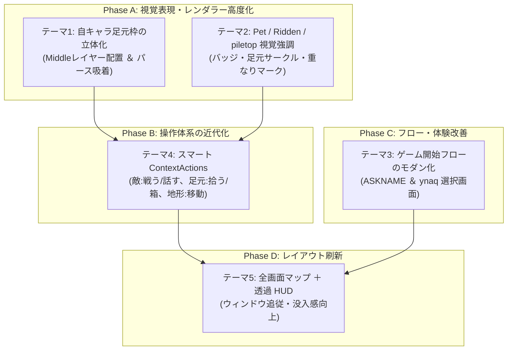

# 🎨 GKL クライアント UI/UX 刷新＆レンダラー表現高度化 実装計画書

本ドキュメントは、NetHack WASM WebUI の代表クライアントである **GKL Pure JS Client** および各レンダラー（WebGPU HD2D、Canvas 2D、ASCII）において、視認性・操作性・画面構成を大幅に進化させるための 5 大改善テーマの実装計画書です。

---

## 📌 1. 背景と全体方針

NetHack は伝統的に CUI をルーツとし、ターミナル由来の断片的なテキストプロンプトや、グリフ（文字）単位での描画体系を持っています。本プロジェクトでは WebAssembly 化および WebGL/WebGPU・近代 Web UI 技術を駆使してリッチなジオラマ体験（HD2D）や各種モーダル機能（ペーパードール、ナレッジ、ダイレクションパッド等）を実現してきました。

本計画では、以下の 3 つの方針のもとでクライアントのさらなる近代化を推し進めます：
1. **空間的一体感（イマーシブ）の向上**: レンダラーの立体パースペクティブと UI オーバーレイの完全調和。
2. **情報の直感的可視化**: ペット・騎乗・アイテム重なり（piletop）等の状況を、グリフ番号の違いを活かしてグラフィカルに明示。
3. **操作のコンテキスト化**: 画面クリック可能化の資産を活かし、右クリックや長押しによるシームレスなアクション・情報取得への誘導。

---

## 🚀 2. 5大改善テーマの詳細設計



---

### テーマ 1: 自キャラ足元枠の 3D パースペクティブ化 ＆ 表示プライオリティの Middle レイヤー最適化

#### 1.1 現状課題
現在、`WebGPUHD2DRenderer.js` の `_renderCursorFrames(ctx, ts, now)` において、自キャラ（`playerX, playerY`）の位置に緑色の枠（死亡時は赤色）を描画しています。
しかし、以下の 2 つの大きな課題があります：
1. **パースペクティブの不一致**: 座標を `worldToScreen(this.playerX, 0.44, this.playerY)` で中心点 1 点のみを取得し、Canvas 2D の `ctx.strokeRect` を実行しているため、立体ジオラマの床面ではなく、カメラ正面（スクリーン正対）を向いた長方形として描画されている。
2. **表示プライオリティ（レイヤー階層）の逆転**: 描画先が WebGPU 3D シーンの手前にある Canvas 2D 最前面オーバーレイとなっているため、**キャラクターの身体（Layer 4: Top）の上に枠線や透過光が被さってしまい**、「キャラクターが枠の中に立っている（足元にある）」という自然な前後関係が崩れている。Canvas 2D レンダラー（`MainViewportRenderer.js`）でも、キャラクター描画後に枠を描画しているため同様の課題がある。

#### 1.2 レイヤー構成と表示プライオリティの定義
GKL クライアントおよびレンダラーの共通描画階層は以下の通り定義されます：
* **Layer 0〜2: Bottom (床・壁天面・壁前面)**
* **Layer 3: Middle (アイテム・罠・足元ハイライト枠／サークル)** ⬅ **★本テーマの配置位置**
* **Layer 4: Top (キャラクター・モンスター・プレイヤー・死亡時墓石)**
* **Layer 5: Effect (過渡的エフェクト: 魔法ビーム・爆発等)**

自キャラ足元枠の表示プライオリティを **Layer: Middle（床・アイテムの上、かつ直立するキャラクターの足元・背面）** に位置付け、キャラクターのドット絵やビルボードの手前に線が被らない自然な足元敷き枠として描画します。

#### 1.3 レンダラー別実装設計

##### ① WebGPU HD2D レンダラー (推奨: パイプライン内 Middle レイヤー描画)
最前面 Canvas 2D への描画ではなく、WebGPU のインスタンス描画パイプライン（WGSL シェーダー）内の **Middle レイヤー（Layer 3、床面直上 $Y = 0.01 \sim 0.03$）** に足元枠プレーン（クアッドまたは結線枠）を投入します。

* **床の 4 隅ワールド座標（1 マスの床タイル枠）**:
  $$P_0 = (playerX - 0.48, 0.01, playerY - 0.48)$$
  $$P_1 = (playerX + 0.48, 0.01, playerY - 0.48)$$
  $$P_2 = (playerX + 0.48, 0.01, playerY + 0.48)$$
  $$P_3 = (playerX - 0.48, 0.01, playerY + 0.48)$$

* **深度テスト（Depth Test）の恩恵**:
  WebGPU のパイプラインに Middle（$Y = 0.01$）として乗せることで、深度バッファの働きにより、直立するキャラクターのビルボード（Layer 4、中心高さ $Y = 0.44$）が自然に枠の前面を覆い、完璧な「足元サークル／枠」となります。また、手前の壁による遮蔽（オクルージョン）も自動的に正しく処理されます。

* **Canvas 2D 投影オーバーレイ（フォールバック / ターゲットカーソル枠）**:
  探索時や照準時のターゲットカーソル（金色パルス枠）のように「対象マス全体を最前面で強調したい場合」は、引き続き 2D オーバーレイ側の `worldToScreen` 4 頂点結線を用いて最前面強調を行います：
  ```javascript
  const p0 = this.worldToScreen(targetX - 0.48, 0.01, targetY - 0.48);
  const p1 = this.worldToScreen(targetX + 0.48, 0.01, targetY - 0.48);
  const p2 = this.worldToScreen(targetX + 0.48, 0.01, targetY + 0.48);
  const p3 = this.worldToScreen(targetX - 0.48, 0.01, targetY + 0.48);

  if (p0 && p1 && p2 && p3) {
    ctx.save();
    ctx.strokeStyle = '#ffd700';
    ctx.lineWidth = 2;
    ctx.beginPath();
    ctx.moveTo(p0.screenX, p0.screenY);
    ctx.lineTo(p1.screenX, p1.screenY);
    ctx.lineTo(p2.screenX, p2.screenY);
    ctx.lineTo(p3.screenX, p3.screenY);
    ctx.closePath();
    ctx.stroke();
    ctx.restore();
  }
  ```

##### ② Canvas 2D レンダラー (`MainViewportRenderer.js`)
* 現在、キャラクター（`Layer 3: Top`）やエフェクト（`Layer 4: Effect`）を描画した後に実行されている自キャラ枠描画（`isPlayerTile`）を、**`cell.middle`（アイテム描画）の直後、かつ `cell.top`（キャラクター描画）の前** に移動します。
* これにより、キャラクターのドット絵の下に枠線が潜り込み、WebGPU 版と同様に Middle プライオリティで統一されます。

#### 1.4 メリット
* ジオラマの視点角度（チルト）やトップダウン切り替え、ズームに完全追従したパースペクティブ枠が実現可能。
* キャラクターのドット絵やアニメーション（バウンス）の上に枠線が被らず、自然で没入感の高い足元ハイライトが得られる。

---

### テーマ 2: Pet / Ridden / piletop アイテムの視覚的識別強調

#### 2.1 現状課題
NetHack では、画面上のモンスターやアイテムは単一のタイル番号に変換されて描画されるため、「どれが飼い慣らしたペット（Tamed）か」「どれに騎乗中（Ridden）か」「足元にアイテムが複数個重なっている（piletop）か」が見た目だけでは識別しづらい課題があります。

#### 2.2 内部判定ロジック（既存資産の活用）
プロジェクトの `src/core/knowledge/engines/glyphClassifier.js` では、すでに以下の通り NetHack の Glyph Offset を用いた完全な同定が可能です：
* **Pet**: `GLYPH_PET_OFF (766)` 〜 `GLYPH_INVIS_OFF` ➔ `{ isPet: true }`
* **Ridden**: `GLYPH_RIDDEN_OFF` 〜 ➔ `{ isRidden: true }`
* **piletop**: `GLYPH_OBJ_PILETOP_OFF (7992)`、`GLYPH_BODY_PILETOP_OFF (8473)`、`GLYPH_STATUE_PILETOP_OFF (8856)` ➔ `{ isPile: true }`

#### 2.3 実装アプローチ比較
1. **案 A: タイルスプライトシートの動的複製・書き換え**
   - 課題: テクスチャアトラスのサイズが肥大化し、GPUメモリやインデックスマッピングの管理コストが高い。
2. **案 B: レンダラーオーバーレイ / シェーダー拡張（推奨）**
   - メリット: タイル画像自体は不変のまま、追加情報（バッジ、枠、エフェクト）を描画パスで合成できる。

#### 2.4 レンダラー別の表現仕様
* **Canvas 2D / WebGPU HD2D**:
  * **Pet**: 足元に小さな緑サークル、または頭上に小さなハート/首輪バッジ（🐾 / 💚）。
  * **Ridden**: 足元に青いサークル、または馬蹄/鞍アイコン。
  * **piletop**: タイル右下に「重ね合わせアイコン」または小さな「＋」マーク、あるいは右下にズレたシャドウ枠を表示。
* **ASCII レンダラー**:
  * ペット: 背景色の薄いハイライト、または文字色を特定色（エメラルドグリーン等）で着色。
  * piletop: アンダーライン付与、または複数重なりを示すドット表示。

---

### テーマ 3: ゲーム開始時の導入フロー最適化 (ASKNAME ＆ ynaq 選択画面のモダン化)

#### 3.1 現状課題と既存資産の確認
* **既存資産の完成度**:
  すでに `CharacterCreationModal.js` が実装されており、職業（Role）・種族（Race）・性別（Gender）・属性（Alignment）のタブ切替、詳細ナレッジ表示、グラフィックプレビュー、NetHack メニューとの自動ジャンプ連携（Step 13 最終確認等）は**極めてリッチかつ完全な形で稼働**しています。
* **現状のボトルネック（導入部のみが CUI のまま）**:
  新規ゲーム開始時に届く以下の 2 つのステップが、依然として簡易な CUI スタイルのままであり、導入のファーストインプレッションを損ねています：
  1. `ASKNAME`（名前入力）: 下部の狭いプロンプトバーにテキスト入力枠が出るだけ。
  2. `ynaq` 質問（`Shall I pick a character's race, role... [ynaq]`）: 単なる質問ダイアログとして届き、選択肢が「Yes / No / All / Quit」という直感性に欠けるボタン表示になっている。

#### 3.2 解決策: ASKNAME ＆ ynaq 画面のモダン化（既存システムとのシームレス連携）
ゼロから巨大なウィザードを新設したり、ドライバへ自動キーストロークを流し込む複雑なシーケンスを組む必要はありません。**`ASKNAME` と `ynaq` の 2 画面をモダンに整えるだけで、その後の詳細選択は現システムの `CharacterCreationModal` にそのままバトンタッチ可能**です。

```mermaid
flowchart TD
    Start["新規ゲーム開始"] --> Step1["Step 1: ASKNAME 画面<br/>(冒険者名の入力 / ランダム生成)"]
    Step1 --> Step2["Step 2: ynaq 選択画面<br/>(おまかせ / 手動選択 / クイック即開始)"]
    
    Step2 -->|「おまかせ作成 (結果確認)」| SendY["'y' または 'a' を送信"]
    Step2 -->|「自分で選ぶ (手動作成)」| SendN["'n' を送信"]
    Step2 -->|「クイックスタート (即開始)」| SendQ["'q' を送信"]
    
    SendY --> ShowResult["キャラクタ作成結果の表示"] --> GameStart["冒険スタート"]
    SendN --> ExistingModal["現システムの CharacterCreationModal 起動<br/>(Role / Race / Gender / Alignment 選択)"] --> GameStart
    SendQ --> GameStartDirect["確認なしでランダム即開始<br/>(即ダンジョン突入)"]
```

* **Step 1: モダンな名前入力画面 (`ASKNAME`)**:
  - 中央モーダルカード形式で「冒険者の名前を決めてください」を表示。
  - デフォルト名（Hero）、サイコロによるランダムネーム生成ボタン、決定ボタン。
  - 確定時に入力された名前をドライバへ送信し、同時に `core.setPlayerName` と `CharacterCreationModal.characterName` へ保存。

* **Step 2: NetHack の実挙動に即した開始モード選択画面 (`ynaq`)**:
  - `Shall I pick character's race, role...` プロンプトを検知した際、従来の「Yes / No / All / Quit」という直感に反するラベルではなく、**NetHack の実際の動作仕様に即した 3 大カード選択肢** を提示：
    - 🎲 **おまかせ作成 (結果を確認して開始)** ➔ `'y'` または `'a'` を送信
      - NetHack が自動で職業・種族・性別・属性を選定し、生成結果の確認画面を表示した上で冒険を開始。
    - ⚙️ **自分で詳細に選ぶ (手動カスタム作成)** ➔ `'n'` を送信
      - 既存の `CharacterCreationModal` が起動し、各タブでナレッジを見ながらじっくりキャラメイク。
    - ⚡ **クイックスタート (ランダム即開始)** ➔ `'q'` を送信
      - キャラクタ作成結果の確認などのステップを一切挟まず、ランダム決定されたキャラクターでそのまま即座にダンジョンへ突入。

* **Step 3: 現システムの動作による自動継続**:
  - ユーザーが「自分で詳細に選ぶ（`n`）」を選んだ場合、NetHack から順次届く職業選択メニューを **既存の `CharacterCreationModal` が自動検知して起動**。
  - 既存の完成されたタブ UI・ナレッジ・ジャンプロジックがそのまま動作するため、追加のキーストローク中継等は一切不要です。

#### 3.3 実装上のメリット
* **最小の実装コストで最大の効果**: 既存の高機能な `CharacterCreationModal.js` 資産を 100% 活用できるため、導入部の 2 画面のスタイリング・誘導整備のみで完了（工数・リスクを大幅低減）。
* **迷わせない導線**: NetHack 特有の `[ynaq]` の意味を知らない新規プレイヤーでも、「おまかせ」か「じっくり選ぶ」かを直感的に選んでゲームを開始可能。

---

### テーマ 4: 操作体系の近代化 (マスのクリック対象に応じたスマート ContextActions ＆ ナレッジ連携)

#### 4.1 現状課題
* 現在のクリック動作は、対象が敵や宝箱・オブジェクトであっても一律にナレッジ詳細の表示と `travelTo`（自動移動）を試みる仕様となっています。
* そのため、敵モンスターと戦ったり話しかけたり、足元のチェストやアイテムを操作したい場合でも、画面端のサイドパネル（ContextActions / 方向パッド）まで視線とマウスを動かしてボタンを押す必要があり、テンポを損ねています。
* また、敵をクリックした際に不用意に移動突進が暴発して予期せぬピンチに陥るリスクもあります。

#### 4.2 インタラクション設計（対象コンテキスト別のスマート分岐）
通常の左クリック（スマホではシングルタップ）において、クリックされたマスの状態（GKL の `situation` / `inspectCellOnDemand` 情報）に応じて、最も自然でスマートな動作に自動分岐します：

```mermaid
flowchart TD
    Click["マスの左クリック / タップ"] --> Check{"クリック対象の種別判定"}
    
    Check -->|敵モンスター / NPC| ActionEnemy["対象直上に推奨アクション表示<br/>(⚔️ 戦う / 💬 話す / 🏹 投擲等)"]
    Check -->|自キャラ (足元 / 箱・アイテム)| ActionSelf["自キャラ直上に足元アクション表示<br/>(📦 拾う / 🧰 開ける / 🍖 食べる等)"]
    Check -->|ドア / ギミック| ActionGimmick["ギミックアクション表示<br/>(🚪 開ける / 🦵 蹴る / 🔍 調べる)"]
    Check -->|何もない床・通路 (地形)| Move["安全に自動移動 (travelTo)"]
    
    ActionEnemy --> Exec["その場でワンタップ選択実行！"]
    ActionSelf --> Exec
    ActionGimmick --> Exec
```

1. **敵モンスター / NPC をクリック**:
   - 不用意な突進移動は行わず、対象の直上（頭上付近）に **フローティング ContextActions メニュー** をポップアップ表示。
   - 「⚔️ 戦う（攻撃）」「💬 話しかける」「🏹 遠隔攻撃 / 杖」「🔍 詳細ナレッジ」などの推奨アクションが上部に並び、そのまま素直に選択実行可能。

2. **自キャラ（足元）をクリック（箱・アイテム・祭壇などがある場合）**:
   - 自キャラのマスをクリックすることで、**足元アクションメニュー** がスマートに展開。
   - 「📦 拾う」「🧰 箱を開ける / 解錠」「🍖 食べる」「📜 読む」「⬇ 置く」など、足元の状況に応じたアクションをマウス直下で即座に実行可能。

3. **安全な地形マス（床・通路）をクリック**:
   - 対象に特別なアクションがない場合は、従来通り素直にそのマスへの **自動移動（`travelTo`）** をスムーズに実行。

4. **右クリック / 長押し（詳細コンテキスト）**:
   - 移動可能な地形であっても移動せずに「そのマスを遠隔調査（Look）」したい場合や、全コマンド一覧を展開したい場合の補助操作として活用。

#### 4.3 実装設計（`main.js` / `ContextActions.js` 連携）
* `main.js` の `handleCanvasInspect(gx, gy, false)` において：
  ```javascript
  const isPlayerTile = (gx === this.playerX && gy === this.playerY);
  const cellKnowledge = await this.core.gkl.inspectCellOnDemand({ x: gx, y: gy });
  
  if (isPlayerTile) {
    // 1. 自キャラクリック ➔ 足元 ContextActions を自キャラ直上にポップアップ
    this.showFloatingContextActions({ x: gx, y: gy, type: 'FLOOR' });
  } else if (cellKnowledge?.hasMonster || cellKnowledge?.hasDoor || cellKnowledge?.hasChest) {
    // 2. 敵・ギミッククリック ➔ 対象マス直上に推奨アクション（戦う/話す/開ける等）をポップアップ
    this.showFloatingContextActions({ x: gx, y: gy, type: 'TARGET', knowledge: cellKnowledge });
  } else if (cellKnowledge?.isWalkable) {
    // 3. 地形マス ➔ 素直に移動
    await this.core.gkl.travelTo({ x: gx, y: gy });
  }
  ```
* レンダラーの `worldToScreen(gx, gy)` を用いて、マップ上のクリック位置のすぐ上に吹き出し型で表示するため、視線移動ゼロの快適な操作性を実現。

#### 4.4 メリット
* 「敵をクリックしたら戦う/話す」「箱や足元をクリックしたら開ける/拾う」「床をクリックしたら移動する」という、現代のゲーマーが直感的に期待する操作感と完全に一致。
* 画面端のボタンを探す必要がなくなり、テンポ・快適性が劇的に向上。

---

### テーマ 5: 画面全体の刷新 (マップ全画面ベース ＋ 透過 HUD オーバーレイ)

#### 5.1 現状課題
現在の GKL クライアントは、中央のビューポート、左右のサイドパネル（メッセージログ、ステータス、ナレッジ、方向パッド等）によるクラシックな分割画面スタイルです。画面解像度が低いデバイスではダンジョン表示領域が狭くなります。

#### 5.2 刷新後のレイアウト構造（モダン RPG / Diablorike HUD）
* **ベースレイヤー（最背面）**:
  * ダンジョンマップ Canvas / WebGPU キャンバスがウィンドウ全体（100vw × 100vh）に広がる。
  * ウィンドウサイズ変更時にバックバッファを完全追従リサイズ。
* **オーバーレイレイヤー（前面・透過浮遊 HUD）**:
  * **メッセージログ**: 画面上部または左上に、背景グラデーション透過（フェードアウト付き）で重ね表示。直近数行のみ浮かび、スクロールやホバーで履歴展開。
  * **ステータスバー**: 画面下部中央にコンパクトな HP / MP / AC / レベル等のヘルスグローブまたはモダンバーをフロート配置。
  * **ミニマップ**: 画面右上に透過円形またはスクエア型でフロート。
  * **インベントリ・ペーパードール**: モーダルまたは右端からのスライドイン（Drawer）として表示。

---

## 📅 3. 段階的実装ロードマップ (Phasing)

| フェーズ | テーマ | 実装内容 | ステータス | 想定工数・難易度 |
| :--- | :--- | :--- | :---: | :---: |
| **Phase A** | テーマ 1, 2 | ・HD2D 自キャラ足元枠の 3D パース吸着 ＆ Middle レイヤー配置最適化<br/>・Pet / Ridden 足元サークルの Middle レイヤー (Layer 3.3) 化<br/>・Pet [♥] / Ridden [R] / piletop [+] の統一ミニバッジ描画 | **✅ 完了** | 低〜中（即効性大） |
| **Phase B** | テーマ 4 | ・クリック対象コンテキスト判定（敵 / 自キャラ足元 / ギミック / 地形）<br/>・直上フローティング ContextActions（敵:戦う/話す、足元:拾う/箱、地形:移動）<br/>・右クリック / 遠隔調査および不用意な突進移動抑止 | **✅ 完了** | 中 |
| **Phase C** | テーマ 3 | ・ASKNAME（名前入力）ダイアログのカード化 ＆ ランダム生成<br/>・ynaq（おまかせ/手動）選択カード新設（手動選択時は既存 CharacterCreationModal へ自動継続） | **✅ 完了** | 低〜中 |
| **Phase D** | テーマ 5 | ・マップ全画面化（100vw/100vh）と動的リサイズ追従<br/>・透過メッセージログ、フローティングステータス HUD の CSS 刷新 | 未着手 | 中〜高 |

---

## 📂 4. 影響範囲・対象ソースファイル

* **レンダラー関連**:
  - `examples/gkl-pure-js-client/modules/renderers/WebGPUHD2DRenderer.js` (自キャラ床枠、エフェクト)
  - `examples/gkl-pure-js-client/modules/renderers/MainViewportRenderer.js` (Canvas 2D マーク)
  - `examples/gkl-pure-js-client/modules/renderers/MinimapHudRenderer.js` (ミニマップ HUD 連携)
* **知識・分類エンジン**:
  - `src/core/knowledge/engines/glyphClassifier.js` (Pet, Ridden, piletop 判定)
* **モーダル・UI コンポーネント**:
  - `examples/gkl-pure-js-client/modules/components/CharacterIntroModal.js` (ASKNAME ＆ ynaq カード画面新設)
  - `examples/gkl-pure-js-client/modules/components/ModalManager.js` (CharacterIntroModal 連携・プロンプト一元管理)
  - `examples/gkl-pure-js-client/modules/components/CharacterCreationModal.js` (既存の完成モーダルをそのまま再利用)
  - `examples/gkl-pure-js-client/modules/components/PaperdollModal.js`
  - `examples/gkl-pure-js-client/modules/actions/ContextActions.js` (右クリック連携)
* **スタイル・レイアウト**:
  - `examples/gkl-pure-js-client/css/character-intro-modal.css` (導入カード専用スタイル)
  - `examples/gkl-pure-js-client/css/viewport.css` (全画面 HUD 化)
  - `examples/gkl-pure-js-client/index.html` (DOM 構造の透過オーバーレイ化)
