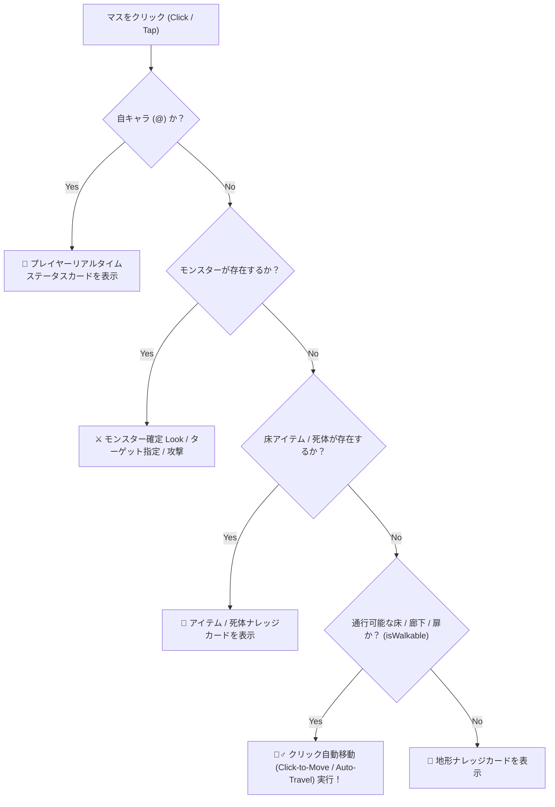

# GKL 高レベル統合 API (`inspectCellOnDemand`) クライアント UI / Web コンポーネント連携実装ガイド (追加分)

> **Note**: 本ドキュメントは、従来の `WebUICore_Usage_Guide.md` や `Modern_Web_Components_Update_Rules.md` を補完・最新化するための**追加実装ガイド**です。Web コンポーネントや新規 UI へ導入する際のリファレンスとしてご活用ください。既存ガイドへの合流は全コンポーネントへの適用完了後に行います。

---

## 1. 概要とメリット (Overview & Benefits)

従来の UI 実装では、マップマスのホバーやクリック時に UI 側で以下のような泥臭い処理を個別に書く必要がありました：
- `AreaStateManager` の `cell.top` / `cell.middle` / `cell.bottom` の手動分岐・型判定
- サイレント Look コマンド (`;`) の発火条件の手動制御
- `StatusAccessor` からの自キャラ HP / Pw / AC / 所持金の型パースと手動オブジェクト組み立て
- `getMonsterKnowledge`, `getItemKnowledge`, `getTerrainKnowledge` への多重フォールバック呼び出し

新設された高レベルカプセル化 API **`core.gkl.inspectCellOnDemand(targetPos, options)`** を使用することで、**これらすべての複雑なロジックが GKL コア層にカプセル化**されます。

UI 側は **「マス座標 $(x, y)$ を渡して返ってきた統一カードデータを描画するだけ」** になり、UI 側のコード量を **70% 〜 80% 大幅削減** できます。

---

## 2. API 仕様 (API Signature & Data Schema)

### メソッド署名
```javascript
const cardData = await core.gkl.inspectCellOnDemand(targetPos, options);
```

#### 引数 (Arguments)
- **`targetPos`**: `{ x: number, y: number }` (マップ絶対座標: `x: 0〜79`, `y: 0〜23`)
- **`options`**:
  - **`isHover`** (`boolean`):
    - `true`: **仮ホバー（クイックプレビュー）**。不要な Look コマンド送信を行わず高速に既存データ返却。
    - `false` (デフォルト): **確定クリック調査**。モンスターの場合に非同期でサイレント Look (`;`) コマンドを発火し、動的ステートを確定獲得。

---

### 返り値 (`cardData` 統一データ構造)

返ってくる `cardData` は、エンティティ種別ごとに以下の統一フォーマットでカプセル化されています（該当なしの場合は `null`）：

#### 👤 A. プレイヤー自身 (`category: 'PLAYER'`)
```javascript
{
  name: "Hero (Samurai)",
  category: "PLAYER",
  isPlayer: true,
  dangerLevel: "NONE",
  dispositionStatus: "PLAYER",
  stats: {
    hd: "Lv.1",
    ac: "AC 10",
    hp: "14/14",      // 安全パース済み文字列
    pw: "3/3",        // 安全パース済み文字列
    gold: "137zm",    // 安全パース済み文字列
    dlvl: "Dlvl:1"
  },
  inventoryCount: 8,
  effectSummary: "操作中のプレイヤー自身です。HP: 14/14, AC: 10, 所持金: 137zm."
}
```

#### 🐉 B. モンスター (`category: 'MONSTER'`)
```javascript
{
  id: "mon_12",
  name: "ジャッカル (jackal)",
  category: "MONSTER",
  dangerLevel: "LOW",                 // "NONE" | "LOW" | "MEDIUM" | "HIGH" | "CRITICAL"
  dispositionStatus: "HOSTILE",       // "HOSTILE" | "PEACEFUL" | "TAMED" | "DEFAULT_PEACEFUL"
  stats: { hd: 1, ac: 10, speed: 12, mr: 0 },
  effectSummary: "標準的なダンジョンモンスターです。",
  tacticalAdvice: ["一対一で対峙してください。"],
  isClickConfirmed: true              // Look コマンド確認済みフラグ
}
```

#### 🎒 C. アイテム・金塊 (`category: 'WEAPON' | 'ARMOR' | 'GOLD' | etc.`)
```javascript
{
  id: "item_12",
  name: "金塊 (gold piece)",
  category: "GOLD",
  effectSummary: "ダンジョン内で拾える通貨です。",
  usageAdvice: ["店での買い出しや各種サービスに使用できます。"]
}
```

#### 🍖 D. 死体 (`category: 'CORPSE'`)
```javascript
{
  id: "corpse_12",
  name: "ジャッカル の死体 (corpse)",
  category: "CORPSE",
  corpseInfo: { warningNote: "腐敗に注意してください。" },
  effectSummary: "モンスター (jackal) の死体です。食料として食べるか、祭壇で捧げることができます。"
}
```

---

## 3. クライアント UI / Web コンポーネント実装パターン

### パターン 1: Pure JS / Canvas イベントハンドラでの実装例

キャンバスの `mousemove` (仮ホバー) と `click` (確定調査) で共通関数を呼ぶだけのシンプル設計です。

```javascript
// 🎯 キャンバス調査一元化関数
const handleCanvasInspect = async (gx, gy, isHover) => {
  if (core?.gkl?.inspectCellOnDemand) {
    // コア API 呼び出し (1行)
    const cardData = await core.gkl.inspectCellOnDemand({ x: gx, y: gy }, { isHover });
    
    // 描画関数へそのままデータ渡し
    renderKnowledgeCard(cardData, { isClickConfirmed: cardData?.isClickConfirmed || !isHover });
  }
};

// メインキャンバスのイベントバインド
canvas.addEventListener('mousemove', async (e) => {
  const { gx, gy } = getMapCoordinates(e);
  await handleCanvasInspect(gx, gy, true);  // 仮ホバー
});

canvas.addEventListener('click', async (e) => {
  const { gx, gy } = getMapCoordinates(e);
  await handleCanvasInspect(gx, gy, false); // 確定クリック調査！
});
```

---

### パターン 2: Web コンポーネント (Custom Elements) での実装例

`<nh-knowledge-card>` などのカスタム要素コンポーネントで更新メソッドを公開する例です。

```javascript
class NhKnowledgeCardComponent extends HTMLElement {
  constructor() {
    super();
    this.attachShadow({ mode: 'open' });
  }

  /**
   * マス座標に基づくナレッジカードの即座更新
   * @param {Object} core WebUICore インスタンス
   * @param {number} x マス X (0〜79)
   * @param {number} y マス Y (0〜23)
   * @param {boolean} isHover 仮ホバーか確定クリックか
   */
  async inspectCell(core, x, y, isHover = false) {
    if (!core?.gkl?.inspectCellOnDemand) return;

    // GKL コア層からカプセル化されたナレッジオブジェクトを取得
    const cardData = await core.gkl.inspectCellOnDemand({ x, y }, { isHover });
    this.render(cardData, !isHover);
  }

  render(data, isClickConfirmed = false) {
    if (!data) {
      this.shadowRoot.innerHTML = `<div class="empty">該当ナレッジなし</div>`;
      return;
    }

    const isMonster = data.dangerLevel || data.category === 'MONSTER' || data.dispositionStatus;

    if (isMonster) {
      this.shadowRoot.innerHTML = `
        <div class="card monster">
          <h3>${data.name} <span class="badge">${data.dangerLevel}</span></h3>
          <p>${data.effectSummary || ''}</p>
          ${isClickConfirmed ? '<span class="confirmed">🔍 Look確認済み</span>' : ''}
        </div>`;
    } else {
      this.shadowRoot.innerHTML = `
        <div class="card item">
          <h3>${data.name} <span class="badge">${data.category}</span></h3>
          <p>${data.effectSummary || ''}</p>
        </div>`;
    }
  }
}

customElements.define('nh-knowledge-card', NhKnowledgeCardComponent);
```

---

## 4. UI 描画時の判定ルール (Rendering Guidelines)

UI 側で `cardData` を受信した際のレンダリング判定ルール：

1. **`cardData` が `null` の場合**:
   - マップ範囲外または情報が存在しない空マス。「該当するナレッジ情報がありません」等のヒントを表示。
2. **モンスター/ペット/プレイヤー (`data.dangerLevel || data.category === 'MONSTER' || data.dispositionStatus`)**:
   - 危険度バッジ (`LOW`, `MEDIUM`, `HIGH`, `CRITICAL`, `NONE`) や 性格バッジ (`⚔️ 敵対的`, `☮️ 平和的`, `👤 プレイヤー`, `🐾 ペット`) を含むモンスター用レイアウトを適用。
   - `data.isClickConfirmed === true` または `isHover === false` の時に **`🔍 Look確認済み`** バッジを表示。
3. **アイテム / 金塊 / 死体 / 地形**:
   - カテゴリバッジ (`WEAPON`, `ARMOR`, `GOLD`, `CORPSE`, `TERRAIN` 等) や BUC効果、識別テクニックを含むアイテム用レイアウトを適用。

---

## 5. まとめ

`core.gkl.inspectCellOnDemand()` を活用することで、各 Web コンポーネント版や様々なUI実装において、**「イベント拾い ➔ `inspectCellOnDemand` 呼び出し ➔ レンダリング」** という極めてシンプルで保守性の高いクリーンなアーキテクチャを実現できます。

---

## 6. 【発展・拡張構想】クリック自動移動 (Click-to-Move / Auto-Travel) との統合設計

「操作マスをクリックして詳細ナレッジを見る」機能から一歩進み、**「通行可能な床・廊下をクリックした際はその場所へ自動移動（Auto-Travel / タップ移動）する」** という現代的でグラフィカルなローグライク UX（NetHackJP / WebUI 独自拡張）を実現するための設計ガイドラインです。

### 💡 アクションの判定フロー (Intelligent Click Action)

マスをクリックした際、`inspectCellOnDemand` のナレッジ情報と `cell.bottom` (CMAP) の地形情報から、インテリジェントに動作を切り替えます：



### 🏃‍♂️ 移動キー・コマンドの送信仕様

1. **隣接 8 マス (距離 1) の場合**:
   - 直接、該当する方角キー（`k`, `l`, `j`, `h`, `u`, `n`, `b`, `y` または NumPad `8`, `6`, `2`, `4`, `9`, `3`, `1`, `7`）を `core.sendKey()` で 1 歩送信。
2. **遠隔マス (距離 > 1) の場合**:
   - NetHack 組み込みの **Travel Command (`_`)** を送信。
   - コマンド送信シーケンス: `_` ➔ （画面のカーソルを目的地 $(gx, gy)$ へ移動して `.` / `Enter`）により、WASM Cコアの標準自動経路探索（Pathfinding）で安全に移動を開始。

### 🌟 期待されるゲーム体験（対応クライアントの拡大）

- **スマホ・タブレットのタッチ操作完全最適化**: キーボードのないモバイル環境でも、画面をタップするだけで「移動」「モンスター調査」「アイテム確認」がスイスイ直感的に行えるようになります。
- **NetHack の敷居を劇的に下げるモダン WebUI**: 従来の「キーボードコマンドを丸暗記するゲーム」から、「現代的なクリック＆タップ RPG」へとゲーム体験が飛躍的に進化します。

