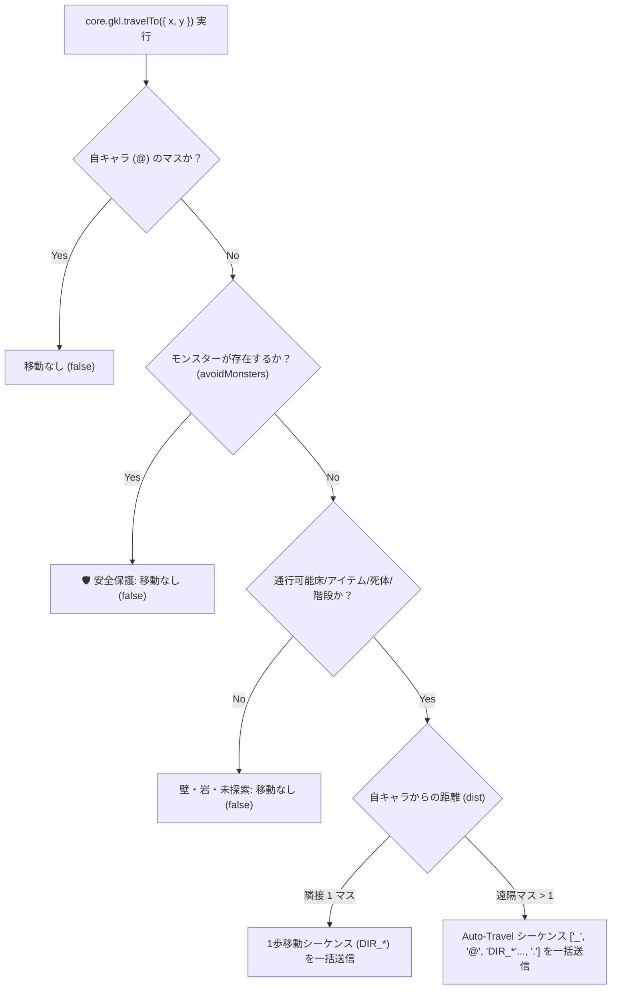

# GKL 高レベル統合 API (`inspectCellOnDemand`) クライアント UI / Web コンポーネント連携実装ガイド (追加分)

> **Note**: 本ドキュメントは、従来の `WebUICore_Usage_Guide.md` や `Modern_Web_Components_Update_Rules.md` を補完・最新化するための**追加実装ガイド**です。Web コンポーネントや新規 UI へ導入する際のリファレンスとしてご活用ください。既存ガイドへの合流は全コンポーネントへの適用完了後に行います。

---

## 1. 概要とメリット (Overview & Benefits)

従来の UI 実装では、マップマスのホバーやクリック時に UI 側で以下のような泥臭い処理を個別に書く必要がありました：
- `AreaStateManager` の `cell.top` / `cell.middle` / `cell.bottom` / `cell.effect` の手動分岐・型判定
- サイレント Look コマンド (`;`) の発火条件の手動制御
- `StatusAccessor` からの自キャラ HP / Pw / AC / 所持金の型パースと手動オブジェクト組み立て
- `getMonsterKnowledge`, `getItemKnowledge`, `getTerrainKnowledge` への多重フォールバック呼び出し

新設された高レベルカプセル化 API **`core.gkl.inspectCellOnDemand(targetPos, options)`** を使用することで、**これらすべての複雑なロジックが GKL コア層にカプセル化**されます。

UI 側は **「マス座標 $(x, y)$ を渡して返ってきた統一カードデータを描画するだけ」** になり、UI 側のコード量を **70% 〜 80% 大幅削減** できます。

---

## 2. API 仕様 (API Signature & Data Schema)

### メソッド署名
```javascript
const cardData = await core.gkl.inspectCellOnDemand(targetPos, options);
```

#### 引数 (Arguments)
- **`targetPos`**: `{ x: number, y: number }` (マップ絶対座標: `x: 0〜79`, `y: 0〜23`)
- **`options`**:
  - **`isHover`** (`boolean`):
    - `true`: **仮ホバー（クイックプレビュー）**。不要な Look コマンド送信を行わず高速に既存データ返却。
    - `false` (デフォルト): **確定クリック調査**。モンスターの場合に非同期でサイレント Look (`;`) コマンドを発火し、動的ステートを確定獲得。

---

### 返り値 (`cardData` 統一データ構造)

返ってくる `cardData` は、エンティティ種別ごとに以下の統一フォーマットでカプセル化されています（該当なしの場合は `null`）：

#### 👤 A. プレイヤー自身 (`category: 'PLAYER'`)
```javascript
{
  name: "Hero (Samurai)",
  category: "PLAYER",
  isPlayer: true,
  dangerLevel: "NONE",
  dispositionStatus: "PLAYER",
  stats: {
    hd: "Lv.1",
    ac: "AC 10",
    hp: "14/14",      // 安全パース済み文字列
    pw: "3/3",        // 安全パース済み文字列
    gold: "137zm",    // 安全パース済み文字列
    dlvl: "Dlvl:1"
  },
  inventoryCount: 8,
  effectSummary: "操作中のプレイヤー自身です。HP: 14/14, AC: 10, 所持金: 137zm."
}
```

#### 🐉 B. モンスター (`category: 'MONSTER'`)
```javascript
{
  id: "mon_12",
  name: "ジャッカル (jackal)",
  category: "MONSTER",
  dangerLevel: "LOW",                 // "NONE" | "LOW" | "MEDIUM" | "HIGH" | "CRITICAL"
  dispositionStatus: "HOSTILE",       // "HOSTILE" | "PEACEFUL" | "TAMED" | "DEFAULT_PEACEFUL"
  stats: { hd: 1, ac: 10, speed: 12, mr: 0 },
  effectSummary: "標準的なダンジョンモンスターです。",
  tacticalAdvice: ["一対一で対峙してください。"],
  isClickConfirmed: true              // Look コマンド確認済みフラグ
}
```

#### 🎒 C. アイテム・金塊 (`category: 'WEAPON' | 'ARMOR' | 'GOLD' | etc.`)
```javascript
{
  id: "item_12",
  name: "金塊 (gold piece)",
  category: "GOLD",
  effectSummary: "ダンジョン内で拾える通貨です。",
  usageAdvice: ["店での買い出しや各種サービスに使用できます。"]
}
```

#### 🍖 D. 死体 (`category: 'CORPSE'`)
```javascript
{
  id: "corpse_12",
  name: "ジャッカル の死体 (corpse)",
  category: "CORPSE",
  corpseInfo: { warningNote: "腐敗に注意してください。" },
  effectSummary: "モンスター (jackal) の死体です。食料として食べるか、祭壇で捧げることができます。"
}
```

---

## 3. クライアント UI / Web コンポーネント実装パターン

### パターン 1: Pure JS / Canvas イベントハンドラでの実装例

キャンバスの `mousemove` (仮ホバー) と `click` (確定調査) で共通関数を呼ぶだけのシンプル設計です。

```javascript
// 🎯 キャンバス調査一元化関数
const handleCanvasInspect = async (gx, gy, isHover) => {
  if (core?.gkl?.inspectCellOnDemand) {
    // コア API 呼び出し (1行)
    const cardData = await core.gkl.inspectCellOnDemand({ x: gx, y: gy }, { isHover });
    
    // 描画関数へそのままデータ渡し
    renderKnowledgeCard(cardData, { isClickConfirmed: cardData?.isClickConfirmed || !isHover });
  }
};

// メインキャンバスのイベントバインド
canvas.addEventListener('mousemove', async (e) => {
  const { gx, gy } = getMapCoordinates(e);
  await handleCanvasInspect(gx, gy, true);  // 仮ホバー
});

canvas.addEventListener('click', async (e) => {
  const { gx, gy } = getMapCoordinates(e);
  await handleCanvasInspect(gx, gy, false); // 確定クリック調査！
});
```

---

### パターン 2: Web コンポーネント (Custom Elements) での実装例

`<nh-knowledge-card>` などのカスタム要素コンポーネントで更新メソッドを公開する例です。

```javascript
class NhKnowledgeCardComponent extends HTMLElement {
  constructor() {
    super();
    this.attachShadow({ mode: 'open' });
  }

  /**
   * マス座標に基づくナレッジカードの即座更新
   * @param {Object} core WebUICore インスタンス
   * @param {number} x マス X (0〜79)
   * @param {number} y マス Y (0〜23)
   * @param {boolean} isHover 仮ホバーか確定クリックか
   */
  async inspectCell(core, x, y, isHover = false) {
    if (!core?.gkl?.inspectCellOnDemand) return;

    // GKL コア層からカプセル化されたナレッジオブジェクトを取得
    const cardData = await core.gkl.inspectCellOnDemand({ x, y }, { isHover });
    this.render(cardData, !isHover);
  }

  render(data, isClickConfirmed = false) {
    if (!data) {
      this.shadowRoot.innerHTML = `<div class="empty">該当ナレッジなし</div>`;
      return;
    }

    const isMonster = data.dangerLevel || data.category === 'MONSTER' || data.dispositionStatus;

    if (isMonster) {
      this.shadowRoot.innerHTML = `
        <div class="card monster">
          <h3>${data.name} <span class="badge">${data.dangerLevel}</span></h3>
          <p>${data.effectSummary || ''}</p>
          ${isClickConfirmed ? '<span class="confirmed">🔍 Look確認済み</span>' : ''}
        </div>`;
    } else {
      this.shadowRoot.innerHTML = `
        <div class="card item">
          <h3>${data.name} <span class="badge">${data.category}</span></h3>
          <p>${data.effectSummary || ''}</p>
        </div>`;
    }
  }
}

customElements.define('nh-knowledge-card', NhKnowledgeCardComponent);
```

---

## 4. UI 描画時の判定ルール (Rendering Guidelines)

UI 側で `cardData` を受信した際のレンダリング判定およびカテゴリ別レイアウト定義：

1. **`cardData` が `null` の場合**:
   - マップ範囲外または情報が存在しない空マス。「該当するナレッジ情報がありません」等のヒントを表示。

2. **エンティティ主要カテゴリ (`ENTITY_TYPES` / `data.type` / `data.category`)**:
   - **`MONSTER`**: モンスター（危険度 `CRITICAL`, `HIGH`, `MEDIUM`, `LOW` / 性格 `PEACEFUL`, `HOSTILE`）
   - **`PET`**: ペット / 従者（`TAMED` / 性格バッジ `🐾 ペット`）
   - **`PLAYER`**: プレイヤー自身（HP/Pw/AC/Dlvl等リアルタイムステータス表示）
   - **`BODY` / `CORPSE`**: 死体（腐敗警告・食用アドバイス）
   - **`ITEM`**: アイテム一般
   - **`STATUE`**: 石像 / 彫像
   - **`TERRAIN`**: 地形（壁, 床, 扉, 階段, 罠, 神壇, 泉, 溶岩, 墓, 彫刻 等）
   - **`EFFECT`**: ビーム / 爆発 / 警告エフェクト
   - **`UNEXPLORED`**: 未探索領域

3. **アイテム詳細カテゴリ (`OBJECT_CATEGORY` / `data.category`)**:
   - **`WEAPON`**: 武器（小型/大型攻撃力、スキル、装備アドバイス）
   - **`ARMOR`**: 防具（AC、着脱変化テスト、呪いチェック）
   - **`RING`**: 指輪（装着効果、流し台テスト）
   - **`AMULET`**: 魔除け（耐性、反射、首かけリスク）
   - **`CONTAINER`**: 容器（箱, チェスト, 袋, 保冷箱 等 / 収納・保護効果）
   - **`TOOL`**: 道具（ランプ, 鍵, ツルハシ, 缶切り 等 / `#apply` 使用アドバイス）
   - **`FOOD`**: 食料（栄養価, 食用判定）
   - **`POTION`**: 薬 / ポーション（飲用リスク, 流し台/神壇テスト）
   - **`SCROLL`**: 巻物（試読リスク, 解呪/白紙活用）
   - **`SPELLBOOK`**: 魔法書（解読条件, 必要知能）
   - **`WAND`**: 杖（方向指定振出 `z`, 床文字刻みテスト `E`）
   - **`COIN` / `GOLD`**: 金貨 / 金塊
   - **`GEM`**: 宝石 / 硝子 / 研ぎ石 / 石（タッチストーン判定, 投擲/売却）
   - **`OTHER`**: その他未分類アイテム

4. **プロンプト / 入力カテゴリ (`PROMPT_CATEGORY` / `data.promptCategory`)**:
   - **`YN`**: Yes/No 質問
   - **`DIRECTION`**: 方向選択 (`which direction?`)
   - **`TEXT` / `LIN`**: 一行テキスト入力
   - **`MENU`**: アイテム/コマンド選択メニュー
   - **`EXT`**: 拡張コマンド (`#`) 入力
   - **`FILE`**: セーブ/ファイルダイアログ
   - **`KEY`**: 単一キー入力

---

## 5. まとめ

`core.gkl.inspectCellOnDemand()` を活用することで、各 Web コンポーネント版や様々なUI実装において、**「イベント拾い ➔ `inspectCellOnDemand` 呼び出し ➔ レンダリング」** という極めてシンプルで保守性の高いクリーンなアーキテクチャを実現できます。

---

## 6. クリック自動移動 (Click-to-Move / Auto-Travel) との統合仕様

「操作マスをクリックして詳細ナレッジを見る」機能と連動し、**「通行可能な床・廊下やアイテム・死体のマスをクリックした際は、ナレッジ表示と同時にその場所へ自動移動（Auto-Travel / タップ移動）する」** という現代的でグラフィカルなローグライク UX（NetHackJP / WebUI 標準仕様）の統合ガイドラインです。

### 💡 GKL 高レベル API `core.gkl.travelTo(targetPos, options)`

自動移動に関する全安全判定（モンスター保護、壁判定、アイテム優先歩行）および入力プロトコル（隣接1歩 `DIR_*` / 遠隔 `_` + `@` トラベルシーケンス構築）は **GKL プラグイン内部にカプセル化** されています。

各 UI クライアント側（Pure JS, Vue, React, Svelte, Solid 等）では、独自に移動計算・キー生成を行う必要はなく、`core.gkl?.travelTo({ x, y })` を直接呼び出すだけで機能します。

```javascript
// 【UI クライアント側での実装例】
canvas.addEventListener('click', async (e) => {
  const { gx, gy } = getGridCoords(e); // 画面座標 ➔ セル座標変換

  // 1. オンデマンド Look ナレッジ表示
  const cardData = await core.gkl.inspectCellOnDemand({ x: gx, y: gy }, { isHover: false });
  if (cardData) {
    renderKnowledgeCard(cardData);
  }

  // 2. GKL 高レベル API を呼び出して安全な自動移動を実行！
  if (core.gkl?.travelTo) {
    await core.gkl.travelTo({ x: gx, y: gy });
  }
});
```

### 🧠 GKL 内部の自動判定・実行フロー

`core.gkl.travelTo({ x, y })` の内部では、以下の優先順位で安全移動が判定・自動実行されます：



---

## 7. まとめ

- **モジュール境界と安全性の確立**: GKL プラグイン層に移動ロジックが集約されたことで、各 UI クライアントは描画とイベント受付のみに専念でき、保守性とクロスプラットフォーム共通 UX が達成されます。
- **スマホ・タブレットのタッチ操作完全最適化**: キーボードのないモバイル環境でも、画面をタップするだけで「移動」「モンスター調査」「アイテム確認・移動」が直感的に行えます。

