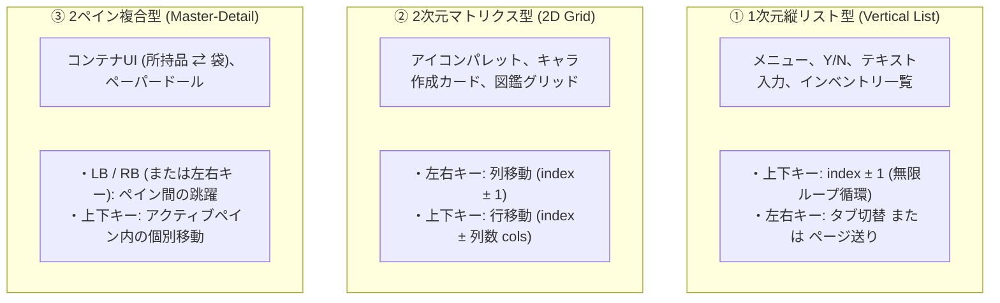

# 🧭 クライアント・モーダル操作性＆ナビゲーション統合設計ガイド (Modal Interaction & Navigation Design Guide)

**作成日**: 2026-10-02  
**ステータス**: `🟢 guideline` (クライアントUI/UX標準実装規約)  
**対象領域**: `src/components/`, `src/ui-controller/`, `ModalManager.js`, 全モーダル・ダイアログ画面  
**関連ドキュメント**: [`dialog_design_system_unification_concept.ja.md`](./dialog_design_system_unification_concept.ja.md) (外観・CSSトークン統一仕様)

---

## 1. 背景と本ガイドの目的

NetHack WASM WebUI では、ゲームの多機能化に伴い多数の専用モーダル（キャラ作成、装備ペーパードール、二画面コンテナ、伝承図鑑、インテリジェント入力支援ダイアログ群等）が開発されてきました。

先行して実施された **「外観・デザインシステムの統一」**（`dialog_design_system_unification_concept.ja.md` による Dark Glass UI 統一）により、視覚的な美しさと統一感は達成されましたが、**「操作性・ナビゲーションの実装」** は機能ごとに場当たり的に進められたため、以下の重大な課題が残されていました：

1. **マウス操作への無意識の依存**:
   - 一部のモーダルはマウスホバー・クリック前提で組まれており、キーボードやゲームパッドのみで項目を選択・確定できない。
2. **空間構造と操作の不一致（1次元シーケンシャルの破綻）**:
   - 横に4列並ぶカードやグリッドに対して単純な「次へ／前へ」を適用すると、「下キーを押したのに右隣へ進む」「下の行に行くために4回押す必要がある」といった深刻な認知ギャップが発生する。
3. **フォーカス管理の分散とスパゲッティ化**:
   - 呼び出し元（クライアントコントローラ側）でモーダル内部のDOMを直接クエリして `classList.add('selected')` を行うような密結合が発生していた。

本ガイドラインは、**「ゲームパッド対応であるかどうかにかかわらず、あらゆるモーダルがキーボードの方向キー（またはゲームパッド十字キー）＋決定＋キャンセルで100%確実に操作できる標準アクセシビリティ」** を確立するための、クライアント共通の設計・実装標準です。

---

## 2. コア原則：3大アクセシビリティ憲法

すべてのモーダル・ダイアログは、以下の3大原則を例外なく満たさなければならない：

1. **完全キーボード/パッド完結 (No-Mouse Requirement)**:
   - マウスに一切手を触れることなく、**「方向キー（上下左右）＋ 決定（Enter / A）＋ キャンセル（Escape / B）」** だけで選択から確定・離脱まで完結すること。
2. **アクティブフォーカスの常時可視化 (Visual Focus & Autoscroll)**:
   - モーダルが開いた瞬間、初期項目（先頭または前回の選択位置）に視覚的フォーカス（青枠・ハイライト）が当たっていること。
   - 画面外に隠れた項目にフォーカスが移動した際、自動的に `scrollIntoView({ block: 'nearest' })` で可視領域にスクロールすること。
3. **マウスとキーボード/パッドのカーソル完全同期 (Bidirectional Sync)**:
   - マウスで要素をホバーした際、内部のフォーカスインデックスがその項目へ即時同期すること（マウスからキーボード、キーボードからマウスへの持ち替えでカーソルが飛ばない）。

---

## 3. モーダルの3大レイアウトトポロジー（空間モデル）

画面の構造を無視して一律なシーケンシャル移動を行うと操作体験が崩壊します。  
本プロジェクトのモーダルは、必ず以下の**3つの空間モデルのいずれか**に分類・標準化して実装します。



| トポロジー | 代表モーダル | 十字キー / Arrow (上下) | 十字キー / Arrow (左右) | ショルダー (LB / RB) |
| :--- | :--- | :--- | :--- | :--- |
| **① 1次元縦リスト型** | 原作互換メニュー、YNプロンプト、テキスト `--More--` | **前後の項目選択** (`index ± 1`) | カテゴリタブ切替 / ページ送り | タブ切替 |
| **② 2次元マトリクス型** | キャラクタ作成カード、図鑑グリッド、スペルパレット | **垂直行移動** (`index ± cols`) | **水平列移動** (`index ± 1`) | 前後ページ送り |
| **③ 2ペイン複合型** | 二画面コンテナUI、装備ペーパードール | アクティブなペイン内での移動 | （ペイン内またはペイン間移動） | **左ペイン ⇄ 右ペインの跳躍** |

---

## 4. 3層協調アーキテクチャ（責務分担）

モーダルの操作ロジックは、クライアントに直書きせず、以下の3層に明確に分離します。

```mermaid
flowchart TD
    subgraph Layer1["1. 入力層 (Input Controller)"]
        DEV["🎮 ゲームパッド / ⌨️ キーボード / 🖱️ マウス"]
        INP["GamepadInputController / InputCoordinator"]
    end

    subgraph Layer2["2. 状態・調停層 (Headless Navigation Helpers)"]
        NAV["ListNavigationHelper / GridNavigationHelper"]
        STATE["・itemCount (選択肢総数)<br>・focusedIndex (現在カーソル位置)<br>・2Dグリッド空間計算 / ループ処理"]
    end

    subgraph Layer3["3. 描画・ビュー層 (UI Components / Web Components)"]
        COMP["<nh-modal> / <nh-character-creation-modal> 等"]
        VIEW["・.is-focused 枠線ハイライト<br>・scrollIntoView() 自動スクロール<br>・マウスホバーの双方向同期"]
    end

    DEV -->|キー・ボタン押下| INP
    INP -->|標準シグナル (NAV_UP/DOWN/LEFT/RIGHT, SUBMIT, CANCEL)| NAV
    NAV -->|インデックス遷移計算| STATE
    STATE -->|focusChange(newIndex)| COMP
    COMP -->|DOM更新| VIEW
    VIEW -->|マウスホバー/クリック| NAV
```

### 各層の責務規約

1. **入力層 (`InputController` / `InputCoordinator`)**:
   - デバイスの差異（Arrowキー、`hjkl`、ゲームパッド十字キー、スティック）を吸収し、現在最前面のモーダルに対して標準シグナル（`NAV_UP`, `NAV_DOWN`, `NAV_LEFT`, `NAV_RIGHT`, `SUBMIT`, `CANCEL`）をディスパッチする。
   - **禁止事項**: モーダル内部のDOM要素を直接操作・参照すること。
2. **状態・調停層 (`ListNavigationHelper` / `GridNavigationHelper`)**:
   - 純粋なインデックス状態と空間計算を保持するHeadlessモジュール。
   - `itemCount`、`columns` を保持し、シグナルに応じて新しいインデックスを算出。
   - **利点**: DOMに一切依存しないため、Vitest等の単体テストで100%自動検証可能。
3. **描画・ビュー層 (`<nh-*>` Web Components / モーダルDOM)**:
   - ヘッドレス層からの `focusChange(newIndex)` イベントを受けて、対象DOMに `.is-focused` や青枠ハイライトを付与。
   - 画面外要素の `scrollIntoView` や、マウスホバー時のインデックス同期を担う。
   - **禁止事項**: 独自のキーリスナーを乱立させ、アプリ全体のショートカットと衝突させること。

---

## 5. 段階的リファクタリング・チェックリスト

既存の各モーダルを本ガイドラインに準拠させる際は、以下のステップで進める：

- [ ] **Step 1: トポロジーの決定**
  - 対象画面が「①縦リスト」「②グリッド」「③2ペイン複合」のどれに該当するかを定義する。
- [ ] **Step 2: NavigationHelper の接続**
  - コンポーネント内部に `ListNavigationHelper` または `GridNavigationHelper` をインスタンス化し、アイテム総数・列数をセットする。
- [ ] **Step 3: フォーカススタイルの定義 (`.is-focused`)**
  - Shadow DOM または CSS 内に、キーボード/パッド選択時の一目でわかる青枠ハイライト（`--primary-color: #38bdf8`）を定義する。
- [ ] **Step 4: 双方向同期と決定・キャンセルの結線**
  - `focusChange` で DOM スタイル更新 ＆ `scrollIntoView()`。
  - マウスホバーで `nav.setIndex(i)`。
  - `SUBMIT` で該当項目の決定ハンドラ実行、`CANCEL` でモーダル閉鎖ハンドラ実行。

---

## 6. 最優先適用ホットパス：最頻出2大画面のシグナル駆動統一 (High-Priority Hot Paths)

願い（Wish）や虐殺（Genocide）といった特殊ダイアログは冒険中に数回しか出現しません。  
一方で、全プレイ時間の **85〜90% を支配しているのは以下の「最頻出2大画面」** です。  
この2画面の見た目と操作性をシグナル駆動で標準化することが、全クライアントのUX改善において最も高いROI（投資対効果）を発揮します。

### 6.1 ① 統一 YN 確認カード (Standardized YN Confirm Card)
- **出現頻度**: ★★★★★（フロア移動、扉の蹴破り、飲食、未識別アイテム装備、危険行動確認など）
- **現状の課題**:
  - `ModalManager.js` において、あるプロンプトでは画面下部に「(1キー入力待機)」とだけ文字が出てボタンがない。
  - 別のプロンプトでは小さなボタンが急に横並びで現れるなど、見た目と操作が場当たり的でバラバラ。
- **シグナル駆動による統一設計**:
  - `MessageContextResolver` / `ControlSignalCatalog` が検知したシグナル（`SIGNAL_PROMPT_YN`, `SIGNAL_CONFIRM_DANGER` 等）に基づき、定位置（画面中央または下部）に **「統一 YN カード」** を展開。
  - 対象となるアイテムやアクションがあれば、アイコン・対象名称・危険度バッジを自動インジェクション。
  - **操作体系**:
    - 十字キー／Arrow 左右（または上下）: `[ はい (y) ]` と `[ いいえ (n) ]` を切り替え（初期カーソルは安全側または推奨側に自動配置）。
    - 決定キー（Enter / Pad A）: 選択中の選択肢を実行。
    - キャンセルキー（Escape / Pad B）: 即座に `いいえ`（または `\x1b`）を送信して安全に閉じる。

### 6.2 ② 統一 アイテム＆メニューセレクター (Standardized Item & Menu Selector)
- **出現頻度**: ★★★★★（読む、飲む、装備する、落とす、拾う、コンテナへ出し入れなど）
- **現状の課題**:
  - アルファベット（`a-z`）の直接キーボード打鍵を前提としたテキスト表示や、枠線の崩れたメニューが混在。
  - ゲームパッドやキーボード矢印キーでの項目巡回・選択が効かない、またはマウス依存。
- **シグナル駆動による統一設計**:
  - 本ガイドの **「トポロジー①（1次元縦リスト型）」** に完全準拠したカードモーダルとして統一。
  - インベントリ状態（`InventoryStateManager`）とシグナルを自動結合し、「ショートカット文字 ＋ アイテムアイコン ＋ 真名・数量・状態（呪い/祝福）」を整然としたリスト形式で描画。
  - **操作体系**:
    - 十字キー／Arrow 上下: 項目をスパスパ巡回（`index ± 1`）。
    - ショルダー（LB / RB）または 左右キー: 装備部位・道具カテゴリタブの切り替え。
    - 決定キー（Enter / Pad A）: フォーカス項目の選択を確定（WASMへ正規識別子またはキーを送信）。
    - キャンセルキー（Escape / Pad B）: 即座にメニューを離脱（`0` または `\x1b`）。

---

## 7. まとめ：基本操作の完全制覇に向けて

本ガイドラインに従い、上記「① YN確認カード」と「② アイテム＆メニューセレクター」の2系統を共通コンポーネントとしてシグナル駆動で整備・刷新することで、**特殊モーダルの作り込みを待たずして、NetHack の全ゲームプレイの基本操作がキーボードでもゲームパッドでも完全に快適かつ直感的に操作可能** となります。

