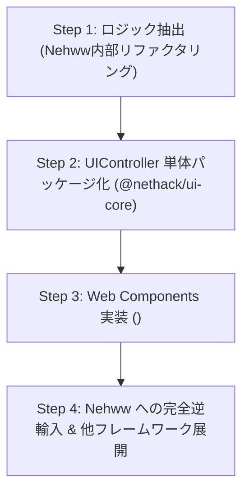

# 🏛️ UIController (Headless UI) アーキテクチャ設計仕様書
## 〜 Model/View の完全分離とシグナル吸収による長寿命クライアントの実現 〜

---

## 1. 概要・背景と目的

### 1.1 背景：リファレンスクライアント `Nehww` の大成功と新たな課題
NetHack WASM WebUI プロジェクトにおいて、公式リファレンスクライアント **`Nehww`**（`examples/gkl-pure-js-client/`）は Phase A〜D を経て劇的な進化を遂げました。
- **全画面ダンジョンマップ ＋ イマーシブHUD**（100vw × 100vh、フローティングHUD群、過去ログドロワー）
- **高度なゲーム操作支援**（二画面ファイラー型コンテナUI、部位判定付きペーパードール、詳細ナレッジ図鑑、スマートコンテキストアクション）
- **Neo-Retro Dark Glass UI**（サイバーシアン `#38bdf8` とフロストガラスマテリアルによる全体統一）

これらの機能により、「ブラウザで動く最高峰の NetHack クライアント」としての仕様とUXは完全に実証されました。

しかし、開発が急速に進んだ結果、**「高度なUI状態管理・計算ロジック」が `Nehww` のクライアントコード内部に強く結合している** という新たな構造的課題が浮き彫りになりました。

### 1.2 直面する2つの本質的リスク
1. **多重実装・二重保守の壁（Web Components・他フレームワーク展開の負荷）**:
   - 将来的に Web Components（`<nh-*>`）や React / Vue / Svelte 移植版を作成する際、モーダルスタック管理、フォーカストラップ、HUDのピン留め・ドック状態、D&Dドラフト計算、キーバインド調停といったUIロジックをクライアントごとに再実装する必要が生じ、膨大な工数とバグの温床になります。
2. **Model（Cコア / WASM / GKL）のシグナル進化に伴う「手戻り」**:
   - Phase 5 等で推進されている「状況シグナル基盤」「メッセージパースの高度化」「バイナリストリーム化」「NetHack本体の将来アップデート」など、Model側の内部仕様が変わるたびに、画面側（HTML/CSS/DOM）のコードまで修正・テストし直さなければならないリスクを孕んでいます。

### 1.3 本設計の目的
これらの課題を根底から解決するため、GKL（Model）とクライアント（View）の間に、DOM非依存のUI状態・操作機械である **「UIController（Headless UI層）」** を定義・確立します。
**「Model側のシグナルがどれほど高度化・激変しても、UIController がその差分を吸収・正規化し、View側クライアントは1行もコードを変えずに動作し続ける」** という長寿命アーキテクチャの実現をゴールとします。

---

## 2. 4層アーキテクチャ（MVC / Presenterモデル）

システム全体を以下の4層に整理します。

```text
+-------------------------------------------------------------------------------+
| Layer 4: Client View / Components (具象描画・CSS・DOM)                        |
|  - Nehww (Vanilla JS リファレンスクライアント)                                |
|  - Web Components (<nh-hud>, <nh-paperdoll>, <nh-container-dialog>)           |
|  - 将来のフレームワーク移植版 (React 18, Vue 3, SolidJS, Svelte)              |
+-------------------------------------------------------------------------------+
                                    ▲▼ (UI State & UI Events)
+-------------------------------------------------------------------------------+
| Layer 3: ★ UIController (Headless UI / Presenter / UI-Core)                   |
|  【防腐層 (Anti-Corruption Layer) & UI状態マシン (DOM非依存)】                |
|  - HUDLayoutController (座標・ピン・ドック・最小化・自動退避)                |
|  - ModalStackController (スタック順序・ESCキー優先度・FocusTrap)              |
|  - InteractionController (装備スロット適合判定・コンテナD&Dドラフト)         |
|  - InputCoordinator (ゲームキー vs UIフォーム入力の排他調停)                  |
|  - UIConfigStore (テーマ・HUD配置・透過度のスキーマ検証 & 永続化)            |
+-------------------------------------------------------------------------------+
                                    ▲▼ (Domain State & Actions)
+-------------------------------------------------------------------------------+
| Layer 2: GKL (Game Knowledge & Logic Layer - DOM非依存)                       |
|  - 知識ベース (アイテム種別、装備部位マスター、モンスター危険度)              |
|  - レシピ実行エンジン (IRC: 換装マクロ、コンテナ出し入れ自動化)                |
|  - ゲーム状態モデル (Inventory, Map, PlayerStatus, SituationCache)            |
+-------------------------------------------------------------------------------+
                                    ▲▼ (RPC / Dispatch)
+-------------------------------------------------------------------------------+
| Layer 1: WASM / NetHack C Core & WebUI Core                                   |
|  - NetHack C エンジン本体 (Emscripten WebAssembly)                            |
|  - 仮想端末 (Driver), メッセージストリーム, ウィンドウイベント                |
+-------------------------------------------------------------------------------+
```

---

## 3. UIController の中核的役割：防腐層（Anti-Corruption Layer）

UIController の最も本質的な役割は、**Modelの進化に対する衝撃緩衝材（防腐層）** として機能することです。

```text
[ Model側の変化・進化 ]
  - シグナル粒度の微細化 (例: HP差分ストリーム、状態異常フラグ更新)
  - 通信方式の高速化 (JSON ➔ バイナリ/FlatBuffers)
  - C層フックの追加・メッセージカタログの再編
               │
               ▼ (激変)
     ┌────────────────────────┐
     │ ★ UIController         │ ◀── ここでシグナルを吸収・正規化！
     └────────────────────────┘
               │
               ▼ (常に安定したUI向け契約: UI Contract)
[ View側 (Nehww / Web Components) ]
  - 変更不要！ 既存のHTML/CSS/コンポーネントがそのまま動作
```

### 3.1 吸収の具体例
- **シナリオ: HP更新シグナルの仕様変更**
  - *変更前*: ターン終了時に `core.on('playerStatus', status)` で全ステータスがまとめて送られてくる。
  - *変更後*: パフォーマンス向上のため、`signal:hp_changed { current: 15, max: 18, delta: -3 }` のような細粒度ストリームに変更された。
  - *UIControllerの吸収動作*:
    - UIController内部で `status.hp` を更新し、View側にはこれまで通り `uiController.status.on('change', uiStatus)` を発行。
    - **View側のコード（ステータスバーHUDのDOM更新）は1行も修正する必要がない。**

- **シナリオ: 装備換装レシピのステップ拡張**
  - *変更内容*: NetHackのバージョンアップにより、呪われた指輪を外す前の追加確認プロンプトが発生するようになった。
  - *UIControllerの吸収動作*:
    - UIControllerとGKLの間でプロンプト処理シーケンスを完結させる。
    - ペーパードールView側は「換装要求を出して待つ」だけなので、画面ロジックには一切影響しない。

---

## 4. レイヤー別 責務境界マトリクス

「どこまでがGKLで、どこからがUIControllerで、どこがViewか」の境界ルールを厳密に定義します。

| 領域 | GKL (Layer 2) の責務 | UIController (Layer 3) の責務 | View / Client (Layer 4) の責務 |
| :--- | :--- | :--- | :--- |
| **装備 (Paperdoll)** | - アイテムの装備可否判定<br>- 換装キーシーケンス（レシピ）の生成・実行<br>- 呪縛（Cursed）状態の追跡 | - 現在選択中のアイテムが適合する「スロットのハイライト配列」の算出<br>- スロットホバー時の装備比較差分の計算 | - スロット枠のフロストガラス描画<br>- サイバーネオングローのアニメーション<br>- クリック/ドラッグイベントの検知 |
| **コンテナ (Container)** | - バッグ/チェストへの格納・取出コマンド発行<br>- 手品袋（Bag of Holding）爆発安全ガード | - ユーザーが画面上で選んでいる「移動予定アイテム群（ドラフト）」の一時保持<br>- 移動確定時のGKLバッチ処理呼び出し | - 二画面ファイラーのリストDOM描画<br>- ドラッグ中のゴースト要素表示 |
| **HUDレイアウト** | *関与しない* | - 各HUD（メッセージ、ステータス、ミニマップ等）の表示/非表示・ピン留め・ドック座標の計算<br>- 画面サイズ変更時のクランプ計算 | - CSS Flexbox/Grid、`backdrop-filter` の適用<br>- マウスによるドラッグ移動のポインタ追従 |
| **モーダル・入力** | - NetHackプロンプト（`ynaq`、`--More--` 等）の解析 | - 開いているモーダルのスタック管理（Z-Index順序）<br>- ESCキー押下時の最前面モーダル閉塞<br>- Tabキーのフォーカストラップ追跡<br>- ゲームキー入力とUIテキスト入力の排他調停 | - モーダル外枠のHTML描画<br>- フォーカス枠のスタイル適用 |
| **設定 (Config)** | - ゲーム内設定（オートピックアップ、コマンドディレイ等）の保持 | - UI設定（テーマ名、HUD透過度、パネル展開初期値等）のバリデーションと LocalStorage 永続化 | - 設定変更UI（スライダー、セレクトボックス等）のレンダリング |

---

## 5. UIController の主要サブシステム設計

UIController はフレームワーク非依存の純粋な TypeScript / ES Modules クラス群として構成されます。

### 5.1 `HUDLayoutController`
- **役割**: 全画面マップ上に浮遊する各種HUDの位置、ピン留め（Pin）、ドック（Dock）、折りたたみ（Collapse）状態を管理するステートマシン。
- **提供API**:
  ```typescript
  controller.hud.setPinned('message-drawer', true);
  controller.hud.toggleCollapse('status-bar');
  controller.hud.updatePosition('minimap', { x: 20, y: 80 });
  controller.hud.subscribe((hudState) => { /* View側で座標・classを更新 */ });
  ```

### 5.2 `ModalStackController` & `FocusTrapCoordinator`
- **役割**: 多重モーダル（例: キャラ作成 ➔ 詳細確認ダイアログ）の表示順序とキーボードフォーカスを完全に制御。
- **提供API**:
  ```typescript
  controller.modals.push('paperdoll', { slot: 'hand' });
  controller.modals.pop(); // ESCキー等で最前面を閉じる
  controller.modals.isInputActive(); // テキスト入力中ならtrue（ゲームキーを遮断）
  ```

### 5.3 `InteractionController`
- **役割**: ペーパードールやコンテナUIなどの「複数ステップを伴うUI操作」の中間状態（ドラフト）を管理。
- **提供API**:
  ```typescript
  // ペーパードール: 選択アイテムに適合するスロットID群を返す
  const validSlots = controller.interaction.getCompatibleSlots(selectedItem);
  
  // コンテナ: 一時移動リストへの追加・確定
  controller.interaction.stageTransfer(item, 'to_container');
  await controller.interaction.commitTransfer(); // GKLレシピを一括実行
  ```

### 5.4 `InputCoordinator`
- **役割**: ブラウザの `keydown` イベントを受け取り、「今このキーはNetHackに渡すべきか、それともUIショートカットか、あるいはフォーム入力中か」を判定してルーティング。
- **競合解決ルール**:
  1. モーダル内の `<input>` / `<textarea>` にフォーカスがある ➔ NetHack入力を**完全ブロック**。
  2. モーダルが開いているが入力欄外 ➔ `Escape` や矢印キーはモーダル制御へ。ゲームキーはブロック。
  3. 全画面マップ状態 ➔ `Alt+S` や `L` などのグローバルUIショートカットを捕捉。それ以外はすべてNetHack（GKL/Driver）へパススルー。

### 5.5 `UIConfigStore`
- **役割**: デザイントークン（テーマ）、透過度、音量、HUDレイアウトなどのユーザー設定を管理。
- **スキーマ駆動**: 設定値のバリデーションを行い、不正な値が保存された場合は安全なデフォルト値へフォールバック。

---

## 6. Web Components（`<nh-*>`）連携アーキテクチャ

UIController が完成した段階で、具象View層として **Web Components**（Custom Elements + Shadow DOM）を展開します。

```text
+-------------------------------------------------------------+
| Custom Element: <nh-paperdoll>                              |
|  #shadow-root (open)                                        |
|    <style> /* Neo-Retro Dark Glass CSS が完全カプセル化 */ </style>|
|    <div class="paperdoll-container">                        |
|       <slot name="helm"></slot>                             |
|       <slot name="armor"></slot>                            |
|       ...                                                   |
|    </div>                                                   |
+-------------------------------------------------------------+
         │                                    ▲
         │ (DOM Event: slot-click)            │ (State Update: highlight)
         ▼                                    │
+─────────────────────────────────────────────────────────────+
| ★ UIController (PaperdollPresenter)                         |
+─────────────────────────────────────────────────────────────+
```

### Web Components化の利点
1. **フレームワーク・アグノスティック**:
   ```html
   <!-- React, Vue, Svelte, 素のHTML いずれでも1行置くだけで最高品質UIが動作 -->
   <script type="module" src="./nh-components.js"></script>
   <nh-hud-container theme="cyber-cyan">
     <nh-viewport></nh-viewport>
     <nh-message-hud pinned="true"></nh-message-hud>
     <nh-paperdoll-dialog></nh-paperdoll-dialog>
   </nh-hud-container>
   ```
2. **スタイルの汚染防止（CSSカプセル化）**:
   - Neo-Retro Dark Glass の精緻なCSS変数やアニメーションが、ホストアプリケーションのCSS（BootstrapやTailwind等）と衝突しない。

---

## 7. 段階的マイグレーション計画（Phase E ロードマップ）

既存の動作（全90テスト、1,180テスト PASS）を1ミリも壊さない「非破壊的アプローチ」で段階的に推進します。



- **Step 1: ロジック抽出（Nehww 内部での Headless 化）**:
  - `examples/gkl-pure-js-client/js/` 内にある DOM 操作とステート計算が混在しているコードを分離。
  - まずは同ディレクトリ内に `controller/` を新設し、純粋計算ロジック（`HUDLayoutController.js`, `InputCoordinator.js` 等）を切り出す。
- **Step 2: 独立パッケージ化（`packages/ui-core/` または `src/ui-core/`）**:
  - DOM に依存しない UIController を共通モジュールとして抽出し、Vitest による Headless 単体テスト（DOMモックなし）を構築。
- **Step 3: Web Components 化（`packages/web-components/`）**:
  - 切り出された UIController にバインドするカスタム要素群（`<nh-hud>`, `<nh-paperdoll>` 等）を実装。
- **Step 4: Nehww への逆輸入**:
  - `Nehww` の画面コードを、この Web Components または UIController を利用する形に差し替え、コード量を半減させつつ保守性を極限まで高める。

---

## 8. まとめ

本アーキテクチャにより：
1. **Modelの進化（シグナル高度化・バイナリ化）に対する手戻りがゼロになる。**
2. **新しいUIクライアントやWeb Componentsの作成工数が激減する。**
3. **UIロジックの完全自動テスト（Headlessテスト）が可能になり、品質が飛躍的に向上する。**

リファレンスクライアント `Nehww` で得られた貴重な知見を結晶化させ、NetHack WASM WebUI を真のオープンプラットフォームへと押し上げる中核基盤として本仕様を推進します。
