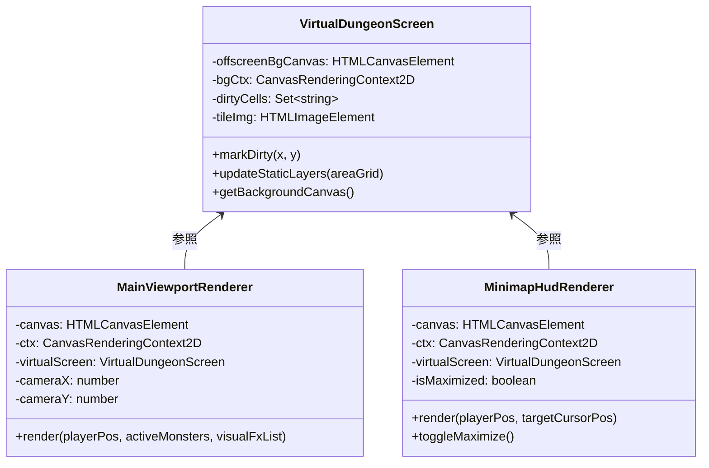
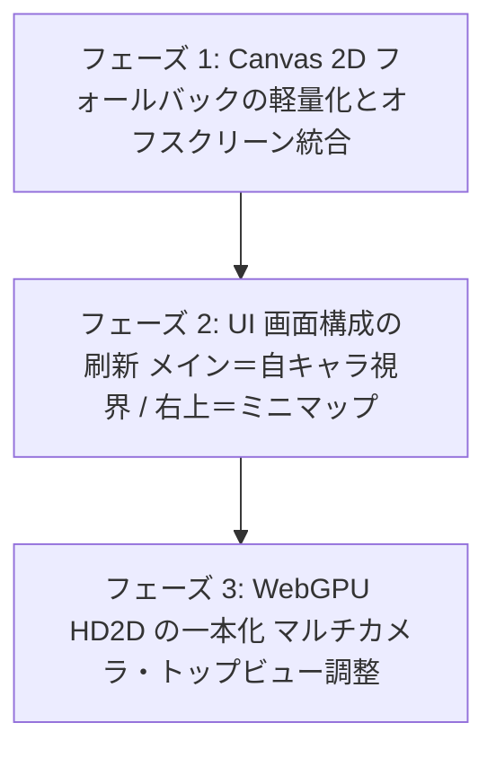

# 仮想スクリーン統合レンダラー ＆ UI画面刷新 計画仕様書
**Unified Virtual Screen & Modern Camera Architecture Plan**

- **対象プロジェクト**: NetHack-wasm-webUI
- **作成日**: 2026-09-20
- **保存先**: `docs/2_client_ui/unified_renderer_and_screen_architecture_plan.md`
- **ステータス**: `🟢 implemented` (Phase 1〜3 実装・テスト完了)

---

## 1. 概要と背景課題 (Executive Summary & Background)

### 1.1 背景と現状の課題
現在の `gkl-pure-js-client` におけるグラフィック描画および UI 画面構成には、以下の根本的な技術的負債と構造的なちぐはぐさが存在しています。

```text
【現状のちぐはぐな画面構成】
┌─────────────────────────────────────────────────────────┐
│ 【メイン画面領域】(game-canvas)                           │
│   ダンジョン全体 80x24 マスが 16x14px にギュッと縮小され、   │
│   中央に小さく押し込められて表示されている                 │
│                                           ┌───────────┐ │
│                                           │[FOCUS CAM]│ │
│                                           │自キャラ周辺│ │
│                                           │32px原寸   │ │
│                                           └───────────┘ │
└─────────────────────────────────────────────────────────┘
```

1. **画面構成の不自然さ（主従の逆転）**:
   - 中央の広大なメインエリアに「極小に縮小された全体マップ」が居座り、本来プレイヤーが見るべき「32px 原寸のアニメーションする自キャラ周辺（Focus Camera）」が画面右上に小さな小窓（PiP）として浮いている。
   - 現代の RPG やローグライク（Diablo、各種現代ローグライク）の「メイン画面がキャラ周辺の迫力あるビュー ＋ 画面隅に全体ミニマップ」という自然な構成と逆転している。
2. **レンダラーの二重管理とコードの重複**:
   - メインマップ描画 (`MapRenderer`) と自キャラ周辺描画 (`ZoomRenderer`) が別々のクラスとして独立し、双方で「4層レイヤー合成（Bottom/Middle/Top/Effect）」「タイルアトラス計算」「カーソル枠描画」などを二重に実装している。
3. **Canvas 2D の無駄な CPU 描画負荷**:
   - タイルの浮遊・歩行バウンスアニメーションを行うために、毎ターン・毎フレーム画面全体（80×24＝1,920マス）をクリアして全マスをループで再描画（ブルートフォース）している。
   - その結果、「全体を描き直すと重いから、FocusView だけ別 Canvas にして描画範囲を絞ろう」という本末転倒な対症療法を生んでいる。
4. **WebGPU (HD2D) との連携の断絶**:
   - プロトタイプ実装された `WebGPUHD2DRenderer` は単独で動作しており、既存の CanvasRenderer / ZoomRenderer とのインターフェースやカメラ統合が未整理のままとなっている。

---

## 2. 刷新コンセプトと基本設計 (Core Architecture Vision)

本刷新では、**「完全な仮想スクリーン（オフスクリーン）を中心に据え、カメラ（ビューポート）で画面へ切り出す」** というアーキテクチャへの全面移行を行います。

```text
                     [ NetHack Wasm コア / AreaStateManager ]
                                        │
             ┌──────────────────────────┴──────────────────────────┐
             ▼ (メッセージ駆動: 変化時のみ)                         ▼ (毎フレーム: アニメーション)
   【Layer 1: 地形 (Bottom)】                                 【Layer 3: キャラクタ (Top)】
   【Layer 2: アイテム (Middle)】                             【Layer 4: エフェクト (Effect)】
             │                                                     │
             └──────────────────────────┬──────────────────────────┘
                                        ▼
             ┌─────────────────────────────────────────────────────────┐
             │ 【仮想ダンジョン画面 (Virtual Dungeon Screen)】          │
             │   - 80x24 マス x 32px 原寸 (2560 x 768px オフスクリーン) │
             │   - 静的背景は Dirty Cell 差分更新のみ (負荷 0%)          │
             │   - 動的キャラ・エフェクトのみを毎フレーム合成            │
             └──────────────────────────┬──────────────────────────────┘
                                        │
                    ┌───────────────────┴───────────────────┐
                    ▼                                       ▼
       【Camera A: メインビューポート】          【Camera B: ミニマップ HUD】
       - プレイヤー中心の迫力ある原寸描画         - 全体 80x24 を縮小転送
       - 画面いっぱいに広がる現代的 UI           - 画面右上（または右下）にスマート配置
       - アニメーション / 画面振動 / FX          - [Tab] キーで中央展開可能 (NetHackのmキー衝突防止)
```

### 2.1 主なメリット
1. **現代的で没入感の高い UI/UX**:
   - 画面全体を使って、32×32px 原寸（または滑らかにスケーリングされたビュー）でダイナミックに NetHack の世界を冒険できる。
2. **CPU / GPU 負荷の劇的低減**:
   - ダンジョンの 99%（床・壁・置かれたアイテム）はターン更新時のみピンポイント差分描画（Dirty Rect）。
   - 毎フレーム描画するのは「動いているモンスター・自キャラの数マス（十数回）」＋「画面転送（`drawImage` 2回）」のみになり、CPU 負荷が実質ゼロになる。
3. **コードの単一化（Single Source of Truth）**:
   - セル描画ロジックが 1 箇所に集約され、エフェクトやカーソル表示の不整合が消滅する。
4. **WebGPU へのシームレスな移行足場**:
   - 「完全なダンジョンデータ」と「カメラによる切り出し」に責務が分離されるため、描画バックエンドを Canvas 2D から WebGPU に差し替える際も、カメラ行列の変更だけで完全に同じ UI を再現できる。

---

## 3. レイヤー分離 ＆ 差分更新（Dirty Rect）設計

NetHack のゲーム世界の更新頻度に基づき、描画パイプラインを「静的背景」と「動的合成」に完全分離します。

```text
┌─────────────────────────────────────────────────────────────────────────┐
│ ① 静的背景バッファ (Bottom + Middle): 2560x768px Canvas                 │
│    - NetHack C コアから変更通知のあったセルのみ再描画                      │
│    - プレイヤーが歩いていない待機中は【完全負荷 0%】                      │
└─────────────────────────────────────────────────────────────────────────┘
                                    │
                                    ▼ 転送 (drawImage)
┌─────────────────────────────────────────────────────────────────────────┐
│ ② ワークバッファ (または直接ターゲット Canvas へ切り出し転送)           │
│    - 背景から必要な範囲をコピー                                          │
│    - 動的モンスター / 自キャラ (Top) をバウンスアニメーション描画         │
│    - 斬撃 / 爆発 / 被弾フラッシュ (Effect / Visual FX) を最前面描画       │
└─────────────────────────────────────────────────────────────────────────┘
```

### 3.1 差分更新（Dirty Cell）の管理
- `AreaStateManager` でセルの `bottom` や `middle` が変化した座標 `(x, y)` を `Set` に記録。
- 描画ループ開始時に `dirtyCells` に含まれるセルだけを背景オフスクリーン Canvas 上で `clearRect` ＆ `drawTile` する。
- 更新完了後、`dirtyCells.clear()` でリセット。

---

## 4. クラス設計とインターフェース仕様

現状の `MapRenderer` と `ZoomRenderer` を再構築し、以下の 3 つの明確な責務に再編します。

### 4.1 クラス構成図



### 4.2 各クラスの責務

#### 1. `VirtualDungeonScreen`（仮想画面データ・静的背景マネージャー）
- 80×24 マス（2560×768px）のオフスクリーン Canvas を保持。
- タイル画像（透過 `nethack_default_32_tr.png`）を管理。
- 地形（Bottom）およびアイテム（Middle）の差分描画を担当。

#### 2. `MainViewportRenderer`（メイン視界レンダラー）
- 画面中央のメイン Canvas を担当（例: 800×600px や 960×540px などコンテナ追従）。
- プレイヤーを中心としたカメラ座標をスムーズ補間（Lerp: `camPos += (target - camPos) * 0.15`）。
- 背景 Canvas からカメラ周辺の矩形領域を高速転送（`drawImage`）。
- 視界内のモンスター・自キャラ（Top）をバウンス付きで描画。
- 斬撃、被弾赤フラッシュ、撃破バーストなどの Visual FX やターゲットカーソルを描画。
- 画面振動（Screen Shake）の `translate` 適用。

#### 3. `MinimapHudRenderer`（ミニマップ HUD レンダラー）
- 画面右上の小窓 Canvas（例: 240×72px 程度）を担当。
- 背景 Canvas 全体（2560×768px）をギュッと縮小して `drawImage`。
- 自キャラ位置に光るドット（緑）、モンスター位置（赤）、階段/店舗などのランドマークアイコンを軽量オーバーレイ。
- [Tab] キーまたはクリックで「画面中央に大きく半透明展開」するトグル機能を提供（※NetHackの m プレフィックス移動コマンドとの衝突を防ぐため、Tabキーに限定）。

---

## 5. 段階的移行ロードマップ (Phased Migration Roadmap)

安全に既存機能を壊さず移行するため、以下の 3 フェーズで進めます。



### 【フェーズ 1】Canvas 2D フォールバックの軽量化とオフスクリーン統合
- **目標**: 既存の UI 配置を維持したまま、内部の描画ロジックを「仮想スクリーン ＋ 切り出し」に統一し、CPU 負荷を削減する。
- **作業内容**:
  1. `VirtualDungeonScreen.js` を新規作成し、80×24 の原寸背景管理と差分更新（Dirty Rect）を実装。
  2. `MapRenderer` と `ZoomRenderer` の共通タイル描画処理を一本化。
  3. `ZoomRenderer` が `VirtualDungeonScreen` から自キャラ周辺を `ctx.drawImage` で切り出すようにリファクタリング。
- **検証ポイント**:
  - 待機時の CPU 使用率がほぼ 0% に低下すること。
  - ZoomRenderer のタイルの見た目やアニメーション、エフェクトが損なわれないこと。

### 【フェーズ 2】UI 画面構成の刷新（現代的ゲームレイアウトへの逆転）
- **目標**: 画面の主従関係を逆転し、メイン画面を迫力あるフォーカスビューに、全体マップをミニマップ HUD に刷新する。
- **作業内容**:
  1. `index.html` のレイアウトを変更:
     - メイン Canvas (`#game-canvas`) をプレイヤー周辺の迫力ビューに割り当て。
     - `#zoom-viewport-box` を `#minimap-hud-box` に改名し、画面右上にミニマップとして再配置。
  2. ミニマップにプレイヤー位置や階段アイコンのピン留め表示を追加。
  3. [Tab] キーでの全体マップオーバーレイ展開機能を実装 (NetHackの m コマンド競合を避けるため Tab に統一)。
- **検証ポイント**:
  - プレイヤーの移動に合わせてメイン画面がスムーズに追従すること。
  - ミニマップでフロア全体の探索状況が直感的に把握できること。

### 【フェーズ 3】WebGPU HD2D の一本化 ＆ 描画調整
- **目標**: WebGPU レンダラーを本番メインとして昇格させ、Canvas 2D を完全なフォールバックとする。
- **作業内容**:
  1. **トップビュー対応**: カメラを真上に向けた際にも、ビルボード（直立板）が消えないよう WGSL シェーダーで水平プレーンに倒すモードを追加。
  2. **マルチカメラ（またはレンダーターゲット切り出し）**:
     - WebGPU の 1 回のインスタンスバッファから、メイン画面用カメラ（ジオラマまたはズーム）と、ミニマップ用カメラ（全体トップビュー）を極小負荷でレンダリング。
  3. **アイドル時省電力（Dirty レンダリング）**:
     - 移動やアニメーションがない時は描画ループを停止/間引く省電力モードを導入。
- **検証ポイント**:
  - WebGPU 対応ブラウザでは 60FPS の美しい HD2D ジオラマ/トップビューでプレイ可能であること。
  - WebGPU 非対応環境では、フェーズ 1〜2 で構築した軽量 Canvas 2D が自動的に起動すること。

---

## 6. 実装コード設計ドラフト (Implementation Drafts)

### 6.1 `VirtualDungeonScreen.js` 実装イメージ

```javascript
/**
 * VirtualDungeonScreen.js - 80x24 マス (2560x768px) の完全な仮想ダンジョン背景管理
 */
export class VirtualDungeonScreen {
  constructor({ tileSize = 32, cols = 80, rows = 24 }) {
    this.tileSize = tileSize;
    this.cols = cols;
    this.rows = rows;
    
    // 2560 x 768px のオフスクリーン Canvas
    this.bgCanvas = document.createElement('canvas');
    this.bgCanvas.width = cols * tileSize;
    this.bgCanvas.height = rows * tileSize;
    this.bgCtx = this.bgCanvas.getContext('2d');
    
    this.dirtyCells = new Set();
    this.tileImg = null;
    this.tileLoaded = false;
  }

  markDirty(x, y) {
    if (x >= 0 && x < this.cols && y >= 0 && y < this.rows) {
      this.dirtyCells.add(`${x},${y}`);
    }
  }

  markAllDirty() {
    for (let y = 0; y < this.rows; y++) {
      for (let x = 0; x < this.cols; x++) {
        this.dirtyCells.add(`${x},${y}`);
      }
    }
  }

  /**
   * 差分セルのみをピンポイントで背景 Canvas に再描画
   */
  flushDirtyCells(areaGrid, tileMappingFn) {
    if (!this.tileLoaded || this.dirtyCells.size === 0) return;
    
    const tileMap = typeof tileMappingFn === 'function' ? tileMappingFn() : [];
    const colsInAtlas = Math.floor(this.tileImg.width / 32) || 40;
    const ts = this.tileSize;

    for (const key of this.dirtyCells) {
      const [xStr, yStr] = key.split(',');
      const x = parseInt(xStr, 10);
      const y = parseInt(yStr, 10);
      const dx = x * ts;
      const dy = y * ts;

      // セル領域をクリア
      this.bgCtx.fillStyle = '#000000';
      this.bgCtx.fillRect(dx, dy, ts, ts);

      const cell = areaGrid?.[y]?.[x];
      if (cell) {
        // Layer 1: 地形 (Bottom)
        if (cell.bottom && cell.bottom.rawGlyph >= 0) {
          this._drawTile(cell.bottom.rawGlyph, colsInAtlas, tileMap, dx, dy);
        }
        // Layer 2: アイテム (Middle)
        if (cell.middle && cell.middle.rawGlyph >= 0) {
          this._drawTile(cell.middle.rawGlyph, colsInAtlas, tileMap, dx, dy);
        }
      }
    }

    this.dirtyCells.clear();
  }

  _drawTile(glyphId, colsInAtlas, tileMap, dx, dy) {
    const tileIdx = tileMap[glyphId] !== undefined ? tileMap[glyphId] : 0;
    const sx = (tileIdx % colsInAtlas) * 32;
    const sy = Math.floor(tileIdx / colsInAtlas) * 32;
    this.bgCtx.drawImage(this.tileImg, sx, sy, 32, 32, dx, dy, this.tileSize, this.tileSize);
  }
}
```

### 6.2 メイン画面での高速切り出し合成イメージ (`MainViewportRenderer.js`)

```javascript
// 毎フレームの描画処理 (60FPS アニメーション)
renderMainViewport({ playerX, playerY, areaGrid, activeMonsters, visualFxList, now }) {
  const ctx = this.ctx;
  const ts = 32; // タイル原寸 32px

  // 1. カメラ座標のスムーズ追従 (Lerp)
  this.camX += (playerX - this.camX) * 0.15;
  this.camY += (playerY - this.camY) * 0.15;

  // 画面中央にカメラを合わせるオフセット計算
  const viewW = this.canvas.width;
  const viewH = this.canvas.height;
  const srcX = Math.max(0, Math.min(2560 - viewW, this.camX * ts - viewW / 2));
  const srcY = Math.max(0, Math.min(768 - viewH, this.camY * ts - viewH / 2));

  // 2. 背景 Canvas から自キャラ周辺を高速切り出し転送 (たった 1 回の drawImage)
  ctx.drawImage(this.virtualScreen.bgCanvas, srcX, srcY, viewW, viewH, 0, 0, viewW, viewH);

  // 3. 画面内に入っている動的モンスター・自キャラ (Top) のみを描画
  const bounceY = -Math.round(Math.abs(Math.sin(now / 160)) * 3);
  for (const m of activeMonsters) {
    const screenX = m.x * ts - srcX;
    const screenY = m.y * ts - srcY;
    if (screenX >= -ts && screenX <= viewW && screenY >= -ts && screenY <= viewH) {
      this._drawDynamicTile(ctx, m.rawGlyph, screenX, screenY + bounceY);
    }
  }

  // 4. 最前面 Visual FX (斬撃・フラッシュ) の描画
  this.renderVisualFx(ctx, srcX, srcY, visualFxList, now);
}
```

### 6.3 ミニマップ HUD での縮小転送イメージ (`MinimapHudRenderer.js`)

```javascript
renderMinimap({ playerX, playerY }) {
  const ctx = this.ctx;
  const w = this.canvas.width;   // 例: 240px
  const h = this.canvas.height;  // 例: 72px

  // 背景全体 (2560x768) をミニマップ枠へギュッと縮小転送 (たった 1 回の drawImage)
  ctx.drawImage(this.virtualScreen.bgCanvas, 0, 0, 2560, 768, 0, 0, w, h);

  // プレイヤー現在地を光る緑ドットで表示
  const px = (playerX / 80) * w;
  const py = (playerY / 24) * h;
  ctx.fillStyle = '#00ff66';
  ctx.beginPath();
  ctx.arc(px, py, 2.5, 0, Math.PI * 2);
  ctx.fill();
}
```

---

## 7. まとめ

本刷新計画は、単なるリファクタリングにとどまらず、**「現代の Web アプリケーションとして最も快適で美しい NetHack プレイ環境を実現する」** ための根本的なアーキテクチャ刷新です。

- **フォールバックの最適化**: メッセージ駆動差分更新により、Canvas 2D でも CPU 負荷を極小化。
- **UI/UX の刷新**: 「自キャラ周辺がメイン画面、全体マップはミニマップ」という自然な画面構成へ転換。
- **WebGPU への円滑な一本化**: 仮想スクリーンとカメラの概念が整理されることで、WebGPU マルチカメラへの移行が極めてシンプルになる。

この仕様に基づき、フェーズ 1 から順次安全に実装を進行させることを推奨します。
