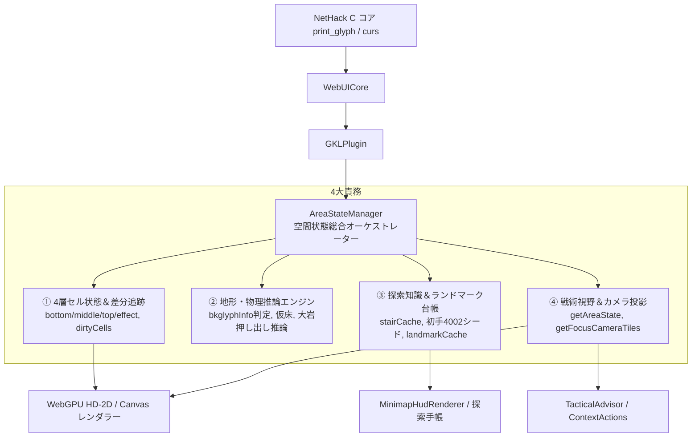
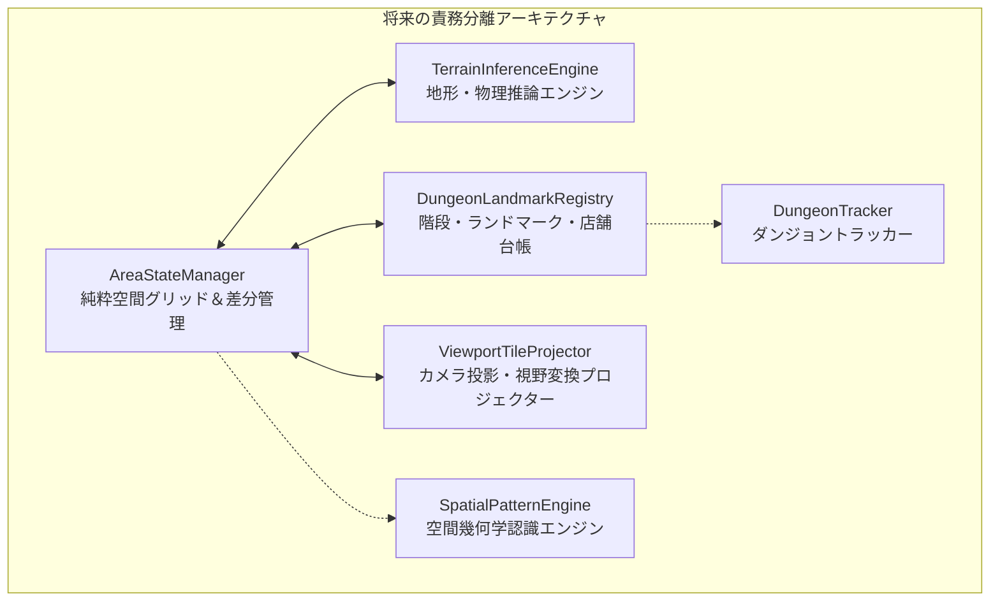

# 🗺️ AreaStateManager 空間状態総合オーケストレーター 仕様書 ＆ モジュール機能整理計画

## 1. 概要とアーキテクチャ位置付け

`AreaStateManager` は、NetHack WASM WebUI の知識層（GKL: Game Knowledge Layer）において、**「現在探索中のダンジョン空間情報」を一元管理するSingle Source of Truth (SSOT)** です。

NetHack の C コアは、画面描画を `print_glyph(x, y, glyph)` という「現在最前面に見えている単一のグリフ値」として送信します。
しかし、モダンなWebクライアント（HD-2Dレンダラー、3Dジオラマ、詳細インスペクター、戦術アドバイザー等）が要求する「床の上にモンスターが乗り、アイテムが落ちている」という多層構造を復元・永続化するため、`AreaStateManager` は単なる配列保持を超えて、**推論・キャッシュ・台帳・投影の 4 大責務** を担っています。



---

## 2. 4層セルデータモデル ＆ 差分追跡

グリッド（既定: $80 \times 24$ マス）の各セルは、以下の多層構造（`AreaCell`）を持ちます。

```javascript
{
    x: number,
    y: number,
    bottom: Object | null,  // 地形レイヤー (床, 壁, 階段, 扉, 祭壇, 水, 溶岩 等)
    middle: Object | null,  // 設置物・アイテムレイヤー (アイテム, 大岩 Boulder)
    top: Object | null,     // 生物レイヤー (自キャラ, モンスター, ペット)
    effect: Object | null,  // 一時演出レイヤー (ビーム, 爆発, 稲妻)
    engraving: Object | null // 床文字レイヤー (文字テキスト, 判定タイプ)
}
```

### レイヤー解決優先度
レンダラーが最前面グリフ（`topGlyph`）を解決する際は、以下の優先順で判定されます：
1. `effect` (最前面エフェクト)
2. `top` (モンスター / 死亡時の墓石 4011)
3. `middle` (アイテム / 大岩)
4. `bottom` (地形 / 階段 / 壁 / 床)

### 差分更新追跡 (`dirtyCells`)
毎フレーム全 $80 \times 24$ マスを再描画する負荷を防ぐため、グリフ更新・自キャラ移動が発生した座標のみを `this.dirtyCells`（`Set<string>` / `x,y` 形式）に記録します。
レンダラーは `getDirtyCells()` を取得し、描画完了後に `clearDirtyCells()` で消費します。

---

## 3. グリフ処理パイプライン ＆ 地形自己修復 (Self-Healing)

`updateGlyph(x, y, glyphId, glyphInfo, bkglyphInfo)` は、受信したグリフの種別に応じて適切なレイヤーへ振り分けます。

```mermaid
flowchart TD
    In[受信: glyphId, bkglyphInfo] --> Classify[classifyGlyph(glyphId)]
    
    Classify -->|TERRAIN| SetBottom[cell.bottom に格納<br>cell.top/middle/effect をクリア]
    Classify -->|ITEM / BOULDER| CheckBottom1{cell.bottom 存在?}
    Classify -->|MONSTER / PET| CheckBottom2{cell.bottom 存在?}
    
    CheckBottom1 & CheckBottom2 -->|未探索 / null| EvalBg{bkglyphInfo 有効 &<br>glyph < 9622 ?}
    EvalBg -->|Yes| SetGenuine[cell.bottom = 真の地形]
    EvalBg -->|No (9622)| SetInferred[cell.bottom = 仮床 3992<br>inferred: true]
    
    CheckBottom1 -->|設定完了後| SetMiddle[cell.middle = アイテム/大岩]
    CheckBottom2 -->|設定完了後| SetTop[cell.top = モンスター]
    
    SetBottom -.-> Heal[自己修復: 以前の仮床が<br>本物の地形グリフで上書き確定]
```

### ① 背景グリフ (`bkglyphInfo`) 判定と安全ガード
NetHack 5.0 C コア（`winshim.c`）から送られてくる背景グリフ情報を検証します：
- `bkglyphInfo.glyph >= 0` かつ `glyph < 9622 (GLYPH_UNEXPLORED_OFF)` であれば、真の地形として `cell.bottom` に確定格納。
- **9622 ガード**: Cコアの設定により `9622` が送られてきた場合は、画面が黒くなるのを防ぐため自動的に安全な「仮床（`createInferredFloor()`: 3992番、`inferred: true`）」へフォールバック。

### ② 自己修復 (Self-Healing / Overwrite)
モンスターやアイテムがマスから移動・消滅した際、Cコアから送られてくる正規の地形グリフを受信すると、以前設定された仮床は自動的に真の地形に上書きされ、`inferred` フラグが消去されます。

---

## 4. 階段・ランドマーク台帳エンジン (Stair & Landmark Registry)

### ① 階段キャッシュ (`stairCache`)
NetHack ではフロア移動（階段昇降）時にマップ全体が消去されます。再訪時に階段位置を見失わないよう、フロアキー（例: `Dlvl:1:x,y`）をプレフィックスとして階段情報を永続保持します。
- **初手ブランチ階段先行シード (`seedInitialStair`)**:
  ゲーム開始時（Dlvl:1 の初手）のみ、自キャラ初期座標の足元に **地上脱出用のブランチ上り階段（グリフ番号 `4002`: `S_branch_upstair`）** を先行シード登録。1歩も動いていない状態でも足元を正確に描画します。
- **フロア再訪時の復元 (`applyStairCacheForFloor`)**:
  フロア移動直後、当該フロアの `stairCache` を走査し、`grid` の `cell.bottom` に階段を自動展開します。

### ② ランドマーク台帳 (`landmarkCache`)
`extractLandmarkEntity(x, y, glyphId)` により、探索上重要なオブジェクトを自動検出して台帳に記録します：
- **階段**: `STAIR_UP` (3998, 4000, 4002, 4004), `STAIR_DOWN` (3999, 4001, 4003, 4005)
- **祭壇**: `ALTAR` (4006〜4010)
- **水場・泉**: `FOUNTAIN` (4014), `SINK` (4013)
- **玉座**: `THRONE` (4012)
- **店舗 (SHOP)**: 店主（Shopkeeper: monOffset 271, 267, 268）を検知した際、同一フロア内の店舗としてグループ化登録。

---

## 5. 特殊物理 ＆ ギミック推論エンジン

NetHack の C コア仕様に起因する非同期的な描画ラグを吸収する推論ロジックです。

### ① 大岩（Boulder）押し出し推論
プレイヤーが大岩（`isBoulderGlyph`）を押して移動した際、Cコアからのグリフ送信順序によって「足元に岩が残ったまま移動先に新しい岩が現れる」現象が発生します。
- **Case A (移動先検知)**: プレイヤーの移動先マスにすでに大岩が存在する場合、足元マスの `cell.middle` をクリア。
- **Case B (遅延到着検知)**: プレイヤー移動後に押し出し先マスへ大岩グリフが届いた場合、足元マスの `cell.middle` をクリア。

### ② 死亡時墓石置換
プレイヤー死亡フラグ（`isDead`）が立った際、プレイヤー座標の `cell.top` を自動的に墓石（`DEFAULT_TOMBSTONE_GLYPH`: 4011番）へ置換して描画します。

---

## 6. 空間・戦術視野 ＆ カメラ投影インターフェース

### ① 戦術視野 (`getAreaState`)
- 自キャラを中心とした半径 $R$（既定 $3 \times 3$）マスの周囲状態を抽出。
- 操作モード（Vi-keys / NumPad）に応じた移動・攻撃キー情報（`code: 'E', key: '6', name: '東'` 等）を自動付与。
- `TacticalAdvisor`（戦術助言）および `FloatingContextActions`（スマートアクション）の基盤入力となります。

### ② カメラ投影 (`getFocusCameraTiles`)
- レンダラー（HD-2D / Canvas）に向けて、中心座標（$cx, cy$）から視界矩形（$radiusX \times radiusY$）内のタイル情報を整形して提供。
- レイヤー別グリフ（`bottomGlyph`, `middleGlyph`, `topGlyph`, `effectGlyph`）の完全解決。
- 構造化知識ベース（`structuredKnowledge`）と結合し、タイル直下のモンスター名やアイテム名を即時注入。

---

## 7. 空間幾何学認識エンジン ＆ ダンジョントラッカー連携とモジュール分割計画

### 将来計画との依存関係
ロードマップ上の以下の2大バックログ構想は、`AreaStateManager` のグリッド・ランドマーク情報を前提としています：
1. **[Spatial_Pattern_Engine_Architecture.md](./Spatial_Pattern_Engine_Architecture.md) (空間幾何学認識エンジン)**:
   - 部屋の矩形形状、通路のトポロジー、刻み文字の幾何配置パターンを検知。
2. **[Dungeon_Tracker_and_Checkpoint_Architecture.md](./Dungeon_Tracker_and_Checkpoint_Architecture.md) (ダンジョントラッカー)**:
   - 全階層の重要拠点マーカー（🚩）やセーブデータ非破壊のチェックポイント管理。

現在の 1,085 行の単一クラスにこれらのロジックを直接追加すると、破綻するリスクがあります。
そのため、以下の**4モジュール分割・リファクタリング計画**を「実装待ち（Backlog / RFC）」として定義します。

### モジュール分割構想 (Target Architecture)



| 新モジュール名 | 移譲される責務 |
| :--- | :--- |
| **`AreaStateManager.js` (コア)** | 純粋な $80 \times 24$ セルグリッド保持、`cell.top/middle/bottom/effect` 読み書き、`dirtyCells` 管理 |
| **`TerrainInferenceEngine.js`** | `bkglyphInfo` 判定、仮床フォールバック、自己修復、大岩押し推論、墓石置換 |
| **`DungeonLandmarkRegistry.js`** | `stairCache`、`landmarkCache`、初手ブランチ階段シード、店舗同定・グループ化、フロア再訪復元 |
| **`ViewportTileProjector.js`** | `getFocusCameraTiles`、`getAreaState`（描画・UI向けデータ変換・キー情報付与） |

### 移行ステップ（ロードマップ連携）
1. **Step 1: 仕様書固定（本ドキュメント）**: 現有の全振る舞い・インターフェースを確定。
2. **Step 2: 内部デリゲーション抽出**: 外部 API（`updateGlyph` 等）の後方互換性を 100% 維持したまま、内部処理を上記 3 クラスへ委譲。
3. **Step 3: 空間幾何学認識エンジン ＆ ダンジョントラッカーの接続**: クリーンになった `DungeonLandmarkRegistry` および `AreaStateManager` の上に、`SpatialPatternEngine` と `DungeonTracker` を相乗り配備。
