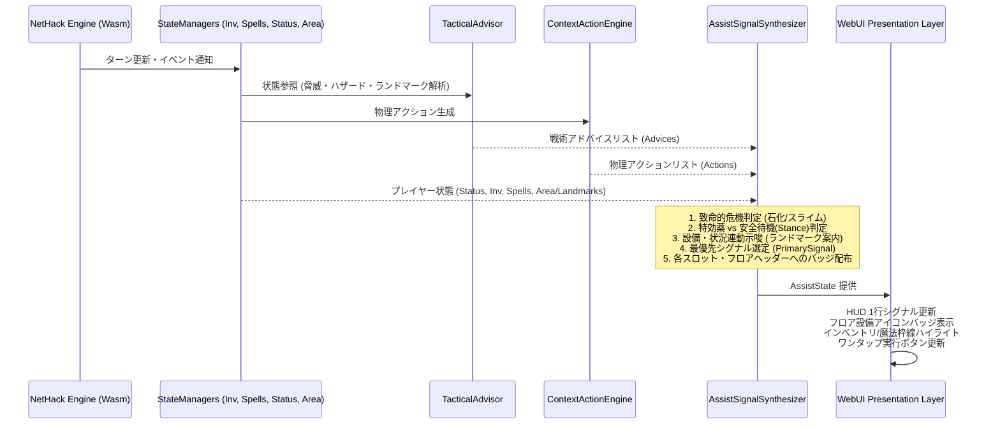

# GKL 行動指針 (Action Stance) ＆ アシストシグナル (AssistSignal) 仕様・設計書

**〜JRPGメンタルモデルの乖離を解消し、情報過多・ボタン乱立を防ぐ次世代行動アシスト基盤〜**

---

## 1. 背景と課題意識 (Background & Motivation)

### 1.1 JRPGメンタルモデルと NetHack 仕様の乖離
多くのプレイヤーが親しんでいるJRPG（ドラクエ、FF等）と、NetHackの「環境・道具の物理的相互作用（ケミストリー）」の間には大きな思考ギャップが存在します：

- **状態異常の回復**:
  - *JRPG*: 「キアリーや毒消し草などの専用アイテム・呪文で即時治療する」
  - *NetHack*: **特効薬（火の杖、トカゲの死体等）を持っていないケースが大半**。実態は「治るまでいかに安全にターンを経過させるか（足踏み待機、壁際退避、Elbereth結界）」または「神への祈り (`#pray`)」が主力。
- **魔法と杖の運用**:
  - *JRPG*: 「MPさえあればメニューから選んで撃つだけ」
  - *NetHack*: 金属鎧による**魔法失敗率の爆発（Fail 50〜100%）**、直線射線の壁反射・自爆リスク、敵の反射特性が存在。失敗率が高い時は「同じ効果の杖」や「投擲」への切り替えが定石。
- **コマンドの複雑さ**:
  - 自分に杖を振る (`z` ➔ `letter` ➔ `.`) や、床に文字を刻む (`E` ➔ `-` ➔ `Elbereth`) など、キーストロークの敷居が高い。

### 1.2 従来のUIアプローチにおける限界
- **ボタン乱立の罠**: 状況に応じた推奨アクションボタンを都度画面に増やすと、UIがボタンだらけになり認知負荷が爆発する。
- **長文アドバイスの読み飛ばし**: 長文の警告テキスト（Tips）を画面に出しても、プレイ中は読まれず無視されやすい。

---

## 2. コア設計原則 (Core Design Principles)

```
        ┌─────────────────────────────────────────────────────────────┐
        │            Action Stance & AssistSignal 3大原則             │
        └─────────────────────────────────────────────────────────────┘
                                       │
          ┌────────────────────────────┼────────────────────────────┐
          ▼                            ▼                            ▼
  【行動指針 (Stance) 中心】     【3層情報圧縮ピラミッド】     【システムとUIの完全疎結合】
  ・特効薬の有無に応じた        ・Level 1: 極小バッジ/枠線    ・システム: 統合メタデータ出力
    「安全な過ごし方」提示      ・Level 2: 1行シグナル (HUD)  ・UI: バッジ/ハイライト/実行
  ・待機/祈り/結界の自動評価    ・Level 3: アクション ＆ Why    を好みの表現でレンダリング
```

1. **行動指針（Stance）中心の設計**:
   - 「持っているアイテムを使う」だけでなく、「特効薬がない時の最も安全な行動（その場待機、足踏み、祈り、視界遮断）」を行動指針として評価・サジェストする。
2. **3層情報圧縮ピラミッド (3-Tier Compression Model)**:
   - 画面を圧迫せず、プレイヤーが一瞬で判断できるよう情報を3段階（バッジ ➔ 1行シグナル ➔ アクション＆詳細）に圧縮。
3. **システム（判定・データ）と UI（表現）の完全疎結合**:
   - GKL は画面にボタンを直接配置するのではなく、**「おすすめフラグ／統合アシストシグナル (`AssistState`)」** を出力する。UI クライアント側はそれを持ち物枠のハイライト枠線にするか、HUDの1行バーにするかを自由に決定できる。

---

## 3. 3層情報圧縮モデル (3-Tier Information Model)

```
┌────────────────────────────────────────────────────────────────────────┐
│ Level 1: Nano Badge (極小バッジ・枠線)                                 │
│ ・インベントリ一覧、習得魔法一覧、ステータス欄の各スロットに付与       │
│ ・例: [🔥治療] [⚠️高失敗] [🛡️待機] [🎯特効]                           │
├────────────────────────────────────────────────────────────────────────┤
│ Level 2: 1-Line Signal (HUD最上部の最優先シグナル)                     │
│ ・現在の状況で「最も生存確率を高める1行（10〜20文字）」                │
│ ・例: "🛡️ 混乱中: 移動せず足踏み(.)推奨"                               │
├────────────────────────────────────────────────────────────────────────┤
│ Level 3: Action & Why (即時実行 ＆ 理由展開)                           │
│ ・タップ時のワンタップ実行キーストローク (例: ['.'] や ['z','a','.'])  │
│ ・[?] クリック時のアコーディオン解説 ＆ Wikiリンク                     │
└────────────────────────────────────────────────────────────────────────┘
```

---

## 4. データ構造定義 (Data Contract / TypeScript)

```typescript
/**
 * GKL がクライアントへ毎ターン提供する統合アシスト状態
 */
export interface AssistState {
    /** ターン番号 */
    turn: number;

    /** 
     * Level 2: HUD最上部に表示する最優先シグナル (最大1件)
     * 現在最も重要度・緊急度が高いトピックのみを厳選
     */
    primarySignal: AssistSignal | null;

    /**
     * Level 1: 各スロット（所持品・魔法・ステータス）に付与するバッジ・強調情報
     * キー: 
     *  - 所持品: invlet (例: 'a', 'b')
     *  - 魔法: spellKey (例: 'a') または spellName (例: 'force bolt')
     *  - ステータス: statusId (例: 'Confused', 'Blind', 'Sliming')
     */
    slotBadges: Record<string, SlotBadge>;

    /**
     * Level 3: primarySignal に直結するワンタップ実行アクション（存在する場合）
     */
    primaryAction: AssistAction | null;
}

/**
 * 1行シグナル
 */
export interface AssistSignal {
    id: string;
    priority: number; // 0〜100 (90+: 致命的危機, 70+: 高脅威, 50+: 有効戦術, 30+: 日常支援)
    category: 'SURVIVAL' | 'STATUS_REMEDY' | 'TACTICAL_COMBAT' | 'EQUIPMENT_MAGIC' | 'UTILITY';
    stance: 'WAIT_SAFE' | 'CURE' | 'PRAY' | 'RANGED' | 'EQUIP' | 'ENGRAVE' | 'CAUTION';
    icon: string;              // '🛡️' | '🔥' | '🙏' | '⚠️' | '🎯' | '🪄' など
    shortMessageJa: string;    // "混乱中: 移動せず足踏み(.)推奨"
    shortMessageEn: string;    // "Confused: Wait in place (.) recommended"
    detailWhyJa?: string;      // "混乱中に移動するとランダムな方向へ進み、罠や溶岩に突っ込む危険があります。"
    detailWhyEn?: string;
    wikiTopic?: string;        // "Confusion" (NetHack Wikiリンク用)
}

/**
 * スロットバッジ（枠線・アイコン）
 */
export interface SlotBadge {
    type: 'danger' | 'warning' | 'info' | 'success'; // 色・エフェクト種別
    icon: string;
    labelJa: string;           // "治療", "特効", "待機", "危険", "推奨"
    labelEn: string;
    highlightBorder?: boolean; // UI側で金枠/パルスアニメーションを行うフラグ
    suggestedVerb?: string;    // "zap", "apply", "eat", "cast"
}

/**
 * ワンタップ実行用アクション
 */
export interface AssistAction {
    id: string;
    labelJa: string;           // "足踏みする (.)", "火の杖を自分に振る"
    labelEn: string;
    keySequence: (string | number)[]; // ['.'] または ['z', 'a', '.']
    isSafe: boolean;           // 誤操作リスクがないか
}
```

---

## 5. 状況別 Stance（行動指針）判定マトリクス

### 5.1 状態異常 ＆ サバイバル・健康 (Status Hazards & Survival)
| 状況 / 状態異常 | 条件（特効/回復所持 vs なし） | Stance | 1行シグナル (Level 2) | バッジ (Level 1) | ワンタップアクション (Level 3) |
| :--- | :--- | :--- | :--- | :--- | :--- |
| **HP致命域 (瀕死: < 30%)** | 回復ポーション/杖/呪文あり | `HEAL` | `🚨 瀕死(HP低): 直ちに回復薬/魔法で治癒` | 回復薬/杖/呪文: `[💊緊急回復]` (金枠) | `q` ➔ `回復薬` |
| **HP致命域 (瀕死: < 30%)** | 回復手段なし ＆ 祈り可能 | `PRAY` | `🙏 瀕死(HP低): 神に祈って全快を乞う` | ステータス(HP): `[🙏祈願]` | `#pray` ➔ `y` |
| **HP危険域 (警戒: 30〜50%)** | 回復ポーション所持 | `HEAL` | `💖 HP低下: 回復薬(q)の服用または退避` | 回復薬: `[💊回復]` | `q` ➔ `回復薬` |
| **病気・食中毒 (`Sick/Ill`)** | エキストラ回復薬 / 角所持 | `CURE` | `🤢 病気中: 直ちに強力回復薬または角で治癒` | 所持品(強回復薬/角): `[💊治癒]` (赤枠) | `q` ➔ `回復薬` / `a` ➔ `角` |
| **呪われた装備 (`Cursed`)** | 解呪の巻物 / 解呪魔法あり | `CURE` | `📜 呪縛: 解呪の巻物(r)で装備解除可能` | 所持品(解呪巻物): `[📜解呪]` | `r` ➔ `解呪巻物` |
| **混乱 (`Confused`)** | 特効薬なし（大半） | `WAIT_SAFE` | `🛡️ 混乱中: 移動せず足踏み(.)推奨` | ステータス: `[🛡️待機]` | `.` (足踏み) |
| **混乱 (`Confused`)** | ユニコーンの角所持 | `CURE` | `🦄 混乱中: ユニコーンの角で治療` | 所持品(角): `[✨治療]` | `a` ➔ `角` |
| **盲目 (`Blind`)** | 特効薬なし（大半） | `WAIT_SAFE` | `🛡️ 盲目中: 壁際で安全確保・待機` | ステータス: `[🛡️待機]` | `s` (捜索待機) |
| **盲目 (`Blind`)** | ユニコーンの角/回復薬あり | `CURE` | `✨ 盲目中: 角または回復薬で治療` | 所持品(角/薬): `[✨治療]` | `a` ➔ `角` / `q` ➔ `薬` |
| **スタン (`Stunned`)** | 自然治癒待ち | `WAIT_SAFE` | `⏳ スタン中: 攻撃を控えその場で待機` | ステータス: `[⏳待機]` | `.` (足踏み) |
| **幻覚 (`Hallu`)** | 特効薬なし | `CAUTION` | `🔍 幻覚中: 見た目に惑わされず待機` | ステータス: `[🔍注意]` | `.` (足踏み) |
| **スライム化 (`Sliming`)** | 火炎手段所持 (杖/薬/巻物) | `CURE` | `🔥 スライム化: 自分に火を放ち治療！` | 所持品(火): `[🔥治療]` (赤金枠) | `z` ➔ `杖` ➔ `.` |
| **スライム化 (`Sliming`)** | 火炎手段なし ＆ 祈り可能 | `PRAY` | `🙏 スライム化: 神に祈って救済を乞う` | ステータス: `[🙏祈願]` | `#pray` ➔ `y` |
| **石化進行 (`Petrifying`)** | トカゲの死体 / 酸所持 | `CURE` | `🦎 石化中: 直ちにトカゲの死体を摂取！` | 所持品: `[🦎緊急]` (赤金枠) | `e` ➔ `トカゲ` |
| **石化進行 (`Petrifying`)** | 特効なし ＆ 祈り可能 | `PRAY` | `🙏 石化中: 直ちに神に祈る！` | ステータス: `[🙏祈願]` | `#pray` ➔ `y` |

### 5.2 モンスター脅威 ＆ 戦闘 (Combat Tactics)
| モンスター / 状況 | 状況条件 | Stance | 1行シグナル (Level 2) | バッジ (Level 1) | ワンタップアクション (Level 3) |
| :--- | :--- | :--- | :--- | :--- | :--- |
| **浮遊する目玉 (`Floating Eye`)** | 視界内・射線上 | `RANGED` | `⚠️ 浮遊する目玉: 近接禁止！遠隔攻撃推奨` | 投擲/遠隔魔法: `[🎯特効]` | `f` / `t` / 攻撃魔法 |
| **浮遊する目玉 (`Floating Eye`)** | 目隠し/タオル所持 | `EQUIP` | `🙈 浮遊する目玉: 目隠し着用で安全接近` | 所持品(目隠し): `[🛡️装備]` | `P` ➔ `目隠し` |
| **銀弱点モンスター (悪魔/人狼等)** | 銀製武器所持（未装備） | `EQUIP` | `⚔️ 銀弱点敵: 銀の武器への持替推奨` | 所持品(銀武器): `[✨特効]` | `w` ➔ `銀武器` |
| **反射持ちモンスター (銀竜等)** | 直線ビーム魔法/杖を抑制 | `CAUTION` | `🛡️ 反射敵: ビーム跳ね返り自爆に注意` | ビーム魔法: `[⚠️自爆危険]` | 物理攻撃 / 対象指定 |

### 5.3 魔法・防具・リソース (Magic & Armor Penalty)
| 状況 | 状況条件 | Stance | 1行シグナル (Level 2) | バッジ (Level 1) | ワンタップアクション (Level 3) |
| :--- | :--- | :--- | :--- | :--- | :--- |
| **金属鎧着用 ＆ 魔法詠唱** | 魔法失敗率 50%以上 | `CAUTION` | `🪄 防具干渉: 魔法失敗率高（杖を推奨）` | 攻撃の杖: `[✨推奨]`<br>魔法欄: `[⚠️高失敗]` | 杖の行使 (`z`) |
| **MP枯渇 / 空腹時の詠唱危機** | Pw不足 または 飢餓 | `CAUTION` | `⚡ 霊力不足: 魔法を控え杖や道具を使用` | 杖/道具: `[✨推奨]` | 道具使用 |

### 5.4 取得魔法 (Spells) の案内と「4つの安全ガード」仕様
NetHack において取得魔法の案内は、職業格差（ヒーラー/魔術師 vs 戦士職）や金属鎧による失敗率爆発、空腹消費の観点から最も慎重な制御を要します。

```
     ┌─────────────────────────────────────────────────────────────┐
     │             取得魔法 (Spell) 推奨の 4大安全ガード            │
     └─────────────────────────────────────────────────────────────┘
                                   │
      ┌────────────────────────────┼────────────────────────────┐
      ▼                            ▼                            ▼
【1. 習得状態】              【2. 失敗率ガード】           【3. 霊力 ＆ 満腹度】
・SpellStateManager に       ・失敗率が安全域 (≦ 25%)      ・現在 Pw ≧ 必要コスト
  存在すること                 であること (金属鎧時は除外)  ・空腹 (Hungry/Weak) でない
```

1. **安全ガード条件の完全充足時のみ案内**:
   - ヒーラーやプリースト、ウィザード等で、上記4条件をすべて満たしている場合のみ、治癒魔法 (`healing`) や特効魔法を `AssistState` の推奨対象として点灯。
2. **防具干渉時の代替誘導 (Fallback to Wand/Potion)**:
   - 魔法を習得していても金属鎧等で失敗率が高い（> 25%）場合は、魔法の案内を完全に抑制し、魔法一覧画面に `[⚠️失敗率XX%]` 警告のみを表示。HUD上では「回復ポーション」や「同じ効果の杖」を優先案内。
3. **詠唱操作の自動化 (`DIR_SELF` 連動)**:
   - 治癒魔法 (`healing`, `extra healing`, `cure blindness` 等) は対象として自分自身 (`.`) を指定する必要があるため、Level 3 のワンタップアクションには自動的に `['Z', spellKey, '.']` をバインド。

---

### 5.5 フロア案内 ＆ ランドマーク（設備）台帳仕様 (Floor Landmark & POI Registry)

NetHack は数十階層を行き来するゲームであり、「あの階の祭壇はどこだっけ？」「道具屋があったのは何階か？」「指輪識別用の流し台を見失った」という**探索メモの記憶負荷（うろ覚え問題）**がプレイヤーの大きなストレス要因となります。
`AreaStateManager` のフロア別キャッシュ基盤を活用し、発見済み設備を自動集計・提示する「フロア案内」をアシスト基盤へ統合します。

```
┌────────────────────────────────────────────────────────────────────────┐
│ Level 1: Nano Badge (フロア設備バッジ)                                 │
│ ・ヘッダーやフロア表示部に発見済みランドマークをアイコンバッジ一覧表示 │
│ ・例: [🗺️ Dlvl:3] [🪜上] [🪜下] [⛪祭壇(中立)] [🚰流し台] [🏪道具屋]   │
├────────────────────────────────────────────────────────────────────────┤
│ Level 2: 1-Line Signal (状況連動型ランドマーク示唆)                    │
│ ・状況や持ち物に応じた気付きシグナル                                   │
│ ・例: "🚰 未識別指輪所持: このフロアに流し台(Sink)あり"                │
│ ・例: "⛪ 重い死体所持: このフロアに同属性の祭壇あり (捧げ物可能)"     │
├────────────────────────────────────────────────────────────────────────┤
│ Level 3: Action & Landmark Guide (ナビゲーション ＆ 設備詳細)          │
│ ・対象設備への方向ガイド / 距離表示 / ワンタップ移動                   │
│ ・フロア設備台帳モーダルでの全フロア一覧確認                           │
└────────────────────────────────────────────────────────────────────────┘
```

#### 5.5.1 データ型定義 (TypeScript Data Contract)
```typescript
export type LandmarkType = 
    | 'STAIR_UP'      // 上り階段 / ハシゴ
    | 'STAIR_DOWN'    // 下り階段 / ハシゴ
    | 'ALTAR'         // 祭壇 (無属性/秩序/中立/混沌/異教)
    | 'SINK'          // 流し台
    | 'FOUNTAIN'      // 噴水
    | 'THRONE'        // 王座
    | 'SHOP';         // 商店 (店主)

export type AltarAlignment = 'unaligned' | 'lawful' | 'neutral' | 'chaotic' | 'other';

export interface LandmarkEntity {
    id: string;              // 一意ID (例: "Dlvl:3:18,12:STAIR_DOWN")
    type: LandmarkType;      // ランドマーク種別
    floorKey: string;        // 所属フロア (例: "Dlvl:3", "Minetown:3")
    x: number;               // マップX座標 (0〜79)
    y: number;               // マップY座標 (0〜23)
    glyphId: number;         // グリフID (NetHack CMAP/MON ID)
    name: string;            // 英語表示名 (例: "altar (neutral)", "sink")
    nameJa: string;          // 日本語表示名 (例: "祭壇 (中立)", "流し台")
    icon: string;            // 表示用絵文字/シンボル (例: "⛪", "🚰", "🪜")
    details?: {
        alignment?: AltarAlignment; // 祭壇の属性
        alignmentJa?: string;       // 属性日本語名 ("中立", "秩序", "混沌" 等)
        shopkeeperType?: string;    // 店主種別
    };
}

export interface FloorLandmarksSummary {
    floorKey: string;
    stairsUp: LandmarkEntity[];
    stairsDown: LandmarkEntity[];
    altars: LandmarkEntity[];
    sinks: LandmarkEntity[];
    fountains: LandmarkEntity[];
    thrones: LandmarkEntity[];
    shops: LandmarkEntity[];
    all: LandmarkEntity[];
}
```

#### 5.5.2 ランドマーク検出 ＆ セマンティック判定アルゴリズム
`AreaStateManager.updateGlyph(x, y, glyphId)` 受信時に、以下の判定ロジックで自動抽出・登録します：

| 設備種別 | 判定条件 (Glyph ID / cmapFlags) | 属性・詳細判定 | アイコン | 日本語名 |
| :--- | :--- | :--- | :---: | :--- |
| **上り階段** | `cmapFlags.isStairUp` (3998, 4000, 4002, 4004) | - | 🪜 | 上り階段 / ハシゴ |
| **下り階段** | `cmapFlags.isStairDown` (3999, 4001, 4003, 4005) | - | 🪜 | 下り階段 / ハシゴ |
| **祭壇 (無属性)** | `glyphId === 4006` | `alignment: 'unaligned'` | ⛪ | 祭壇 (無属性) |
| **祭壇 (秩序)** | `glyphId === 4007` | `alignment: 'lawful'` | ⛪ | 祭壇 (秩序) |
| **祭壇 (中立)** | `glyphId === 4008` | `alignment: 'neutral'` | ⛪ | 祭壇 (中立) |
| **祭壇 (混沌)** | `glyphId === 4009` | `alignment: 'chaotic'` | ⛪ | 祭壇 (混沌) |
| **祭壇 (異教)** | `glyphId === 4010` | `alignment: 'other'` | ⛪ | 祭壇 (異教) |
| **流し台** | `cmapFlags.isSink` (4013) | - | 🚰 | 流し台 (Sink) |
| **噴水** | `cmapFlags.isFountain` (4014) | - | ⛲ | 噴水 (Fountain) |
| **王座** | `cmapFlags.isThrone` (4012) | - | 👑 | 王座 (Throne) |
| **ショップ** | `info.type === MONSTER && info.isShopkeeper` | 店主モンスター出現位置 | 🏪 | 道具屋 / 商店 |

```javascript
// AreaStateManager 内でのランドマーク登録実装例
extractLandmarkEntity(x, y, glyphId, info) {
    if (!info) return null;
    const floorKey = this.currentFloor;
    const baseId = `${floorKey}:${x},${y}`;

    if (info.cmapFlags) {
        const cf = info.cmapFlags;
        if (cf.isStairUp) return { id: `${baseId}:STAIR_UP`, type: 'STAIR_UP', floorKey, x, y, glyphId, icon: '🪜', name: 'stair up', nameJa: '上り階段' };
        if (cf.isStairDown) return { id: `${baseId}:STAIR_DOWN`, type: 'STAIR_DOWN', floorKey, x, y, glyphId, icon: '🪜', name: 'stair down', nameJa: '下り階段' };
        if (cf.isAltar) {
            const alignMap = {
                4006: { alignment: 'unaligned', nameJa: '祭壇 (無属性)' },
                4007: { alignment: 'lawful', nameJa: '祭壇 (秩序)' },
                4008: { alignment: 'neutral', nameJa: '祭壇 (中立)' },
                4009: { alignment: 'chaotic', nameJa: '祭壇 (混沌)' },
                4010: { alignment: 'other', nameJa: '祭壇 (異教)' }
            };
            const aInfo = alignMap[glyphId] || { alignment: 'neutral', nameJa: '祭壇' };
            return { id: `${baseId}:ALTAR`, type: 'ALTAR', floorKey, x, y, glyphId, icon: '⛪', name: `altar (${aInfo.alignment})`, nameJa: aInfo.nameJa, details: aInfo };
        }
        if (cf.isSink) return { id: `${baseId}:SINK`, type: 'SINK', floorKey, x, y, glyphId, icon: '🚰', name: 'sink', nameJa: '流し台' };
        if (cf.isFountain) return { id: `${baseId}:FOUNTAIN`, type: 'FOUNTAIN', floorKey, x, y, glyphId, icon: '⛲', name: 'fountain', nameJa: '噴水' };
        if (cf.isThrone) return { id: `${baseId}:THRONE`, type: 'THRONE', floorKey, x, y, glyphId, icon: '👑', name: 'throne', nameJa: '王座' };
    }
    if (info.isShopkeeper) {
        return { id: `${baseId}:SHOP`, type: 'SHOP', floorKey, x, y, glyphId, icon: '🏪', name: 'shopkeeper', nameJa: '商店 (店主)' };
    }
    return null;
}
```

#### 5.5.3 AssistSignalSynthesizer 連携示唆ルール (Level 2 シグナル)
以下の条件が揃った際、HUD 最優先シグナル (`primarySignal`) または提案シグナルとして自動生成します：

1. **未識別指輪 ＋ 流し台 (Sink Identification)**:
   - 条件: 所持品に `oclass === Ring (8)` かつ未識別 (`!identified`) のアイテムが存在 ＆ `currentFloor` に `SINK` が存在。
   - シグナル: `🚰 未識別指輪あり: この階の流し台に落とすと識別可能 (#drop ➔ d)` (重要度: `INFO`)
2. **重い死体 ＋ 自属性祭壇 (Corpse Sacrifice)**:
   - 条件: 所持品に新鮮な死体 (`corpse`) が存在 ＆ プレイヤー属性（`status.align`）と一致する `ALTAR` が存在。
   - シグナル: `⛪ 捧げ物可能: この階の祭壇に死体を捧げて神の恩恵を獲得 (#offer)` (重要度: `RECOMMEND`)
3. **瀕死・危険 ＋ 階段退避 (Stair Escape)**:
   - 条件: HP < 30% ＆ 周辺に強敵存在 ＆ `STAIR_UP` が存在。
   - シグナル: `🪜 退避推奨: 上り階段へ移動して体制を立て直す` (重要度: `DANGER`)

---

## 6. アーキテクチャ構成 ＆ 処理フロー



---

## 7. 実装計画とロードマップ (Implementation Roadmap)

1. **Phase 1: `AssistSignalSynthesizer` コアクラス新設**:
   - `src/core/knowledge/AssistSignalSynthesizer.js` の実装。
   - `TacticalAdvisor`、`ContextActionEngine`、`InventoryStateManager`、`StatusAccessor` からの合成ロジック。
   - 単体テスト (`AssistSignalSynthesizer.test.js`) による全 Stance マトリクスの網羅検証。
2. **Phase 2: フロア設備・ランドマーク台帳との連携**:
   - `AreaStateManager` のフロア別 POI キャッシュ（階段・祭壇・ショップ・流し台・噴水・王座）の統合。
   - `SituationCache` 経由での `landmarks` メタデータ出力。
3. **Phase 3: `SituationCache` ＆ `GKLPlugin` への統合**:
   - ターン同期パイプラインに組み込み、`gkl.getAssistState()` として一括取得可能にする。
4. **Phase 4: UI クライアント連携 (Examples / WebUI)**:
   - HUD 1行シグナルバーの実装。
   - フロア設備アイコンバッジ群（階段・祭壇・店等）のヘッダー表示。
   - インベントリ・習得魔法モーダルでのスロットバッジ・金枠ハイライトの描画。
   - クリック時のコマンド自動送信シーケンス連携。

---

*ドキュメント作成日: 2026-08-25 (最終更新: 2026-08-26 フロア案内・ランドマーク仕様追記)*  
*保存先: `docs/3_gkl/Assist_Signal_and_Stance_Architecture.md`*

