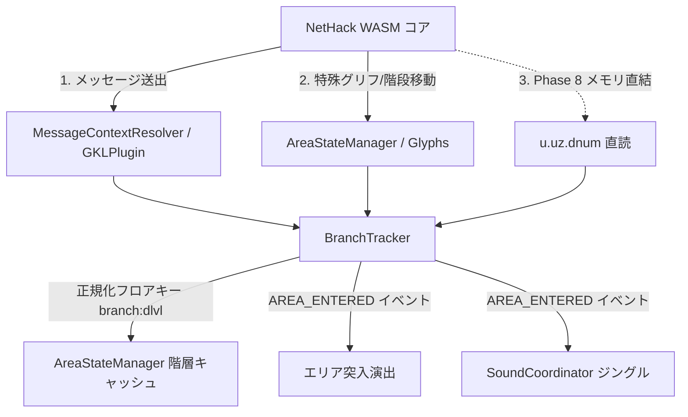

# 🏰 GKL ブランチ検出・フロアキャッシュ分離 ＆ エリア突入アナウンス演出アーキテクチャ

## 1. 背景と課題

NetHack 5.0 において、ステータス行（Index 20 / `BL_DLEVEL`）の階層表示は `Dlvl:3` のように単なる数値深度のみが出力され、ブランチ名（ダンジョン本流、ノームの鉱山、倉庫番等）が含まれません。
これにより、以下の課題と発展の機会が存在します：

1. **同一度数（Dlvl）重複によるキャッシュ混同（ゴースト階段・地形混線リスク）**:
   - 例えばダンジョン本流の地下3階（`Dlvl:3`）と、ノームの鉱山の地下3階（`Dlvl:3`）が同じキーとして扱われると、階段キャッシュや地形記憶が混ざり合い、再訪時やマップ復元時に不整合を引き起こすリスクがあります。
2. **現代的RPG体験・探索没入感の欠如**:
   - 近年のアクションRPG（ダークソウル、エルデンリング等）やローグライク作品では、新エリアや特殊フロアへの到達時に「**ノームの鉱山 (The Gnomish Mines)**」「**倉庫番 (Sokoban)**」といったエリア名がドラマチックに画面中央へフェードイン表示されるシネマティック演出が標準となっています。
   - NetHack のクラシックな体験を尊重しつつ、WebUI のオーバーレイ技術によってモダンな冒険感を大幅に強化できます。

---

## 2. ブランチ検出メカニズム (3重検出アプローチ)

Cコアのコードを改変せず、以下の3段階のハイブリッド手法で現在フロアのブランチを特定します。



### ① レベル1: メッセージ駆動型判定 (高信頼・決定論的)
NetHack コアがフロア突入時や階段移動時に送出する固有メッセージをフックします：

| 検知パターン (正規表現 / 文字列) | ブランチID (`branchId`) | 表示用日本語名 | 英語名 | 演出スタイル |
| :--- | :--- | :--- | :--- | :--- |
| `Welcome to the Gnomish Mines!` | `mines` | **ノームの鉱山** | The Gnomish Mines | `cave` (鉱山・土埃) |
| `Welcome to the town of Minetown!` / `Welcome to Minetown!` | `minetown` | **ノームの町** | Minetown | `town` (街・石畳) |
| `Welcome to Mine's End!` | `mines_end` | **鉱山の最下層** | Mine's End | `danger` (深紅) |
| `Welcome to Sokoban!` | `sokoban` | **倉庫番** | Sokoban | `puzzle` (知性・青) |
| `Welcome to Fort Ludios!` | `fort_ludios` | **フォート・ルディオス** | Fort Ludios | `gold` (黄金) |
| `Welcome to the Valley of the Dead!` | `valley_of_the_dead` | **死の谷** | Valley of the Dead | `eerie` (紫煙・死霊) |
| `Welcome to Gehennom!` / `Entering Gehennom...` | `gehennom` | **ゲヘナ** | Gehennom | `hell` (火炎・獄炎) |
| `Welcome to Vlad's Tower!` | `vlad_tower` | **ヴラドの塔** | Vlad's Tower | `vampire` (血塗られた塔) |
| `Welcome to the Wizard's Tower!` | `wizard_tower` | **魔法使いの塔** | The Wizard's Tower | `arcane` (秘術) |
| `Astral Plane` | `astral_plane` | **天上界 (アストラル界)** | Astral Plane | `celestial` (神聖) |

※ 本流ダンジョン（`dungeon`）への復帰は、本流側の階段を登った際、またはデフォルト値として判定。

### ② レベル2: 地形・階段トポロジー判定
- ダンジョン本流から鉱山への分岐階段（分岐先情報）をトラッキング。
- 鉱山特有の不規則な岩壁（rough-hewn rock）やソコバン特有の石壁配置パターン（`SpatialPatternEngine` 連携）による補助識別。

### ③ レベル3: Phase 8 (Native Shim) メモリ直結連携 (将来)
- `Phase 8: Native Shim Direct Binding` 稼働後は、プレイヤー構造体 `u.uz.dnum`（ダンジョン番号）および `u.uz.dlevel` を直接参照し、メッセージを待たずに 100% 確実にブランチを即時同定。

---

## 3. GKL 階層キャッシュのブランチ完全分離

### キャッシュキーの設計
`AreaStateManager` および `DungeonTracker` が管理する階層別キャッシュのキーを、従来の数値 `dlvl` から以下のように名前空間分離します：

$$\text{FloorKey} = \text{branchId} + \text{":"} + \text{dlvl}$$

- 例:
  - ダンジョン本流 地下3階: `dungeon:3`
  - ノームの鉱山 地下3階: `mines:3`
  - 倉庫番 1階: `sokoban:1` (ゲーム内部的には Dlvl:6〜9 付近)

### 期待される効果
- 鉱山から本流へ戻った際、あるいは再訪した際に、互いの階段位置や探索済み地形データ（`cell.bottom`、壁、仮床）が上書き衝突する不具合を完全に防止。

---

## 4. エリア突入アナウンス演出 (Visual FX & Sound)

### イベントシグナル仕様
ブランチまたは主要エリアの切り替えを検知した瞬間、GKL から `AREA_ENTERED` イベントを発行します。

```javascript
this.emitFxTrigger({
    type: 'AREA_ENTERED',
    branchId: 'mines',
    title: 'The Gnomish Mines',
    titleJa: 'ノームの鉱山',
    subtitle: 'Dungeon Level 3',
    theme: 'cave', // 'cave' | 'town' | 'puzzle' | 'hell' | 'celestial'
    bannerDurationMs: 4000
});
```

### UI コンポーネント (`<nh-area-banner>`)
- **配置**: メインビューポート（`MainViewportRenderer`）の中央上部（HUD やメッセージログを邪魔しない半透明オーバーレイ）。
- **アニメーション**:
  1. `0.0s - 0.8s`: タイトルテキスト（大フォント・セリフ体・金/銀/ルーン装飾）が緩やかに拡大しながらフェードイン（Blur + Scale Up）。
  2. `0.8s - 3.2s`: 優美に浮遊（Subtle Floating / Letter Spacing 拡大）。
  3. `3.2s - 4.0s`: 左右へ溶け出すようにフェードアウト（Opacity 0 + Blur Out）。
- **テーマ別ビジュアル**:
  - `cave`: 土埃と微細な鉱石スパークエフェクト
  - `hell`: 画面下部に微かな熱気ゆらぎ（Heat Haze）
  - `puzzle`: 青い知性のルーンライン

### 音響演出 (`SoundCoordinator` 連携)
- エリア突入時に、`SoundCoordinator` 経由で短い環境ジングルまたはストリングス音を再生（例: `jingle_area_mines`）。
- Procedural Synth Driver を用いることで、外部音声ファイルゼロでも短調の神秘的な和音を即時シンセサイズ可能。

---

## 5. ロードマップ・実装フェーズ

| フェーズ | スコープ | 主要対象ファイル | 成果物 |
| :--- | :--- | :--- | :--- |
| **Phase 1** | **GKL ブランチ追跡 ＆ キャッシュ分離** | `BranchTracker.js`<br>`AreaStateManager.js`<br>`GKLPlugin.js` | メッセージ解析による `branchId` 判定、`branch:dlvl` キャッシュ分離 |
| **Phase 2** | **エリア突入演出コンポーネント配備** | `AreaBannerComponent.js`<br>`base.css` | 画面中央フェードイン・シネマティックバナー演出 |
| **Phase 3** | **音響ジングル ＆ 冒険手帳連携** | `SoundCoordinator.js`<br>`AdventureLogManager.js` | 新エリア到達ジングル、手帳「発見エリア図鑑」へのアンロック記録 |
