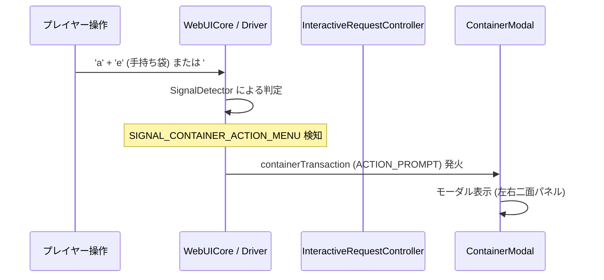
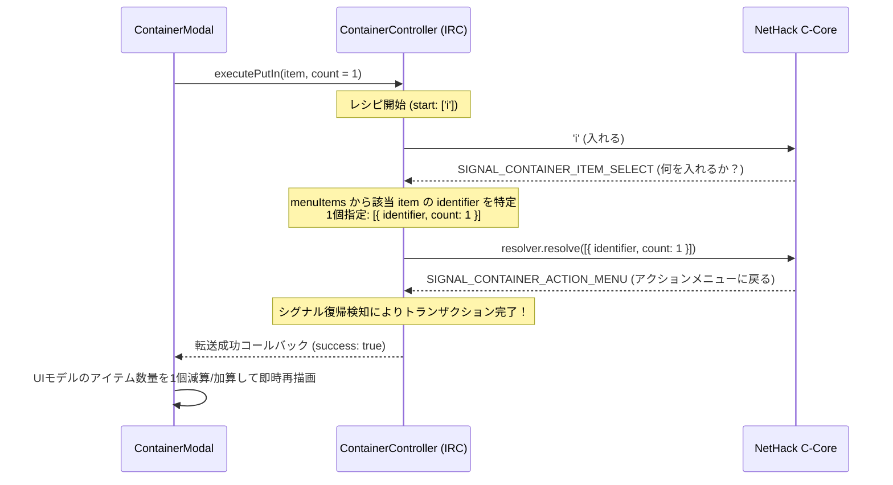
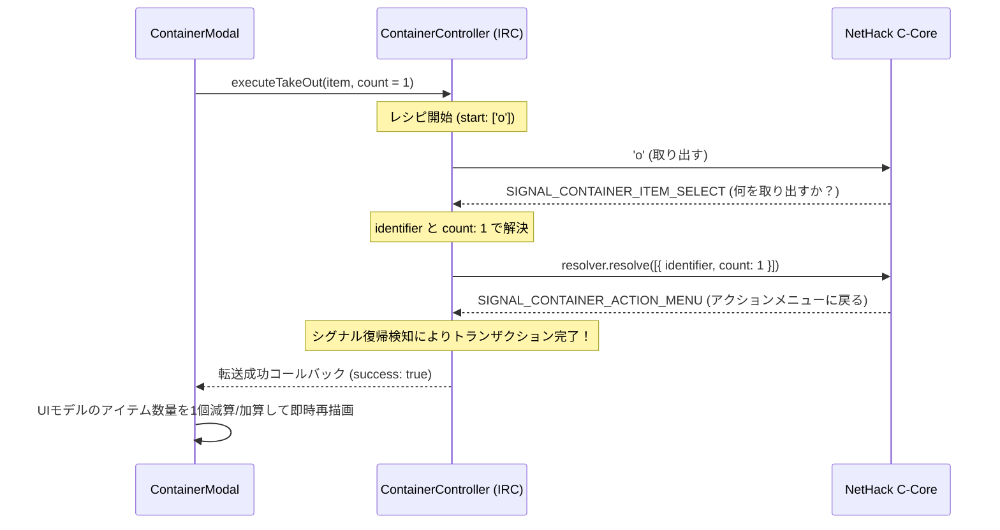
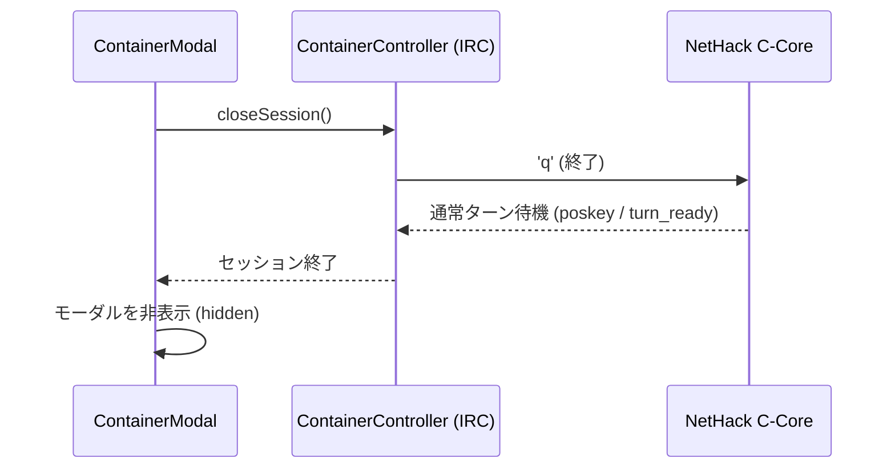

# コンテナ対話・UI 設計仕様書 (IRC & Signal-Driven SSOT)

## 1. 基本方針・設計原則 (Core Philosophy)

1. **裏マクロ同期の完全禁止 (Zero Hidden Macros / No `syncContents`)**:
   - 状態を取得・確定させるために「裏でもう一度コンテナを開けて覗いて閉じる」という旧来のアンチパターンは**完全に禁止・廃止**する。
   - すべての操作（開く、入れる、出す、閉じる）は、**C コアと直接対話する1つの独立した IRC レシピ（トランザクション）** として完結させる。

2. **シグナル駆動のライフサイクル (Signal-Driven Lifecycle)**:
   - 画面の更新・完了確認は、平文メッセージ（"You put... into the sack" 等）の文字列解析に頼らない。
   - C コアが発火するシグナル（`SIGNAL_CONTAINER_ACTION_MENU`, `SIGNAL_CONTAINER_ITEM_SELECT`, `SIGNAL_CONTAINER_FLOOR_SELECT` 等）の遷移そのものをトランザクションの進捗および完了トリガーとする。

3. **C コア メニュー構造体の直接返却 (Direct Binary/Object Resolution)**:
   - キーストローク列（`['2', 'd']` 等）を送信して選択する方式は完全撤廃。
   - C コアの `select_menu` に対して、16バイト境界アラインされた構造体オブジェクト配列（`[{ identifier, count }]`）を直接 resolver に解決させる。

4. **インデックス基準の厳密な1:1選択 (Strict Index-Based UI Selection)**:
   - `undefined === undefined` や `str === str`、`name === name` などの曖昧一致判定を完全に根絶する。
   - UI上の選択状態（`selectedLeftIndex`, `selectedRightIndex`）は、配列のインデックス（`number`）または一意な ID のみで厳密に 1 アイテムのみを追跡する。

---

## 2. コンテナ対話プロトコルとシーケンス (Interaction Protocol)

### 2.1 コンテナの初期オープン (Open Session)

プレイヤーが手持ちの鞄を使う（`apply` -> レター）か、床の箱の上で `#loot` を実行した際の流れ：



- **手持ち袋**: `SIGNAL_CONTAINER_ACTION_MENU`（Do what with your sack?）が届く。
- **床の箱**: 必要に応じて `SIGNAL_DIRECTION`（足元 `.`）や `SIGNAL_CONTAINER_FLOOR_SELECT`（箱の選択）を通過した後、`SIGNAL_CONTAINER_ACTION_MENU` が届く。

---

### 2.2 アイテム投入 (Put In: 1個移動)

プレイヤーが所持品アイテムをクリック／ドラッグしてコンテナへ投入する流れ：



---

### 2.3 アイテム取り出し (Take Out: 1個移動)

プレイヤーがコンテナ内アイテムをクリック／ドラッグして手持ちへ取り出す流れ：



---

### 2.4 コンテナの終了 (Close Session)

プレイヤーが「完了」ボタン、`ESC`、または `q` を押下した際の流れ：



---

## 3. UI（ContainerModal）のデータバインディング仕様

### 3.1 選択状態の管理
- `selectedLeftIndex: number | null` (左パネルで選択中のアイテムインデックス)
- `selectedRightIndex: number | null` (右パネルで選択中のアイテムインデックス)
- 選択スタイル付与ロジック:
  ```javascript
  // 左パネル
  const isSelected = (this.selectedLeftIndex === idx);
  // 右パネル
  const isSelected = (this.selectedRightIndex === idx);
  ```
  - これにより、`undefined === undefined` やプロパティ未定義による全選択の不具合は原理的に発生し得ない。

### 3.2 移動時のローカルデータ更新
- トランザクションが成功（IRC が C コアからのシグナル復帰を確認）した時点で：
  - **投入時**:
    - 左パネル（所持品）: 対象アイテムの `count` を 1 減算。0 になったら配列から除外。
    - 右パネル（コンテナ）: 同一アイテムがあれば `count` を 1 加算。なければ新規追加。
  - **取り出し時**:
    - 右パネル（コンテナ）: 対象アイテムの `count` を 1 減算。0 になったら配列から除外。
    - 左パネル（所持品）: 同一アイテムがあれば `count` を 1 加算。なければ新規追加。
- **裏マクロ（`syncContents`）による再同期は一切行わない。**
