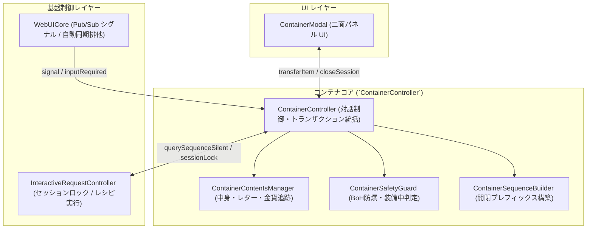
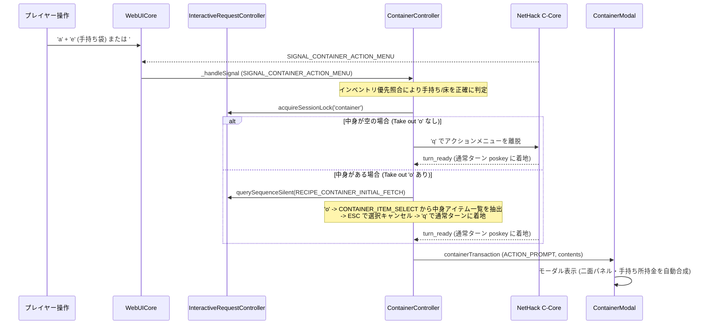
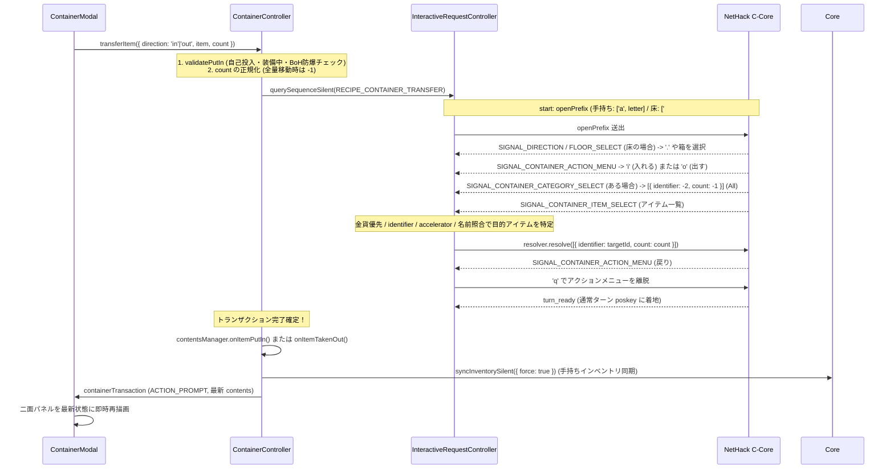
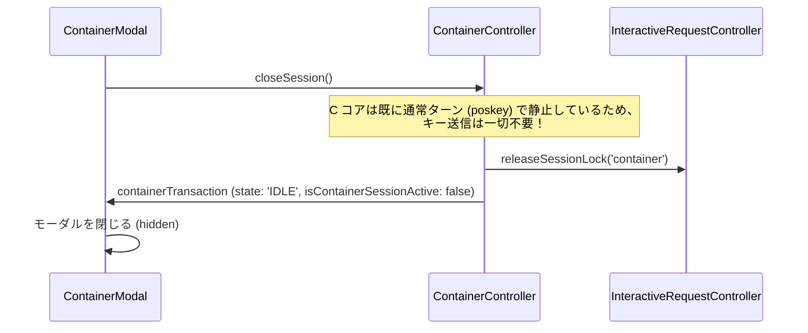

# コンテナ対話・UI 設計仕様書 (IRC & Signal-Driven SSOT)

> [!NOTE]
> **ステータス**: `🟢 implemented` (実装完了・現行仕様)

## 1. 基本方針・設計原則 (Core Philosophy)

1. **裏マクロ同期の完全禁止 (Zero Hidden Macros / No `syncContents`)**:
   - 状態を取得・確定させるために「裏でもう一度コンテナを開けて覗いて閉じる」という旧来のアンチパターンは**完全に禁止・廃止**する。
   - すべての操作（開く、入れる、出す、閉じる）は、**C コアと直接対話する独立した IRC レシピ（トランザクション）** として完結させる。

2. **オンデマンド・アトミック実行（1操作＝1トランザクション）**:
   - コンテナメニューを開いたまま待機するのではなく、モーダル表示中の C コアは**常に安全な通常ターン待機（`poskey` / `turn_ready`）で完全静止**させる。
   - ユーザーが出し入れ操作を行った瞬間のみ、`ContainerController` が `openPrefix`（手持ち: `['a', letter]`、床: `['#', 'loot']`）から始まるアトミックなレシピを一瞬で実行し、アイテム選択後に `q` で脱出して通常ターンに着地させる。
   - これにより、待機中のハングやキー不整合、意図しないターンスキップが原理的に発生しない。

3. **シグナル駆動のライフサイクル (Signal-Driven Lifecycle)**:
   - 画面の更新・完了確認は、平文メッセージ（"You put... into the sack" 等）の文字列解析に頼らない。
   - C コアが発火するシグナル（`SIGNAL_CONTAINER_ACTION_MENU`, `SIGNAL_CONTAINER_ITEM_SELECT`, `SIGNAL_CONTAINER_FLOOR_SELECT` 等）の遷移そのものをトランザクションの進捗および完了トリガーとする。

4. **C コア メニュー構造体の直接返却 (Direct Binary/Object Resolution)**:
   - キーストローク列（`['2', 'd']` 等）を送信して選択する方式は完全撤廃。
   - C コアの `select_menu` に対して、16バイト境界アラインされた構造体オブジェクト配列（`[{ identifier, count }]`）を直接 resolver に解決させる。
   - スタックアイテムの全量移動フラグ（`count: -1`）および数量指定移動を完全サポート。

5. **インデックス基準の厳密な1:1選択 (Strict Index-Based UI Selection)**:
   - `undefined === undefined` や `str === str`、`name === name` などの曖昧一致判定を完全に根絶する。
   - UI上の選択状態（`selectedLeftIndex`, `selectedRightIndex`）は、配列のインデックス（`number`）または一意な ID のみで厳密に 1 アイテムのみを追跡する。

---

## 2. システムアーキテクチャと責任境界 (`ContainerController`)

`src/core/container/ContainerController.js` が中心となり、以下のモジュールと協調して動作します。

### 各モジュールの責務
- **`ContainerController`**:
  - `attach(core)` による WebUICore 購読とシグナル自動検知。
  - IRC 汎用セッションロック（`acquireSessionLock('container')`, `releaseSessionLock('container')`）の取得・解放。
  - 初回アクションメニュー（`handleInitialActionMenu`）のハンドリング。
  - アイテム転送（`transferItem`）のトランザクション実行とローカルモデル・インベントリ同期。
- **`ContainerContentsManager`**:
  - コンテナ内アイテム配列、金貨アイテム（`$`）の追跡、レターの再採番（`reindexLetters`）。
  - アイテム投入（`onItemPutIn`）および取り出し（`onItemTakenOut`）時のスタック数量計算。
- **`ContainerSafetyGuard`**:
  - Bag of Holding (BoH) 防爆ガード（自己投入阻止、魔法の鞄・トリックの鞄等の危険物投入阻止）。
  - 装備中アイテム（武器、防具、矢筒等）の投入ガード。
- **`ContainerSequenceBuilder`**:
  - コンテナの開閉プレフィックス生成。床コンテナは正規化された `['#', 'loot']`、手持ちコンテナは `['a', letter]` を生成。

---

## 3. コンテナ対話プロトコルとシーケンス (Interaction Protocol)

### 3.1 コンテナの初期オープン (Session Initialization)

プレイヤーが手持ちの鞄を使う（`apply` -> レター）か、床の箱の上で `#loot` を実行した際の流れ：

- **コンテナ種別の誤判定防止**:
  - プレイヤーが手持ちの袋やチェストを開けた場合、インベントリ内のアイテム（`onum`, `letter`, `name`）と優先照合。
  - 床の箱と誤判定されて `#loot` プレフィックスが生成される不具合を完全に防止します。
- **床コンテナプレフィックスの正規化**:
  - 床コンテナを開くプレフィックスは末尾の不要な `\r` を排除し `['#', 'loot']` に正規化。C コアが直後の文字を即座キャンセルや Quit コマンドと誤認する問題を解消。

---

### 3.2 アイテム転送 (Put In / Take Out: アトミック実行)

プレイヤーがアイテムの転送ボタン（1個 / 全量 / 任意数）を押下、またはドラッグ＆ドロップした際の流れ：

- **全量移動 (`count: -1`) のサポート**:
  - 複数個スタック（矢、金貨、食料等）の全量移動時、NetHack C コアの仕様である `count: -1` を直接構造体に設定して `select_menu` に渡すため、数量入力プロンプトが挟まることなく一発で全量転送が完結します。
- **排他制御と描画サプレス**:
  - `InteractiveRequestController.isBusy()`（セッションロック中）の間、WebUICore は途中のプロンプト画面描画（`renderer.showPrompt`）をサプレスし、裏での自動サイレント同期も抑止します。

---

### 3.3 コンテナの終了 (Close Session)

プレイヤーが「閉じる」ボタン、`ESC`、または `q` を押下した際の流れ：

- C コアは常に poskey で待機しているため、セッション終了時に余分なキーを送信する必要がなく、安全かつ即座に終了します。

---

## 4. 金貨（Gold Pieces / `$`）の総合仕様

NetHack において金貨は通常のアイテムとは異なる特殊な扱い（インベントリ文字 `$`、クラス `COIN_CLASS`、手持ちステータス `BL_GOLD` 管理）を受けるため、コンテナシステムでは以下の包括的対応を行っています。

### 4.1 金貨の正規アイテム同定
`ContainerContentsManager` および `ContainerController` は、以下の条件で金貨アイテムを正規に認識します：
1. **メニュー項目メタデータ**:
   - `mi.glyph === 3886` または `mi.glyphInfo.glyph === 3886`
   - `mi.accelerator === 36` (ASCII `$`) または `mi.charStr === '$'`
2. **テキストパターン判定**:
   - `/(?:gold\s+pieces?|pieces?\s+of\s+gold|zorkmids?|枚の金貨|^金貨$)/i`
3. **JNetHack の見出し誤判定対策**:
   - JNetHack において 1枚の金貨は「金貨」と表示されます。旧来のパーサーが見出し行（アイテムカテゴリ）と誤認して除外していた問題を解消し、単数金貨（`count: 1`, `isGold: true`）として正しくパースします。

### 4.2 NetHack 標準に準拠した最上部ソート順 (`reindexLetters`)
NetHack の標準インベントリ表示（`flags.inv_order`）において、金貨は常に先頭に配置されます。
- `ContainerContentsManager.reindexLetters()` は、金貨アイテム（`isGold || letter === '$'`）を手持ち・コンテナ内ともに**配列の最上部（インデックス 0）にソート**します。
- 金貨のレターは常に `'$'`（`accelerator: '$'`）に固定され、それに続く通常アイテムが `'a'...'z'`, `'A'...'Z'` で連続採番されます。

### 4.3 金貨の数量管理（加算・減算追跡）
- **投入時 (`onItemPutIn`)**:
  - コンテナ内に既に金貨が存在する場合、二重エントリーを作らず `existing.count += addCount` で合算。表示テキストも `${existing.count} gold pieces` に自動整形。
- **取り出し時 (`onItemTakenOut`)**:
  - 部分取り出しの場合、`existing.count -= takeCount` で減算。全量取り出し（または残数 0）で配列から削除。

### 4.4 手持ち所持金（Status gold）の UI 合成表示
NetHack では手持ちの金貨は通常インベントリ（`'i'`）の一覧には現れず、ステータス（`BL_GOLD`）として保持されます。
- `ContainerModal` は、プレイヤーの手持ち所持金（`core.getStatus()?.gold?.amount`）が 1 枚以上ある場合、左パネル（手持ちアイテム一覧）の最上部（インデックス 0）に**レター `$` の金貨アイテムを自動合成して描画**します。
- これにより、プレイヤーは手持ちの所持金を通常のアイテムと全く同じ感覚でコンテナ内へ投入（1個 / 全量 / 任意数）できます。

---

## 5. UI（ContainerModal）の操作・データバインディング仕様

### 5.1 左右二面パネルの構成
- **左パネル（Player Inventory）**:
  - プレイヤーの所持品一覧。最上部に手持ち所持金（Status gold）が自動合成される。
  - 装備中のアイテム（`E`, `W` 等のバッジ表示）や BoH 危険アイテム（防爆アイコン表示）は投入ボタンが無効化される。
- **右パネル（Container Contents）**:
  - コンテナ内アイテム一覧。金貨があれば最上部に表示。

### 5.2 厳密なインデックス選択管理
- `selectedLeftIndex: number | null`
- `selectedRightIndex: number | null`
- プロパティ値の曖昧一致（`name === name` 等）を完全撤廃し、選択中アイテムは配列インデックスのみで 1:1 に追跡されます。

### 5.3 移動操作インターフェース
各パネルのアイテムごとに以下の操作を提供：
1. **「1個」ボタン**: `count: 1` で即時転送。
2. **「全量」ボタン**: `count: -1` でスタックを即時全量転送。
3. **「数量」ボタン**: プロンプトで指定した個数を転送。
4. **ドラッグ＆ドロップ**: 反対側パネルへドロップして全量転送。

---

## 6. 失敗の経緯とアンチパターン集 (Lessons Learned & Anti-Patterns)

本仕様に到達する過程で、多くの試行錯誤と重大な破綻（デッドロック、状態不整合、暴走）を経験しました。将来の機能拡張やリファクタリングにおいて、**「もっと簡単にできるのではないか？」という安易な先祖返り・デグレを構造的に防ぐため**、実際に踏み抜いた失敗の経緯と理由をここに記録します。

### 6.1 アンチパターン①: 裏マクロ同期 (`syncContents`) による二重開閉の破綻
- **試みたアプローチ**:
  アイテムをコンテナに出し入れした後、最新の正確な中身を C コアから再取得するために、裏でサイレントに鞄をもう一度開き直して中身一覧を抽出し、閉じるマクロ（`syncContents`）を走らせた。
- **実際に発生した破綻**:
  1. NetHack C コアは、コンテナの開閉によって時間経過やトラップ判定、モンスターの割り込み等の内部イベントが発生することがある。
  2. 非同期通信のタイミングのわずかなズレにより、前の出し入れトランザクションの完了キーと裏開閉マクロの初動キーが衝突。
  3. 「閉じるキー（`q` / `ESC`）」が過剰に送られて通常ターンの行動を誤爆したり、逆に足りずにメニュー状態で放置されて、ゲーム全体がハング（デッドロック）した。
- **得られた教訓とベストプラクティス**:
  **裏マクロ同期は完全禁止**。トランザクション成功時に C コアが正常にシグナルを返した時点で、ローカルモデル（`ContainerContentsManager`）を数学的に即座更新する（アイテム加算・減算）。C コアを余分に二重開閉させてはならない。

### 6.2 アンチパターン②: メニュー待機モードによる状態乖離とハング
- **試みたアプローチ**:
  モーダル表示中、C コアのアクションメニュー（"Do what with your sack/chest?"）を開いたまま待機させ、ユーザーがボタンを押すたびに `i`（入れる）や `o`（出す）を送信して連続対話しようとした。
- **実際に発生した破綻**:
  1. C コアがメニュー待機中であるにもかかわらず、Web UI 側ではユーザーがモーダル外をクリックしたり、ESC を押したり、画面をリサイズ・タブ切り替えすることがある。
  2. このとき、C コアの状態（メニュー階層の深さ）と Web UI 側の状態が完全に乖離する。
  3. モーダルを閉じる際に送信すべき `q` や `ESC` の回数が「現在どのサブメニューにいるか」に依存してしまい、確実に通常ターン（`poskey`）へ復帰させることが原理的に不可能となった。
- **得られた教訓とベストプラクティス**:
  **オンデマンド・アトミック実行（待機中は常に poskey 静止）**。モーダル表示中の C コアは常に安全な通常ターン（`poskey`）で静止させる。ユーザーが出し入れ操作を行った瞬間のみ、`openPrefix` から入って `q` で脱出して必ず `poskey` に着地させる。これにより、待機中に何が起きても安全性が 100% 保証される。

### 6.3 アンチパターン③: 床コンテナ開閉プレフィックス末尾の `\r`（CR）による誤爆・暴走
- **試みたアプローチ**:
  床のコンテナを開くために `#loot` を送信する際、キーバッファに改行として `\r` を付加した（`['#', 'loot\r']` や `['#', 'loot', '\r']`）。
- **実際に発生した破綻**:
  1. NetHack C コアの拡張コマンド入力ルーチン（`get_ext_cmd`）は、入力完了の瞬間に内部で処理を確定する。
  2. 末尾に残った `\r` が直後に発生するプロンプト（方向指定「どの方向？」や足元の箱の選択）に対して「空エンター」または「キャンセル」として先食い消費された。
  3. その結果、C コアは操作を中断した上に、残存していた後続キーが Quit コマンドや不要な移動キーとして誤認識され、ゲームが意図せず終了したりプレイヤーが勝手に歩き出す暴走を引き起こした。
- **得られた教訓とベストプラクティス**:
  **床プレフィックスは `['#', 'loot']` に正規化**する。末尾に `\r` やスペースを付加せず、C コアが要求するプロンプトシグナル（`SIGNAL_DIRECTION` 等）に対して直接ハンドラが `.` を返す。

### 6.4 アンチパターン④: スタックアイテムの数量キー送信によるプロンプト増殖
- **試みたアプローチ**:
  矢や金貨などの複数スタックアイテムを全量移動する際、キーストローク列として数字キーや `a`（すべて）をシミュレート送信しようとした。
- **実際に発生した破綻**:
  1. C コアのバージョンやコンテキストによって「How many? [all]」が挟まる場合と挟まらない場合があり、分岐予測が極めて不安定になる。
  2. キー送信のわずかな遅延で数量プロンプトが脱落し、1個しか移動しなかったり、逆に余分な数字キーが次ターンの移動キーとして暴発した。
- **得られた教訓とベストプラクティス**:
  **NetHack C コア仕様の全量フラグ（`count: -1`）を構造体に直接書き込む**。C コアの `select_menu` は `mi.count` に `-1` が渡されると、追加の数量プロンプトを一切挟まずに一発でスタック全量を処理する。キー入力をシミュレートするのではなく、16バイト境界 C 構造体に直接 `-1` を注入するのが最も堅牢で高速である。

### 6.5 アンチパターン⑤: JNetHack での単数「金貨」のカテゴリ見出し誤認
- **試みたアプローチ**:
  メニュー一覧の行をパースする際、インベントリ選択記号（`letter`）が存在せず、アイテム名だけが書かれている行を「カテゴリ見出し行（Coins, Weapons 等）」と見なして除外した。
- **実際に発生した破綻**:
  1. 英語版 NetHack では単数の金貨は「1 gold piece」や「a gold piece」と数量付きで表記される。
  2. しかし日本語版（JNetHack）では、1枚の金貨が「金貨」とだけ表示される仕様になっていた。
  3. パーサーがこれを「金貨カテゴリのヘッダー見出し行」と誤認して破棄してしまい、手持ちやコンテナに 1 枚だけ金貨がある場合に画面から完全に消失した。
- **得られた教訓とベストプラクティス**:
  **多層優先判定による金貨の確実な救済**。glyph ID `3886`、accelerator `36` (`$`)、およびテキスト正規表現（`/(?:gold\s+pieces?|枚の金貨|^金貨$)/i`）を組み合わせ、単数金貨を正規アイテム（`count: 1`, `isGold: true`）として同定する。

### 6.6 アンチパターン⑥: 床箱と手持ち箱の同定漏れ・手持ちレター汚染による出し入れ不能事故
- **試みたアプローチ**:
  コンテナを開いた際、プロンプトに含まれる名前（`"large box"` 等）を手がかりに、インベントリ内のアイテム一覧から一致するものを検索し、見つかった場合はそのレターを使って手持ちコンテナ（`['a', letter]`）として扱い、見つからなかった場合は床コンテナ（`['#', 'loot']`）として扱うという単純な名前部分一致を用いた。
- **実際に発生した破綻**:
  1. **床箱を開けた際の手持ち誤同定**:
     床にある大型箱（`"Do what with the large box?"`）を開けた際、直前に食料を食べたりアイテムを使用したレター（`lastUsedItemLetter`）が残っていたり、プレイヤーが手持ちインベントリに箱や名前に box を含むアイテムを所持していると、部分一致して「手持ちコンテナ（`isFloor = false`）」と誤判定された。その結果、床の箱であるにもかかわらず手持ちアイテムを開けようとして `['a', letter]` が発行され、出し入れが完全に失敗・タイムアウトした。
  2. **手持ち箱を開けた際の床フォールバック（`#loot` 誤爆）**:
     プレイヤーが手持ちの箱を `a` で開けた際（`"Do what with your large box?"`）、インベントリ内の修飾名（`"an unlocked large box"` や `"大きな箱"` 等）と厳密一致しなかった場合、袋系にあるようなフォールバックが存在しなかったため、`letter: null` のままセッションが開始された。出し入れ時に `letter` がないため床用コマンド `['#', 'loot']` が誤送信され、足元に箱がないため空振りしてタイムアウトした。
- **得られた教訓とベストプラクティス**:
  **NetHack C コアの厳密な命名規則（手持ち＝`"your "`、床＝`"the "`）に基づく多層防壁**:
  1. **手持ち確定**: プロンプトに `"your "` または `"あなたの"` が付く場合は **100% 手持ちコンテナ（`isFloor = false`）**。
  2. **床確定**: `"the "` または `"その"` が付く、あるいは `#loot` コマンド発火時、または "your" の付かない箱名は **100% 床コンテナ（`isFloor = true`）**。
  3. **床コンテナ探索遮断**: 床コンテナ確定時はインベントリ探索を一切行わず、`letter = null` を保証。`lastUsedItemLetter` が残っていても手持ちと誤認させない。
  4. **直前レター妥当性検証**: `lastUsedItemLetter` を採用する際は、そのレターのアイテムがコンテナ種別（鞄・箱）と一致することを必ず検証し、無関係な食料や杖のレターを混入させない。
  5. **単一所持フォールバック**: 手持ちコンテナ確定時、インベントリ内に同種アイテム（袋系または箱系）が1つだけ存在する場合はそれを採用し、`letter` の欠損を完全に防ぐ。

