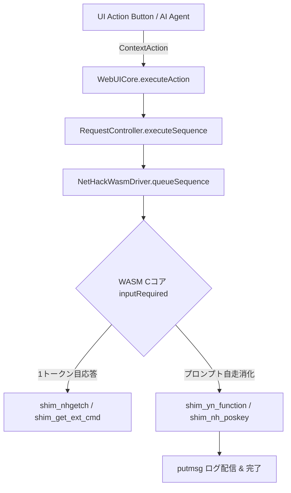

# ContextAction & executeAction API 仕様書

`WebUICore` が提供する文脈依存推奨アクション (`ContextAction`) のデータ構造と、それを自動実行する `core.executeAction(action)` のコマンドフォーマット定義ドキュメントです。

---

## 1. 概要

`WebUICore.prototype.executeAction(action)` は、`ContextActionEngine` またはフロントエンド UI から渡された `ContextAction` オブジェクトを解釈し、`RequestController` および `NetHackWasmDriver.prototype.queueSequence(tokens)` へ送出委託を行う統一ファサード API です。

連続プロンプト（拡張コマンド、方向指定、道具選択等）の自動消化・中間状態モーダルの隠蔽・プロンプトログの配信 (`putmsg`) はすべて低レイヤーの **`NetHackWasmDriver`** が自走管理します。



---

## 2. 役割とレイヤー責務の分離 (SoC)

ContextAction 周辺の処理は、以下の明確な 3 レイヤー構成で分離されています。

| レイヤー | コンポーネント | 責務と扱うデータ |
| :--- | :--- | :--- |
| **UI / 表示層** | UI Button / CSS / Vue / React | 人間用表示 (`label`, `labelJa`, `descriptionJa`, `risk`, `priority`) |
| **GKL 知能解析層** | `ContextActionEngine` / `RequestController` | 文脈判断とトークン配列 (`keySequence: ['#', 'open', 'DIR_E']`) の生成および状態管理 |
| **低レイヤー通信層** | `NetHackWasmDriver` (または WorkerBridge) | WASMプロンプトイベント受動消化・抽象キー (`DIR_*`) 変換・`putmsg` ログ送出 |

---

## 3. ContextAction データ構造 (Schema)

`ContextAction` オブジェクトは以下のプロパティで構成されます。

```typescript
interface ContextAction {
    /** ユニークなアクション識別子 (例: 'ACTION_OPEN_DOOR_N', 'ACTION_UNLOCK_CONTAINER_FEET') */
    id: string;

    /** カテゴリ (INTERACT, COMBAT, ITEM, MOVEMENT 等) */
    category: 'INTERACT' | 'COMBAT' | 'ITEM' | 'MOVEMENT';

    /** 英語表示ラベル (例: 'Open door', 'Unlock container') */
    label: string;

    /** 日本語表示ラベル (例: '扉を開ける (Open)', '箱を解錠 (Apply)') */
    labelJa?: string;

    /** 元キー表現 (例: 'o', 'C-d', '#sit', 'a') */
    key: string;

    /** 連続キー送出シーケンス (例: ['o', 'DIR_E'], ['#', 'open', 'DIR_E'], ['a', 'f', 'DIR_E'], ['C-d', 'DIR_E']) */
    keySequence?: string[];

    /** メイン文字表現 (例: 'o', 'C-d', '#sit') */
    charStr?: string;

    /** 拡張コマンド名 (# を除いた純粋な名称, 例: 'sit', 'chat', 'loot', 'untrap', 'pay', 'pray') */
    extCmd?: string;

    /** 方向キー表現 (例: 'DIR_N', 'DIR_E', 'DIR_SELF') */
    directionKey?: string;

    /** リスクレベル (null: 安全, 'warning': 警告, 'danger': 危険・要確証ダイアログ) */
    risk?: null | 'warning' | 'danger';

    /** UI表示の優先度 (数値が大きいほど上に配置) */
    priority: number;

    /** アクションの対象 ('self', 'feet', 'adjacent', 'inventory') */
    target?: 'self' | 'feet' | 'adjacent' | 'inventory';

    /** 英語説明文 */
    description?: string;

    /** 日本語説明文 */
    descriptionJa?: string;
}
```

---

## 4. コマンドトークン規定と送出パターン

`keySequence` には、WASM Cコアが入力待ちに入った際に受領される **生キー（翻訳前キー）** または **抽象キー** の配列を定義します。

### パターン 1: 単一キーコマンド (Single Key Command)
* **使用例**: 探索 (`['s']`), 階段を下りる (`['>']`), アイテムを拾う (`[',']`)
* **`keySequence`**: `['s']`

### パターン 2: 制御キー付きコマンド (Control Key Command)
* **使用例**: 蹴る (`['C-d', 'DIR_E']`)
* **動作**: `C-d` はドライバー内部で `number_pad` モードに応じて `k` または ASCII 4 (`Ctrl+D`) へ自動変換されます。

### パターン 3: 方向指定付きシーケンスコマンド (Directional Sequence Command)
* **使用例**: 扉を開ける (`['o', 'DIR_E']`), 鍵で解錠 (`['a', 'b', 'DIR_E']`)
* **動作**: 抽象方向キー (`DIR_N`, `DIR_NE`, `DIR_E`, `DIR_SE`, `DIR_S`, `DIR_SW`, `DIR_W`, `DIR_NW`, `DIR_SELF`) はドライバー受領時にキーモード (`numpad` / `vi`) に応じて即時自動変換されます。

### パターン 4: 拡張コマンド (Extended Command Sequence)
* **使用例**: 話しかける (`['#', 'chat', 'DIR_E']`), 扉を開ける (`['#', 'open', 'DIR_E']`), 漁る (`['#', 'loot', 'DIR_SELF']`)
* **動作**: 1トークン目の `'#'` で Cコアが ExtCmd プロンプトへ入り、2トークン目の `'chat'` でコマンド名が返答され、3トークン目の `'DIR_E'` で方向プロンプトが自動消化されます。

---

## 5. UI クライアント側での呼び出し標準

フロントエンド UI（Web UI / モバイル UI）では、推奨アクションボタンの押下時に以下のように `executeAction` を呼び出します。

```javascript
// Recommended Action ボタンクリック時の共通ハンドラー
function handleActionButtonClick(action) {
    if (!action) return;

    // 危険アクションに対する事前安全確認
    if (action.risk === 'danger') {
        const ok = confirm(`【⚠️ 危険な行動】\n"${action.labelJa || action.label}" を実行しますか？`);
        if (!ok) return;
    }

    // executeAction への送出委託
    core.executeAction(action);
}
```

---

## 6. まとめ

- **UI表示データ (翻訳後)**: `labelJa`, `descriptionJa` 等の画面表示専用プロパティ。ドライバー側へは送られず UI レイヤーで利用されます。
- **実行用トークン (翻訳前/生キー)**: `keySequence: ['#', 'open', 'DIR_E']` などの生キー・抽象トークン。ドライバー側で直接自動消化されます。
- **ドライバー自動消化化の成果**: コントローラーや UI 側でのビジーウェイト・タイマー待ちは完全不要となり、シンプルで安全な受動的自走アーキテクチャが確立されています。
