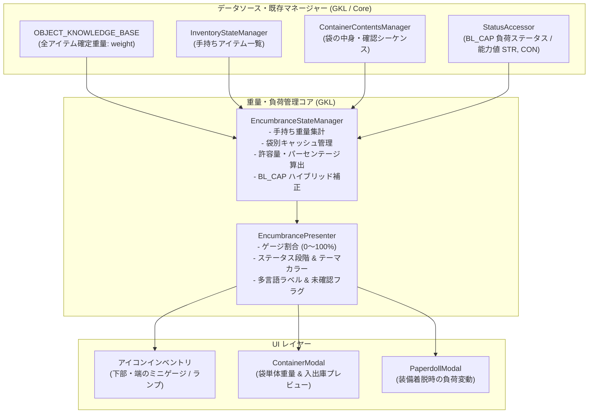
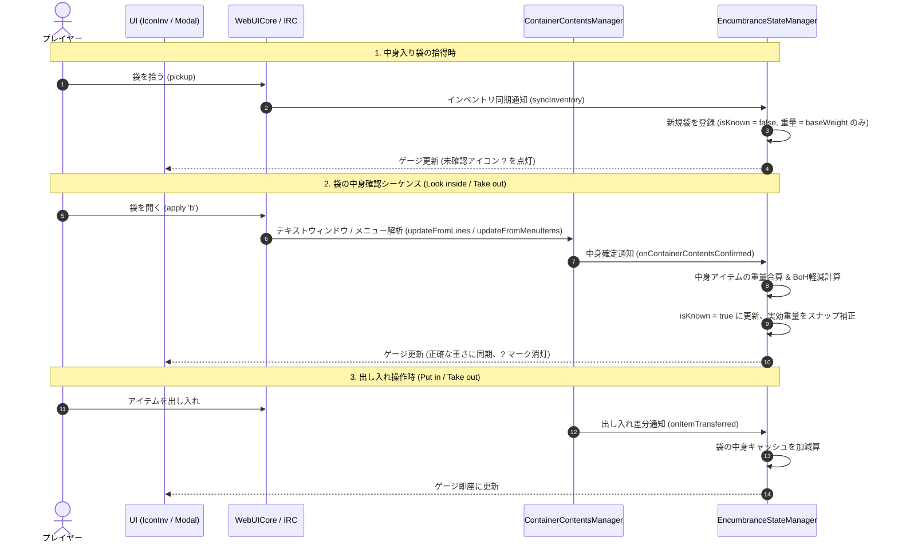

# インベントリ重量・負荷状態管理仕様書 (Encumbrance & Weight Architecture)

## 1. 基本方針・設計原則 (Core Philosophy)

1. **誤差を吸収する「ゲージ・ランプ（状態表示）」中心のUX**:
   - プレイヤーが重量管理に真に求めているのは「1ポンド単位の厳密な数値」ではなく、「あとどれくらい拾えるか」「動けなくなる危険があるか」という**定性的なリスク把握**である。
   - 厳密な数値ではなく、**ゲージ（プログレスバー）や状態ランプ（安全・注意・警戒・危険）**を中心としたUI表現を採用することで、未確認の袋や死体・食べかけ食料等の微小な端数誤差を自然に吸収する。

2. **GKL / Core 主導のステート管理（C コア改変ゼロ・フロントエンド完結）**:
   - NetHack C コアに手を加えることなく、フロントエンドの GKL (Gameplay Knowledge Layer) が既存のナレッジマスターデータ (`OBJECT_KNOWLEDGE_BASE`) やステータス更新 (`StatusAccessor`)、インベントリキャッシュ (`InventoryStateManager`) を統合して状態を算出・管理する。

3. **袋（コンテナ）の中身確認シーケンスによるスナップ確定**:
   - 「中身の入った袋を拾った直後」は、中身が未知（`isKnown = false`）として扱い、袋自体の基本重量のみ（＋未確認バッジ）で計算する。
   - プレイヤーが袋を開く（`apply` → `Look inside` / `Take out`）シーケンスを既存の `ContainerContentsManager` がフックした瞬間に中身アイテム一覧と総重量をスナップ補正（確定）する。

4. **保持の袋（Bag of Holding）の適正補正**:
   - 単純な入出庫前の最大値保持ではなく、保持の袋の状態（祝福: 25%、未呪い: 50%、呪い: 200%）に応じた軽減・増加係数を袋の中身に適用し、「袋に荷物を詰めて軽くなった」という実利をゲージに反映する。

5. **共通サービス / プレゼンター化による複数 UI 横断共有**:
   - アイコンインベントリ、コンテナ UI、ペーパードール UI など、複数の画面で同じ負荷・重量状態を矛盾なく表示するため、計算ロジックを独立したマネージャー（`EncumbranceStateManager`）に集約し、UI 側には軽量な共通コンポーネント/プレゼンターを提供する。

---

## 2. システムアーキテクチャと責務境界



### 各モジュールの責務

- **`EncumbranceStateManager` (GKL Logic)**:
  - 手持ちアイテムの基本重量を合算。
  - 各袋アイテムの中身キャッシュ（`containerCache`）を保持し、袋ごとの実効重量を算出。
  - プレイヤーの許容量（Carrying Capacity）を推定し、現在重量との比率（%）を算出。
  - C コアから送られてくる公式負荷ステータス（`BL_CAP`）と連動し、閾値ズレを補正。

- **`EncumbrancePresenter` (Presentation Helper)**:
  - UI 描画に必要なフォーマット済みデータ（パーセント、カラー、レベル、多言語テキスト）を生成。
  - 共通 UI パーツ（ミニゲージ、バッジ）の HTML / レンダリング関数を提供。

- **各 UI モーダル / コンポーネント (View)**:
  - Presenter から受け取った情報をもとに、画面の一角にゲージやランプを描画。

---

## 3. データ構造と計算モデル

### 3.1. コンテナキャッシュ構造 (`containerCache`)

インベントリ内のコンテナごとに以下の状態を追跡します：

```typescript
interface ContainerWeightRecord {
    letter: string;               // インベントリレター ('b' 等)
    containerType: string;        // 'SACK', 'BAG_OF_HOLDING', 'CHEST' 等
    baseWeight: number;           // 袋自体の重さ (Sack/BoH: 15, Large box: 350 等)
    isKnown: boolean;             // 中身を確認済みか
    bcursed: number;              // 呪われ状態 (-1: 呪い, 0: 未呪い, 1: 祝福)
    items: Array<{                // 中身アイテム
        name: string;
        onum: number;
        count: number;
        weight: number;
    }>;
    contentsRawWeight: number;    // 中身の未補正合計重量
    effectiveWeight: number;      // 補正後の袋全体の総重量
}
```

### 3.2. 重量計算ロジック

1. **通常アイテムの重量**:
   $$\text{weight} = \text{item.weight} \times \text{item.count}$$
   ※ 金貨は $100$ 枚ごとに $1$。

2. **袋（コンテナ）の実効重量**:
   - 中身未確認（`isKnown === false`）の場合：
     $$\text{effectiveWeight} = \text{baseWeight} \quad (\text{未確認マーク付与})$$
   - 中身確認済み（`isKnown === true`）の場合：
     - 通常の袋（Sack, Chest, Box 等）：
       $$\text{effectiveWeight} = \text{baseWeight} + \text{contentsRawWeight}$$
     - 保持の袋（Bag of Holding）：
       - 祝福: $\text{baseWeight} + \lceil \frac{\text{contentsRawWeight}}{4} \rceil$
       - 未呪い: $\text{baseWeight} + \lceil \frac{\text{contentsRawWeight}}{2} \rceil$
       - 呪い: $\text{baseWeight} + (\text{contentsRawWeight} \times 2)$

3. **許容量（Carrying Capacity）とパーセンテージ**:
   - NetHack 内部式に準拠した基本許容量（STR・CON およびレベルより算出）：
     $$\text{capacity} = \text{baseCapacity(STR, CON)}$$
   - ゲージ比率:
     $$\text{ratio} = \min\left(1.0, \frac{\text{totalCurrentWeight}}{\text{capacity}}\right)$$

4. **BL_CAP（公式ステータス）とのハイブリッド連動**:
   - C コアの `BL_CAP` フィールドが `0 (無負担)` 以外の値を示した場合は、UI 表示レベルを確定ステータス側へ引き上げ、表示の矛盾を防止する。

| 段階 (Level) | ゲージ目安 | BL_CAP ステータス | テーマカラー | 状態名 (Ja / En) |
|---|---|---|---|---|
| **Normal** | 0% 〜 69% | 0 (Unencumbered) | `#3fb950` (緑) | 余裕 (Normal) |
| **Caution** | 70% 〜 99% | 1 (Burdened) | `#d29922` (黄) | 負担 (Burdened) |
| **Danger** | 100% 〜 133% | 2 (Stressed) / 3 (Strained) | `#db6d28` (橙) | 重荷 (Stressed) |
| **Critical** | 134% 〜 | 4 (Overtaxed) / 5 (Overloaded) | `#f85149` (赤) | 超過重 (Overloaded) |

---

## 4. ライフサイクルとシーケンス処理



---

## 5. UI への組み込み設計

### 5.1. アイコンインベントリ
- **配置**: インベントリドロワー / パネルの下部フッター。
- **表示形態**:
  - スリムな横長プログレスバー。
  - 現在の負荷アイコン（🏃 / 🚶 / 🏋️ / 🚨）＋ パーセンテージ。
  - 未確認の袋が存在する場合はアイコン横に `?` バッジを表示。

### 5.2. コンテナ UI (`ContainerModal`)
- **配置**: コンテナモーダルのヘッダーまたは仕切り部分。
- **表示形態**:
  - 「この袋の重さ: `45`（中身: 12個）」
  - 保持の袋の場合: `[ 魔法効果: 50% 軽減中 ]`
  - アイテム転送時のプレビュー（アイテムを選択した際、袋と手持ちそれぞれのゲージ変化を破線で予告）。

### 5.3. ペーパードール UI (`PaperdollModal`)
- **配置**: アバター足元または装備スロット一覧の下部。
- **表示形態**:
  - 装備中の武具・防具による総合重量と、負荷ゲージ。
  - 重装鎧を着脱した際のリスク変動を直感的に表示。

---

## 6. 段階的実装ロードマップ (Phased Roadmap)

### Phase 1: GKL ロジック層 & 単体テスト
- `src/core/knowledge/EncumbranceStateManager.js` の新設。
- `OBJECT_KNOWLEDGE_BASE` からのアイテム重量引き当て。
- `ContainerContentsManager` との連動フック（確認シーケンス時のスナップ更新）。
- Vitest によるテストケース作成（BoH 軽減計算、出し入れ、未確認袋の挙動、`BL_CAP` 連動）。

### Phase 2: Presenter & 共通 UI コンポーネント
- `src/core/knowledge/EncumbrancePresenter.js` の新設。
- HTML/CSS による軽量ミニゲージ・ランプコンポーネント（テーマカラー対応、アニメーション）。

### Phase 3: 各 UI への段階的統合
1. **ステップ 1**: アイコンインベントリ（最も頻繁に目にするメイン画面）。
2. **ステップ 2**: コンテナ UI（出し入れと袋重量の可視化）。
3. **ステップ 3**: ペーパードール UI（装備着脱の戦略性向上）。
