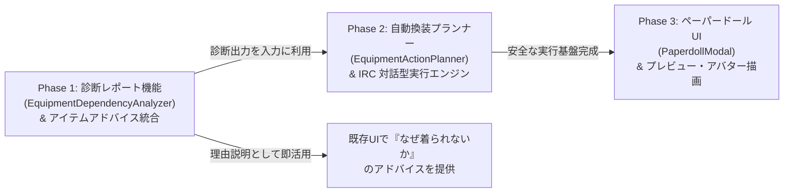

# 装備ペーパードールUI ＆ 依存関係診断・換装プランナー 完全設計仕様書
(Equipment Paperdoll and Dependency Architecture Specification)

## 1. 背景とビジョン

### 1.1 1980年代 CUI 操作からの脱却
NetHack における装備変更は、極めて緻密な内部ルールに縛られた多段階のキーストロークを要求します。
例えば「ハワイアンシャツを着る」という一見単純な操作であっても、プレイヤーは以下の手順を踏む必要があります：
1. `T` を押して外套（Cloak）を脱ぐ。
2. `T` を押して鎧（Suit）を脱ぐ（重鎧の場合、数ターンを消費）。
3. `W` を押してシャツ（Shirt）を着る。
4. `W` を押して鎧を着直す（再び数ターンを消費）。
5. `W` を押して外套を着直す。

途中で手袋をしていれば指輪は嵌められず、両手武器を持っていれば盾は装備できず、理由が明示されないまま `"You can't wear that!"` や `"You are wearing gloves."` と拒絶される仕様は、新規プレイヤーにとって巨大な参入障壁となっています。

### 1.2 目指したい体験
本構想では、Diablo や Baldur's Gate に代表される**「部位スロット（頭・首・外套・鎧・シャツ・主手・副手・左右指・足・矢筒）を備えた現代的ペーパードールUI」**を実現します。
プレイヤーがスロットにアイテムをドラッグ＆ドロップ（またはタップ）するだけで、裏で必要なキーストロークの依存関係が自動解決され、安全かつ確実に換装が行われる体験を提供します。

---

## 2. 段階的実装ロードマップ（3 フェーズ戦略）

先行する「コンテナUI」の完成・安定化を最優先としつつ、本機能は以下の 3 段階で独立して価値を提供できるように分割設計します。



### フェーズ 1: 依存関係診断レポート機能（最速の Quick-Win）
- UI（GUI画面）を作らずに、純粋なドメインロジックとして `EquipmentDependencyAnalyzer` を作成。
- インベントリと対象アイテムから「ブロッカー（阻害要因）」「所要ターン数」「呪いリスク」を診断するレポートを出力。
- **即時活用**: 既存の `TacticalAdvisor` や `ItemSpecPresenter`、コンテキストメニューに組み込み、「なぜ装備できないのか」「どうすれば装備できるのか」の解説テキストとして提供。
- **検証**: WASM を起動することなく、Vitest 単体テストで 100% のエッジケースを網羅。

### フェーズ 2: 換装プランナー ＆ 対話型実行エンジン
- 診断レポートを元に、最短かつ安全なコマンド列（`ActionRecipe`）を自動生成。
- `InteractiveRequestController (IRC)` と連携し、Cコアとの間でプロンプト同期を取りながら 1 ステップずつ実行。
- 中断（敵の接近・攻撃）時の即時ロールバック（Abort）を実装。

### フェーズ 3: ペーパードール UI の具現化
- 人型アバターとスロットグリッドのモーダル画面（`PaperdollModal`）を構築。
- AC 変動、耐性付与、重量負荷、所要ターンのリアルタイム・プレビュー。
- PC 向けドラッグ＆ドロップ ＋ モバイル向けクイックセレクター。

---

## 3. データモデルと静的ナレッジの設計方針

### 3.1 「全アイテム個別定義」の過剰情報化を回避する
NetHack では「武器」だけでなく「コカトリスの死体」「ツルハシ」「ただの岩」「ワンド」「薬」など、ほぼすべてのアイテムを手（`uwep`）に持つことができます。
全 500 種類以上のアイテムに対して静的ナレッジ（`OBJECT_KNOWLEDGE_BASE`）に個別スロット定義を書き込むと、データの肥大化と保守困難を招きます。

### 3.2 解決策: 「専用スロット（防具・装身具）」と「万能スロット（主手）」の分離
NetHack の C コア仕様（`objects.c`, `objclass.h`）に基づき、**「大分類（oclass）と防具サブ分類（oc_armcat）から適合スロットを導出する軽量リゾルバー」** を設けます。

```javascript
// EquipmentRules.js（わずか数十行の定数定義）

export const ARMOR_LAYERS = {
  // レイヤー値が大きいほど外側（脱ぐときは外側から、着るときは内側から）
  CLOAK: { slot: 'cloak', layer: 3, blockers: [] },
  SUIT:  { slot: 'suit',  layer: 2, blockers: ['cloak'] },
  SHIRT: { slot: 'shirt', layer: 1, blockers: ['cloak', 'suit'] },
};

export const ACCESSORY_RULES = {
  RING:      { slot: 'ring',      blockers: ['gloves'] }, // 手袋をしていると着脱不可
  AMULET:    { slot: 'amulet',    blockers: [] },
  BLINDFOLD: { slot: 'blindfold', blockers: [] },
};
```

#### スロット適合リゾルバー（Pure Function）
```javascript
export function resolveEligibleSlots(item) {
  // 1. 防具（サブタイプから一意に決まる）
  if (item.oclass === ARMOR_CLASS) {
    switch (item.armorType) {
      case 'cloak': return ['cloak'];
      case 'suit':  return ['suit'];
      case 'shirt': return ['shirt'];
      case 'helm':  return ['helm'];
      case 'gloves': return ['gloves'];
      case 'shield': return ['off_hand']; // 盾は副手スロットへ
      case 'boots': return ['boots'];
    }
  }

  // 2. 装身具
  if (item.oclass === RING_CLASS) return ['left_ring', 'right_ring'];
  if (item.oclass === AMULET_CLASS) return ['amulet'];
  if (item.isBlindfoldOrTowel) return ['blindfold'];

  // 3. 矢・弾・投擲（Quiverに入るもの）
  if (item.isAmmunition || item.isThrowable) {
    return ['quiver', 'main_hand'];
  }

  // 4. その他すべてのアイテム（武器、死体、道具、ワンド等）
  // すべて主手スロットで wield 可能
  return ['main_hand'];
}
```

### 3.3 インベントリからの装備状態抽出（Normalized Equipment State）
`InventoryStateManager` の所持品リストから、末尾の着用トークンをパースして単一の装備マップを抽出します。
- `(being worn)`: 鎧、外套、シャツ、兜、手袋、靴、盾
- `(wielded)`: 主手武器
- `(alternate weapon; not wielded)`: 控え武器
- `(at the ready)` または `(in quiver)`: 矢筒
- `(on left hand)`: 左手の指輪
- `(on right hand)`: 右手の指輪

---

## 4. 装備依存関係の自動解決アルゴリズム

### 4.1 診断レポートのデータ構造 (`EquipmentDependencyReport`)

```typescript
interface EquipmentDependencyReport {
  targetItem: { letter: string; name: string; targetSlot: string };
  canExecute: boolean; // 実行可能か（致命的な呪い等の有無）
  
  // 依存ブロッカー（脱ぐ必要があるアイテム）
  blockers: Array<{
    slot: string;
    letter: string;
    name: string;
    actionNeeded: 'take_off' | 'remove' | 'unwield';
    isCursed: boolean;
    estimatedTurns: number;
  }>;

  // 巻き戻し対象（操作完了後に着直すべきアイテム）
  itemsToRewear: Array<{
    slot: string;
    letter: string;
    actionNeeded: 'wear' | 'put_on' | 'wield';
    estimatedTurns: number;
  }>;

  // リスク・セーフティ診断
  risks: {
    totalEstimatedTurns: number;
    isMultiTurn: boolean;
    hasCursedBlocker: boolean;
    targetBucStatus: 'blessed' | 'uncursed' | 'cursed' | 'unknown';
    warnings: string[];
    blockingReason?: string; // canExecute === false の理由
  };
}
```

### 4.2 3層アーマー換装のアルゴリズム例
「シャツを着る（または脱ぐ/交換する）」場合の解決フロー：
1. **ブロッカー探索**:
   - `Cloak` スロットにアイテムがあるか？ → あればブロッカーに追加（`T`）。
   - `Suit` スロットにアイテムがあるか？ → あればブロッカーに追加（`T`）。
2. **呪い判定**:
   - ブロッカーのいずれかが `isCursed === true` の場合、`canExecute = false` とし、理由に「外套/鎧が呪われていて脱げないため、シャツの換装はできません」をセット。
3. **着直しスタック (Rewear Stack)**:
   - 脱がしたアイテムを逆順（LIFO: 先に Suit を着直して、最後に Cloak を着直す）で `itemsToRewear` に登録。
4. **所要ターン数計算**:
   - クローク着脱: 各 1 ターン
   - 鎧着脱: AC や素材に応じた重さ（例: プレートメイル 5 ターン、革鎧 1 ターン）
   - シャツ着脱: 各 1 ターン
   - 合計ターン数を合算。

### 4.3 手袋と指輪の干渉解決
- 対象が「指輪（`left_ring` / `right_ring`）」の場合：
  - `gloves` スロットにアイテムが存在すれば、ブロッカーの先頭に `gloves`（脱ぐ）を追加。
  - 指輪の操作完了後、`gloves` を着直すステップを `itemsToRewear` に追加。
  - 手袋が呪われている場合、`canExecute = false`。

### 4.4 武器・手周りの設計: 「二刀流トグル方式」
- **主手 (Main Hand)**:
  - 武器、死体、ツルハシなどを受け入れる（`w [letter]` を発行）。
  - 空にする場合は `w -` を発行。
  - 両手武器（Two-handed）を装備する場合、現在 `off_hand` に盾があれば「盾を脱ぐ」をブロッカーに登録。
- **副手 (Off Hand)**:
  - **通常モード**: 「盾」スロット（`W` / `T`）。両手武器装備中は配置不可。
  - **二刀流トグル ON モード**: 「左手武器」スロット。
    - 盾を装備していたら自動で脱ぐシーケンスを生成。
    - 片手武器をドラッグすると、`uswapwep` にセット（`x` → `w` → `x` 等）した上で `#twoweapon` を同期。
- **矢筒 (Quiver)**:
  - 矢、ボルト、ロック、投擲武器を受け入れ（`Q` コマンド）。

---

## 5. NetHack 特有の危険に対するセーフティガード

| リスク種別 | ゲーム内現象 | ガード設計 |
| :--- | :--- | :--- |
| **複数ターン消費<br/>(Multi-turn action)** | 重鎧の着脱には 3〜5 ターン消費し、途中で敵に攻撃される。 | **敵感知セーフティ (Hostile Proximity Check)**:<br/>GKLの視界内に覚醒した敵対モンスターがいる場合、赤色警告ダイアログを表示し、明示的承認を要求。 |
| **中断 (Interrupt)** | `nomove` 中に敵の攻撃や物音で着脱が止まる。 | **FSM ロールバック**:<br/>SignalDetector が中断シグナルを検知したら、IRC の後続キーキューを**即座に破棄（Abort）**し、最新インベントリ状態で安全着地。 |
| **呪い確定アイテム** | 呪われたアイテムを着ると自力で脱げなくなる。 | **呪詛アラート**:<br/>赤枠ハイライト ＋ 「呪われています。解呪の巻物等がない限り脱げなくなります」の確認モーダル。 |
| **B/U/C 未確定アイテム** | 呪われた浮遊指輪や目隠しで即死・詰み。 | **安全試着ガード (Safe-Fitting Guard)**:<br/>祭壇ドロップ等で BUC 未確定のアイテムは、装備前に「呪われている可能性があります」と警告確認を挟む（設定でトグル可能）。 |
| **コカトリスの死体<br/>(Rubber Chicken)** | 素手で死体を持つと触れた瞬間に石化即死。 | **死体取り扱いセーフティ**:<br/>手袋未着用、または手袋破損時に死体を wield しようとした場合、赤色ダイアログで強制ブロック。 |

---

## 6. UI/UX・視覚表現設計

### 6.1 ペーパードール・レイアウト
- 中央に人型アバター（種族・性別・職業のグラフィック）。
- 胴体中央は**「レイヤードカード表現」**（手前に外套、少しずらして鎧、その奥にシャツ）を採用し、3層構造の重なり順を視覚的に理解させる。

```
       [ 頭: 兜 ]         [ 目: 目隠し ]         [ 首: アミュレット ]
       
   [ 主手: 長剣 ]      ┌── [ 外套: クローク ] ──┐      [ 副手: 盾 ]
                       │  [ 胴: プレートメイル ] │      □ 二刀流 (#twoweapon)
   [ 控え: 弓 ]        └── [ 肌: シャツ ] ─────┘      
                       
   [ 左指: 指輪 ]            [ 手: 手袋 ]              [ 右指: 指輪 ]
   
       [ 矢筒: 矢 ]          [ 足: ブーツ ]
```

### 6.2 リアルタイム差分プレビュー (Diff Preview)
アイテムをスロットにドラッグ中、またはマウスホバー時に変動を即時プレビュー：
- **AC（アーマークラス）**:
  - 初心者配慮: `AC: 5 → 2 (防御力 +3 改善)` のように、**数値の低下が防御力の向上であることを日本語で明示**。
- **耐性・特性バッジ**:
  - 付与される特性（緑）、喪失する特性（赤）のタグ変化（例: `[反射] +`, `[火耐性] +`）。
- **重量負荷 (Encumbrance)**:
  - 換装後の総重量と負荷レベル（`Unencumbered` → `Burdened` 等）。
- **所要時間**:
  - `換装所要時間: 約 6 ターン`。

### 6.3 デバイス別操作体系
- **PC / マウス**: インベントリ一覧からのドラッグ＆ドロップ。
- **モバイル / タッチ**: スロットをタップすると、そのスロットに装備可能なアイテムだけをフィルタリングした**「クイック装着ボトムシート」**がポップアップ。

---

## 7. 全体アーキテクチャ連携シーケンス

```mermaid
sequenceDiagram
    autonumber
    actor User
    participant UI as PaperdollModal (View)
    participant Analyzer as EquipmentDependencyAnalyzer
    participant Planner as EquipmentActionPlanner
    participant GKL as InventoryStateManager (GKL)
    participant IRC as InteractiveRequestController
    participant Core as WASM C-Core

    User->>UI: シャツをスロットにドロップ
    UI->>Analyzer: analyzeDependency(inventory, targetItem)
    Analyzer->>GKL: 現在の着用状態・BUC取得
    Analyzer-->>UI: 診断レポート (ブロッカー: Cloak, Suit / 7ターン / 警告)
    
    opt リスクあり (ターン消費大 / 未識別 / 敵接近)
        UI->>User: セーフティ確認モーダル表示
        User->>UI: 承認 (OK)
    end

    UI->>Planner: buildActionRecipe(report)
    Planner-->>UI: ActionRecipe (T->b, T->c, W->e, W->c, W->b)
    
    UI->>IRC: executeRecipe(recipe)
    loop 各ステップ実行
        IRC->>Core: キーストローク送信
        Core-->>IRC: ACK (プロンプト検知 / 完了)
        alt 中断発生 (敵の攻撃など)
            Core-->>IRC: Interrupt Detected!
            IRC->>IRC: キュー即座破棄 (Abort)
            break
        end
    end
    IRC-->>UI: 完了 or 中断通知
    GKL-->>UI: 最新の装備状態で再描画
```

---

## 8. テスト検証計画 (Vitest / TDD)

Phase 1 における `EquipmentDependencyAnalyzer` は、以下のマトリクスを網羅する単体テストを作成して品質を担保します。

1. **基本 3 層アーマー換装テスト**:
   - `[Cloak, Suit]` 着用中に `Shirt` を着用 → ブロッカー `[Cloak, Suit]`、着直し `[Suit, Cloak]` が正しく導出されること。
2. **呪詛ブロッカー阻止テスト**:
   - `Cloak` が `cursed` の状態で `Shirt` 着用を試みる → `canExecute === false` となり、理由が正しく格納されること。
3. **手袋と指輪の相互干渉テスト**:
   - `Gloves` 着用中に `Ring` の着脱を試みる → ブロッカーに `Gloves` が含まれ、作業後に着直されること。
   - `Gloves` が `cursed` の場合 → 着脱不能と判定されること。
4. **武器・盾の排他テスト**:
   - 両手武器装備中に `Shield` を装備 → ブロッカーに両手武器が含まれること。
   - `Shield` 装備中に両手武器を装備 → ブロッカーに `Shield` が含まれること。
5. **コカトリス死体セーフティテスト**:
   - 素手（手袋なし）で `corpse (cockatrice)` の wield を試みた場合、致死警告フラグが立つこと。

---

## 9. 関連ドキュメント
- [コンテナUI＆操作プロトコル 完全設計仕様書 (Visual_Container_UI_Architecture_and_Usage_Guide.md)](file:///c:/Users/e3-sh/Documents/GitHub/Nethack-wasm-webUI/docs/3_gkl/Visual_Container_UI_Architecture_and_Usage_Guide.md)
- [TacticalAdvisor 仕様・アーキテクチャ (TacticalAdvisor_Specification_and_Architecture.md)](file:///c:/Users/e3-sh/Documents/GitHub/Nethack-wasm-webUI/docs/3_gkl/TacticalAdvisor_Specification_and_Architecture.md)
- [InteractiveRequestController 仕様・ロードマップ (Interactive_Request_Controller_Architecture_and_Roadmap.md)](file:///c:/Users/e3-sh/Documents/GitHub/Nethack-wasm-webUI/docs/2_client_ui/Interactive_Request_Controller_Architecture_and_Roadmap.md)
