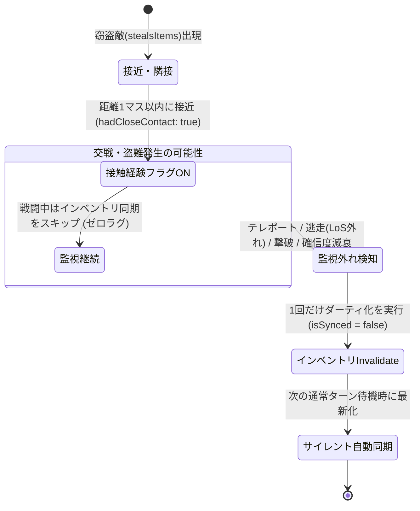

# GKL インベントリ状態同期アーキテクチャ (Inventory Synchronization Architecture)

本文書は、NetHack WASM WebUI の Game Knowledge Layer (GKL) における**所持品（インベントリ）状態の自動同期メカニズム**、**AC変化検知による盗難・装備破壊の即時同期**、および**MonsterTrackerのメンタルマップ減衰モデルと連動したポストコンバット（遅延）同期構想**を記録・定義した仕様設計書である。

---

## 1. 背景と課題

### 1.1 問題の所在
- **移動・待機時のキャッシュ維持**:
  - GKL ではパフォーマンス最適化のため、移動（`h, j, k, l` 等）や待機（`.`, `s` 等）操作を `isNonItemSequence` により「所持品に影響しない操作」として除外し、毎ターンのインベントリクエリ送出を抑止している。
- **敵ターンで発生する盗難・アイテム喪失**:
  - ニンフ（所持品盗難）、レプラコーン（ゴールド盗難）、猿（軽量アイテム盗難）などのモンスターは、プレイヤーが移動・待機したターンにアイテムを奪う。
  - プレイヤー視点では移動しただけであるためキャッシュが有効（`isSynced = true`）のまま残り、同期するまでアイテム喪失に気が付けない問題が発生していた。

### 1.2 設計方針
1. **WASM/Cコア非依存（No-C-Hack）**:
   - Cコアの改修（WASMリビルド）や内部メモリポインタの直接参照を行わず、フロントエンド（JS/TS）層で完結する。
2. **メッセージパース非依存（Zero-Message-Dependency）**:
   - 多言語対応や翻訳揺れ・設定によるメッセージ抑止に影響されない、堅牢なステータス・ゲーム空間の状態遷移をトリガーとする。
3. **ゼロラグ・非ターン消費の徹底**:
   - 戦闘中に毎ターン不要なサイレントクエリを乱発せず、テンポとレスポンスを100%維持する。

---

## 2. 採用された同期アーキテクチャ (Phase 1)

### 2.1 AC（アーマークラス: `BL_AC = 14`）変化検知トリガー
モンスターによる防具・装身具の盗難、装備破壊、酸による腐食、脱衣等の発生時、NetHack は即座に `status_update`（フィールド 14 / `BL_AC`）を発火する。

- **処理フロー**:
  1. `GKLPlugin` の `status_update` リスナーにて AC 値の変化（`_prevAc !== newAc`）を監視。
  2. AC が変化した瞬間に `inventoryStateManager.invalidate()` を呼び出し、インベントリをダーティ化（`isSynced = false`）。
  3. 次のトップレベル通常ターン待機時（`isTopLevelTurn`）に既存の安全な `syncPendingStateSilent()` が裏で実行され、インベントリ表示を最新化。
- **2重実行防止の保証**:
  - `invalidate()` はフラグの更新（`this.isSynced = false`）のみを行うため、装備操作（`W` 等）で複数回トリガーされても、実際の同期クエリはターン終了時の **1回のみ** 安全に集約される。

### 2.2 猿系モンスター（`monkey` / `ape`）のナレッジ反映
NetHack 内部コード（`steal.c` 内の `monkey_business` ロジック）に基づき、猿系モンスターの盗み行動特性をナレッジに反映。

- **仕様**:
  - 呪われておらず、猿の所持重量制限（`can_carry`）に収まり、脱衣時間の不要な軽量アイテム（カメラ、食料、ツール、巻物、ポーション等）を盗んで持ち逃げする。
- **反映**:
  - [`MONSTER_KNOWLEDGE_FULL.js`](file:///c:/Users/e3-sh/Documents/GitHub/Nethack-wasm-webUI/src/core/knowledge/MONSTER_KNOWLEDGE_FULL.js) の `stealsItems` 特性推論および個別戦術アドバイスに `monkey` (233) および `ape` (234) を正式追加。

---

## 3. 将来設計構想: MonsterTracker 連動型ポストコンバット同期 (Phase 2)

消耗品やツールなど、ACが変化しないアイテムの盗難に対しても、メッセージに依存せず空間・時間認知モデルから遅延同期を行う洗練されたアーキテクチャ構想。

### 3.1 状態遷移モデル

### 3.2 詳細ライフサイクルとトリガー条件

1. **隣接・接触経験の記録**:
   - `MonsterTracker.updateVisibleMonster()` において、`monKnowledge.traits.stealsItems === true` を持つモンスターがプレイヤーと距離1マス以内（隣接）に位置した場合、その追跡エントリーに `entry.hadCloseContact = true` をセット。
2. **交戦中（戦闘中）の同期待機**:
   - 戦闘中に毎ターンクエリを投げることはせず、キー入力の即時性を維持。
3. **監視外れ（事態解消）時のディレイ同期トリガー**:
   - 以下のいずれかのイベントによってモンスターが「監視対象から外れた」瞬間に、1回だけインベントリを invalidate する：
     - **テレポート・視界外れ**: ニンフやレプラコーンが盗難直後にテレポートし、`entry.inLoS` が `false` になった時。
     - **逃走・確信度減衰**: 猿が盗難後に逃走し、数ターン経過して確信度が減衰（`NEARBY_UNSEEN` / `DECAYING`）した時。
     - **撃破・消滅**: プレイヤーがモンスターを撃破してエントリーが削除された時。
4. **結果的整合性（Eventual Consistency）の達成**:
   - 戦闘のテンポを一切犠牲にすることなく、盗難が発生した一連の事象が収束したタイミングで自動的に最新の所持品状態へと収束する。
