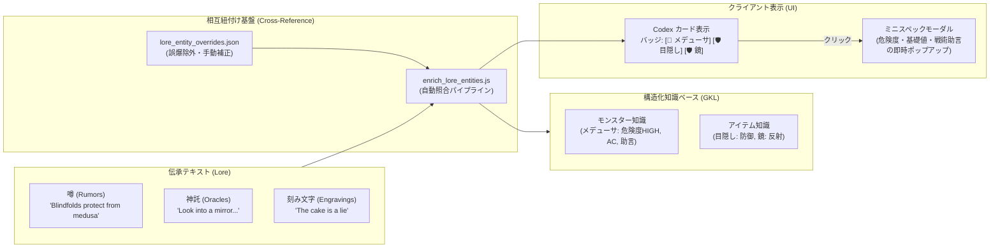

# 📜 伝承知識と構造化データの相互紐付け 仕様書
## Lore & Structured Knowledge Cross-Reference Specification

---

## 📌 1. 目的と概要 (Objective & Overview)

NetHack には、占い師やフォーチュンクッキーから得られる膨大な「噂（Rumors: 750件以上）」、デルフィの神託所（Oracle of Delphi）で授かる「神託（Oracles）」、ダンジョンの床や壁に残された「落書き・刻み文字（Engravings）」といった豊かな伝承（Lore）が存在します。

しかし、従来の LORE システムは単なるテキストコレクション（文字列の収集・閲覧）に留まっており、GKL（Game Knowledge Layer）が誇るモンスター（384体）・アイテム（481種）・アーティファクト等の**構造化知識ベース（Structured Knowledge）**とは切り離されていました。

本仕様は、伝承テキスト内に登場するモンスター・アイテム・アーティファクト等の固有名詞を自動抽出および手動キュレーションによって構造化データと相互に紐付け（Cross-Reference）、**プレイヤーが噂や神託を読むだけで、関連するモンスターの危険度や戦術助言、アイテムの用途や鑑定情報をワンクリックで参照できる統合知識体験**を実現するための設計仕様です。



---

## 📐 2. データモデルとスキーマ (Data Model & Schema)

### 2.1 エンティティ参照スキーマ (`relatedEntities`)
`src/core/lore/data/LoreMasterData.js` 内の各伝承エントリ（`RUMORS`、`ORACLES`）に、以下のスキーマで `relatedEntities` 配列を保持します：

```typescript
interface LoreEntityRef {
    type: 'MONSTER' | 'ITEM' | 'ARTIFACT';
    id: string;          // GKL内の一意なエンティティID (例: 'mon_184', 'obj_240')
    name: string;        // 英語正式名称 (例: 'medusa', 'blindfold', 'mirror')
    nameJa?: string;     // 日本語名称 (例: 'メデューサ', '目隠し', '手鏡')
}

interface LoreEntry {
    id: string;                  // 一意な伝承ID (例: 'rumor_tru_1', 'oracle_9')
    text: string;                // 原文英語テキスト
    translatedText?: string;     // 日本語訳
    category?: string;           // 分類
    relatedEntities: LoreEntityRef[]; // ★関連エンティティリスト
}
```

### 2.2 メタデータ集計 (`LORE_MASTER.metadata`)
データセット全体に以下のメタデータが付与され、テストやツールから整合性を検証可能です：

```json
{
  "enrichedWithEntities": true,
  "rumorsLinkedCount": 312,
  "oraclesLinkedCount": 18,
  "totalEntitiesCount": 450,
  "lastEnriched": "2026-09-24"
}
```

---

## ⚙️ 3. 自動照合パイプラインとキュレーション機構

### 3.1 自動照合スクリプト (`tools/enrich_lore_entities.js`)
1. **エンティティ辞書の構築**:
   - `src/core/knowledge/data/MONSTER_KNOWLEDGE_FULL.js`（384体）および `OBJECT_KNOWLEDGE_FULL.js`（481種）から、英名・日本語名・エイリアスをインデックス化。
2. **単語境界を考慮した正規表現マッチング**:
   - 単純な部分一致ではなく、単語境界（`\b`）と複数形（`s`, `es`, `ies`）に対応した正規表現でテキストをスキャン。
3. **誤爆防止（Stop Words & Minimum Length）**:
   - 短すぎる単語（3文字以下）や、「it」「an」「or」「of」「well」「can」等の一般的な英単語と重複するアイテム・モンスター名を誤検出から除外。
   - 「crystal」単体で反応せず「crystal plate mail」を最長一致で検出。

### 3.2 手動キュレーション機構 (`tools/lore_entity_overrides.json`)
自動抽出の限界（比喩的表現、文脈上の除外、自動照合で拾えない隠れたキーアイテム）を解決するため、外部 JSON によるオーバーライド機構を備えています：

* **`stopWords`**: 特定の単語や、誤検知しやすいモンスター/アイテム名をグローバルに除外。
* **`entityOverrides`**: 特定の伝承IDに対し、強制的に追加するエンティティ（`add`）や、除外するエンティティ（`remove`）を指定。
  ```json
  {
    "oracle_9": {
      "add": [
        { "type": "MONSTER", "id": "mon_medusa", "name": "medusa", "nameJa": "メデューサ" },
        { "type": "ITEM", "id": "obj_blindfold", "name": "blindfold", "nameJa": "目隠し" },
        { "type": "ITEM", "id": "obj_mirror", "name": "mirror", "nameJa": "手鏡" }
      ]
    },
    "rumor_tru_4": {
      "remove": ["mon_squirrel"]
    }
  }
  ```

---

## 🖥️ 4. クライアント UI / UX 実装仕様

### 4.1 ゲーム内 Codex モーダル (`CodexModal.js` ＆ `codex-modal.css`)
プレイヤーが冒険手帳・伝承図鑑（Codex）を開いた際、各カードに関連エンティティバッジが表示されます：

1. **エンティティバッジ表示**:
   - モンスター: `[👾 メデューサ]`（紫/赤基調バッジ）
   - アイテム・アーティファクト: `[🛡️ 目隠し]` `[⚔️ 銀のベル]`（青/金基調バッジ）
2. **クリックによるミニスペック展開 (`showEntitySpec`)**:
   - バッジをクリックすると、画面遷移せずに **ミニスペックポップアップ** がその場で展開。
   - **モンスターの場合**: 危険度（`HIGH`, `INSTAKILL` 等）、基礎ステータス（HD, AC, 速度, MR）、戦術助言（Tactical Advice）を表示。
   - **アイテムの場合**: 種別（TOOL, WEAPON 等）、基準価格、効果概要（Effect Summary）を表示。
   - 既存の `GKLPlugin` / `KnowledgeEngine`（`getMonsterKnowledge`, `getItemKnowledge`）のデータをそのまま活用するため、完全同期・軽量に動作。

### 4.2 伝承キュレーション・インスペクターツール (`tools/lore_codex.html`)
開発者・監修者がブラウザ上で全伝承と紐付け結果を確認・編集できるWebツールです：
* **関連エンティティのリアルタイム表示**: 全750件以上の噂・神託カードに関連バッジを一覧表示。
* **タグ編集モード (Edit Mode)**:
  - ワンクリックでバッジの除外（✕ボタン）。
  - 「＋追加」ボタンから **エンティティピッカーモーダル** を開き、384体のモンスター・481種のアイテムをインクリメンタル検索して即座にタグ追加。
  - 編集結果は `tools/lore_entity_overrides.json` 形式で JSON エクスポート可能。

---

## 🧪 5. テスト・品質保証方針

伝承と構造化データの結合度が高まることに伴い、以下の自動テストを配備しています：

1. **メタデータとスキーマ検証 (`LoreEntityCrossReference.test.js`)**:
   - `LORE_MASTER.metadata` の整合性チェック。
   - 全ての `relatedEntities` が有効な型（`MONSTER` / `ITEM` / `ARTIFACT`）、非空の ID および名称を持つことを保証。
   - 紐付け総数が 400 件以上存在することをチェック。
2. **重要ルールの回帰防止テスト**:
   - `rumor_tru_1`（目隠し）、`rumor_tru_4`（クリスタルプレートメイル）、`rumor_tru_6`（刀とワーム）、`rumor_tru_184`（メデューサと鏡）が正確に紐づき、誤爆がないこと。
   - `oracle_9`（メデューサ戦の攻略）、`oracle_16`（イェンダーの魔除け）、`oracle_17`（3大儀式アイテム: 銀のベル、祈りの燭台、モロクの書）の正確な同定。
3. **UI レンダリングテスト (`CodexModal.test.js`)**:
   - バッジ要素の生成、クリックイベントの発火、ミニスペックモーダルの開閉を DOM レベルで検証。

---

## 📈 6. 今後の展望 (Future Roadmap)

1. **Stage 5.1 との統合**:
   - Phase 5 の Stage 5.1（LOREのGKL配下移設）において、本仕様のエンティティ照合機構を `KnowledgeEngine` 内部のサービスとして完全合流させる。
2. **ゲーム中リアルタイム逆引き (Reverse Cross-Reference)**:
   - ダンジョン内で敵モンスター（例: メデューサ）に遭遇した際、プレイヤーが収集した Codex の中から「そのモンスターに関連する噂や神託」を戦術アドバイザー（`TacticalAdvisor`）が自動で推薦・引用提示する逆引き機能の実装。
