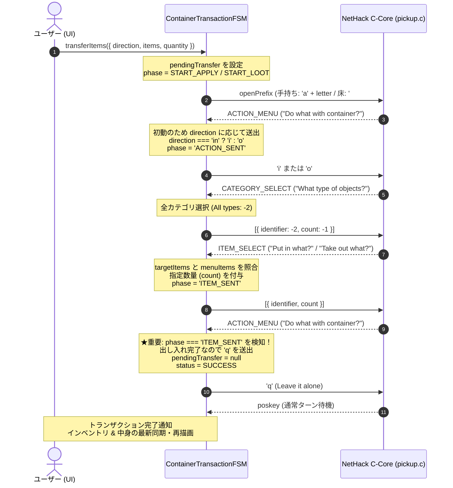

# コンテナUI＆操作プロトコル 完全設計仕様書 (Architecture Specification v3)

## 1. 背景と設計方針の変遷

### 1.1 一括キーシーケンス送信の失敗と教訓
初期のプロトタイプでは、`querySequenceSilent` を用いて `['a', 'f', 'o', 'a', item, '\r']` のような一括キー送信を行っていました。
しかし、以下の致命的な問題が発生しました：
1. **未知のコマンドエラー**: NetHack C コアのメニュー選択 (`select_menu`) は項目選択の時点で即時確定するため、末尾に `'\r'` (Enter) を含めると次のターンで `Unknown command '^M'` として誤爆し、プレイヤーが意図しないアイテムを落としたり投げたりする。
2. **非同期メニュー待機**: C コアの内部状態マシン（`use_container`）はメニューごとの入力待機（`inputRequired`）を行うため、一括シーケンスでは途中のプロンプト（カテゴリ選択メニューや数量確認）と噛み合わず desync を引き起こす。

### 1.2 動的対話型 FSM アーキテクチャの確立
現在のアーキテクチャでは、**動的対話型ステートマシン（`ContainerTransactionFSM`）** を採用しています：
- **初動**: 必要なコンテナオープンコマンド（手持ち鞄: `['a', letter]`、床の箱: `['#', 'loot', '\r', '.']`）のみを C コアに送出。
- **プロンプト駆動**: C コアから届く `inputRequired`（`ACTION_MENU` → `CATEGORY_SELECT` → `ITEM_SELECT` → 完了メニュー復帰）を FSM がリアルタイムに検知し、適切なトークンを自動送出。
- **1操作1ターンで安全着地**: 出し入れ完了後に `'q'` を送信して C コアの `use_container` ループを抜けさせ、通常ターン（`poskey`）へ着地させる。

---

## 2. 全体アーキテクチャとコンポーネント構成

```mermaid
flowchart TD
    subgraph UI_Layer ["UI レイヤー (Client)"]
        CM["ContainerModal (二面パネルGUI)"]
        Qty["数量指定 (Qty Input)"]
        Glyph["アイコン描画 (Glyph / Emoji)"]
        Trans["日本語翻訳 (TranslationEngine)"]
    end

    subgraph Core_Layer ["FSM / 状態管理レイヤー"]
        FSM["ContainerTransactionFSM"]
        CCM["ContainerContentsManager (コンテナ中身 SSOT)"]
        CSB["ContainerSequenceBuilder"]
        CSG["ContainerSafetyGuard (BoH防爆)"]
        ISM["InventoryStateManager (所持品 SSOT)"]
    end

    subgraph Driver_Layer ["Cコア / 実行レイヤー"]
        WASM["NetHack WASM C-Core (pickup.c: use_container)"]
    end

    CM -->|Put In / Take Out 要求| FSM
    Qty -->|指定数量 (-1 = All)| FSM
    FSM -->|初動コマンド| WASM
    WASM -->|inputRequired (プロンプト)| FSM
    FSM -->|自動応答 (i/o, All types, item ID, q)| WASM
    FSM -->|中身差分更新・同期| CCM
    FSM -->|所持品差分更新・同期| ISM
    CCM -->|中身データ| CM
    ISM -->|所持品データ| CM
    Glyph --> CM
    Trans --> CM
```

---

## 3. シーケンス詳細仕様

### 3.1 コンテナオープン・初回中身先読み
ユーザーがコンテナを開いた場合（手持ち鞄への `a` または床の箱への `#loot`）：
1. C コアから `ACTION_MENU`（"Do what with your <container>?" / "The chest is empty. Do what with it?"）が届く。
2. **中身が空の場合**: メニューに `'o'` が存在しないため、即座に中身 0 件と確定し、`'q'` を送って `poskey` に着地。
3. **中身が存在する場合**:
   - FSM は `'o'` (take something out) を自動送出（先読み開始）。
   - C コアから `CATEGORY_SELECT`（"Take out what type of objects?"）が届いたら `'a'` (All types) を自動送出。
   - C コアから `ITEM_SELECT`（"Take out what?" 公式 `select_menu`）が届く。
   - `menuItems` から公式の `accelerator`（`a`, `b`, ...）、`identifier`（ポインタ値）、`str`、`glyph`、`count` を回収して `ContainerContentsManager` に格納。
   - 直ちに `\x1b` (ESC: 27) を送出してメニューをキャンセル。
   - C コアは `use_container` のメインループ（`ACTION_MENU`）に戻るため、`'q'` を送出して `use_container` を抜け、通常ターン（`poskey`）に着地。
4. UI 側に左右二面パネルが表示される。

### 3.2 アイテム転送（投入 Put In / 取り出し Take Out）
ユーザーが UI 上でアイテムをクリックまたはドラッグ＆ドロップした際：



---

## 4. 残存課題と解決策の完全設計

### 4.1 課題1: 床の箱（チェスト）の出し入れ反映不具合
- **原因**:
  - `ITEM_SENT` 後に C コアから戻ってきた `ACTION_MENU` に対し、FSM が `phase` を確認せず再度 `'i'` または `'o'` を送出してしまっていたため、重複送信やループエラーが発生していた。
- **解決策**:
  - `ACTION_MENU` 受信時、`this._pendingTransfer.phase === 'ITEM_SENT'` であれば完了とみなし、直ちに `'q'` を送信して `use_container` を抜け `poskey` に着地させる。
  - `"The chest is empty.  Do what with it?"` のスペース数や改行を許容する正規表現検知を適用する。

### 4.2 課題2: スタックアイテム（複数個アイテム）の数量移動制御
- **問題事象**:
  - 6本のダガーや複数個の食料を移動した際、画面上は全量移動したように見えるが、実際には1個しか移動していない。
- **原因分析**:
  - NetHack C コアの `select_menu` では、数量指定を行わずにアイテムを選択するとデフォルト数量（通常 1 個）が適用される。
  - FSM 側で `selectedResponses` を構築する際、数量指定（`count`）が `-1`（未指定）のまま送られているか、あるいは C コア側で数量プロンプト（`"How many?"`）を要求するモードになっている。
- **解決設計**:
  1. `count` の明示指定:
     - ユーザーが `input-container-qty` で数量（例: `3`）を指定した場合、`count = 3` を送信。
     - 数量指定が空（All）の場合、アイテムの所持数全量（`target.count`）を `count` として送信。
  2. C コアの `count` 受理形式の適合:
     - WebUICore のメニュー応答形式 `{ identifier: id, count: targetCount }` を確実に送信する。
     - もし C コアが数量入力プロンプト（`getlin` 等）を求めてきた場合のハンドリングを FSM に追加。

### 4.3 課題3: 左右ペイン移動時のアイテムレター重複・非更新問題
- **問題事象**:
  - アイテムを左から右（または右から左）へ移動した際、アイテムレターが移動元のまま残ったり、相手側の既存アイテムと同じレターが表示されて重複する。
- **原因分析**:
  - 差分更新（`onItemPutIn`, `onItemTakenOut`）時に、移動先コンテナでの新しいレター（アルファベット）の再採番が行われていない。
  - また、所持品（`InventoryStateManager`）側も C コアの実際のインベントリと同期されず、古いレターのまま残っている。
- **解決設計**:
  1. **コンテナ中身のレター再採番**:
     - `ContainerContentsManager` は、中身アイテム配列のインデックス順に `'a'`, `'b'`, `'c'`... を一意かつ連続して再採番する。
  2. **所持品インベントリの公式再同期**:
     - トランザクション完了（`poskey` 着地時）に、`inventoryStateManager` の最新インベントリ情報（C コア同期データ）をフェッチして画面を再描画する。
  3. **一意キーの徹底**:
     - 左右ペインのレンダリングおよび選択判定において、レターのみに依存せず `identifier` や `onum`、一意の ID を主キーとして使用する。

### 4.4 課題4: アイコン表示＆日本語名表示
- **対応内容**:
  1. **アイコン**:
     - `item.glyphId >= 0` の場合は `core.getGlyphHtml(item.glyphId, { displaySize: 20, tileImage: tileImgPath })` を使用。
     - 未解決時は `getItemSymbol(item)`（⚔️, 🛡️, 🧪, 📜, 🍖 等）をフォールバック表示。
  2. **日本語翻訳**:
     - `core.translate(rawText)` を適用し、所持品名、コンテナ内アイテム名、コンテナ名ヘッダーをすべて日本語化。

---

## 5. 実機検証で判明した構造的問題と再設計仕様 (Architecture Revision v3.1)

実機（NetHack WASM C コア）での動作検証の結果、単体モック環境では顕在化しなかった「C コア内部状態とフロントエンド同期モデルの根本的乖離」による 6 つの深刻な問題が判明した。本章ではその詳細、原因、および今後の再設計方針を規定する。

### 5.1 判明した 6 つの課題と根本原因分析

#### ① 数量指定（All / 数値）が効かず 1 個しか移動しない問題
- **現象**: ALL や特定数値を指定して移動しても C コア側では 1 個しか移動していない。しかし画面上は左から右へ全量移動したように見え、開き直すと 1 個だけ移動している。
- **原因**:
  1. **楽観的 UI 更新（Optimistic Update）の先走り**: GUI 側で C コアの処理結果を待たずに「全量移動した」と仮定してローカル配列を更新している。
  2. **WASM 層への `count` 伝達不良**: C コア（`pickup.c: menu_loot`）は `select_menu` が返す `menu_item.count` を見て数量分割（`splitobj`）を行うが、WebUI の `{ identifier, count }` レスポンスが WASM メモリ上の C 構造体に正しく反映されていないか、あるいは `query_objlist` 側で個別数量プロンプトなしにデフォルト 1 個として処理されている。

#### ② インベントリの状態が「一度移動した後」にしか同期されない（1手遅れバグ）
- **現象**: モーダルを開いた直後のインベントリ表示が過去の状態のままで、何か 1 つアイテムを移動させた後に初めて最新の状態に更新される。
- **原因**:
  - `ContainerModal` は `inventoryStateManager` を参照しているが、NetHack C コアはターン終了時（コンテナを閉じる操作完了時）にしかインベントリ更新イベント（`update_inventory`）を発行しない。
  - FSM 内部のローカル差分更新（`_updateInventoryDiff`）が中途半端なキャッシュを生成し、次のトランザクションで届いた C コア実データによって初めて上書きされるため、常に 1 ターン遅延する。

#### ③ 「入れる（Put In）」操作で全選択されたり誤移動する問題
- **現象**: 右ペイン（コンテナ）へアイテムを入れようとすると、所持品一覧のすべてにチェックが入ったり、意図しないアイテムが移動する。
- **原因**:
  - `menu_loot` で投入する際、C コアは `CATEGORY_SELECT`（"Put in what type of objects?"）→ `ITEM_SELECT`（"Put in what?"）を発行する。
  - FSM の `_handleLootPhaseInput` において、`menuItems` と対象アイテムのマッチングであいまい判定（`item.rawText.includes(target.name)`）を行っているため、名前が類似するアイテムや全選択用ヘッダーテキストに誤合致し、複数のアイテム（または全アイテム）を選択状態として C コアへ返信してしまっている。

#### ④ 床の箱（チェスト等）に物を入れられない問題
- **現象**: 手持ちの鞄と異なり、床に置いてある箱に対して「入れる」操作ができない。
- **原因**:
  - 手持ち鞄は `apply`（`'a'`）で開くが、床の箱は `#loot` で開く。
  - C コア（`pickup.c: use_container`）の仕様として、床の箱は「中身がある場合（`[o]` と `[i]` の選択肢）」と「空箱の場合（`[o]` が出ず自動分岐）」でメニュー構成が異なる。
  - FSM は手持ち鞄と同じ固定シーケンスを想定しているため、C コアの返答プロンプトと噛み合わず即座にメニューが終了してしまう。

#### ⑤ 再同期（Sync）ボタンを押すとハングする（「同期中...」のままフリーズ）
- **現象**: 再同期ボタンを押すと時計アイコン（⏳）のまま応答が返ってこなくなる。
- **原因**:
  - `btnSync` が呼び出す `syncContentsSilent({ force: true })` が、内部で `core.querySequenceSilent`（`[':', 27]` 等）を実行している。
  - WASM コアが通常ターン（`poskey`）待機中にある場合、サイレントクエリの Promise 解決条件（特定プロンプト完了検知）が満たされず、Core の入力キューがデッドロック状態になる。

#### ⑥ アイテムレター同期の構造的齟齬
- **根本的ギャップ**:
  - **所持品（左ペイン）**: NetHack C コア内で一意かつ永続的なインベントリレター（`invlet`: `'a'`〜`'z'`, `'A'`〜`'Z'`）を持つ。
  - **コンテナ中身（右ペイン）**: **C コア内部ではレターを持たない**。単なるオブジェクトの単方向連結リスト（`cobj`）であり、C コアがメニュー（`query_objlist`）を表示するその瞬間に、上から順に一時的に `'a'`, `'b'`, `'c'`... とキーアクセラレータを動的割り当てしているだけである。
- **問題点**: フロントエンド側で「コンテナ内アイテムにも固有のレターが存在する」と誤認してローカル再採番（`reindexLetters`）やレター照合を行おうとしているため、C コア側の動的割り当てと致命的なズレが生じている。

---

### 5.2 再設計方針と基本原則

今後の修正にあたり、以下の設計原則を厳格に適用する：

1. **アイテム同定の完全キー化（`identifier` SSOT）**:
   - あいまいな名前一致（`includes`）やレターによる照合を**全面廃止**する。
   - すべてのアイテム選別は C コアのポインタ値（`identifier`）の完全一致のみで行う。
2. **コンテナ中身レターのローカル永続化の廃止**:
   - 右ペインのレターは単なる UI 表示上のアクセラレータ（行番号相当）とし、状態としては保持しない。
   - C コアとの通信にはレターを使用せず、メニュー選択時のインデックスまたは `identifier` を用いる。
3. **楽観的 UI 更新の撤廃とトランザクション確定同期（悲観的更新）**:
   - UI 側で「移動したはず」と見なして配列を書き換える処理を撤廃する。
   - C コアのトランザクションが完全に完了し、C コアから確定した最新データを受信したときのみ再描画する。
4. **WASM メモリ層への `menu_item.count` 伝達の確立**:
   - Driver / Core 側のメニュー選択ハンドラにおいて、UI から渡された `count` が WASM メモリ上の `menu_item` 構造体に確実に書き込まれるようにシリアライズ層を改修する。
5. **床コンテナの動的プロンプトディスパッチ**:
   - 固定シーケンスを廃止し、C コアから届いた実際のプロンプト（"Do what with the chest?", "Loot which containers?", "Put in what type?"）に応じて動的に次のアクションを決定する。
6. **安全な再同期プロトコルの策定**:
   - デッドロックを引き起こす `querySequenceSilent` を廃止し、正規のオープン＆クローズによる再取得、または安全なインベントリ同期 API を使用する。

---

### 5.3 現在の運用方針：コンテナ改修の一時保留とバイパス（現行状態）

上記 6 つの課題の対症療法によるコード肥大化・デッドロックの泥沼化を防ぐため、**コンテナ専用 FSM の改修作業は現段階で一時保留**とする。

#### 1. コンテナ処理のバイパス措置（現在の動作）
- **設定変更**: [`WebUICore.js`](file:///C:/Users/e3-sh/Documents/GitHub/Nethack-wasm-webUI/src/core/WebUICore.js) において、`enableContainerFSM` のデフォルト値を `false`（明示的に `true` が指定された場合のみ有効）に変更。
- **ゲーム内の挙動**: コンテナを開いた際の自動インターセプト（FSM による先読みやキー横取り）が停止し、**NetHack ネイティブのメニュー操作（通常の NetHack C コア挙動）として動作**する。これにより、ハングや誤移動を気にせず通常のゲームプレイ・動作検証が可能となる。
- **実装資産の温存**:
  - `ContainerModal`（二面パネル GUI、タイル/絵文字アイコン、日本語化、ドラッグ＆ドロップ UI）
  - `ContainerContentsManager`（中身 SSOT）
  - `ContainerTransactionFSM`（動的ディスパッチロジック）
  等のこれまでの実装資産・単体テストコードはすべて保持されており、`options.enableContainerFSM: true` を渡すことでいつでも再有効化・テストが可能である。

#### 2. 今後のロードマップ：WebUICore 汎用 RequestController への昇格
- **課題の本質**:
  低レベル固定配列（`Driver.queueSequence`）と局所的コントローラ（`GKL.RequestController`）の混在により、動的なメニュー待機を伴う対話処理が各所に散らばっていたことが根本原因である。
- **次期アーキテクチャ**:
  `RequestController` の概念を GKL プラグインから **`WebUICore` の基盤機能へと昇格**させ、「プロンプトやメニュータイプに応じた動的分岐が可能な汎用連続リクエストコントローラ」として整備する。
  詳細は [`docs/2_client_ui/Interactive_Request_Controller_Architecture_and_Roadmap.md`](file:///C:/Users/e3-sh/Documents/GitHub/Nethack-wasm-webUI/docs/2_client_ui/Interactive_Request_Controller_Architecture_and_Roadmap.md) を参照。
- **コンテナ再開時の接続**:
  基盤コントローラが完成した段階で、コンテナ操作を「汎用コントローラに渡す小さな宣言的対話レシピ」として接続・再開する。

#### 3. コンテナアーキテクチャの根本刷新指針（入口の正常化とセッションガード）
これまでの「外側からキー入力を盗み聞きして無理やり割り込む方式」を全面廃止し、以下の新パイプラインに刷新する：
1. **正規の入口検知**: `PromptPayloadBuilder` が C コアの `ACTION_MENU` を受けて `inputType: 'CONTAINER'` を発行。複数箱がある場合（"Loot which containers?"）は一般メニューに選ばせ、箱が確定した瞬間に二面パネルを開く。
2. **`containerContext`（同定知識）の引き渡し**: セッション開始時に対象コンテナの完全な情報（手持ちレター、ポインタ、床座標、箱番号等）をセッションへ渡し、セッション内での確実な開け直し（Re-open）を可能にする。
3. **セッション境界ガード**: コンテナセッション中は `PromptPayloadBuilder` の通常プロンプト構築をサプレス（弾く）し、裏表での多重起動やプロンプト混信を 100% 遮断する。
（詳細設計は [`docs/2_client_ui/Interactive_Request_Controller_Architecture_and_Roadmap.md`](file:///C:/Users/e3-sh/Documents/GitHub/Nethack-wasm-webUI/docs/2_client_ui/Interactive_Request_Controller_Architecture_and_Roadmap.md) 第6章を参照）


