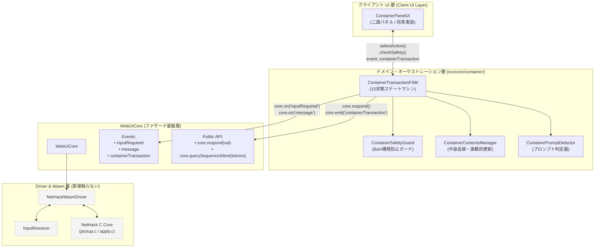
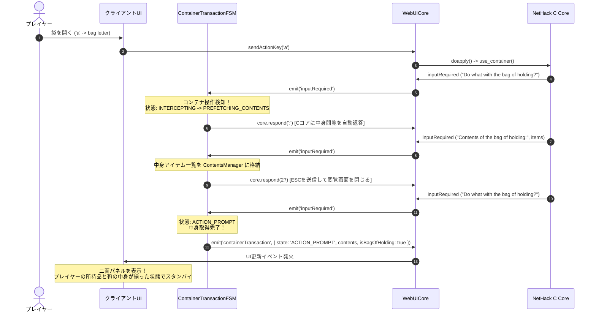

# ⚠️ 【アーカイブ・廃止された旧設計】ビジュアル・コンテナUI 仕様解説書

> [!WARNING]
> **本ドキュメントは過去の検討案（旧設計）であり、現在は廃止（非推奨）されています。**  
> **実装できなかった理由**:  
> 1. **Cコアメニュー滞在前提の破綻**: NetHack の C コア（`pickup.c` / `apply.c`）は、アイテムを1個投入・取り出した時点で `use_container()` を終了し、1ターン消費して通常ターン（`poskey`）に着地します。本旧設計では「モーダル表示中はCコアのメニュー内に居座り続ける」前提であったため、通常ターンに着地するたびに FSM が裏で勝手に `'a'` などを先走り送信してメニューを再開しようとしました。
> 2. **先走り入力の取り残し**: ユーザーが操作を終えずにモーダルを閉じた際、C コア側に入力途中の `'a'`（What do you want to use or apply?）が取り残され、通常画面の操作が破壊される重大な問題が発生しました。
> 3. **非同期プロンプト会話の脆弱性**: `menu_style = FULL` や環境差異によってプロンプトがテキストかメニューかウィンドウかが動的に変化するため、1文字ずつ応答を待つ非同期ステートマシンが途中で詰まり、UI の永久操作ロック（フリーズ）を引き起こしました。
> 
> **決定された新設計**:  
> 「ダイアログ表示中は C コアへ何も送信せず完全静止（待機）させ、ユーザーがアイテムをクリックした時のみ完結したキーシーケンス（開く→入れる/出す→閉じる）を一括実行して即座に静止復帰する」オンデマンド・アトミック実行アーキテクチャを採用しました。  
> 最新の仕様書は `docs/3_gkl/Visual_Container_UI_Architecture_and_Usage_Guide.md` を参照してください。

---

（以下は過去の参考記録として保存された旧仕様本文です）

# ビジュアル・コンテナUI 仕様・アーキテクチャ＆使用方法解説書 (旧案)

本書は、NetHack WebUI における革新機能である**「ビジュアル・コンテナUI（Visual Container UI）」**のフェーズ1基盤（ステートマシン、Cコアプロンプト検出、Bag of Holding爆発防止セーフティ、コンテナ中身マネージャー）の設計思想、アーキテクチャ、内部仕様、およびクライアントUI層からの使用方法をまとめた公式技術解説書です。

---

## 1. 背景と設計思想 (Motivation & Architecture Philosophy)

### 1.1 NetHack のコンテナ操作の課題
NetHack のコンテナ操作（床の箱やチェストに対する `#loot`、または所持している袋・鞄に対する `apply ('a')`）は、C 言語コア（`pickup.c` / `apply.c`）との間で複数回にわたるプロンプト・メニューが連鎖する**マルチステップ・トランザクション**です。

- **単発プロンプトとの違い**: Wish（願い）、Genocide（虐殺）、Polymorph（変化）などは単発の `getlin` プロンプトを横取りするだけで完結しますが、コンテナ操作では：
  1. 「何をするか？」のアクション選択 (`Do what with X?` → `:oibrsnq`)
  2. カテゴリ選択 (`Put in/Take out what type of objects?`)
  3. アイテム複数選択 (`Put in/Take out what?`)
  4. 数量指定 (`How many?`)
  5. アクション選択ループへの再帰
  という不定回数の非同期対話が往復します。
- **致命的事故（Bag of Holding 爆発）**: Bag of Holding（軽量化の鞄/魔法の袋）に打ち消しの杖（Wand of Cancellation）や別の魔法の袋を投入すると、**一瞬で鞄が爆発四散しアイテムが消失・即死級ダメージ**を受けます。

### 1.2 設計思想：Driver直接アクセス禁止と二面パネル構想
本機能は、C コアのクラシックなプロンプトシーケンスをプレイヤーから隠蔽し、現代的な**「二面パネル（プレイヤー所持品 ⇄ コンテナ中身）」**としてグラフィカルに操作できる環境を提供することを目的としています。

この実現にあたり、以下の設計方針を徹底しています：

1. **Driver 直接アクセス禁止の原則**:
   - `ContainerTransactionFSM` は `NetHackWasmDriver` を直接操作せず、必ず **`WebUICore` のファサード層（イベントおよび公開 API）のみ**を介して動作します。
   - レイヤー境界を厳格に保つことで、Wasm Driver の内部実装変更に対する耐性を確保します。
2. **案B（中身自動先読みパイプライン）の採用**:
   - アクション選択プロンプト検知時、直ちに C コアへ `:` (Look inside) を自動発行して中身を取得し、**コンテナの中身が判明した状態で UI に制御を渡す**ことで、プレイヤーが初手から一覧を見渡せる快適性を実現します。
3. **堅牢なセーフティガード（BoH 防爆システム）**:
   - GKL の識別状態（`InventoryStateManager` / `ItemIdentificationResolver`）と連携し、事故を引き起こすアイテムの投入を未然にハードブロックまたは警告します。

---

## 2. システム構成・レイヤー図

---

## 3. コンポーネント別仕様

### 3.1 `ContainerPromptDetector.js` (プロンプト判定器)
C コアが発行した `inputRequired` イベントの生テキスト（`rawPrompt`）を正規表現パターンマッチングし、コンテナ操作のどのフェーズにあるかを瞬時に分類します。

- **検出種別 (`ContainerPromptType`)**:
  - `ACTION_MENU`: アクション選択（`Do what with <container>?` / `<container> is empty. Do what with it?`）
  - `CONTAINER_SELECT`: 複数コンテナ選択（`Loot which containers?`）
  - `CATEGORY_SELECT`: カテゴリ選択（`Take out/Put in what type of objects?`）
  - `ITEM_SELECT`: アイテム選択（`Take out/Put in what?`）
  - `CONTENTS_VIEW`: 中身一覧表示（`Contents of <container>:`）
  - `HELP_TEXT`: ヘルプ（`Container actions:`）
  - `NONE`: コンテナ非関連プロンプト
- **アクションコード特定 (`identifyActionFromMenuItem`)**:
  `in_or_out_menu()` が出力するメニュー項目名（例: `"Look inside the bag"`, `"take something out"`, `"done"`）から、C コアのアクション文字 (`:`, `o`, `i`, `b`, `r`, `s`, `n`, `q`) への逆引き変換を行います。

### 3.2 `ContainerSafetyGuard.js` (BoH 爆発防止セーフティガード)
NetHack C 言語コアの `mbag_explodes()`（`src/pickup.c` L2495-L2514）の仕様に完全準拠した防爆ロジックを提供します。

#### 3層判定アルゴリズム
1. **第1層: onum 確定判定**:
   - `WAN_CANCELLATION` (onum: 263): チャージ残り (`spe > 0`) がある場合は `CRITICAL`（確定爆発・ハードブロック）。チャージ 0 (`spe <= 0`) の場合は `DISCHARGED`（爆発しない・安全）。
   - `BAG_OF_HOLDING` (onum: 346): 別の BoH への投入は `CRITICAL`（確定爆発・ハードブロック）。
   - `BAG_OF_TRICKS` (onum: 345): チャージ残りがある場合は `CRITICAL`。
2. **第2層: テキストフォールバック判定**:
   - onum が取得できない場合、アイテム名称（日英双方）およびチャージ表記 `(0:N)` から危険度を判定。
3. **第3層: 未識別疑義判定**:
   - 未識別の杖（外見名: `"long wand"` 等）や未識別の袋は、打ち消しの杖や魔法の袋の可能性があるため `SUSPICIOUS`（警告）としてフラグ付け。

#### 判定レベル (`DangerLevel`)
| レベル | 状態 | 挙動 |
|---|---|---|
| `SAFE` | 通常アイテム、安全な道具 | そのまま投入許可 |
| `DISCHARGED` | チャージ 0 の打ち消しの杖 / いたずらの袋 | 爆発しないため投入許可 |
| `SUSPICIOUS` | 未識別の杖・未識別の袋 | 警告ダイアログ表示（ユーザー確認） |
| `CRITICAL` | 識別済みの打ち消しの杖(残チャージあり) / BoH | **完全ブロック（投入拒絶）** |

### 3.3 `ContainerContentsManager.js` (コンテナ中身マネージャー)
現在開いているコンテナの状態と中身アイテムのリストを保持・差分更新します。

- **自動コンテナ種別判定 (`ContainerType`)**:
  コンテナ名から `BAG_OF_HOLDING`, `OILSKIN_SACK`, `SACK`, `CHEST`, `LARGE_BOX`, `ICE_BOX`, `UNKNOWN` を自動分類。
- **中身解析 (`updateFromMenuItems`)**:
  `Contents of ...` メニューに渡される `menuItems` をパースし、記号・個数・glyphId・onum を保持。
- **楽観的差分更新 (`onItemPutIn` / `onItemTakenOut`)**:
  アイテムの出し入れ完了メッセージやユーザー操作に基づき、中身リストをリアルタイムに増減。
- **爆発リセット (`onContainerExploded`)**:
  爆発発生時、コンテナ状態を即座に破棄。

### 3.4 `ContainerTransactionFSM.js` (ステートマシン本体)
WebUICore のイベントを購読し、15 の状態でコンテナ操作ライフサイクルをオーケストレーションします。

---

## 4. 自動先読みパイプラインの動作シーケンス (旧案B)

プレイヤーが袋を `apply ('a')` した際の、FSM による内部自動先読みと UI 連携のシーケンスです：

---

## 5. テスト自動化・品質保証

| テストスイート | ファイル | テスト数 | 主なテスト項目 |
|---|---|---|---|
| プロンプト判定器 | `ContainerPromptDetector.test.js` | 27 tests | 英語生プロンプト判定、メニュー項目からのアクション逆引き、空コンテナ検知 |
| セーフティガード | `ContainerSafetyGuard.test.js` | 30 tests | onum 判定、チャージ 0 例外（非爆発）、日英テキスト判定、未識別疑義判定、一括フィルタ |
| 中身マネージャー | `ContainerContentsManager.test.js` | 22 tests | 種別判定、中身メニューパース、楽観的増減更新、爆発リセット、スナップショット不変性 |
| ステートマシン | `ContainerTransactionFSM.test.js` | 36 tests | ライフサイクル、先読み自動消化、アクション選択遷移、複合操作(`b`/`r`)、自動消化転送パイプライン (`transferItems`)、爆発メッセージ検知 |
| 二面パネル UI | `tests/ui/ContainerModal.test.js` | 11 tests | パネル描画、ドラッグ＆ドロップ連携、BoH 危険アイテム投入ハードブロック、未識別アイテム確認警告モーダル、一括移動 |
| 実機シナリオ再生 | `tests/scenarios/realScenarios.test.js` | 1 test (case ⑧) | `sack_food_in_out` (袋への食料投入・取り出し実機キャプチャ) の完全リプレイ検証 |
