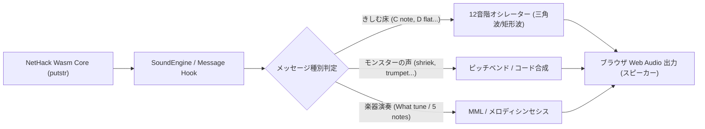

# 動的音程シンセシス構想 (Dynamic Musical & Pitch Synthesis Concept)

> [!NOTE]
> 本ドキュメントは、NetHack のテキストメッセージに含まれる**「音名・音程（Pitch）」「罠の音」「モンスターの鳴き声・咆哮」「楽器演奏」**を検知し、Web Audio API のオシレーター（シンセシス機能）によってリアルタイムに発音・演出する将来構想（アイデア帳・仕様案）です。

---

## 1. 背景とコンセプト

NetHack は数十年にわたるアスキー（テキスト）ベースの伝統を持ちますが、その内部コード（`trap.c`、`sounds.c`、`music.c` など）を紐解くと、**極めて精緻な音響・音階データ**がメッセージテキストとして緻密に埋め込まれています。

これらを単なる文字ログとして流すのではなく、Web Audio API（軽量な数式計算のみで発音、外部MP3/WAVアセット不要）によって**その場でシンセサイズ（合成発音）**することで、プレイヤーの没入感とゲーム体験を飛躍的に高めることができます。



---

## 2. 具体的な演出シーンと音響仕様

### 2.1. 罠の音：きしむ床（Squeaky Board）の「完全12音階」
NetHack の `trap.c:trapnote()` では、きしむ床の罠に**クロマティックスケール（半音階）全12音**が割り振られており、踏んだマスごとに異なる音階が出力されます。

#### 原作メッセージ例
- `A board beneath you squeaks a C note loudly.` （ド）
- `A board beneath you squeaks a D flat loudly.` （レ♭）
- `A board beneath you squeaks an E flat loudly.` （ミ♭）
- `A board beneath you squeaks an F sharp loudly.` （ファ♯）
- `A board beneath you squeaks an A note loudly.` （ラ）
- （遠くの敵が踏んだ時）`You hear a G note squeak in the distance.`

#### シンセシス設計
- **音色**: 短いアタックを持つ三角波（`triangle`）または矩形波（`square`）＋ 指数関数的ディケイ（減衰）。
- **音程マッピング**:
  - `C note` $\rightarrow$ `C4` (261.63 Hz)
  - `D flat` $\rightarrow$ `Db4` (277.18 Hz)
  - `D note` $\rightarrow$ `D4` (293.66 Hz)
  - `E flat` $\rightarrow$ `Eb4` (311.13 Hz)
  - `E note` $\rightarrow$ `E4` (329.63 Hz)
  - `F note` $\rightarrow$ `F4` (349.23 Hz)
  - `F sharp` $\rightarrow$ `F#4` (369.99 Hz)
  - `G note` $\rightarrow$ `G4` (392.00 Hz)
  - `G sharp` $\rightarrow$ `Ab4` (415.30 Hz)
  - `A note` $\rightarrow$ `A4` (440.00 Hz)
  - `B flat` $\rightarrow$ `Bb4` (466.16 Hz)
  - `B note` $\rightarrow$ `B4` (493.88 Hz)
- **距離減衰**:
  - `loudly` / `beneath you`: 通常音量（ゲイン 1.0）
  - `nearby`: やや減衰（ゲイン 0.6）
  - `in the distance`: 低音量 ＋ ローパスフィルタ（ゲイン 0.25）

---

### 2.2. モンスターの声・咆哮（Monster Vocalizations）
NetHack の `sounds.c` に定義されているモンスターの鳴き声・発声アクションです。

| メッセージ | 発生源 | シンセシス音響仕様 |
| :--- | :--- | :--- |
| **`... shrieks.`** / **`They shriek!`** | シュリーカー（叫ぶキノコ）、黄色いカビ | **金切り声（ピッチベンド）**: 高周波（2000Hz $\rightarrow$ 800Hz）の急激な下降ノコギリ波。プレイヤーを警戒させる甲高い警戒音。 |
| **`... trumpets!`** | 象、マンモス、マストドン | **突撃ラッパ（ブラス調）**: ノコギリ波による倍音の豊かな 3 音和音（`C4 + G4 + C5`）。 |
| **`... a low buzzing.`** / **`... an angry drone.`** | 巨大蜂、昆虫 | **羽音（ブザー / ドローン）**: 低周波（110Hz〜150Hz）ノコギリ波 ＋ 12Hz の LFO（振幅変調）による震え。 |
| **`... rattles noisily.`** | スケルトン | **骨のカタカタ音**: 40ms の極短パルスノイズを数回連続トリガー（カタタッ）。 |
| **`... gurgles.`** | 水の悪魔、水棲生物 | **バブリング音**: サイン波 ＋ 高速周波数変調（FM）。 |

---

### 2.3. 楽器の演奏と跳ね橋の合言葉（Instruments & Drawbridge）
NetHack の城（Castle）における跳ね橋ギミック、および各種楽器アイテムの演奏です。

#### 跳ね橋の合言葉曲（Castle Drawbridge）
- `What tune are you playing? [5 notes, A-G]`
- プレイヤーが入力したアルファベット（例: `d e a t h` や `c d e f g`）をその場でパースし、5音のメロディとして順次オシレーター演奏。
- 正解時（ギアが噛み合う音 `... gear turns.`）に開放ファンファーレを合成。

#### 楽器アイテムの演奏
- **木の笛 / 魔法の笛 (`wooden flute` / `magic flute`)**: 柔らかなサイン波/三角波によるアルペジオ。
- **角笛 (`bugle`)**: ファンファーレ（`C4-E4-G4-C5` の軍隊突撃ラッパ）。
- **ドラム (`leather drum` / `drum of earthquake`)**: 低周波サイン波のピッチ降下によるバスドラム（ドンッ！）。

---

## 3. 実装アプローチ案

1. **`SoundEngine.js` 既存機能の活用**:
   - `SoundEngine.js` には既にオシレーター（`sine`, `square`, `sawtooth`, `triangle`）、音階から周波数への変換（`_noteToFreq`）、および MML パーサーが組み込まれているため、追加の巨大ライブラリは不要。
2. **メッセージフックの拡張**:
   - `SoundEngine.rules` に正規表現パターンを追加するだけで対応可能：
   ```javascript
   // 例: きしむ床の音名検知ルール
   {
       id: "trap_squeak_note",
       pattern: "squeaks (?:an? )?([A-G](?: sharp| flat)? note|[A-G](?: sharp| flat)?)",
       dynamicBeep: (match) => {
           const noteName = parseTrapNote(match[1]); // "F sharp" -> "F#4"
           return { notes: [noteName], wave: "triangle", duration: 120 };
       }
   }
   ```
3. **完全な軽量性**:
   - すべてブラウザ標準の Web Audio API によるリアルタイム計算のため、通信量・ファイル容量への負荷はゼロ。

---

## 4. まとめ

本構想は、テキストだけの NetHack に**「音程」という新たな五感の次元**をもたらし、プレイヤーが歩きながら「今踏んだ床はファ♯だった」「遠くで叫び声がした」と耳で状況を把握できる、ユニークかつリッチなゲーム体験を提供します。
