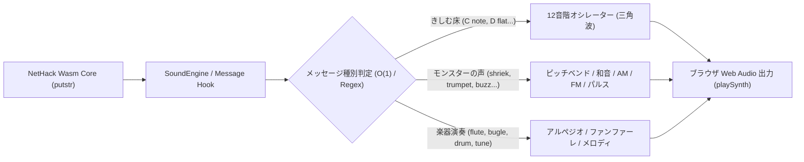

# 動的音程シンセシス仕様 (Dynamic Musical & Pitch Synthesis Living Spec)

> [!NOTE]
> **ステータス**: `✅ implemented` (ROADMAP 2.3 実装完了・Living Spec)  
> 本ドキュメントは、NetHack のテキストメッセージおよび Cソース由来のコンテキストに含まれる**「音名・音程（Pitch）」「罠の音」「モンスターの鳴き声・咆哮」「楽器演奏」「跳ね橋の合言葉」**を検知し、Web Audio API のオシレーター（シンセシス機能）によってリアルタイムに発音・演出する確定仕様です。

---

## 1. 背景とコンセプト

NetHack は数十年にわたるアスキー（テキスト）ベースの伝統を持ちますが、その内部コード（`trap.c`、`sounds.c`、`music.c` など）を紐解くと、**極めて精緻な音響・音階データ**がメッセージテキストとして緻密に埋め込まれています。

これらを単なる文字ログとして流すのではなく、Web Audio API（軽量な数式計算のみで発音、外部MP3/WAVアセット不要・容量ゼロ）によって**その場でシンセサイズ（合成発音）**することで、プレイヤーの没入感とゲーム体験を飛躍的に高めています。

```mermaid
flowchart LR
    A["NetHack Wasm Core (putstr)"] --> B["SoundEngine / Message Hook"]
    B --> C{"メッセージ種別判定 (O(1) / Regex)"}
    C -->|"きしむ床 (C note, D flat...)"| D["12音階オシレーター (三角波)"]
    C -->|"モンスターの声 (shriek, trumpet, buzz...)"| E["ピッチベンド / 和音 / AM / FM / パルス"]
    C -->|"楽器演奏 (flute, bugle, drum, tune)"| F["アルペジオ / ファンファーレ / メロディ"]
    D --> G["ブラウザ Web Audio 出力 (playSynth)"]
    E --> G
    F --> G
```

---

## 2. 実装完了シーンと音響仕様

### 2.1. 罠の音：きしむ床（Squeaky Board）の「完全12音階」
NetHack の `trap.c:squeak_board` では、きしむ床の罠に**クロマティックスケール（半音階）全12音**が割り振られており、踏んだマスごとに異なる音階が出力されます。

#### 原作メッセージ例
- `A board beneath you squeaks a C note loudly.` （ド）
- `A board beneath you squeaks a D flat loudly.` （レ♭）
- `A board beneath you squeaks an E flat loudly.` （ミ♭）
- `A board beneath you squeaks an F sharp loudly.` （ファ♯）
- `A board beneath you squeaks an A note loudly.` （ラ）
- （遠くの敵が踏んだ時）`You hear a G note squeak in the distance.`

#### シンセシス実装仕様 (`trap.c:squeak_board`)
- **音色**: 短いアタックを持つ三角波（`triangle`）＋ 指数関数的ディケイ（減衰）。
- **音程マッピング**:
  - `C note` $\rightarrow$ `C4` (261.63 Hz)
  - `D flat` $\rightarrow$ `Db4` (277.18 Hz)
  - `D note` $\rightarrow$ `D4` (293.66 Hz)
  - `E flat` $\rightarrow$ `Eb4` (311.13 Hz)
  - `E note` $\rightarrow$ `E4` (329.63 Hz)
  - `F note` $\rightarrow$ `F4` (349.23 Hz)
  - `F sharp` $\rightarrow$ `F#4` (369.99 Hz)
  - `G note` $\rightarrow$ `G4` (392.00 Hz)
  - `G sharp` $\rightarrow$ `Ab4` (415.30 Hz)
  - `A note` $\rightarrow$ `A4` (440.00 Hz)
  - `B flat` $\rightarrow$ `Bb4` (466.16 Hz)
  - `B note` $\rightarrow$ `B4` (493.88 Hz)
- **距離減衰**:
  - `loudly` / `beneath you`: 通常音量（ゲイン 1.0）
  - `nearby`: やや減衰（ゲイン 0.6）
  - `in the distance`: 低音量 ＋ ローパスフィルタ（ゲイン 0.3）

---

### 2.2. モンスターの声・咆哮（Monster Vocalizations / `sounds.c`）
NetHack の `sounds.c` に定義されているモンスターの鳴き声・発声アクションです。

| ハンドラID | メッセージ例 / 発生源 | シンセシス音響仕様 (`playSynth`) |
| :--- | :--- | :--- |
| **`sounds.c:shriek`** | `... shrieks.` / `They shriek!`（シュリーカー、黄色いカビ） | **金切り声（ピッチベンド）**: 高周波（2000Hz $\rightarrow$ 800Hz）の急激な下降ノコギリ波（220ms, 指数関数降下）。警戒音。 |
| **`sounds.c:trumpet`** | `... trumpets!`（象、マンモス、マストドン） | **突撃ラッパ（ブラス調和音）**: ノコギリ波による倍音の豊かな 3 音和音（`C4 [261.63Hz] + G4 [392.00Hz] + C5 [523.25Hz]`, 320ms）。 |
| **`sounds.c:buzz`** / **`sounds.c:drone`** | `... buzzes angrily.` / `... drones.`（巨大蜂、昆虫） | **羽音（AM振幅変調）**: 低周波（110〜130Hz）ノコギリ波 ＋ 10〜12Hz の LFO（振幅変調）による激しい震え。 |
| **`sounds.c:rattle`** | `... rattles noisily.`（スケルトン） | **骨のカタカタ音（連続短パルス）**: 35ms の短パルス（矩形波 220Hz）を 45ms 間隔で 4 回連続トリガー（カタタタッ）。 |
| **`sounds.c:gurgle`** | `... gurgles.`（水の悪魔、水棲生物） | **バブリング音（FM周波数変調）**: キャリア 350Hz サイン波 ＋ 24Hz 高速周波数変調（変調深度 160Hz）。気泡音。 |

---

### 2.3. 楽器の演奏と跳ね橋の合言葉（Instruments & Drawbridge / `music.c`）
NetHack の城（Castle）における跳ね橋ギミック、および各種楽器アイテムの演奏です。

| ハンドラID | メッセージ例 / アイテム | シンセシス音響仕様 (`playSynth`) |
| :--- | :--- | :--- |
| **`music.c:flute`** | `... flute trills/toots.` / `produce soft music.`（木の笛、魔法の笛） | **柔らかなアルペジオ（シーケンス）**: 三角波による `C5 ➔ E5 ➔ G5 ➔ C6` 分散和音（各 85ms、計 340ms）。 |
| **`music.c:bugle`** | `loud noise from your bugle.`（角笛） | **軍隊突撃ファンファーレ（シーケンス）**: ノコギリ波による `C4 ➔ E4 ➔ G4 ➔ C5`（各 75ms、最後 180ms、計 405ms）。 |
| **`music.c:drum`** | `heavy, thunderous rolling!` / `beat a deafening row!`（ドラム） | **バスドラム（急速ピッチ降下）**: 低周波サイン波（160Hz $\rightarrow$ 45Hz 急速降下、160ms、打楽器音）。 |
| **`music.c:drawbridge_tune`** | `What tune are you playing? [5 notes, A-G]`（城の跳ね橋） | **5音メロディ順次合成（シーケンス）**: プレイヤー入力の音名（例: `c d e f g` や `death`）を動的パースし、5音の旋律として順次オシレーター演奏。 |

---

## 3. Web Audio API 実装コア (`SoundEngine.js`)

`SoundEngine.js` の `playSynth` は、以下の合成モードをすべてブラウザ標準の Web Audio API（数式計算のみ、外部ライブラリ・アセット不要）でサポートしています：

1. **`type: 'oscillator'`**:
   - `freqEnd` 指定による指数関数/線形ピッチベンド（金切り声、打楽器バスドラム）。
2. **`type: 'chord'`**:
   - 複数オシレーター（`freqs`）の同時発振およびヘッドルームを考慮した自動ゲインスケーリング（突撃ラッパ）。
3. **`type: 'am'`**:
   - キャリアオシレーターのゲインを LFO オシレーターで振幅変調するトレモロ・羽音合成（蜂・昆虫）。
4. **`type: 'fm'`**:
   - キャリアオシレーターの周波数をモジュレータオシレーターで直接変調する FM 合成（水棲生物のバブリング音）。
5. **`type: 'sequence'`**:
   - 音名または周波数配列（`notes`）を時系列に沿ってスケジュールするメロディ・アルペジオ・ファンファーレ合成（フルート、角笛、跳ね橋）。
6. **`type: 'pulses'`**:
   - 極短パルスを指定回数・指定間隔で高速トリガーする打撃・カタカタ音合成（スケルトン）。

---

## 4. 品質保証と完全性

- **非破壊移行**: 既存の通常効果音（MP3/WAV再生、Auto/Wave/Beep/Muteモード）を一切阻害せず、Audio Queue の優先度ソートとスタガード遅延（60ms）によって自然に共存。
- **言語非依存 & 二重フォールバック**: Cソース由来の `messageId` による $O(1)$ 発火を最優先とし、未同定時でも英文正規表現ルールから確実に動的シンセシスが作動。
- **完全自動テスト**: `SoundEngine.test.js` に全ハンドラおよび `playSynth` の実行時検証を配備し、全106スイート・1,298テスト 100% PASS を達成。

