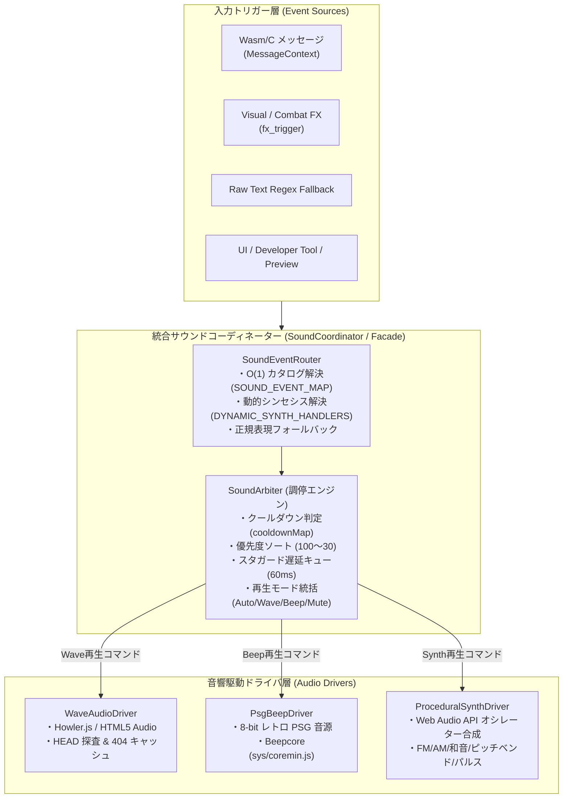
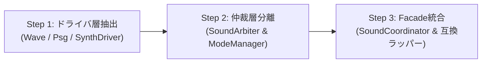

# 🎵 統合サウンドコーディネーター ＆ 音響駆動ドライバ分離構想 (Sound Coordinator & Multi-Driver Architecture)

## 1. 背景と課題意識 (Context & Motivation)

NetHack WASM WebUI の音響システムは、ROADMAP 1.2 Stage 5.4（決定論的SE・Audio Queue）および Stage 5.6（動的音程シンセシス）を経て、音声ファイル再生（Wave）や PSG 風 Beep 音に加え、Web Audio API の数式オシレーター合成（ピッチベンド、和音、AM/FM変調、アルペジオ、短パルス）など複数の発音方式に対応してきました。

しかし、機能の追加に伴い、中核クラスである `SoundEngine.js` に以下の **3つの異なる関心事（責務）** が集中し、コードの肥大化と責務混在が生じています：

1. **入力トリガーの受付・照合責務**:
   - Wasm/C メッセージ（`MessageContext` の `messageId`, `placeholders`）の $O(1)$ 照合
   - Visual FX / Combat FX（`KILL_CONFIRMED`, `ATTACK_HIT`, `DAMAGE_TAKEN`）の購読・受信
   - 英語生テキストに対する正規表現フォールバックマッチング
   - カタログ直接試聴・テストベンチ（`sound_test.html`）からの直接再生要求
2. **調停・仲裁（Arbitration）責務**:
   - 同一・類似音のクールダウン管理（`cooldownMap`）
   - 優先度ソート（Priority 100〜30 による割り込み制御）
   - Audio Queue とスタガード遅延（50〜80ms）による音割れ・同時発振防止
   - 再生モード統括（Auto / Wave / Beep / Mute の判定とフォールバック順序の決定）
3. **物理音響駆動（Driver / Backend）責務**:
   - Waveファイル再生（Howler.js / HTML5 Audio、HEAD探査、404ブラックリスト）
   - レトロ 8-bit PSG 音源（Beepcore、矩形波発振、周波数変換）
   - Web Audio API 多段オシレーター合成（LFO、Gain、変調接続、急激ピッチベンド、和音発振）

### 顕在化した問題点
- **ロジックの漏れ**: カタログ試聴ボタンにおいて動的シンセシスのハンドラ解決が漏れ、無音（Mute同等）になる不具合が発生した。
- **モード判定の重複・分散**: 「いま Mute か」「いま Wave か Beep か」の判定が、キュー投入口・キュー取り出しループ・各再生関数の3箇所に分散していた。
- **拡張の難しさ**: 新しい出力バックエンド（例: WebMIDI音源、チップチューンエミュレータ、立体空間音響）を追加しようとすると、`SoundEngine.js` の基幹コードに直接手を入れる必要があった。

---

## 2. 設計目標とコア原則 (Design Goals & Core Principles)

1. **完全な後方互換性（Non-Breaking API）**:
   - `WebUICore` やクライアントUI、既存のテスト（106スイート・1,300テスト）から見て、外部APIシグネチャ（`processMessageContext`, `handleFxTrigger`, `setSoundMode`, `enqueueSound` 等）は 100% 変更しない。
2. **システム単一窓口（Unified Facade）**:
   - システム全体からは **`SoundCoordinator`（または互換ラッパーとしての `SoundEngine`）** の1つだけが見え、内部の複雑なドライバ群は完全に隠蔽される。
3. **仲裁層と駆動ドライバの完全分離（Arbiter vs Drivers）**:
   - **仲裁層 (`SoundArbiter` / `Coordinator`)**: ゲームロジック、メッセージID、優先度、クールダウン、モード判定に専念。オーディオハードウェアの直接操作は行わない。
   - **駆動ドライバ層 (`AudioDrivers`)**: 音を鳴らすことだけに特化し、ゲームロジックやメッセージIDを一切知らなくてよいステートレス/クリーンな設計とする。
4. **プラガブル・マルチドライバ構成**:
   - ドライバをインターフェース経由で着脱可能とし、ユニットテスト時の完全モック化を容易にする。

---

## 3. アーキテクチャ全体像 (Architecture Overview)



---

## 4. 詳細コンポーネント設計 (Detailed Component Design)

### 4.1 仲裁層: `SoundCoordinator` & `SoundArbiter`

システム外部（WebUICoreやUI）との単一窓口となる Facade クラス。

```javascript
export class SoundCoordinator {
    constructor(options = {}) {
        this.modeManager = new SoundModeManager(options.soundMode || 'auto');
        this.arbiter = new SoundArbiter({
            staggerIntervalMs: options.staggerIntervalMs || 60,
            modeManager: this.modeManager,
            onLogCallback: options.onLogCallback
        });

        // 駆動ドライバの登録
        this.drivers = {
            wave: new WaveAudioDriver({ soundDir: options.soundDir }),
            beep: new PsgBeepDriver(),
            synth: new ProceduralSynthDriver()
        };
        this.arbiter.bindDrivers(this.drivers);
    }

    // --- 既存完全互換 API ---
    processMessageContext(context, fallbackText = '') { ... }
    handleFxTrigger(fx) { ... }
    processLogMessage(text) { ... }
    enqueueSound(ruleOrDef, context = null) { ... }
    setSoundMode(mode) { ... }
    setVolume(vol) { ... }
    unlockAudio() { ... }
}
```

#### `SoundArbiter` の調停アルゴリズム（SSOT）
キューからアイテムを取り出す瞬間に、現在のモード（`Auto`, `Wave`, `Beep`, `Mute`）とアイテム定義（`sound`, `beep`, `synth`）を評価し、どのドライバを呼ぶかを一元的に判定します：

| モード | `rule.sound` (Wave) | `rule.synth` (プロシージャル合成) | `rule.beep` (PSG) | 動作 |
| :--- | :---: | :---: | :---: | :--- |
| **`mute`** | - | - | - | **即座に破棄・消音** (`SKIP_MUTE`) |
| **`wave`** | 存在 | - | - | `WaveDriver.play()` を実行。失敗時は `WARN_WAVE_NOT_FOUND` |
| **`wave`** | なし | 存在 | - | `SynthDriver.play()` を実行（ファイル不在のプロシージャル音） |
| **`beep`** | - | 存在 | - | `SynthDriver.play()` を実行 |
| **`beep`** | - | なし | 存在 | `BeepDriver.play()` を実行 |
| **`auto`** | 存在 | - | - | `WaveDriver.play()` を試行。失敗時は `Synth` / `Beep` へフォールバック |
| **`auto`** | なし | 存在 | - | `SynthDriver.play()` を実行 |
| **`auto`** | なし | なし | 存在 | `BeepDriver.play()` を実行 |

---

### 4.2 駆動ドライバ層: `BaseAudioDriver` と具象ドライバ

各ドライバは、ゲームの文脈を一切持たない純粋なオーディオ再生エンジンです。

```javascript
// 共通ドライバインターフェース
class BaseAudioDriver {
    setVolume(volume) {}
    unlockAudio() {}
    stopAll() {}
}
```

#### ① `WaveAudioDriver`
- **責務**: 音声ファイル（MP3/OGG/WAV）のロード・キャッシュ・再生。
- **機能**:
  - `Howler.js` がグローバルにあれば最優先使用。
  - なければ HTML5 `new Audio()` を使用。
  - `HEAD` 探査による 404 エラー抑止と `failedAssetCache` の自己管理。

#### ② `PsgBeepDriver`
- **責務**: 8-bit レトロ PSG（プログラマブル・サウンド・ジェネレータ）効果音の再生。
- **機能**:
  - `sys/coremin.js` の `Beepcore` があれば PSG 音源モードを使用。
  - なければ Web Audio API の標準矩形波オシレーターにフォールバック。

#### ③ `ProceduralSynthDriver`
- **責務**: Web Audio API による数式オシレーターリアルタイム合成（外部音源ゼロ）。
- **機能**:
  - ROADMAP 2.3 Stage 5.6 で実装された 6 大合成コア（単一波形/ピッチベンド、和音、AM変調、FM変調、シーケンス、パルス）の完全独立モジュール化。
  - ゲームループやメッセージパーサーに一切依存しない、純粋なオーディオグラフ構築。

---

### 4.3 将来拡張: BGM・環境音統括とフロア連動調停 (Ambient, BGM & Floor Adaptation)

調停層（Coordinator）と物理駆動層（Drivers）が分離されることで、将来の BGM や環境音（アンビエント）の導入が極めて自然に行えるようになります：

1. **フロア・ブランチ連動の自動判定**:
   - ゲーム状態（通常ダンジョン、鉱山街、倉庫番、城、ゲヘナ、アストラルプレーン等）に応じて、調停層が適切な環境音やBGMループを判定してドライバへ指示。
   - 音響ドライバ側は「指定された音声を再生・ループする」ことに専念し、ダンジョン仕様を知る必要がありません。
2. **ダッキング制御 (Audio Ducking)**:
   - 死亡音、罠作動、モンスター咆哮、跳ね橋メロディなどの高優先度 SE 発音時に、調停層が一時的に BGM 音量を下げ（ダッキング）、効果音の視認性・明瞭度を保ちます。
3. **SE と BGM の独立ボリューム・モード管理**:
   - `BGM Mute` や `BGM Volume` を個別に調停層で管理し、ユーザー設定（`nh.config`）とスムーズに同期可能となります。

---

## 5. 段階的マイグレーション計画 (Implementation Roadmap)

本リファクタリングは、**既存の全106テストスイート・1,300テストおよび4サンプルクライアントビルドを常時100%維持しながら**、以下の3ステップで安全に進めます：



- **Step 1: ドライバ層の独立パッケージ化 (`src/core/sound/drivers/`)**
  - `WaveAudioDriver.js`, `PsgBeepDriver.js`, `ProceduralSynthDriver.js` を新設。
  - 各ドライバの独立単体テストを作成し、Web Audio モック下での 100% カバレッジを確立。
- **Step 2: 仲裁エンジン (`SoundArbiter.js`) の新設**
  - キュー管理、優先度ソート、スタガード遅延、クールダウン、モード判定を純粋ロジックとして分離。
  - DOM/AudioContext を持たない Headless な単体テストで、全モード遷移と優先度順序を検証。
- **Step 3: `SoundEngine.js` の Facade 化と完全後方互換接続**
  - `SoundEngine.js` を `SoundCoordinator` の薄い委譲ラッパーとして再編。
  - 外部の全呼び出し元（`WebUICore`, `sound_test.html`, `config.html`, 各種テスト）の修正ゼロで 100% PASS を達成。

---

## 6. 完了の定義 (Definition of Done)

1. **アーキテクチャ境界の遵守**:
   - `SoundArbiter` 内に Web Audio API の生ノード（`createOscillator` 等）や `fetch` 呼び出しが 1 行も存在しないこと。
   - 各ドライバ（`WaveAudioDriver` 等）内に `MessageContext` や `messageId` などのゲーム知識が 1 つも存在しないこと。
2. **品質保証**:
   - `src/core/sound/` 配下の単体テストがすべて PASS すること。
   - リポジトリ全テストスイート（106スイート・1,300テスト以上）が 100% PASS すること。
   - 4大サンプルクライアント（Vue, React, Solid, Svelte）のプロダクションビルドが成功すること。
3. **テストベンチ検証**:
   - `tests/sound_test.html` において、モード変更、バースト再生、動的シンセシス試聴、カタログ試聴がすべて正確かつ明瞭に動作すること。
