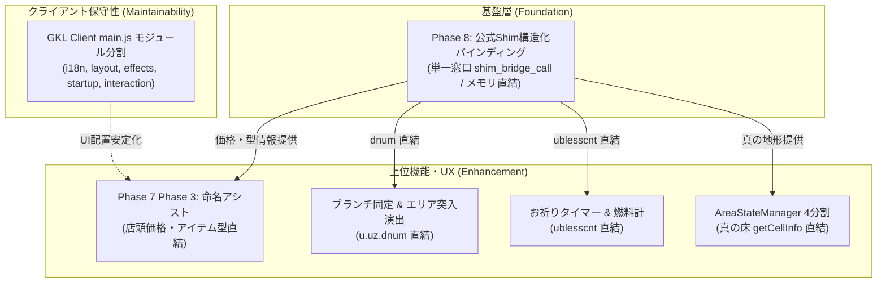

# NetHack WASM WebUI 完了状態・ペンディング状態 再評価総合レポート (2026年10月8日版)
**調査・評価実施日**: 2026年10月8日  
**対象リポジトリ**: `Nethack-wasm-webUI` (main branch)  
**前回レポート**: [`docs/6_project_reports/archive/handover_20260929_status_reevaluation.ja.md`](./archive/handover_20260929_status_reevaluation.ja.md)  

---

## 1. エグゼクティブサマリー (Executive Summary)

本レポートは、前回総合評価レポート（2026/09/29）以降のソースコード（`src/`、`examples/`、`tests/`、`tools/`）、コミット履歴、テストスイート、および最新の設計書群を網羅的・実態ベースで精査し、**「9月29日以降に新たに達成された完了状態」**、**「現在ペンディング・進行中となっているタスクの棚卸し」**、および **「ROADMAP再調整のための課題・依存関係整理」** を体系的にまとめた引き継ぎ総合レポートです。

この9日間（2026/09/29 〜 2026/10/08）において、プロジェクトは NetHack 本体の 5.0.1 への追従、大規模なアーキテクチャ分離、新UI・ツールの追加、および長年の技術的負債（レガシークライアント群）の完全撤廃を同時に成し遂げました。

すべての改修は「今できていることを絶対に壊さない」非破壊的原則のもとで進められ、**全125テストスイート・1,566テスト 100% PASS**（前回比 +19スイート、+266テスト）、および **全4サンプルクライアント（Vue, React, Solid, Svelte）のビルド完全成功** を達成・維持しています。

### 📊 主な再評価ハイライト (前回 09/29 からの主要な変化)

1. **NetHack 5.0.1 へのバージョンアップ ＆ 公式コード非侵襲 Driver 化**:
   - Cコアを 5.0.1 (Commit c1b1b08, "5.0.0-0 post-release") へ更新。
   - `win/shim/winshim.c` 等の公式コードを一切変更せず動作する非侵襲 Driver への移行を完了。
2. **Phase 6: 統合サウンドコーディネーター ＆ 音響駆動ドライバ分離の完遂 (Step 1〜3 100% 完了)**:
   - `SoundEngine.js` の過密責務（照合・調停・物理駆動）を解体し、`SoundCoordinator` (Facade)・`SoundArbiter` (調停エンジン)・`AudioDrivers` (プラガブル物理ドライバ群) の3層モデルへ完全移行。
3. **Phase 7: 標準操作プログレッシブ拡張 ＆ WASM動的ルックアップ統合ナレッジ (Phase 1 & Phase 2 完遂)**:
   - **Phase 1**: `/` コマンド向け動的ルックアップ (`OnDemandLookupService`)、3層統合ナレッジカード (`<nh-knowledge-card>`)、発見済み図鑑 (`<nh-discovery-codex>`) の配備。
   - **Phase 2**: 独立冒険手帳画面 (`tools/adventure_log.html`)、セッション横断メタ進行管理 (`AdventureLogManager` / `AdventureLogStorage`)、`<nh-codex-grid>` コンポーネント、モンスター公式攻撃データ（3,767行）の配備。
4. **ゲームパッド操作体系 ＆ Console Client PoC**:
   - ラジアルメニューパレット、風来のシレン風インベントリドロワー (`<nh-shiren-inventory-drawer>`)、`GamepadInputController`、`examples/console-client/` の配備。
5. **3大不具合是正 ＆ 品質堅牢化の完遂**:
   - 信託（Oracle）テキストウィンドウ検知と大予言（Major Consultation）一括集約保存による OOM クラッシュの根本解決。
   - explore モード（discover/wizard）終了時のランキング混入防止 ＆ 死因 SSOT（Cコア `xlogfile`）一本化。
   - 攻撃エフェクト（ATTACK_HIT）の死亡時・平和NPC・店主衝突時の誤爆完全防止ガード。
6. **公式 xlogfile 準拠スコアボード (`scoreboard.html`) ＆ 事後ナレッジ連携 (`PostMortemKnowledgeResolver`) 新設**:
   - 公式戦歴ビュワーの新設と、NetHack 5.0 `formatkiller()` 準拠の多段構文解析・根本原因調停 (RCA) エンジンの実装。
7. **実装初期レガシークライアント (`legacy-client`) 約8,800行の完全削除**:
   - 旧式クライアント、旧フォント・画像・音声アセットを全削除し、保守性・ビルドサイズを劇的に改善。
8. **テスト・品質保証のさらなる拡大**:
   - テスト数は前回の 1,300 件から **1,566 件（全 125 テストスイート 100% PASS）** へ拡大。全クライアントビルドもエラーゼロを維持。

---

## 2. 前回以降の完了状態 (Completed Status: 2026/09/29 〜 2026/10/08)

以下は、ソースコード、コミット履歴、およびテストスイートの実態確認により、**この期間に新たに実装・検証が完了した項目**です。

### 2.1 NetHack 5.0.1 アップグレード ＆ 非侵襲 Driver 化 【完成】
- **該当設計**: [`docs/1_driver/nethack_version_upgrade_guide.ja.md`](../1_driver/nethack_version_upgrade_guide.ja.md)
- **達成内容**:
  - NetHack 本体の 5.0.1 (Commit c1b1b08) への追従と WASM バイナリの更新。
  - 公式ソースコード（`win/shim/winshim.c` 等）を改変せず、バニラ状態のままビルドして動作させるドライバ層の非侵襲化を確立。
  - 新タイルマップ（`pict/nethack_5.0.1_tiles.png`）および `tilemappings.lst` のインデックス追従。
  - `NetHackMemory.js` / `NetHackWasmDriver.js` のメモリレイアウト追従と単体テスト配備。

### 2.2 Phase 6: 統合サウンドコーディネーター ＆ 音響駆動ドライバ分離 【全ステップ完成】
- **該当設計**: [`docs/4_sound/sound_coordinator_and_multidriver_architecture.ja.md`](../4_sound/sound_coordinator_and_multidriver_architecture.ja.md)
- **達成内容**:
  - **Step 1: 物理駆動ドライバ層 (`src/core/sound/drivers/`)**:
    - `BaseAudioDriver.js`, `WaveAudioDriver.js` (Howler), `PsgBeepDriver.js` (Web Audio 短音), `ProceduralSynthDriver.js` (多段オシレーター合成・きしむ床・咆哮・演奏) を完全分離。
  - **Step 2: Headless 調停エンジン (`SoundArbiter.js`)**:
    - 優先度ソート（Priority 100〜30）、クールダウン管理、スタガード遅延キュー（60ms）、再生モード（Auto/Wave/Beep/Mute）判定を一元化。
  - **Step 3: 統合 Facade (`SoundCoordinator.js`) ＆ 後方互換ラッパー (`SoundEngine.js`)**:
    - 外部 API（`processMessageContext`, `handleFxTrigger`, `enqueueSound` 等）との 100% 後方互換を維持。
    - 全ドライバ・調停・ファサードの単体テスト配備（全18テスト、モック AudioContext / Howler 完全検証）。

### 2.3 Phase 7: 標準操作プログレッシブ拡張 ＆ WASM動的ルックアップ統合ナレッジ (Phase 1 & Phase 2) 【完成】
- **該当設計**: [`docs/7_futures/native_command_extension_and_dynamic_lookup_architecture.ja.md`](../7_futures/native_command_extension_and_dynamic_lookup_architecture.ja.md)
- **達成内容**:
  - **Phase 1 (ゲーム内最優先 / Gap 3 & Gap 1 対応)**:
    - `/` コマンド動的サイレントクエリ (`OnDemandLookupService.js`): 静的辞書二重持ちを排し、WASMから動的にC言語文学引用やモンスター情報を抽出。
    - 3層統合ナレッジカード (`<nh-knowledge-card>`): 基本スペック、モンスター攻撃特性、C言語文学引用をタブ切り替え表示。
    - 発見済み図鑑連携 (`<nh-discovery-codex>`): `\` コマンド出力を捕捉し、発見済みアイテム真名・外見対照カタログを美麗モーダル表示。
    - `ItemIdentificationResolver.js` による未鑑定・外見推定ロジック強化。
  - **Phase 2 (ゲーム外ビューア / Gap 4 対応)**:
    - 独立冒険手帳画面 (`tools/adventure_log.html`): シルエット解禁ギャラリー、収集率パーセンテージプログレス。
    - セッション横断メタプログレッション管理 (`AdventureLogManager.js`, `AdventureLogStorage.js`): セーブデータ横断でアンロック実績を永続化。
    - `<nh-codex-grid>` コンポーネントおよび実機アンロックトースト演出 (`AdventureLogToast.js`)。
    - モンスター公式攻撃データ (`MONSTER_OFFICIAL_ATTACKS.js`, 3,767行) の整備。

### 2.4 ゲームパッド操作体系 ＆ Console Client PoC 【完成】
- **該当設計**: [`docs/7_futures/gamepad/`](../7_futures/gamepad/)
- **達成内容**:
  - ラジアルメニュー入力認識 (`RadialInputRecognizer.js`) および HUD パレット (`<nh-radial-palette-hud>`)。
  - 風来のシレン風インベントリドロワー (`<nh-shiren-inventory-drawer>`): 8方向＋ショートカットによる快適な持ち物操作。
  - ゲームパッド統合コントローラー (`GamepadInputController.js`, `GamepadManager.js`)。
  - レファレンス実装としての独立コンソールクライアント (`examples/console-client/`) の配備。

### 2.5 3大不具合是正 ＆ 品質堅牢化 【完成】
- **該当設計**: [`docs/6_project_reports/archive/bugfix_plan_oracles_explore_attackfx.ja.md`](./archive/bugfix_plan_oracles_explore_attackfx.ja.md)
- **達成内容**:
  - **信託（Oracle）Lore 検知 ＆ 大予言 OOM クラッシュ根本解消**: テキストウィンドウ（`windowId: 5`）宛て送出の検知パイプライン配備。大予言（20件連続送出）を `unlockAllOracles()` により単一集約トランザクションとして保存し、ブラウザのメモリ枯渇（OOM）を完全防止。
  - **explore モード ランキング除外 ＆ 死因 SSOT 化**: `topten.c` 準拠で `flags` (0x2: discover, 0x1: wizard) を解析して除外。死因の判定元を Cコア出力（`xlogfile`）に統一し、配列破壊（`reverse()`）と不正確なフォールバックを完全撤廃。
  - **攻撃エフェクト誤爆防止**: `_isPlayerDead` ガードおよび平和NPC・店主衝突時の事前誤爆抑止を実装。

### 2.6 公式 xlogfile 準拠スコアボード ＆ 事後ナレッジ連携 【完成】
- **該当設計**: [`docs/7_futures/post_mortem_knowledge_and_tactical_advisor_redesign.ja.md`](../7_futures/post_mortem_knowledge_and_tactical_advisor_redesign.ja.md)
- **達成内容**:
  - スコアボード画面 (`tools/scoreboard.html`): 公式 NetHack 5.0 の `xlogfile` 完全準拠の戦歴・ランキング閲覧UI。
  - 事後ナレッジリゾルバー (`PostMortemKnowledgeResolver.js`): `formatkiller()` 構文解析（Prefix, Core Incident, Suffix `, while ...` 分解）と根本原因調停 (RCA) の基礎実装。

### 2.7 レガシークライアント (`legacy-client`) および不要アセットの完全削除 【完成】
- **達成内容**:
  - 実装初期の `examples/legacy-client/`（27ファイル、約8,800行）を完全削除。
  - 旧フォント画像（`pict/k32_jisx0208.png`, `pict/font4x6.png` 等）や旧音声ファイルを全削除。
  - 未使用となった `dat/` 英文・日本文化用巨大ベースファイル群（`dat/data_jp.base` 6,229行等）のクリーンアップ。

### 2.8 ツール群・ポータル・ドキュメント整備 【完成】
- **達成内容**:
  - `index.html`（ポータル）およびツール群（`config.html`, `dev_tools.html`, `save_manager.html`, `adventure_log.html`）のナビゲーション統一。
  - LICENSE, THIRD_PARTY_NOTICES.md, README.md の整備。

---

## 3. タスク構造の再編棚卸し (3段階ライフサイクル管理)

ROADMAP の見通しが悪くなっていた主因は、**「設計完了・着手待ちのタスク」「一部ステップのみ完了して残存しているタスク」「新構想」** がすべて「実施中」のように混在し、つまみ食い状態が発生していたことにあります。  
そこで、タスク管理を **「🔥 現在実施中 (Active Focus)」「⏸️ 設計完了・着手待ち (Wait / Pending)」「💡 構想・将来バックログ (Backlog)」** の厳格な3段階に再編・整理しました。

### 3.1 🔥 現在実施中・最優先フォーカス (Active Focus)
- **Phase 8: 公式Shim構造化バインディング ＆ ゼロオーバーヘッド・メモリ直結**
  - **ステータス**: `🚧 in-progress` (現在進行中の**唯一の最優先基盤タスク**)
  - **設計書**: [`docs/1_driver/official_shim_direct_binding_implementation_plan.md`](../1_driver/official_shim_direct_binding_implementation_plan.md)
  - **方針**: Cコード完全非侵襲の単一ディスパッチャ窓口 (`win/shim/shim_bridge.c` の `shim_bridge_call` / ioctl 方式)。
  - **ステップ**:
    - Stage 8.1: 単一窓口ブリッジ配備 ＆ ビルド・Driver汎用ゲートウェイ整備 (`NetHackMemory.js` ➔ `bridgeCall`)
    - Stage 8.2: コンテナ・アイテム・所持重量の完全直結 (`NetHackObjectSchema.js`, `_weight()`, `_inv_weight()`)
    - Stage 8.3: 真の地形・扉施錠・罠判定 ＆ モンスターPeaceful直結 (`WasmDirectBindingService.js`, `getCellInfo`)
    - Stage 8.4: ブランチ同定・お祈りタイマー・プレイヤー耐性直結 (`dnum`, `ublesscnt`, `uprops`)

### 3.2 ⏸️ 設計完了・着手待ち (Wait / Pending / Ready)
つまみ食いを防ぐため、仕様・設計完了済みであっても意図的に待機させているタスク群です。
- **GKL Pure JS Client (`main.js`) モジュール分割＆オーケストレーター適正化**:
  - **ステータス**: `⏸️ pending (Ready / 次期スロット)`
  - **設計書**: [`docs/2_client_ui/gkl_client_modularization_plan.ja.md`](../2_client_ui/gkl_client_modularization_plan.ja.md)
  - **待機理由**: 2,364行の `main.js` を400〜500行へ分離する設計は完了済み。Phase 8 のコア直結基盤の進捗を見極めつつ、クライアント保守性のために次期スロットで着手。
- **Phase 7 Phase 3: 命名アシスト ＆ GamePad候補選択 (Gap 2 対応)**:
  - **ステータス**: `⏸️ pending (Wait on Phase 8)`
  - **設計書**: [`docs/7_futures/native_command_extension_and_dynamic_lookup_architecture.ja.md`](../7_futures/native_command_extension_and_dynamic_lookup_architecture.ja.md)
  - **保留理由**: 画面テキストパースによる複雑な価格逆引きロジックを組むより、**Phase 8 で Cコアから直接アイテム情報（買値・売値・真名）を取得する方が圧倒的に安全でシンプル**になるため、Phase 8 完了まで意図的に着手を保留。
- **事後ナレッジ連携 ＆ 戦術アドバイザー刷新（残存部）**:
  - **ステータス**: `⏸️ pending (連動待ち)`
  - **設計書**: [`docs/7_futures/post_mortem_knowledge_and_tactical_advisor_redesign.ja.md`](../7_futures/post_mortem_knowledge_and_tactical_advisor_redesign.ja.md)
  - **待機理由**: `PostMortemKnowledgeResolver.js` は実装完了。残る「未接続アドバイスの包括バインド」「50+件の死因検証ベンチマーク」を着手待ち。

### 3.3 💡 構想・将来バックログ (Backlog / Ideas)
- **Phase 8 の恩恵を強く受ける構想群**:
  - *シグナル駆動ハイブリッド翻訳*: Phase 8 の `struct obj` から名詞スロットを直接埋め込み、辞書を90%削減。
  - *GKL ブランチ検出・フロアキャッシュ分離 ＆ エリア突入演出*: Phase 8 の `dnum` 直結で100%確定同定。
  - *GKL タイムライン予測エンジン (お祈りタイマー＆燃料計)*: Phase 8 の `ublesscnt` / 耐性直結で誤差ゼロ化。
  - *GKL 空間幾何学認識エンジン ＆ AreaStateManager 4分割*: Phase 8 の `getCellInfo` 直結で真の床推論をバイパス。
  - *啓蒙ダイアログシグナル化*: （Phase 8 で直接取れない運や神の怒りの動的補正）。
- **独立した構想群**:
  - *外部Wiki連携 (NetHackWiki)*、*ヘルプ専用ダイアログ化*、*完全独立マイクロカーネル化*。

---

## 4. Phase 8 がもたらす「後続タスク・構想への影響・恩恵マップ」

Phase 8（公式Shim構造化バインディング）を最優先の単一フォーカスに据えることで、後続の多くのペンディング・構想タスクが「推測や画面パース」から「確定情報直結」へと劇的に簡略化されます。

| 後続タスク / 構想 | これまでのアプローチ (推測・画面パース) | Phase 8 後のアプローチ (メモリ直結) | もたらされる劇的恩恵 |
| :--- | :--- | :--- | :--- |
| **Phase 7 Phase 3: 命名アシスト** | `\` 画面出力の文字列パース、店頭価格からの basePrice 逆算推定 | `SHIM_CMD_GET_OBJECT_AT` / `inv_item` から `otyp`・買値・売値を直接取得 | 画面パース不要、誤判定ゼロ、未鑑定アイテムの仮名付与が $O(1)$ 確定 |
| **GKL ブランチ同定 & エリア演出** | メッセージや階段トポロジーからの推測（ゴースト階段リスク） | `dnum`（ダンジョン番号）直結 | 100% 確定同定。エリア突入バナー演出が完全な信頼性で発火 |
| **GKL タイムライン予測 (燃料計)** | メッセージ検知からの経過歩数逆算（セーブ再開でリセット） | `ublesscnt`（祈りクールダウン）および内部耐性配列直結 | コールドスタート問題ゼロ、推測誤差ゼロの真値燃料計 |
| **AreaStateManager 4分割** | 背景グリフ・仮床・大岩押しからの泥臭い空間推論 | `getCellInfo(x,y)` による真の床・罠・扉フラグの一括直結 | 空間推論コードの半分が不要化。シンプルな台帳・描画分離へ移行可能 |
| **ハイブリッド翻訳** | 英語メッセージ全文の正規表現マッチング・名詞抽出 | `struct obj` から ID・数量・祝福フラグを抽出しテンプレート埋め込み | 英語パースの組み合わせ爆発を根絶、辞書を18,000行➔1,500行へ90%削減 |

### 💡 相互依存関係と効率的な進行順序の分析



#### 推薦される進行順序：

1. **ステップ 1: 【最優先基盤】Phase 8 (公式Shim構造化バインディング) の Stage 8.1〜8.2 着手**
   - **理由**: これを先行させることで、現在テキスト画面解析や推測に頼っている「アイテム重量」「買値・売値」「真の床」「ブランチ番号」が Cコアから直接 100% 確定データとして手に入ります。
   - これにより、**Phase 7 Phase 3 (価格逆引き命名アシスト)** の実装工数が大幅に削減され、壊れにくい堅牢なコードになります。

2. **ステップ 2: 【保守性確保】GKL Client (`main.js`) のモジュール分割**
   - **理由**: 2,300行を超える `main.js` にこれ以上新機能（命名ダイアログや新HUD演出）を追加するとデバッグ困難になるため、一度疎結合なコントローラー群へ整理します。

3. **ステップ 3: 【機能実現】Phase 7 Phase 3 (命名アシスト) および バックログ群の順次実装**
   - Phase 8 のメモリ直結データと、分割されたクリーンな Client コントローラーを組み合わせて、`<nh-call-candidate-dialog>` やエリア突入演出を実装します。

---

## 5. 総合品質メトリクス (Quality Metrics)

```
[テスト結果 (Vitest run)]
Test Files: 125 passed (125)
Tests:      1,566 passed (1566)
Duration:   12.49s

[サンプルクライアントビルド結果 (npm run build:all-examples)]
Vue Client:    dist/assets/index-*.js (Built in 1.83s)  ✅ PASS
React Client:  dist/assets/index-*.js (Built in 1.80s)  ✅ PASS
Solid Client:  dist/assets/index-*.js (Built in 1.77s)  ✅ PASS
Svelte Client: dist/assets/index-*.js (Built in 2.02s)  ✅ PASS
```

- **回帰バグ発生ゼロ**: NetHack 5.0.1 移行、Phase 6 マルチドライバ分離、レガシークライアント全削除を経ても、全テストスイート・全クライアントビルドでエラーゼロを維持。
- **アーキテクチャ純化**: レガシーコード（約8,800行）の削除により、リポジトリ全体が近代的な WebUICore / GKL / UIController / Web Components 体系へ純化完了。
