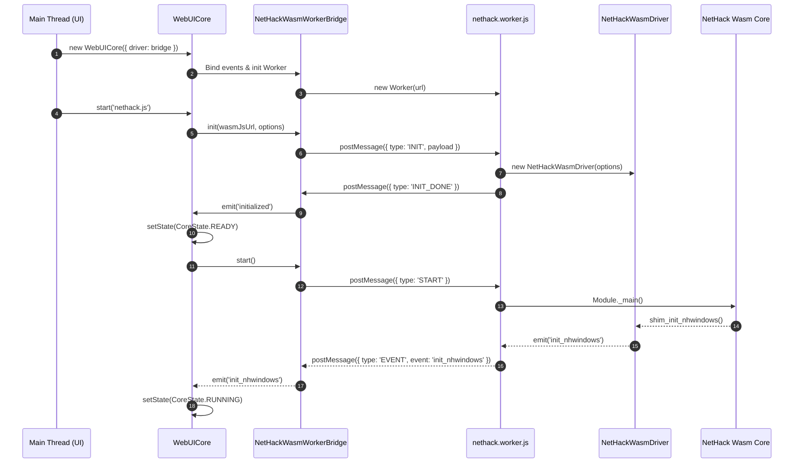
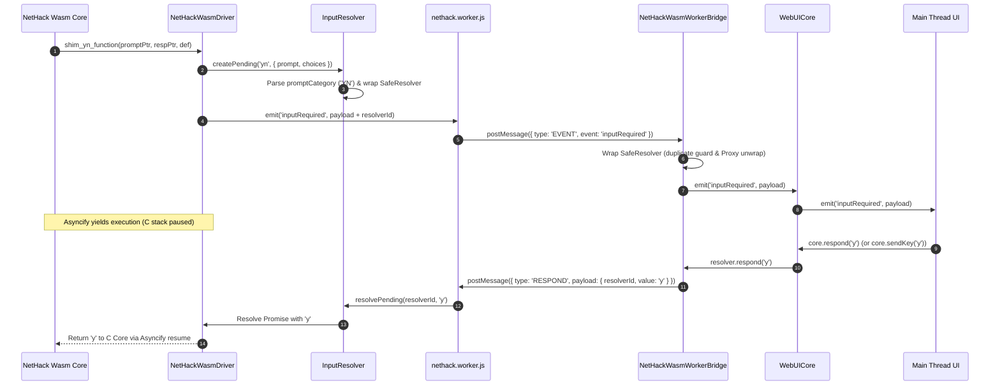

# NetHack-wasm-webUI 技術アーキテクチャ & 設計知識ベース (NotebookLM Knowledge Base)

> [!NOTE]
> **最終更新日時**: 2026年8月8日 (WebUICore 第 3 サイクル完了時点)  
> **対象バージョン**: NetHack 5.0 (3.7.0-dev) Wasm Core / WebUICore v1.0 / Driver v1.0

本ドキュメントは、**NetHack-wasm-webUI** プロジェクトの技術スタック、WebAssembly/Web Worker 構成、`WebUICore` 統合アーキテクチャ、主要モジュール設計、日本語パース・動的翻訳システム、データ永続化仕様、および将来拡張ビジョンをまとめた構造化ナレッジベースです。
NotebookLM 等の LLM コンテキストとして読み込ませ、コードベースの解読・拡張・設計分析に利用することを目的としています。

---

## 1. プロジェクト概要 & 技術スタック (Project Overview & Tech Stack)

### 1.1 プロジェクトの目的
ローグライクゲームの金字塔である NetHack (C言語実装コア / NetHackJP) を WebAssembly (Wasm) にコンパイルし、無改造の C コアとブラウザ上のモダンな Web UI（Vue 3, React 18, Svelte, SolidJS, DOM/Canvas, モバイル, タッチ/ゲームパッド）を橋渡しする統一アーキテクチャ **`WebUICore`** および動的日本語翻訳環境を提供すること。

### 1.2 コア技術スタック
- **Core Engine**: NetHack 3.7.0 (開発版) / NetHack 5.0.0 正式版 / NetHackJP C Core
- **Compilation / Toolchain**: Emscripten (C to Wasm), Asyncify (C言語のブロッキング呼び出しをJavaScriptのPromiseへ変換)
- **Execution Architecture**: Web Workers (メインスレッドのUIレンダリング描画を保護するためWasmエンジンを別スレッドで非同期実行)
- **Unified Domain Facade**: `WebUICore` (ゲーム状態、ライフサイクル、入力マッピング、音効、翻訳、レンダラーの統合カプセル化)
- **Frontend / Rendering**:
  - HTML5 Canvas (`CanvasRenderer` / 高性能 32x32 スプライト描画)
  - DOM UI (`DOMGridRenderer` / レスポンシブ操作画面)
  - サンプル UI パッケージ: Vue 3, React 18, Svelte, SolidJS (`examples/`)
- **Audio Engine**: Web Audio API (`SoundEngine` / メッセージ連動 SE 再生)
- **Input System**: `KeyMapper` (生 KeyboardEvent / アクション自動マッピング), `TouchCalculator`, `GamepadManager`
- **Persistence**: Emscripten IDBFS (IndexedDB による `/save/` ディレクトリの永続化 & セーブデータ安全管理)

---

## 2. WebAssembly / Web Worker / WebUICore 3層アーキテクチャ (3-Tier Architecture)

Wasmコアは計算量の高いゲームループとCモジュール実行を担うため、Web Worker 内で完全非同期実行されます。メインスレッド側では `WebUICore` が統合ファサードとして UI 層と通信ブリッジ（`NetHackWasmWorkerBridge`）をカプセル化します。

```text
+-----------------------------------------------------------------------------------+
| 1. Presentation Tier (UI / App Components)                                        |
|  - Vue 3, React 18, Svelte, SolidJS, Mobile DOM, Canvas                           |
+-----------------------------------------------------------------------------------+
                                       │
                                       ▼ (Method Calls / Event Subscriptions)
+-----------------------------------------------------------------------------------+
| 2. Domain / Core Integration Tier (WebUICore Facade)                             |
|  - WebUICore (Lifecycle State Management: UNINITIALIZED -> RUNNING -> GAME_OVER)   |
|  - Submodules: StatusAccessor, GameOverResolver, KeyMapper, GlyphHelper,          |
|                SoundEngine, TranslationEngine, TouchCalculator, GamepadManager    |
|  - NetHackWasmWorkerBridge (Facade Communications & SafeResolver Wrapper)        |
+-----------------------------------------------------------------------------------+
                                       │
                         Message Passing (Worker Protocol)
                                       │
+-----------------------------------------------------------------------------------+
| 3. Execution Engine Tier (Web Worker Thread: nethack.worker.js)                   |
|  - NetHackWasmDriver (Core C-Shim Dispatcher)                                     |
|  - InputResolver (SafeResolver & Prompt Category Parser)                          |
|  - NetHackMemory (Wasm HEAP Reader / Status Decoder)                              |
|  - NetHackFSManager (Emscripten FS / IDBFS Sync)                                  |
|  - Wasm Module (nethack.wasm / nethack_jp.wasm)                                   |
+-----------------------------------------------------------------------------------+
```

### 2.1 メインスレッド ↔ Worker 通信プロトコル

#### メインスレッド → Worker (Commands)
| Message Type | Payload / Parameters | 説明 |
| :--- | :--- | :--- |
| `INIT` | `{ wasmJsUrl, options }` | Wasm スクリプトの指定、環境変数 (`ENV`) や `Module` 設定の準備 |
| `START` | なし | Wasm モジュールのメインループを開始 |
| `RESPOND` | `{ resolverId, value }` | UI 側からのユーザー入力値（キーコード、テキスト、選択メニューなど）を Wasm に返送 |
| `GET_STATUS` | なし | 現在のドライバー状態を取得 |
| `FS_SYNC` | `{ populate }` | IndexedDB と Emscripten FS 間の同期リクエスト |

#### Worker → メインスレッド (Events & Callbacks)
| Message Type | Event Name / Payload | 説明 |
| :--- | :--- | :--- |
| `INIT_DONE` | なし | Wasm 初期化の完了通知 |
| `EVENT` | `inputRequired` | ユーザーからの入力待ち状態を通知。`promptCategory` や `safeResolver` 用 ID を同封 |
| `EVENT` | `display_nhwindow` | 画面描画更新要求 |
| `EVENT` | `status_update` | HP、階層 (`DLEVEL`)、所持金 (`Gold`) 等のステータス変更 |
| `EVENT` | `putstr` / `raw_print` | テキストログメッセージの出力通知 |
| `EVENT` | `stateChange` | ドライバー状態変更 (`IDLE`, `RUNNING`, `WAITING_INPUT`, `STOPPED`) |
| `EXIT` | `{ exitCode }` | Wasm プロセスの正常終了またはクラッシュの通知 |

---

## 3. WebUICore ファサード & コアモジュール設計 (WebUICore & Core Submodules)

### 3.1 `src/core/WebUICore.js`
- **役割**: クライアント UI（Vue, React 等）から利用される**単一の主要エントリポイント（ファサード）**。
- **特徴的機能**:
  - **8 段階ライフサイクル管理 (`CoreState`)**:
    - `UNINITIALIZED` / `INITIALIZING` / `READY` / `RUNNING` / `WAITING_INPUT` / `GAME_OVER` / `EXITED` / `DESTROYED`
  - **クリーンリスタート (`restart({ clearStorage: true })`)**:
    - ブラウザのリロードを行わずに、VFS セーブ削除・全ストレージ破棄・Worker 再定義・`map_cleared` イベントを自動発行して瞬時にニューゲームを開始。
  - **Safe APIs**:
    - `cancelPrompt()`: アクティブなプロンプトを `KEYS.ESC` (`27`) で安全にキャンセル。
    - `deleteSaveFile(targetFilename)` / `clearAllStorage()`: セーブデータの完全削除 Safe API。
    - `sendKeyEvent(event)` / `sendAction(actionName)`: キーボードイベントや抽象アクションの変換送信。

### 3.2 `src/core/StatusAccessor.js`
- **役割**: C コアから届く複雑なステータス変更イベントを構造化オブジェクトとして保持し、UI 側へ安全なゲッターを提供するモジュール。
- **提供プロパティ**: `hp`, `hpmax`, `gold`, `dlevel` (構造化 `dlevelData`), `conditions` (状態異常配列), `stats` (`str`, `dex`, `con`, `int`, `wis`, `cha`) 等。

### 3.3 `src/core/lifecycle/GameOverResolver.js`
- **役割**: ゲームオーバー（討死・勝利・リタイア）時の勝敗判定、翻訳済み死因文面解析、ハイスコアボード生成を行う自律解析モジュール。
- **提供プロパティ**: `deathMessage` (翻訳済み死因に一本化), `isVictory`, `scoreboard` (`Array<{ rank, score, name, title, death }>`).

### 3.4 `src/core/input/KeyMapper.js`
- **役割**: ブラウザの生 `KeyboardEvent` や修飾キー (Ctrl/Alt)、矢印・テンキー、トラベルキー (`_`) を C コア互換の ASCII コードへ自動変換するマッピングエンジン。

### 3.5 `src/core/sound/SoundEngine.js`
- **役割**: ゲームログメッセージのキーワード（「hits」「kills」「stairs」等）や状態変化を監視し、Web Audio API で効果音 (SE) を自動再生するサウンドエンジン。

### 3.6 `src/core/translation/TranslationEngine.js`
- **役割**: メッセージログやプロンプトテキストを `dictionary.csv` 由来の辞書引きおよび正規表現パターンでリアルタイムに日本語化する翻訳エンジン。

---

## 4. ドライバー & ブリッジ設計 (`src/driver/`)

### 4.1 `src/driver/NetHackWasmDriver.js`
- **役割**: Wasm C Shim 関数群（`shim_init_nhwindows`, `shim_putstr`, `shim_select_menu`, `shim_yn_function` 等）をディスパッチし、EventEmitter ベースで JavaScript イベントへ変換するドライバーコア。
- **特徴機能**:
  - `Asyncify` フック: C コアのブロッキング呼び出し時に JavaScript の `Promise` を返してスタックを一時停止。
  - C コアノイズログカット (`filterSysconfLogs: true`) およびメッセージ重複カット (`deduplicateMessages: true`)。
  - 空メニュー自動応答 (`autoRespondEmptyMenu: true`): 選択肢がない通知用メニューへの自動即時応答。

### 4.2 `src/driver/NetHackWasmWorkerBridge.js`
- **役割**: UI 側メインスレッドで `NetHackWasmDriver` と同一のインターフェースを提供するファサードクラス。
- **特徴機能**:
  - `Worker` インスタンスの生成・管理・`terminate()` による安全破棄。
  - `inputRequired` 受診時、Worker 側の `resolverId` をラップした `SafeResolver` を再構築し、UI から直感的に `.respond(value)` が呼べるようにカプセル化。
  - `unwrapPayload`: Vue 3 や SolidJS 等の UI フレームワークが生成する `Proxy` や複合オブジェクトを透過的に Plain JS Object に分解して postMessage 転送。

### 4.3 `src/driver/InputResolver.js`
- **役割**: Wasm C コアからの各種プロンプト・入力要求の自動分類と `SafeResolver` の生成。
- **特徴機能**:
  - **`SafeResolver`**: 一度 `.respond()` または `.cancel()` が呼ばれた Resolver に対する二重呼び出しを安全な no-op (無効処理) にする二重応答防止機構。
  - **`promptCategory` パース**: 入力待ちメッセージのテキストから、UI 側が扱いやすい型（`TEXT`, `YN`, `KEY`, `MENU`, `POSKEY`, `FILE`, `OTHER`）を自動判別して付与。
  - **ユーザープロンプト保護 (`isUserPromptContext`)**: 非ブロッキング描画処理が本物のユーザー入力待ち Resolver を上書き・Stale 化することを防ぐ二重チェックバリア。

### 4.4 `src/driver/NetHackMemory.js`
- **役割**: Emscripten `HEAPU8` / `HEAP32` メモリ領域を直接解析するユーティリティ。
- **特徴機能**:
  - `parseStatusUpdate`: `DLEVEL` (Field 20) 生データ (`"Dlvl:1"`, `"Tut:1"`) からダンジョンブランチ名 (`branch`) と数値階層 (`dlevelNum`) を構造化抽出。

### 4.5 `src/driver/NetHackFSManager.js`
- **役割**: Emscripten の `FS` および `IDBFS` をカプセル化し、永続化ディレクトリ `/save` の管理とスコア/ログファイルの解析を担当。
- **特徴機能**:
  - `syncToPersistent(populate)` による双方向タイムスタンプ比較データ同期。
  - セーブファイル削除 API (`deleteSaveFile`) の提供。

### 4.6 `lastSequenceBuffer` & 汎用サイレントクエリ (`querySequenceSilent`)
- **役割**: WASM C コアのメモリをハックすることなく、`queueSequence` 実行中のテキスト・メニューデータを一時バッファへキャッチ・蓄積する機構。
- **特徴機能**:
  - `WebUICore.querySequenceSilent(tokens, options)` により、任意のコマンド（インベントリ `['i', ' ']`, 呪文 `['+', ' ']` 等）を画面表示なしで自走実行し、実行結果バッファを Promise で非同期獲得。
  - 推測による不確実なログ解析を全廃し、100% 正確な C コアデータ（Single Source of Truth）によるインベントリ・ステータス同期を実現。

---

## 5. Game Knowledge Layer (GKL) 4層アーキテクチャ & 統合状況アクセサ

Game Knowledge Layer (GKL) は、ゲームの難解さを解消し操作支援・知識補完を行う層であり、`WebUICore` と完全な SoC (関心事の分離) を保ちながら以下の 4 層パイプライン構造で運用されます。

```text
+-----------------------------------------------------------------------------------+
| GKL Layer 1: Situation / State Cache (SituationCache)                            |
|  - StatusAccessor, InventoryStateManager, AreaStateManager を統合                   |
|  - getSituation(): { status, inventory, area, tools, actions } を一括提供        |
+-----------------------------------------------------------------------------------+
                                       │
                                       ▼
+-----------------------------------------------------------------------------------+
| GKL Layer 2: Knowledge Interpretation (Item & Rule Resolver)                      |
|  - 未識別アイテム、効果、耐性、ダンジョン知識の補完                                 |
+-----------------------------------------------------------------------------------+
                                       │
                                       ▼
+-----------------------------------------------------------------------------------+
| GKL Layer 3: Action Reasoning (ContextActionEngine & DirectionalActionResolver)  |
|  - 統合状況から壁掘削・鍵開け・会話等の推奨アクション (keySequence) を動的生成      |
+-----------------------------------------------------------------------------------+
                                       │
                                       ▼
+-----------------------------------------------------------------------------------+
| GKL Layer 4: Execution Control (RequestController)                               |
|  - アクションの keySequence トークンを queueSequence で安全自走消化                 |
+-----------------------------------------------------------------------------------+
```

---

## 6. 日本語パース & メッセージ動的翻訳システム (Japanese Parsing & Translation)

本プロジェクトには、運用目的に応じた **2 種類の日本語動作モード** が搭載されています。

```text
[Message Output Path]
 C Core Message --> (Check Mode)
                      |
                      +---> [1] JS Dynamic Translation Engine (LANG_JP = true)
                      |       1. Check nhMessage.js / dictionary.csv
                      |       2. Regex Pattern Matching (nhPatterns)
                      |       3. Item/Entity Name Lookup (nhItems, nhEntities)
                      |       4. Un-translated log collection to localStorage
                      |
                      +---> [2] Native NetHackJP Direct Pass-through (LANG_JP = false)
                              1. UTF-8 Byte Stream directly from nethack_jp.wasm
                              2. Display directly via FontPrintControl
```

### 5.1 モード 1: 英語 Wasm + 動的パース翻訳エンジン (JS Translation Engine)
- **概要**: 英語版 `nethack.wasm` の出力を受け取り、JavaScript 側でリアルタイムに日本語へ分解・構造化・再構築して表示する方式。
- **辞書引き & パース**: `dictionary.csv` 由来のマップによる直接翻訳および品詞意識ルックアップ (`lookupWord`)、正規表現キャプチャ変換 (`nhPatterns`)。

### 5.2 モード 2: Native NetHackJP Wasm モード (Direct UTF-8 Pass-through)
- **概要**: 日本語版 C コアを直接ビルドした `nethack_jp.wasm` を使用し、C コアレベルでローカライズされた UTF-8 文字列をそのまま表示する方式。

---

## 6. データ永続化 & セーブシステム (Data Persistence & Safe Cleanup) `[✅ 実装済み]`

Emscripten の仮想ファイルシステム (MEMFS) とブラウザの IndexedDB を組み合わせ、セーブデータやスコアログの同期・永続化を行っています。

```text
Emscripten MEMFS (Virtual RAM)                 Browser IndexedDB (IDBFS)
+-------------------------------+              +-------------------------------+
| /save/                        |  syncfs()    | Database: /save               |
|  ├── savefile (plname.gz)     | <----------> |  ├── savefile (plname.gz)     |
|  ├── record                   | (Bi-directional| ├── record                   |
|  └── logfile                  |  Timestamp)  |  └── logfile                  |
+-------------------------------+              +-------------------------------+
```

### 6.1 実装済みセーブ・データ管理機能
1. **セーブデータ自動検知 & Auto Resume (自動再開)**:
   - `core.detectSavedGameInfo()` および `core.hasSaveDataAsync()` により、VFS および IndexedDB 内の既存セーブファイル（プレイヤー名含む）を自動検出。
2. **クリーン再起動 & ストレージ消去**:
   - `core.restart({ clearStorage: true })` または `core.deleteSaveFile()` 呼出し時、IndexedDB 内の古セーブファイルと VFS 上の永続データを一括消去し、メモリ破損や暗転停滞を防ぎます。

---

## 7. マルチフレームワーク統合設計 (Framework Integration)

`examples/` 配下の各種サンプルクライアント（Vue 3, React 18, Svelte, SolidJS）は、以下の Clean Architecture 原則に従って構築されています。

1. **`driverController` シングルトン原則**:
   - UI フレームワークの Reactive State (Vue `reactive()`, Solid `createSignal` 等) に `WebUICore` インスタンスや Resolver を直接格納せず、クラスインスタンスによる Singleton 管理を行って Proxy 破損を防ぐ。
2. **プレゼンテーション層の単純化**:
   - UI コンポーネントは `WebUICore` から送られる構造化イベント (`inputRequired`, `statusUpdate`, `gameOver`) をそのままバインドし、パースやマッピング処理を UI 側に記述しない。

---

## 8. シークエンス図 (Event Flow Diagrams)

### 8.1 初期化 & Worker 起動フロー



### 8.2 非同期入力プロンプト処理フロー (Asyncify & SafeResolver)



---

## 9. 開発者向けまとめ (Developer Summary)

- **完全な関心事の分離**: `WebUICore` がドメイン制御・入力マッピング・状態管理・翻訳・音効をすべて吸収し、UI コンポーネントは表示とスタイルだけに専念できます。
- **入力とメモリの安全性**: `SafeResolver`, `unwrapPayload`, `isUserPromptContext` により、非同期入力時の連打や Proxy 破損、フリーズを防止します。
- **一発クリーン再起動**: `core.restart({ clearStorage: true })` により、ページリロードなしで Worker 再構築と画面リセットを安全に行えます。

---

## 10. 将来構想と拡張ビジョン (Future Roadmap & Architectural Vision)

> [!IMPORTANT]
> **本セクションは 2026年8月時点での将来的な拡張・開発アイデアをまとめた構想（Future Roadmap）です。今後の開発フェーズにおいて段階的に導入が検討されます。**

### 10.1 完全多言語 i18n プラグイン差し替えアーキテクチャ構想
- **`ITranslator` インターフェースによる Dependency Injection (DI)**:
  - `WebUICore` 内部から特定言語（日本語）固定のコードを完全に切り離し、`ITranslator` インターフェースとして抽象化。
  - `JapaneseTranslationEngine` (現行 JP エンジン), `CustomDictTranslator` (ユーザー指定他言語 JSON 辞書), `NullTranslator` (英文パススルー) を自由注入可能にする。
- **`lang` (ロケール) と `translate_enabled` (機能トグル) の分離**:
  - `context` (`'log'`, `'prompt'`, `'menu_item'`, `'file'`, `'ui'`) を導入し、「UI やプロンプトは日本語化するが、ゲーム進行ログのみ原文英語 (Raw English) で出力する」といった文脈別表示制御を実現。
- **Typed Pattern Engine ＆ 複合アイテム解析 (`decomposeItemName`)**:
  - BUC (祝呪), 強化値 (`+1`), 損耗 (`rusty`), 数量, サフィックス等を分解し、ターゲット言語の文法順へ再合成するパースエンジン。

### 10.2 Game Knowledge Layer (ゲーム知識層) 構想
- **背景と目的**:
  - NetHack 固有の複雑な仕様（設置物・地形操作、死体・耐性、信仰、NPC 対話）のハードルを下げ、新規プレイヤーが奥深さに速やかに到達できるようにする独立知識支援層。
- **主要機能コンポーネント**:
  1. **実行可能なコマンドパレット UI (Executable Command Palette)**:
     - ヘルプ（`?` キー）を単なるテキスト閲覧ではなく、VS Code のコマンドパレットのように「カテゴリ分類＋検索」ができ、**選択・タップでその場でコマンドが発動する実行型 UI** 化。スマートフォンやゲームパッドでのプレイ感が劇的に向上。
  2. **設置物・地形のコンテキストアシスト**:
     - 祭壇・噴水・シンク・宝箱等に乗った際、実行可能アクション（`#offer`, `#dip`, `quaff`, `kick` 等）を自動ポップアップ提示。
  3. **死体・アイテム知識カード ＆ 軽量 Wiki リンク**:
     - 「食べると危険/耐性がつく」等のヒント提示、および NetHackWiki (`https://nethackwiki.com/wiki/...`) への自動検索リンク機能。
- **段階的導入ロードマップ**:
  - Phase 1: 静的実行可能コマンドパレット
  - Phase 2: 設置物・アイテムのコンテキストメニュー & 軽量 Wiki 検索リンク
  - Phase 3: ログ解析・動的ヒント & 近未来の AI 連携の模索

### 10.3 次世代 WebUI プラットフォーム最終形態ビジョン
- **リアルタイム・デバッグインスペクター (Debug Inspector)**:
  - Wasm Driver ↔ Core 間で受送信される全イベントのミリ秒タイムスタンプ付きカラーログ出力、State Monitor、および Resolver へのダイレクト入力インジェクター。
- **WebGL / 次世代描画アダプター**:
  - 既存の CanvasRenderer / DOMGridRenderer に加えた、高度なパーティクルやシェーダー効果を持つ WebGL スプライトレンダラープラグインのサポート。
