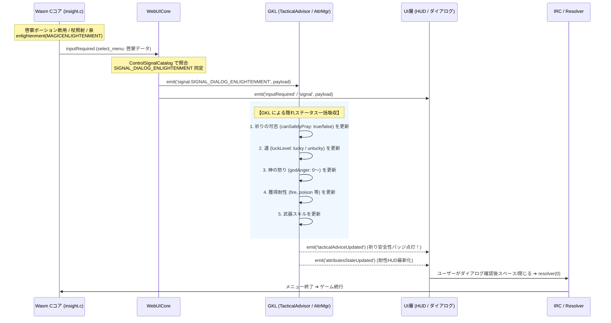

# 🔮 啓蒙ダイアログシグナル化による隠れステータス横取りと状態精度向上アーキテクチャ構想
*(Enlightenment Dialog Signal & Hidden Status Interception Architecture)*

**〜祈りの可否・運・神の怒り・獲得耐性など、普段は見えない隠れ情報を「たまたまの啓蒙」から逃さず吸収する〜**

---

## 1. 概要と実戦的設計方針 (Context & Practical Philosophy)

### 1.1 現実的なプレイスタイルに即したアプローチ
NetHack において、ドラゴン肉などを食べて得る「獲得耐性（Acquired Intrinsics）」は毎プレイ必ず手に入るものではなく、**「大半のプレイ期間中、獲得耐性は持っていない（生来＋装備品のみ）」** のが基本です。

したがって、複雑な外部セーブ同期や過度な永続化ストアを組む必要はありません。
- 普段は **獲得メッセージ（`You feel a hot sensation` 等）** で検知できれば十分。
- そして、**「ゲームプレイ中にたまたま啓蒙ポーションを飲んだり、杖や泉を引いた時」に、そのダイアログから得られる貴重な情報を逃さず横取りしてステータスに反映する**。
- これにより、GKL（Game Knowledge Layer）の把握するキャラクター状態の精度がグッと跳ね上がります。

### 1.2 啓蒙（MAGICENLIGHTENMENT）でしか取れない「真に価値ある隠れ情報」
通常の `^X`（`#attributes`）コマンドは `BASICENLIGHTENMENT` のみで実行されるため、属性値（STR/DEX等）やHP/ACといった表層ステータスしか出力されません。

一方、啓蒙ポーション・杖・泉などで発動する **「魔法の啓蒙 (`MAGICENLIGHTENMENT`: `src/insight.c`)」** では、通常プレイでは絶対に見ることができない以下の **死活的に重要な隠れ情報** が一括開示されます：

| 隠れ情報 | Cソース出力メッセージ | 普段の可視性 | GKL / HUD での活用価値 (絶大) |
| :--- | :--- | :---: | :--- |
| **🙏 祈りの安全性** | `You can safely pray` /<br>`You cannot safely pray` | **完全不可視**<br>(ターン計算か勘頼み) | **【最重要】** ピンチ時の「今すぐ祈るべきか（安全）」と「絶対に祈ってはいけない（神罰・即死）」を 100% 正確に助言可能 |
| **🍀 運のステータス (Luck)** | `You are lucky` / `very lucky` /<br>`extremely lucky` / `unlucky` | **完全不可視** | 祭壇捧げ物、命中率、攻撃回避、願望成功率の判定に直結。幸運・不運の把握 |
| **⚡ 神の怒り (Divine Anger)** | `<God> is angry with you` /<br>`very angry` / `extremely angry` | **完全不可視** | 祭壇改宗失敗や死体冒涜で神が怒っているかどうかの確定判定 |
| **🛡️ 獲得耐性・固有能力** | `fire resistant`, `sleep resistant`,<br>`poison resistant`, `teleport control` 等 | **不可視**<br>(メッセージ推測のみ) | 過去に獲得した耐性や、指輪・装備以外の隠れ耐性を確定更新 |
| **⚔️ 現在武器スキル熟練度** | `Your skill in <weapon> is Basic` 等 | **部分可視** | `#enhance` を開かずとも、現在装備武器の熟練度・二刀流可否を同期 |
| **🪨 幸運の石の効果継続** | `Good luck does not time out` /<br>`Bad luck does not time out` | **不可視** | インベントリ内の石が真に幸運の石（Luckstone）として機能しているかを保証 |

これまで、これらの超重要情報は「プレイヤーが画面上の英文を目視で読んで閉じる」だけで終わっており、WebUI の知識ベース（GKL / TacticalAdvisor）は一切関与できていませんでした。

**シグナル化によって啓蒙ダイアログの出現を検知し、裏でテキストを横取り（インターセプト）して GKL に吸収させることで、ステータス画面や戦術助言の精度を劇的に向上させます。**

---

## 2. シグナル検知 ＆ GKL 吸収アーキテクチャ

WebUICore に個別の横取りステートを持たせず、シグナル駆動 Pub/Sub と IRC パターンに則った疎結合な設計を採用します。



---

## 3. GKL 側でのテキストパースと状態更新ロジック

GKLPlugin 内のシグナルリスナーで、ダイアログの生テキスト（`payload.items`）を走査し、各マネージャーへ分配します。

```javascript
// GKLPlugin.js
core.on('signal:SIGNAL_DIALOG_ENLIGHTENMENT', (payload) => {
    const rawItems = payload.items || payload.menuItems || [];
    const lines = rawItems.map(it => it.rawStr || it.str || it.text || '');

    // 1. 祈りの安全性の抽出 (生死を分ける超重要情報)
    let canSafelyPray = null;
    if (lines.some(l => l.includes('can safely pray'))) {
        canSafelyPray = true;
    } else if (lines.some(l => l.includes('cannot safely pray') || l.includes('can not safely pray'))) {
        canSafelyPray = false;
    }
    if (canSafelyPray !== null && this.tacticalAdvisor) {
        this.tacticalAdvisor.setPrayerSafety(canSafelyPray);
    }

    // 2. 運 (Luck) および 神の怒り (Deity Anger) の抽出
    if (this.statusAccessor) {
        const isLucky = lines.some(l => l.includes('lucky') && !l.includes('unlucky'));
        const isUnlucky = lines.some(l => l.includes('unlucky'));
        const isGodAngry = lines.some(l => l.includes('angry with you'));
        
        this.statusAccessor.updateInsightData({
            luck: isLucky ? 'lucky' : (isUnlucky ? 'unlucky' : 'neutral'),
            isGodAngry,
            canSafelyPray
        });
    }

    // 3. 耐性・固有能力の更新 (たまたま判明した獲得耐性を即座に反映)
    if (this.attributeStateManager) {
        this.attributeStateManager.updateFromIntrinsicsLines(lines);
        if (this.inventoryStateManager) {
            this.attributeStateManager.updateExtrinsicsFromInventory(this.inventoryStateManager.items);
        }
        this.attributeStateManager.isSynced = true;
        this.core.emit('attributesStateUpdated', this.attributeStateManager);
    }

    // 4. 武器スキル行の更新
    if (this.skillStateManager) {
        this.skillStateManager.updateFromLines(lines);
        this.core.emit('skillsStateUpdated', this.skillStateManager);
    }

    // 5. 戦術助言の再評価（祈り推奨バッジ等の即時反映）
    if (this.tacticalAdvisor) {
        this.core.emit('tacticalAdviceUpdated', this.tacticalAdvisor.getAdvice());
    }
});
```

---

## 4. ユーザー体験への還元（HUD・戦術助言の進化）

啓蒙から情報が吸収されると、UI 側では以下のような劇的な体験向上が実現します：

### ① 祈りセーフティ・インジケーター（HUD バッジ）
- **平常時**: 祈りの状態は「未確定（推定）」
- **啓蒙直後**: 
  - `You can safely pray`: HUD に **「🙏 祈り安全（いつでも祈れます）」** が緑色で点灯。HP 危機時に TacticalAdvisor が強力に祈りを推奨。
  - `You cannot safely pray`: HUD に **「⚠️ 祈り不可（神罰の危険あり！）」** が赤色で点灯。誤操作による即死・天変地異を完全防止。

### ② 運・神の怒りバッジ
- 幸運状態（🍀）や神の怒り（⚡）が HUD にわかりやすく表示され、祭壇での行動や願望（Wish）のタイミング判断が的確になります。

### ③ 耐性・スキルの自然な確定
- メッセージの見逃しや未確認だった獲得耐性が、啓蒙ダイアログによって一瞬で判明・整理され、Paperdoll や耐性一覧に美しいアイコンとして反映されます。

### ④ ROADMAP 2.2（神のご機嫌管理＆燃料計）の決定論的キャリブレーション ★絶大シナジー
- **ROADMAP 2.2 の課題**:
  - [nethack_fuel_gauge_spec.md](./nethack_fuel_gauge_spec.md) で策定されているタイムライン予測エンジン（燃料計）では、非侵襲ルールに基づき、お祈りクールダウンを `approximateCooldown = 1000` などのターン減算エミュレーションで追跡しています。
  - しかし、自然経過のターンカウントだけでは、未知の不敬行為やプレイ中のズレによる誤差が蓄積するリスクがありました。
- **啓蒙横取りによるブレイクスルー**:
  - 啓蒙が発生した瞬間に、C コアから出力される `canSafelyPray`（真の祈り安全性）および `<God> is angry with you`（神の怒り）を直接横取りすることで、**エミュレーションのズレを一撃で 100% の確定真値（Ground Truth）へ補正（キャリブレーション）** できます。
  - これにより、燃料計の「予備タンク（+900歩）」の計算精度が絶対確実なものとなり、餓死・デッドロック予測の信頼性が飛躍的に向上します。

---

## 5. 実装ロードマップとタスク

- [ ] **Phase A: 啓蒙シグナルの同定基盤**
  - [ ] `ControlSignalCatalog.js` に `SIGNAL_DIALOG_ENLIGHTENMENT`（`attributes:`, `Background:` 等のシグネチャ）を追加。
  - [ ] `MessageContextCatalog.js` に `"You feel self-knowledgeable..."` の啓蒙トリガーメタデータを追加。
- [ ] **Phase B: GKL でのテキストパースと状態吸収**
  - [ ] `GKLPlugin.js` に `SIGNAL_DIALOG_ENLIGHTENMENT` のリスナーを追加。
  - [ ] 祈り安全性（`canSafelyPray`）、運（`Luck`）、神の怒り（`u.ugangr`）の抽出ロジックを実装。
  - [ ] `AttributeStateManager` および `SkillStateManager` へのテキスト行注入処理を配備。
- [ ] **Phase C: 戦術助言（TacticalAdvisor）＆ HUD 連携**
  - [ ] `TacticalAdvisor` に `setPrayerSafety(canSafelyPray)` を新設し、危機時アドバイスの精度を向上。
  - [ ] UI（Paperdoll や HUD）へ祈り可否・運のインジケーターを描画連携。
- [ ] **Phase D: 検証テスト**
  - [ ] 啓蒙テキスト（`safely pray`, `lucky`, 耐性行）のモックデータを用いたパース・助言更新の単体テストを作成。
