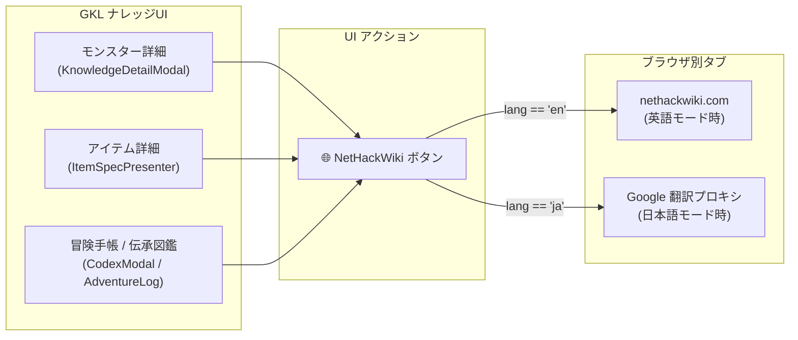

# 🌐 外部ナレッジ連携 (NetHackWiki) ＆ 翻訳モード連動 Web ジャンプ構想
*(External Wiki Knowledge Linking & Locale-Aware Web Jump Architecture)*

## 1. 構想の背景とコンセプト (Concept & Background)

### 1.1 WebUI クライアントならではの優位性
ネイティブデスクトップアプリや端末CUIとは異なり、本プロジェクト（NetHack Wasm WebUI）は**Webブラウザ上で動作する**という決定的な利点を持っています。
ブラウザ標準の `window.open(url, '_blank')` や URL スキームを活用することで、ゲームの進行を妨げることなく、外部の膨大なWebナレッジへシームレスにアクセスできます。

### 1.2 攻略・ナレッジ管理の課題と解決策
- **課題**:
  - NetHack は40年近く蓄積された深遠なルール・例外仕様・変異耐性・ドロップ率・隠しギミックを有しており、これら全解説をゲーム内クライアントの静的データとして抱え込むと、メモリ・バンドルサイズが肥大化し、保守コストやライセンス問題が生じる。
- **解決策**:
  - ゲーム内（GKL）では**戦闘・生存に必要な要約スペック（耐性、危険度、内在能力、属性）**をコンパクトに提供。
  - より深い攻略・歴史・Tips・コミュニティの知見を求めるときは、**NetHackWiki 等の外部Webリンクをワンクリックで開けるリンク項目（🌐 アイコン）**をナレッジポップアップや冒険手帳に提供する。

---

## 2. 外部URL導出メカニズム (URL Resolution Mechanism)

### 2.1 決定論的スラッグ自動導出 ($O(1)$)
個別のモンスター・アイテムすべてに手作業で URL を付与する必要はありません。GKL に既に存在する英語名（`nameEn`）から、NetHackWiki の命名規則に従って自動変換します。

```javascript
/**
 * 英語名から NetHackWiki の標準ページスラッグを生成
 * 例: "giant ant" -> "Giant_ant"
 *     "potion of extra healing" -> "Potion_of_extra_healing"
 */
export function resolveWikiSlug(entity) {
    if (entity.wikiTopic) return entity.wikiTopic; // 個別オーバーライド
    const raw = entity.nameEn || entity.name || '';
    if (!raw) return null;
    
    // アンダースコア置換および先頭大文字化
    const normalized = raw.trim().replace(/\s+/g, '_');
    return normalized.charAt(0).toUpperCase() + normalized.slice(1);
}
```

- **個別オーバーライド (`wikiTopic`)**:
  曖昧さ回避ページ（disambiguation）や特殊な命名規則が存在する場合のみ、`MONSTER_KNOWLEDGE_FULL` や `OBJECT_KNOWLEDGE_MAP` の `wikiTopic` フィールド（※一部モンスターで既にプロトタイプ定義済み）で上書きします。

### 2.2 翻訳モード連動 URL 生成 (Locale-Aware Jump URL)
現在のクライアント言語設定（`language: 'ja' | 'en'`）に応じて、開く先の URL をインテリジェントに切り替えます。

```javascript
export function getExternalWikiUrl(wikiSlug, language = 'ja') {
    if (!wikiSlug) return null;
    const baseWikiUrl = `https://nethackwiki.com/wiki/${encodeURIComponent(wikiSlug)}`;

    if (language === 'en') {
        return baseWikiUrl;
    }

    // 🇯🇵 日本語モード時: Google ウェブサイト翻訳プロキシ経由で開く
    // ページ全体が自動で日本語化された状態でブラウザの別タブに展開される
    return `https://translate.google.com/translate?sl=en&tl=ja&u=${encodeURIComponent(baseWikiUrl)}`;
}
```

- **英語モード時**: 公式の `https://nethackwiki.com/wiki/...` をそのまま開く。
- **日本語モード時**: Google 翻訳プロキシ URL を生成。プレイヤーは英語Wikiを開いた瞬間から日本語機械翻訳でスムーズに内容を読める。
- **将来拡張**: JNetHack Wiki などに該当ページが存在する場合はそちらを優先するフォールバック設定も可能。

---

## 3. UI 統合ポイント (UI Integration Touchpoints)



### 3.1 モンスター・アイテム詳細モーダル (`KnowledgeDetailModal`)
- モーダルのヘッダーまたはフッターに、目立たないスマートなアイコンボタンを配置：
  `[ 🌐 NetHackWiki ]` または `[ 📖 Wiki解説 (外部) ]`
- クリックで別タブ（`target="_blank" rel="noopener noreferrer"`）が即座に開く。

### 3.2 冒険手帳 (AdventureLog) / 伝承図鑑 (CodexModal)
- 神託（Oracles）や噂（Rumors）の各項目から、関連モンスター・アイテム・アーティファクトの Wiki ページへワンクリックでジャンプ。
- 不明な伝承の背景や元ネタ（神話・文学オマージュ）を深掘りしたいプレイヤーに極上の探索体験を提供。

### 3.3 スマートコンテキストアクション (FloatingContextActions)
- マップ上の敵やアイテムを右クリック/ロングタップした際のアクションメニューに、「🌐 Wikiで調べる」を追加（設定でON/OFF可能）。

---

## 4. 本アプローチの利点とアーキテクチャ的評価

1. **容量・メモリ負荷が完全ゼロ**:
   - 膨大な解説文章をクライアントに同梱する必要がないため、WASM WebUI の軽快さを100%維持。
2. **ライセンスの完全独立性**:
   - 外部Webサイトへの単なるハイパーリンクであるため、第三者ライセンスの表記義務や著作権混在が一切発生しない。
3. **常に最新の知見**:
   - バリアントのバージョンアップや新発見があっても、世界中のプレイヤーが編集する Wiki 側の最新情報が即時参照できる。
4. **プレイの没入感を損なわない**:
   - ゲーム内では GKL のコンパクトなHUD/モーダルで即座に状況判断し、じっくり調べたい時だけ別タブで開くという理想的な棲み分けが成立する。
