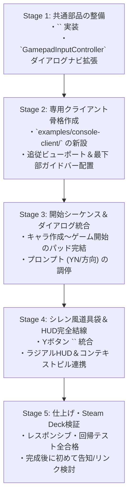

# 🎮 シレン風 GamePad 専用クライアント設計書 (Console Client Architecture)

**作成日**: 2026-10-01  
**ステータス**: `archived` (ゲームパッド入力実験・PoC完了 / 単独クライアント開発はクローズ、コア知見を共通資産化)  
**対象配置**: `examples/console-client/` (`index.html`, `main.js`, `style.css`)  
**関連モジュール**: `WebUICore`, `GamepadManager`, `GamepadInputController`, `NhShirenInventoryDrawer`, `NhRadialPaletteHud`, `NhContextHintPill`, `NhGamepadGuideBar`

---

## 1. 目的と開発方針

### 1.1 目的
NetHackの膨大なコマンド体系を、GKL（状況適応アクション解決）と動的コンテキストマップ（State-Driven Map）を駆使し、**ゲームパッドや Steam Deck 等で「風来のシレン」のように直感的に快適に遊べる専用クライアント（Console Client）** を構築する。

### 1.2 なぜ専用クライアントなのか
デスクトップ向けクライアント（Nehww）への相乗りやおまけ機能として実装しようとすると、以下の致命的な問題が発生する：
- PC用の2カラム配置やサイドパネルとの間でレイアウト・解像度の妥協が生じる。
- ダイアログや開始プロンプトとパッド用HUDの描画レイヤーが衝突し、専用機としての純粋な没入感・操作感が損なわれる。
- したがって、**最初から「ゲームパッド操作前提」で設計された独立した専用クライアント (`examples/console-client/`)** として構築することで、一切の妥協なく理想のコンソールUI/UXを完成させる。

### 1.3 開発規約
- **完成まで `index.html`（プロジェクトルート）への掲載禁止**:
  未完成・検証途中の状態でトップページにリンクを追加しない。`examples/console-client/` 内で単体として完璧にプレイ可能になるまで隔離して開発・検証を行う。
- **WebUICore および共通コンポーネントの再利用**:
  通信・WASMコア制御・ダイアログ基礎・GKL知識層は既存の堅牢なコア資産（`src/` 配下）をインポートし、車輪の再発明を行わない。

---

## 2. 画面レイアウト＆UI/UX構成

コンソール専用クライアントとして、画面の全領域をゲーム画面とゲームパッド用HUDに最適化する。

```
┌─────────────────────────────────────────────────────────────┐
│ 🗺️ 地下1階   ❤️ HP: 16/16   🍖 満腹度: 普通   🪙 0 Gold     │ ⬅️ ① ミニマルステータスHUD
├─────────────────────────────────────────────────────────────┤
│                                                             │
│                                                             │
│                                                             │
│                     【 ダンジョン画面 】                     │
│               （中央自キャラ追従カメラ）                    │
│                                                             │
│                   🚶 @                                      │
│                  [💊 下り階段]                               │ ⬅️ ② 足元コンテキストピル
│                                                             │
│                                    ┌──────────────────────┐ │
│                                    │ 🎒 道具袋 (Yボタン)   │ │ ⬅️ ③ スライドドロワー
│                                    │ [LB/RB] タブ切替     │ │    (開閉時 Fail-Safe)
│                                    │ > 🍎 巨大なリンゴ    │ │
│                                    │   🗡️ ショートソード  │ │
│                                    └──────────────────────┘ │
├─────────────────────────────────────────────────────────────┤
│ [十字キー] 移動   [A] 足元アクション   [B] 待機   [Y] 道具袋 │ ⬅️ ④ コンテキスト対応ボタンガイド
└─────────────────────────────────────────────────────────────┘
```

### 4大コンポーネント構成
1. **① ミニマルステータスバー（最上部）**:
   - 階層、HPゲージ、満腹度、所持金、レベルを横1行でシンプルに表示。
2. **② 中央追従ビューポート（画面中央）**:
   - プレイヤーを中心に据えたカメラ追従。Steam Deck等の16:10画面やフルHDに完全レスポンシブ。
   - 足元や隣接マスに何かある時だけ `<nh-context-pill>` がポップアップ。
   - スティックを倒した時だけ `<nh-radial-hud>` が浮かび上がり8方向コマンドをフリック実行。
3. **③ シレン風スライド道具袋 `<nh-shiren-drawer>`（Yボタン開閉）**:
   - Yボタンで画面右からスライドイン。
   - 十字キーで項目選択、Aボタンでサブメニュー（つかう/そうび/おく/なげる）、LB/RBでタブ切替。
   - **完全Fail-Safe**: 開いている間はターン経過・マップ移動キーを100%遮断。
4. **④ コンテキスト対応ボタンガイドバー `<nh-gamepad-guide-bar>`（画面最下部）**:
   - 現在のコンテキスト（通常探索・道具袋・ダイアログ・YNプロンプト・方向指定）に連動して、リアルタイムに有効なボタン機能を1行で常時ガイド。

---

## 3. 開始シーケンス ＆ ダイアログ・プロンプト完全対応

前回の課題であった「ダイアログやプロンプトが見えなくなる・操作できない問題」を以下の統一ルールで完全に解決する。

### 3.1 キャラクター作成・名前入力（開始シーケンス）
- ゲーム開始時、画面中央にダイアログが浮かび上がる。
- 最下部ボタンガイドバーが即座に `[十字キー] 選択  [A] 決定` にスワップ。
- 十字キー上下で職業・種族・性別・属性のリストを選択し、Aボタンで決定するだけで、キーボードに触れることなくキャラ作成が完了する。

### 3.2 NetHack プロンプト（YN・方向・メッセージ継続）の調停
- **YNプロンプト**:
  - 最下部ガイドバーに `[A] はい (y)   [B] いいえ (n)` が大きく表示され、ワンボタンで回答。
- **方向指定プロンプト（杖を振る・投擲）**:
  - 最下部ガイドバーに `[十字キー/スティック] 8方向照準   [B] 取消` が表示され、スティックを倒すだけで方向を指定。
- **--More--（メッセージ送り）**:
  - AボタンまたはBボタンで次のメッセージへ送る。

---

## 4. 段階的実装ロードマップ (Phased Implementation Plan)

独立した専用クライアントとして、1ステップずつ確実に動くことを確認しながら進める。



### 【Stage 1】共通部品の整備
- `src/components/gamepad/NhGamepadGuideBar.js` の実装と単体テスト。
- `GamepadInputController.js` にダイアログ選択肢ナビゲーション（上下移動、A決定、B閉じる）とターン遮断の単体テスト配備。

### 【Stage 2】専用クライアント骨格作成 (`examples/console-client/`)
- `examples/console-client/` に `index.html`, `main.js`, `style.css` を新設。
- 全画面ビューポート、ミニマルステータスHUD、ボタンガイドバーを配置。
- パッドの十字キーによる確実な移動、Aボタンによる足元アクション、Bボタン待機を確認。

### 【Stage 3】開始シーケンス＆ダイアログ統合
- ゲーム起動時のキャラ作成ダイアログを中央に描画し、パッドだけで選択・決定してダンジョンに降り立てることを確認。
- NetHackコアのYNプロンプト・方向プロンプトをガイドバーと結線。

### 【Stage 4】シレン風道具袋 ＆ HUD完全結線
- Yボタンで `<nh-shiren-drawer>` をスライドイン。
- 十字キーでのアイテム選択、サブメニュー展開、Aボタンでの使用/装備を確認。
- スティックラジアルメニューおよびコンテキストピルの連携。

### 【Stage 5】仕上げ ＆ 検証
- レスポンシブ表示（Steam Deck等の画面比率）の確認。
- Vitest 全テスト実行（全109+ファイル 100% PASS）。
- 単体で完璧に動作することを確認。
