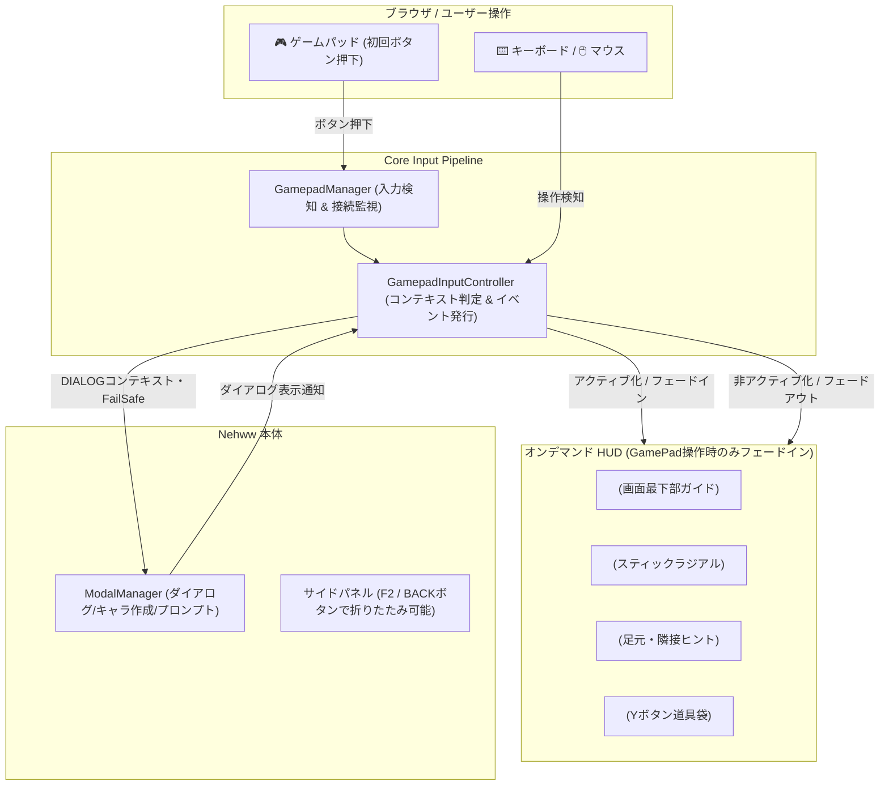

# 🎮 Nehww GamePad オンデマンド統合設計書 (Zero-Footprint On-Demand)

**作成日**: 2026-10-01  
**ステータス**: `proposed` (オンデマンド補助構想 / 将来検討)  
**関連モジュール**: `GamepadManager`, `GamepadInputController`, `NhGamepadGuideBar`, `NhShirenInventoryDrawer`, `NhRadialPaletteHud`, `NhContextHintPill`, `ModalManager`

---

## 1. コンセプト：おまけ機能としてのゼロフットプリント（Zero-Footprint）

Nehww はデスクトップブラウザにおけるキーボード＋マウス＋リッチGKL（HD-2Dビュー、アイコンインベントリ、戦術アドバイス）を主軸とするリファレンスクライアントである。  
したがって、GamePad操作は大々的なプリセットや常設レイアウトとして強制するのではなく、**「コントローラーのボタンを何か押した時だけスッと現れ、キーボード操作に戻れば静かに退避するオンデマンドな補助機能（おまけ機能）」** として実装する。

### コア原則
1. **通常時は完全非表示（Zero-Footprint）**:
   - キーボード/マウス操作時は、GamePad用のHUD（ガイドバー、ラジアル、ピル、ドロワー）は一切表示されない。
   - 既存の画面レイアウト（Classic / Modern）を一切阻害しない。
2. **ボタンを押したら出現（On-Demand Awakening）**:
   - ユーザーが手元のゲームパッドのいずれかのボタン（Aボタンや十字キー等）を押した瞬間に目覚める。
   - 画面最下部に「🎮 コンテキスト対応ボタンガイドバー」がふわっと出現。
   - Yボタンで `<nh-shiren-drawer>`（スライド道具袋）が開閉。
   - スティック操作時のみ `<nh-radial-hud>` が浮かび上がる。
3. **キーボード/マウスとのシームレスな共存**:
   - キーボードのキーを押すか、一定時間（例: 5秒）パッド無操作が続けば、ガイドバーは自然にフェードアウト。
   - いつでもシームレスにキーボード操作とパッド操作を行き来できる。
4. **サイドパネルとの調和**:
   - パネルを強制非表示にするのではなく、Nehww 既存のパネル折りたたみ機構（F2 / Alt+S）と連動し、パッド側（例: BACK / STARTボタン）からワンボタンで全画面化・再展開できる。

---

## 2. システム構成と入力調停

---

## 3. UI/UX 詳細仕様

### 3.1 画面最下部：`<nh-gamepad-guide-bar>`（オンデマンド表示）
- パッドのボタンが押されると画面最下部に薄い透過バーで出現。
- 現在のコンテキスト（`NORMAL`, `MODAL_INVENTORY`, `YN`, `DIRECTION`, `DIALOG`）に合わせて動的にボタンガイドを表示。
- キーボード操作時や一定時間無操作で自動フェードアウト（CSS `opacity: 0` / `transition`）。

| コンテキスト | 表示内容 |
| :--- | :--- |
| **`NORMAL`** | `[十字キー] 移動  [A] 足元  [B] 待機  [Y] 道具  [スティック] ラジアル  [BACK] パネル退避` |
| **`MODAL_INVENTORY`** | `[十字キー] 選択  [LB/RB] タブ  [A] つかう/そうび  [B] とじる` |
| **`DIRECTION`** | `[十字/スティック] 8方向照準  [A] その場  [B] 取消` |
| **`YN`** | `[A] はい (y)  [B] いいえ (n)  [B/ESC] 取消` |
| **`DIALOG`** | `[十字キー 上下] 選択  [A] 決定  [B] 戻る/閉じる` |

### 3.2 ダイアログ・プロンプト表示時の調停 (Fail-Safe)
- キャラ作成ダイアログやYN確認が出ている間：
  - ラジアルメニューやコンテキストピルは非表示。
  - 最下部ガイドバーは `DIALOG` または `YN` 表示となり、裏の移動操作は100%遮断。
  - 十字キー上下でフォーカス移動、Aで決定、Bで閉じる。

---

## 4. 実装ステップ（コンパクト化）

大掛かりなプリセット再設計を排し、シンプルに以下の3ステップで進める。

### Step 1: `<nh-gamepad-guide-bar>` の作成と自動フェードアウト制御
- `src/components/gamepad/NhGamepadGuideBar.js` を作成。
- コンテキスト表示 ＆ パッド入力検知によるフェードイン/タイマーフェードアウト。
- 単体テストの配備。

### Step 2: `GamepadInputController.js` のダイアログ調停＆キーナビ拡張
- `isAnyModalOpen` 検知による `DIALOG` コンテキスト遷移。
- 十字キー上下によるダイアログ選択肢ナビゲーションとA/Bボタンの決定/閉じるディスパッチ。
- 単体テストの配備。

### Step 3: Nehww へのオンデマンドマウント
- `examples/gkl-pure-js-client/index.html` に各コンポーネントを配置（初期非表示）。
- `main.js` で `GamepadInputController` を接続し、パッドのボタンが押された時だけガイドバーやドロワーが動くように結線。
- キャラ作成・プロンプト・通常探索の実機検証。
