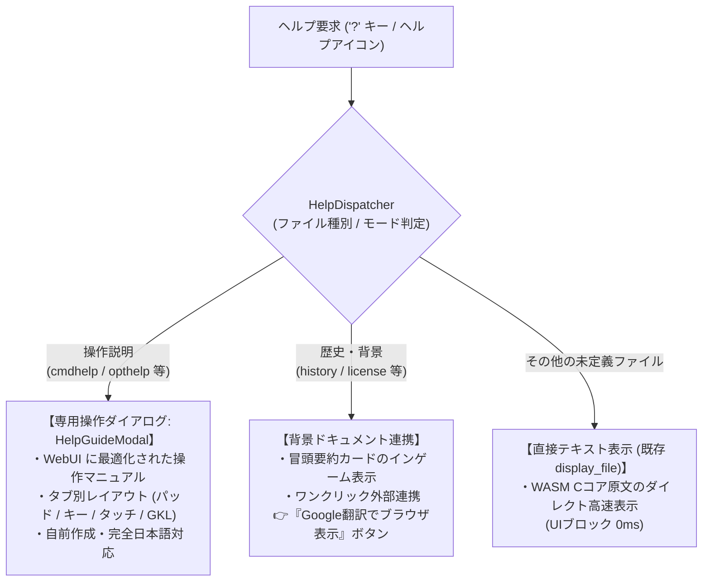

# 📖 ヘルプ専用ダイアログ化 ＆ 外部ドキュメント連携アーキテクチャ構想
*(Dedicated Help Dialog & External Document Integration Architecture)*

## 1. 背景と課題認識 (Background & Problem)

### 1.1 現状の実装と即時対策
NetHack Wasm WebUI では、ヘルプメニュー（`?` キー）から開かれるファイル（`cmdhelp`, `opthelp`, `history`, `help` 等）は C コアから `display_file` イベントとして渡されます。
- **課題**: 以前はこれらを動的翻訳エンジン（`TranslationEngine.translate`）で行ごとに走査していたため、数十万〜数百万回の正規表現マッチングが同期実行され、数秒〜最大28秒のUIフリーズが発生していました。
- **即時対策**: 他バリアントの翻訳ファイルを借用せずライセンスをクリーンに保つ方針、およびヘルプ文用の対訳辞書が現状未整備であることに基づき、`display_file` では**翻訳をバイパスして原文を直接高速表示（所要時間 < 3ms）** する仕様としました。

### 1.2 将来的なギャップと構想の動機
しかし、NetHack 原作の CUI 端末向け英文ヘルプには、現代的な WebUI クライアントとの間で以下の構造的ギャップがあります：
1. **操作体系の乖離**:
   - `cmdhelp` に記載されている内容は「端末キーボード前提」のコマンド一覧であり、WebUI 特有の「ゲームパッド対応」「タッチ/マウスジェスチャー」「方向パッド」「スマートコンテキストアクション」「GKL コデックス」などの革新的な操作系が一切反映されていない。
2. **長文・歴史テキストのインゲーム表示負荷**:
   - `history` やライセンスなどのゲームプレイと直接関係しない長文ドキュメントは、ゲーム内で無理にローカライズ資産として管理・保持する必然性が薄い。
3. **他バリアント成果物の借用回避（ライセンスの完全クリーン化）**:
   - JNetHack などの他バリアントから静的翻訳ファイルを借用すると、ライセンス表記の混在や管理義務が発生する。自前の資産として独立したヘルプ体系を構築することが望ましい。

---

## 2. アーキテクチャ全体像 (System Architecture)



---

## 3. レイヤー別設計仕様 (Component Specifications)

### 3.1 WebUI 専用操作ヘルプダイアログ (`HelpGuideModal`)
NetHack 原作のテキストファイルを表示する代わりに、WebUI のためのリッチな WebComponent モーダルを表示します。

- **コンポーネント構成**: `<nh-help-guide-modal>` (Dark Glass UI デザインシステム準拠)
- **タブ構成**:
  1. **基本操作 / 移動**:
     - 方向パッド、テンキー、vi キー (`hjklyubn`)、クリック移動の解説。
  2. **ゲームパッド / タッチ**:
     - 物理ゲームパッドのボタン配置図、バーチャルパッド、スワイプ/長押しアクション。
  3. **スマートアクション / インベントリ**:
     - マップクリックからの「話す/攻撃/調べる/拾う」コンテキストアクション。
     - インベントリのドラッグ＆ドロップ、装備ペーパードール操作。
  4. **知識・探索 (GKL)**:
     - モンスター・アイテム図鑑（Codex）、危険度・耐性の見方、伝承ログの活用法。
- **メリット**:
  - 初心者から熟練者まで直感的に WebUI の全機能を把握できる。
  - C コアの英文テキストを翻訳する必要が一切なく、完全にプロジェクト自前の日本語ガイドとして保守可能。

### 3.2 背景ドキュメント（`history` 等）の要約 ＆ 外部翻訳連携
NetHack の開発史やクレジットなどの長文テキストは、ゲーム画面内で窮屈にスクロールさせるよりも、外部ブラウザや要約カードを活用します。

- **要約表示 (Summary Card)**:
  - モーダル上部に「NetHackの歴史: 1987年から続くローグライクの原点...」といった数行の日本語要約バナーを提示。
- **Google 翻訳連携ボタン (Open in Google Translate)**:
  - モーダルフッターに **「🌐 ブラウザで日本語訳を開く」** アクションボタンを配置。
  - クリック時に、英文テキストを安全に URL エンコードした Google 翻訳リンク、またはプロジェクト公式の翻訳済みドキュメント URL を別タブで展開する：
    ```javascript
    const openGoogleTranslate = (text) => {
        const url = `https://translate.google.com/?sl=en&tl=ja&text=${encodeURIComponent(text.slice(0, 4000))}&op=translate`;
        window.open(url, '_blank', 'noopener,noreferrer');
    };
    ```
- **メリット**:
  - ゲーム内メモリ消費やバンドルサイズをゼロに保てる。
  - 外部の機械翻訳を活用することで、ライセンスリスクなしにプレイヤーが即座に母国語で長文を読める。

---

## 4. ライセンス整合性とロードマップ上の位置づけ

### 4.1 ライセンスの完全独立性
- **外部借用資産ゼロ**: JNetHack 等の `*_jp` ファイルに一切依存せず、ライセンスファイル（`LICENSE`, `THIRD_PARTY_NOTICES.md`）のクリーンさを恒久的に維持します。
- **自前コンテンツ**: `HelpGuideModal` に掲載する解説文および画像・レイアウトは、本 WebUI プロジェクト独自の著作物として作成されます。

### 4.2 開発優先度 (Priority)
- **優先度**: **Low (Backlog / 将来構想)**
- **位置づけ**:
  - 現状の直接表示（バイパス表示）により「数秒のフリーズ問題」は完全に解決し、ミリ秒単位で軽快に動作しています。
  - 現在進行中の主要マイルストーン（GKL の機能拡充、シグナル駆動ハイブリッド翻訳、HD-2D レンダラー等）の進捗を最優先とし、本構想は UI/UX 洗練フェーズにて必要に応じて着手します。
