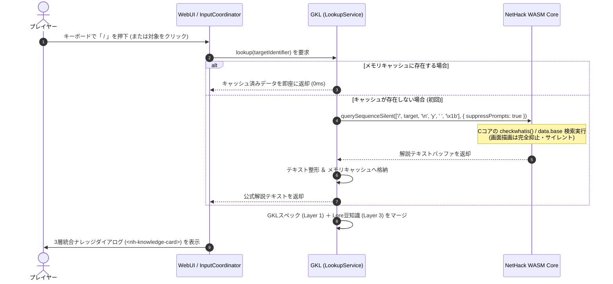

# 📚 標準操作プログレッシブ拡張 ＆ WASM動的ルックアップ統合ナレッジアーキテクチャ
*(Native Command Progressive Enhancement & Dynamic Lookup Architecture)*

## 1. 概要と背景 (Context & Motivation)

### 1.1 開発の進展と生じていた課題
本プロジェクトでは、開発初期と異なり「複数手順を含む複雑な処理」も専用ダイアログ化できるようになり、誤操作防止や利便性向上に主眼を置いて以下の実装を進めてきました。
- **コンテナ二画面ファイラー (`<nh-container-filer>`)**: 複数アイテムの出し入れ、BoH（手品袋）防爆ガード、金貨対応
- **装備ペーパードール (`<nh-paperdoll>`)**: 14部位スロット、依存関係自動解決、呪い検知
- **各種入力支援ダイアログ**: キャラ作成、願い、虐殺、ポリモルフ、魔法書書き込み

これらにより「事故死の防止」と「UIの近代化」は大きく前進しました。しかしその一方で、**ナレッジ（情報・知識）に関する機能が独自実装・個別UI表示（フローティングHUD、サイドパネル、専用モーダル）に偏り、NetHack本来のキー操作や標準情報システムとの重複・二重化**が目立つようになっていました。

### 1.2 思想の転換：プログレッシブ・エンハンスメント (Progressive Enhancement)
NetHackは元来、キーボード操作でダンジョンを歩き、気になったものを調査コマンド（`/`, `\`, `;`, `:`, `^O` 等）で能動的に調べ、知識を蓄積していく「情報と知恵のゲーム」です。

UIが高度化した今だからこそ、NetHackから乖離した独自UIを増やすのではなく、**「NetHack本来の標準操作・基本コマンドを自然にフック・拡張し、そのレスポンスをモダンなリッチダイアログへと昇華させる（Progressive Enhancement）」** 方向に舵を切ることが極めてスマートであり、プレイヤーの学習コストと認知負荷を最小化します。

---

## 2. 3層統合ナレッジモデル (Three-Tier Knowledge Integration)

特にアイテムやモンスターの詳細を調べる基本コマンド `/`（What is this?）において、以下の3つの知識レイヤーを1つの統一カードとして融合します。

```
┌─────────────────────────────────────────────────────────────┐
│ 🏷️ 目隠し (blindfold)              [ 道具 / 重量: 2 / 布製 ] │
├─────────────────────────────────────────────────────────────┤
│ 【Layer 1: GKL 実用スペック & 識別解析】                     │
│  ・状態: 通常 (Uncursed)  |  識別状態: 識別済み              │
│  ・効果: 視界を遮断する。                                   │
├─────────────────────────────────────────────────────────────┤
│ 【Layer 2: NetHack公式 Lookup Information (WASM)】          │
│  📖「目を覆うために使われる一片の布。盲目の状態では、        │
│      外界の光を失う代わりに、第六感や研ぎ澄まされた          │
│      感覚が呼び覚まされるという……」                         │
│      ［『NetHack 5.0 data.base』］                           │
├─────────────────────────────────────────────────────────────┤
│ 【Layer 3: 冒険の豆知識・伝承 (LoreCodex / Rumors)】        │
│  💡「テレパシー能力があるなら、目隠しはとても役に立つ。」   │
│     (真の噂 / 冒険手帳 No.1)                                 │
└─────────────────────────────────────────────────────────────┘
```

### レイヤー別の責務と特徴

| レイヤー | 名称 | データの出所 | 役割と提供価値 |
| :--- | :--- | :--- | :--- |
| **Layer 1** | **GKL 実用スペック＆安全解析** | `ItemSpecPresenter`<br>`StructuredKnowledgeEngine`<br>`ItemIdentificationResolver` | ・ゲームプレイに直結する生データ（重量、材質、攻撃力、AC、耐性、特殊危険性）<br>・未識別アイテムのネタバレ防止マスキング（外見名・仮名・BUC）<br>・プレイヤースキルとの動的突合バッジ（熟練度） |
| **Layer 2** | **NetHack公式 Lookup Information** | **NetHack Cコア (WASM)**<br>`data.base` / `data_jp.base` | ・NetHackが数十年間蓄積してきた公式の文学引用（トールキン、ダンテ、シェイクスピア等）やDevTeamのユーモア解説<br>・NetHackの世界観・文化・歴史そのもの |
| **Layer 3** | **冒険の豆知識・伝承 (Lore)** | `LoreCodex`<br>`LoreMasterData` | ・ダンジョン内で囁かれる噂（Rumors 787件・真偽判定付き）<br>・神託（Oracles）や床の刻み文字伝承<br>・`relatedEntities` により対象アイテム/モンスターへ自動紐付け |

---

## 3. WASM動的サイレントクエリ・アーキテクチャ (Dynamic Silent Query)

### 3.1 静的インデックス化を行わない理由 (Architectural Decision)
NetHack公式の `data.base`（約6,200行）をJS側でビルド時に静的パースしてバンドルに含める手法は、以下の致命的な欠点を持ちます：
1. **データの二重持ち (DRY違反)**: WASMバイナリ内にすでにコンパイル済みの `data` ファイルが存在するにもかかわらず、JS側にも全く同一のテキストを二重保持してバンドルサイズを肥大化させる。
2. **バリアント・バージョン追従の保守コスト増**: 将来 NetHack 3.6 → 3.7 → 5.0 の更新や、Slash'EM、JNetHackなどの別バリアントを動かす際、CコアのWASMを差し替えるだけでなく「JS側の静的辞書も毎回再抽出・再生成して保守する」という余計な作業が発生する。

### 3.2 既存インフラ（`querySequenceSilent`）を活用した動的抽出
本プロジェクトにはすでに、画面描画を汚さずにWASMと対話する **`querySequenceSilent`** 基盤が確立されています。
`suppressPrompts: true, isSilentSync: true` を指定することで、画面のちらつきは一切生じず、内部バッファとして純粋なテキストのみをキャプチャ可能です。



### 3.3 メモリキャッシュ戦略
- 同一セッション内で一度取得した `lookupInformation` は、GKL内部の `Map<string, string>` にキャッシュされます。
- 2回目以降の表示ではWASM通信が一切発生せず、**レスポンス速度 0ms** で完全即時表示されます。

---

## 4. UI・フロントエンド連携設計

### 4.1 InputCoordinator による調停
`src/ui-controller/InputCoordinator.js` において、通常画面での `/` 入力を捕捉・ルーティングします。
- モーダルが開いていない通常ターン時、`/` キー入力を `OPEN_KNOWLEDGE_INSPECTOR` アクションとしてディスパッチ。
- 画面上のアイテム（インベントリ、ペーパードール、コンテナ）やマップ上のモンスターをクリックした際も、同一のインスペクター起動アクションを発行。

### 4.2 Web Components 化 (`<nh-knowledge-card>`)
`src/components/` に、3層ナレッジを描画する共通Web Componentを追加します。
- **タブ / アコーディオン切り替え**:
  - `[ 性能スペック ]`: AC/ダメージ、重量、材質、スキル適性、未識別マスク
  - `[ 📖 公式解説 ]`: WASMから動的取得した `data.base` の解説文
  - `[ 💡 豆知識・噂 ]`: `LoreCodex` の関連 Rumors（真偽バッジ付き）
- **キーボードナビゲーション**: ESC または `q` で即座に閉じてゲーム復帰。

### 4.3 現場の即時調査 (Inspector) と 冒険手帳 (Codex / 収集率) の二本柱
「ナレッジを調べる」という体験を、重複させることなく以下の2つのコンテキスト（利用動機）に明確に住み分けます。中身のカード描画部品（`<nh-knowledge-card>`）は完全に共通化・再利用します。

```
┌─────────────────────────────────────────────────────────────┐
│                       共通の表現部品                        │
│                【 <nh-knowledge-card> 】                    │
│     (Layer 1: スペック ＋ Layer 2: 公式解説 ＋ Layer 3: 噂) │
└──────────────────────────────┬──────────────────────────────┘
                               │ 共有・再利用
               ┌───────────────┴───────────────┐
               ▼                               ▼
     【① 探索中の即時調査】             【② 冒険手帳】
    (Tactical Inspector)               (Adventure Log / Codex)
  ・起動: 「 / 」「 ; 」または対象クリック   ・起動: メニュー、手帳ボタン、Ctrl+O等
  ・目的: 「今目の前の敵/アイテムは安全か？」 ・目的: 「コレクション収集率」「達成度」
  ・対象: 単一ターゲットの即時確認           ・対象: 全体アルバム・一覧検索
  ・ライフサイクル: そのターンでESC閉じる      ・ライフサイクル: セッション横断の知識蓄積
```

### 4.4 パーマデスを汚さない現代的アプローチ：知のメタプログレッション（次回引き継ぎ）
NetHackの本質である**「神聖なパーマデス（死んだら全ロスト）」と「Cコード改変禁止（厳格なゲームバランス）」を一切犯すことなく**、現代のプレイヤーに刺さるリプレイ性を提供します。
- **ルールの厳守**: キャラクターのステータス強化やアイテム持ち越し（強くてニューゲーム）は一切行わない。
- **知の蓄積（メタ進行）**: 
  - 遭遇したモンスター（全384種）、識別したアイテム（全481種）、集めた噂（全787件）が、LocalStorage（セッション横断）の冒険手帳にアンロックされていく。
  - 死亡時にも「手帳の収集率（%）が更新された」「未知の噂の真偽が1つ判明した」という確かな前進感が残り、理不尽な死の喪失感をポジティブな探索欲求へと昇華させる。

### 4.5 現代的図鑑UI：タイルグリッド一覧 ＆ シルエット・アンロック演出
冒険手帳コーデックス（Codex）のUIとして、現代のコレクションゲームのような**「タイルアイコンが並ぶグリッドギャラリーとシルエット解禁表現」**を採用します。

```
┌─────────────────────────────────────────────────────────────┐
│ 📖 NetHack 冒険手帳 (Adventure Log / Codex)                 │
│ [すべて] [👾モンスター] [⚔️武具] [🧪薬/巻物/杖] [📜噂伝承]   │
│ 進捗: 142 / 384 (36.9%)  [██████████░░░░░░░░░░░░░░░]        │
├──────────────────────────────┬──────────────────────────────┤
│  ┌──┐ ┌──┐ ┌──┐ ┌──┐ ┌──┐    │ 🏷️ コカトリス (chickatrice)  │
│  │🐶│ │🐱│ │💀│ │⬛│ │⬛│    │ [危険度: ⚠️⚠️⚠️ / 鳥類]      │
│  └──┘ └──┘ └──┘ └──┘ └──┘    │ ───────────────────────────  │
│  ジャッカル 子猫 コカトリス  ???   ???     │ 📖【NetHack公式解説】        │
│  ┌──┐ ┌──┐ ┌──┐ ┌──┐ ┌──┐    │ 「死んだヒヨコであっても手袋 │
│  │⬛│ │⬛│ │⬛│ │⬛│ │⬛│    │  なしで触れてはならない……」   │
│  └──┘ └──┘ └──┘ └──┘ └──┘    │ 💡【噂・豆知識】             │
│   ???   ???   ???   ???   ???     │ 「コカトリスの死体は最も……」 │
└──────────────────────────────┴──────────────────────────────┘
```

#### ① シルエット＆点灯のビジュアル表現
- **未発見（Locked）**:
  - タイルアイコンを CSS の `filter: brightness(0) opacity(0.25)` で黒塗りのシルエット化。
  - 名称は `No.042 ???` のように伏字表示され、「まだ見ぬモンスター/アイテムが存在する」というワクワク感を演出。
- **発見・解禁（Unlocked）**:
  - ゲーム内で遭遇、`/` で調査、または識別（Discovery）した瞬間にフルカラーで鮮やかに点灯。
  - 初めてアンロックされたエントリには `NEW!` バッジを付与。

#### ② 既存アセットを活用した超軽量実装
- 本プロジェクトにはすでに **`nethack_default_32.png`（32×32タイルシート）** と **`GlyphHelper.js`（座標スプライト切り出しロジック）** が完備されています。
- 新たな画像アセットを追加することなく、純粋な CSS フィルタと既存のグリフ座標マップだけで、極めて軽量（60fps・メモリ消費ほぼゼロ）にこのグリッドギャラリーを実現できます。

#### ③ グリッドと `<nh-knowledge-card>` のシームレス連動
- グリッド上のアンロック済みアイコンをクリックすると、右ペイン（またはポップアップ）でそのまま共通部品である **`<nh-knowledge-card>`** が開き、3層統合ナレッジ（スペック、WASM公式解説、噂・豆知識）をアルバム感覚でじっくり鑑賞できます。

### 4.6 ゲーム内 (In-Game) と ゲーム外 (Out-of-Game) の疎結合展開
冒険手帳コーデックス（Codex）をゲーム内に無理に組み込んでキー調停やWASMループを複雑化させるのではなく、**「ゲーム内」と「ゲーム外（スタンドアロン／コンパニオン）」を疎結合に切り離す**ことで、シンプルさと安全性を最大化します。

```
┌─────────────────────────────────────────────────────────────┐
│                       共通の表現部品                        │
│                【 <nh-knowledge-card> 】                    │
│     (Layer 1: スペック ＋ Layer 2: 公式解説 ＋ Layer 3: 噂) │
└──────────────────────────────┬──────────────────────────────┘
                               │
               ┌───────────────┴───────────────┐
               ▼                               ▼
      【🎮 ゲーム内 (In-Game)】          【🌐 ゲーム外 (Out-of-Game)】
      現場の即時インスペクター             独立した冒険手帳 (Adventure Log)
  ─────────────────────────────      ─────────────────────────────
  ・起動: 「 / 」「 ; 」キー        ・配置: タイトル画面、別タブ、終了画面
  ・役割: 目の前の敵/アイテムの確認   ・役割: グリッド一覧、収集率(%)の鑑賞
  ・特徴: ESCで即閉じ、超軽量         ・特徴: WASMコアに負荷ゼロ、じっくり閲覧
```

1. **ゲーム内は「現場のサバイバル調査（`/`）」だけに特化**:
   - プレイ中の関心事は「今、目の前の敵やアイテムが安全か」という戦術情報です。
   - 重大なキー入力競合やプロンプト状態の破綻を避けるため、ゲーム内では単一ターゲットのカード表示（`<nh-knowledge-card>`）に絞り、ESCで即座にゲーム復帰させます。
2. **ゲーム外（タイトル画面・独立HTML・別タブ）でリッチ冒険手帳を展開**:
   - タイトル画面のメニュー `[ 📖 冒険手帳 ]` や、ゲームオーバー時の成果画面、あるいは独立したHTMLツール（例: `adventure_log.html` や既存の `DebugInspector` の拡張）として提供。
   - LocalStorage からアンロック済みID一覧を読み込むだけで動作するため、WASMコアの実行ループやターンの進行に一切影響を与えません。
   - プレイヤーが別タブやセカンドスクリーンで「コンパニオン手帳」として常時開いておくプレイスタイルも可能です。
3. **Web Components による完全なコード再利用**:
   - `<nh-knowledge-card>`（3層カード）および `<nh-codex-grid>`（タイルグリッド一覧）が独立パッケージ（`@nethack-webui/ui-controller` / `components`）として整備されているため、**ゲーム内でもゲーム外でも1行のコード重複もなく全く同一の部品として動作**します。

---

## 5. エンハンスメント・トグルと直交レイヤー設計 (Vanilla ⇄ Enhanced 切り替え)

### 5.1 「見た目」と「操作拡張」の直交性 (2×2 マトリクス)
本アーキテクチャの最大の強みは、**「レンダラー（描画表現）」と「シグナル・入力フック（挙動拡張）」が完全に分離（直交化）されている点**にあります。
これにより、「エンハンス（拡張機能）を有効化するか否か」の単一フラグ（インジケーター）ひとつで、プレイヤーの好みに応じた自在なプレイスタイルを提供できます。

| | **素の操作 (Vanilla モード)**<br>フック完全OFF・Cコア直結 | **拡張操作 (Enhanced モード)**<br>シグナルフックON・リッチUI |
| :---: | :---: | :---: |
| **クラシック表示**<br>(ASCII / 2Dタイル) | **【完全な原作NetHack】**<br>昔ながらの端末画面、キー操作も1行プロンプトもそのまま。往年の熟練者向け。 | **【レトロモダン・ハイブリッド】**<br>画面は渋いASCII/タイルだが、`/` を押すとリッチな豆知識ダイアログが出たり、コンテナがファイラーで動く！ |
| **モダン表示**<br>(WebGPU HD-2D / Glass) | **【美麗ビジュアル ＋ 硬派操作】**<br>最新の3Dジオラマ描画で、操作自体は一切余計な手を出さないクラシックキーバインド。 | **【フルスペック近代WebUI】**<br>美麗な画面に、ペーパードール、二画面ファイラー、統合ナレッジが完全連動する最高峰体験。 |

### 5.2 技術的実現のシンプルさ（ほぼゼロコスト）
この切り替えは、コア全体に複雑な分岐を散らす必要がありません。**入り口（キー入力）と出口（メッセージ/出力）の2箇所でフラグを評価するだけ**で成立します。

1. **キー入力側 (`InputCoordinator.js`)**:
   ```javascript
   if (!context.isEnhancedMode) {
       // エンハンスOFF時は、ショートカット等のUIキー以外はすべてCコアへ素通し
       return { action: ROUTE_ACTIONS.PASSTHROUGH_GAME_KEY };
   }
   // エンハンスON時のみ、'/' や 'i' をインターセプトして専用ダイアログへルーティング
   ```
2. **メッセージ・シグナル側 (`WebUICore.js` / `GKLPlugin.js`)**:
   - `isEnhancedMode: false` 時は、WASMからのメッセージ出力やテキストウィンドウ（`putstr`, `display_file`）を一切抑止せず、そのまま画面に出力。
   - `isEnhancedMode: true` 時のみ、シグナル解析と動的ダイアログ昇華を実行。

### 5.3 ワンタッチ「エンハンス・インジケーター」UI
画面上のステータスバーやミニマップ周辺に、現在のモードを示す小さなインジケーターバッジを配備します。

> `[ ✨ Enhanced Mode ]`  ⇄  `[ ⚡ Classic Vanilla ]`  *(クリック または `Ctrl+E` / `F1` で瞬時切り替え)*

- **初心者・ライト層**: `Enhanced` で始め、事故を防ぎながら豆知識（Rumors）や公式解説を楽しむ。
- **古参プレイヤー・検証時**: ワンキーで `Classic` に戻し、オリジナルのNetHackのプロンプト挙動やログを確認する。

---

## 6. 他のNetHack標準操作への展開ロードマップ

本アーキテクチャは `/`（What is this?）にとどまらず、NetHackの各標準コマンドへ自然に横展開できます。

| 標準コマンド | NetHack 本来の挙動 | 拡張後のダイアログ / GKL連携イメージ | 活用する既存エンジン |
| :--- | :--- | :--- | :--- |
| **`/`**<br>(What is this?) | シンボルや名前を入力してテキスト解説が出る | **「統合ナレッジ・インスペクター」**<br>・WASM公式解説 ＋ GKLスペック ＋ 豆知識Rumor | `querySequenceSilent`<br>`ItemSpecPresenter`<br>`LoreCodex` |
| **`\`**<br>(Known objects) | 発見・識別済みアイテムの素朴なテキストリスト | **「ディスカバリー・アーカイブ（発見物図鑑）」**<br>・今までに判明した真名と、この世界での外見（例: ルビー色の薬 ＝ 回復の薬）の対照カタログ | `DiscoveryStateManager`<br>`ItemIdentificationResolver` |
| **`:`** または **`;`**<br>(Look / Far look) | 足元や指定マスの内容を1行メッセージ表示 | **「セル・インスペクター」**<br>・足元の刻み文字（Elbereth劣化判定）、重なっている複数アイテム一覧、祭壇の属性等をポップアップ表示 | `OnDemandLookService`<br>`EngravingArchaeologist`<br>`ElberethAnalyzer` |
| **`^O`**<br>(Overview) | 既知のフロア・階段のテキストサマリー | **「ダンジョン・ジャーナル」**<br>・各階のショップ種別、祭壇、泉、未回収の重要品を整理した階層マップビュー | `AreaStateManager`<br>`DungeonTracker` (構想) |
| **`C`**<br>(Call / Name) | アイテムやモンスターに手動で名前をつける | **「ラベリング・アシスト」**<br>・価格識別や未識別カテゴリから絞り込まれた候補名をワンクリックで命名 | `ItemIdentificationResolver`<br>`ContextActionEngine` |

---

## 7. まとめと今後の進め方

本アーキテクチャは：
1. **「NetHackの標準コマンドをリッチ化する」という最も自然なUX**
2. **「WASM内蔵の公式解説をサイレントに引き出す」というDRYかつバリアント非依存の技術基盤**
3. **「GKLの高度なスペック・Lore解析を組み合わせる」という既存資産の最大活用**
4. **「エンハンス・インジケーターで素のNetHackと拡張をワンタッチ切り替えできる」柔軟性**
5. **「パーマデスを汚さずに知の次回引き継ぎ（冒険手帳収集率）を楽しめる」現代的アプローチ**
をすべて両立するものです。

### 段階的な実装ロードマップ (Phased Rollout)
- **Phase 1: 【ゲーム内】`/` コマンド向け動的ルックアップ ＆ 3層カード（最優先）**
  - `querySequenceSilent` を用いた動的解説取得サービス（`OnDemandLookupService`）の実装。
  - 共通カードコンポーネント（`<nh-knowledge-card>`）の実装。
  - `InputCoordinator` による `/` 入力フックとモーダル表示。
  - 遭遇・識別したエントリIDを LocalStorage に記録するコレクション記録層の配備。
- **Phase 2: 【ゲーム外】独立冒険手帳（Adventure Log Viewer）とシルエット解禁**
  - タイトル画面または独立HTMLツール（`adventure_log.html`）としての手帳画面の実装。
  - タイルグリッドコンポーネント（`<nh-codex-grid>`）と CSS シルエット／アンロック点灯演出の実装。
  - LocalStorage の収集記録に基づく全体およびカテゴリ別進捗率（%）の可視化。
  - `SaveManager`（`tools/save_manager.html`）とのデータメンテナンス（リセット・バックアップ）連携。


