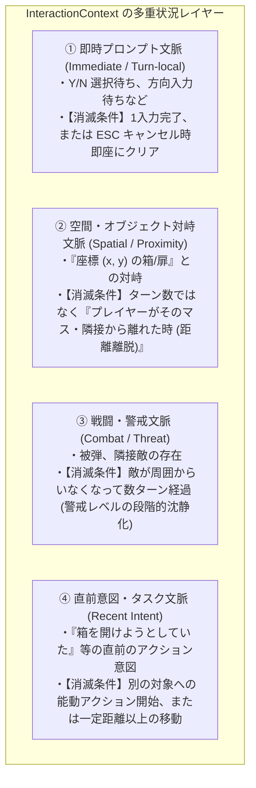
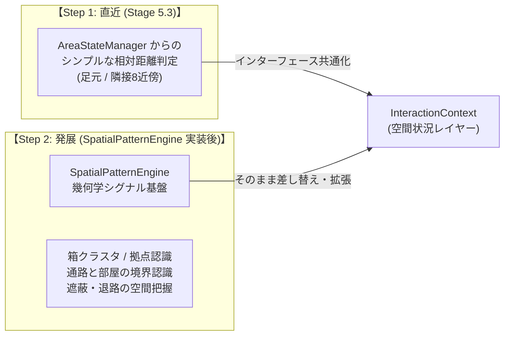

# Phase 5 - Stage 5.3 詳細仕様書
## GKL 状況キャッシュ (SituationCache) のシグナル駆動化と対話コンテキスト (InteractionContext)

---

## 1. 目的とスコープ (Objective & Scope)

### 1.1 背景: 既存の `SituationCache` と状況認識の進化
GKL には既に **`SituationCache.js`（統合状況キャッシュ・SSOT ファサード）** が存在し、`StatusAccessor`, `InventoryStateManager`, `AreaStateManager`, `AttributeStateManager` などを束ねて UI やアドバイザーに「現在の統合状況（`getSituation()`）」を提供しています。
すなわち、**「ゲームの状況を認識・保持する基盤」そのものは元々 GKL に備わっている既存機能**です。

### 1.2 本ステージの真の目的
本ステージの本質は、まったく新しい認識機構をゼロから発明することではなく、以下の **2 つの正常進化** を達成することです：
1. **シグナル駆動によるキャッシュ即時更新**:
   - これまでの「生テキスト（`rawText`）の個別パース」や「ターン完了時の画面・グリフ走査」による受動的な状態同期から、**「WebUICore から発行される状況シグナル（`situationSignal`）をイベントとして購読し、即座に・決定論的にキャッシュを更新する」** パイプラインへと刷新する。
2. **対話・対峙コンテキスト (`InteractionContext`) の統合**:
   - プレイヤーが「今、どの箱や扉と対峙しているか」「戦闘警戒度はどの程度か」という身の回りの対話状態を追跡するサブステート **`InteractionContext`** を `SituationCache` に組み込む。
   - 入力待機やプロンプト発生時に、蓄積された `SituationCache` の全情報（所持品・能力・対峙対象・位置）と掛け合わせて高次の **「第2層: 実施シグナル (Action / Intent Signal)」** を導出・発行する。

---

## 2. アーキテクチャと責務の分離 (Architecture & Responsibilities)

```
       NetHack Wasm (Vanilla C Core)
                    │
                    ▼  (putstr / raw_print / yn_function)
┌────────────────────────────────────────────────────────┐
│  WebUICore (第1層: 状況シグナル基盤)                   │
│   ・MessageContextResolver                             │
│   ・ContextFrameBuffer                                 │
│   ・I/O イベント受信 & テキスト翻訳 (TranslationEngine) │
└───────────────────┬────────────────────────────────────┘
                    │
                    ▼  emit('situationSignal', situationSignal)
                       客観的事象: "施錠された箱がある", "方向入力要求"
┌────────────────────────────────────────────────────────┐
│  GKL (Game Knowledge Layer: 第2層: 現状把握・実施判断)  │
│                                                        │
│  ┌──────────────────────────────────────────────────┐  │
│  │ ★既存の統合状況ファサード: SituationCache       │  │
│  │  (シグナル購読により即時・決定論的に更新)        │  │
│  │                                                  │  │
│  │  ┌────────────────────────────────────────────┐  │  │
│  │  │ 【新設サブステート】InteractionContext     │  │  │
│  │  │  ・多重状況レイヤー (即時 / 空間 / 警戒)   │  │  │
│  │  │  ・空間距離維持 (足元・隣接8近傍)          │  │  │
│  │  │  ・能力評価 (鍵・道具・魔法の有無)         │  │  │
│  │  └──────────────────────┬─────────────────────┘  │  │
│  │                         │                        │  │
│  │  ┌──────────────────────▼─────────────────────┐  │  │
│  │  │ ActionSignalResolver (実施シグナル導出)    │  │  │
│  │  │  ・受動的推奨 (recommendedActions)        │  │  │
│  │  │  ・能動的シーケンス (ActionRecipe)         │  │  │
│  │  │  ・フォーカスなし時の所持品逆引き推測     │  │  │
│  │  └──────────────────────┬─────────────────────┘  │  │
│  │                         │                        │  │
│  │  ・getSituation().interaction として既存UIへ供給 │  │
│  └─────────────────────────┼────────────────────────┘  │
└────────────────────────────┼───────────────────────────┘
                             │
                             ▼  emit('actionSignal', actionSignal)
┌────────────────────────────────────────────────────────┐
│  利用側 (Clients / Controllers)                        │
│   ・SituationCache.getSituation() (既存UIコンポーネント)│
│   ・InteractiveRequestController (IRC: シーケンス実行) │
│   ・コンテナ / 装備モーダルコントローラ                │
│   ・HUD 推奨ボタン / ダイアログハイライト              │
└────────────────────────────────────────────────────────┘
```

---

## 3. InteractionContext の詳細設計 (`src/core/knowledge/context/InteractionContext.js`)

### 3.1 内部ステート設計
```javascript
export class InteractionContext {
    constructor(gkl) {
        this.gkl = gkl;
        this.reset();
    }

    reset() {
        // ① フォーカス候補群 (Multi-Focus Stack / Spatial Candidates)
        this.focusCandidates = {
            atFeet: null,       // 足元の対象 { type, name, isLocked, ttl, pos }
            adjacent: []        // 隣接する対象のリスト [{ type, name, isLocked, direction, ttl, pos }]
        };

        // ② 戦闘・危険状態 (Combat Context)
        this.combat = {
            inCombat: false,        // 直近ターンでの被弾・攻撃有無
            adjacentHostiles: 0,    // 隣接する敵対モンスター数
            dangerLevel: 'NORMAL',  // 'SAFE' | 'NORMAL' | 'WARNING' | 'CRITICAL'
            lastAttackedTurn: -1
        };

        // ③ 直前のアクション履歴
        this.lastAction = {
            turn: 0,
            command: null,
            attempt: null,          // 'UNLOCK', 'FORCE', 'KICK', 'LOOT' 等
            targetType: null
        };
    }
}
```

### 3.2 複数フォーカス候補（Multi-Focus Candidates）の管理
- 単一の `focus` 変数のみでは、「足元に宝箱があり、かつ東隣に鍵のかかった鉄の扉がある」状況で文脈の競合が発生する。
- したがって、空間的位置関係（足元 `atFeet` と隣接 `adjacent`）ごとに候補を独立して保持する。
- プロンプトの性質（例: 方向を問うプロンプトなら `adjacent`、足元アイテムの操作なら `atFeet`）に応じて最適な候補を自動選択する。

### 3.3 単一ターン減衰の限界と「多重状況レイヤー（Multi-Layer Context）」モデル

#### 1. 単一ターン減衰（TTL=1〜2）で生じるジレンマ
時間（ターン数）という単一のタイマーのみでフォーカスを一律に減衰消去させると、以下の問題が生じます：
- **取りこぼし（False Negative）**: 施錠された箱の前に立ち、開けようとした瞬間に敵が接近して **2〜3ターン迎撃**した場合や、インベントリ確認・待機を行っただけで、箱のフォーカスが消滅してしまい元の文脈が失われる。
- **誤爆（False Positive）**: 箱の解錠を諦めて別の部屋へスタスタ歩いていった場合、ターン数が残っていると別の場所で道具を使った際に「さっきの箱」を対象と誤認する。

#### 2. 多重状況レイヤーによる解決
このジレンマを根絶するため、`InteractionContext` は性質の異なる **4 つの独立した状況レイヤー** を管理します：



- **空間・距離ベースの維持（Spatial Retention）**:
  - 足元の箱や隣接する扉は、**ターン数ではなく「プレイヤーがその場（または隣接マス）に留まっている限り維持」** されます。
  - 敵を迎撃しようが、その場で足踏みしようが、**対象の座標と自分の相対距離（チェビシェフ距離 $\le 1$）が保たれていれば文脈は維持**されるため、迎撃後にすぐ「合鍵で開ける」といった推奨が自然に継続します。
  - プレイヤーが 2 歩以上離れた瞬間に、空間コンテキストは安全に消滅し、誤爆を完全に防止します。

- **即時プロンプトの維持・破棄（Immediate Context）**:
  - C コアからの入力要求（`yn_function` 等）は、その質問に回答するか ESC でキャンセルされた瞬間に完全に破棄されます。

### 3.4 FocusEntity が存在しない状態からの直接実行（所持品逆引き推測）
- **シーン**:
  - プレイヤーがあらかじめ対象（箱や扉）に触れておらず、フォーカス候補が空の状態で、いきなり `a` (apply), `z` (zap), `r` (read), `e` (eat) などを押した場合。
- **推測・逆引きロジック**:
  - プロンプト要求（例: *"What do you want to use? [*]"* や *"What do you want to zap? [*]"*）を検知。
  - GKL の `InventoryStateManager` を走査し、該当コマンドで利用可能なアイテム一覧（ItemLetter）を取得。
  - 現在のプレイヤー周辺状況（隣接に敵がいるか、足元に穴があるか等）と照合し、優先度の高いアイテムをサジェスト：
    - 戦闘中 ➔ 攻撃系ワンド、回復ポーション、テレポートの巻物
    - 非戦闘・探索中 ➔ 鍵、解錠具、ツルハシ、照明器具

### 3.5 空間認識の 2段階進化と SpatialPatternEngine との将来連携
空間コンテキストの判定は、将来の拡張を見据えて **2段階のロードマップ** で設計します。



1. **Step 1 (Stage 5.3 直近)**:
   - `AreaStateManager` が保持するプレイヤー座標 `(u.ux, u.uy)` と対象座標から、**「足元（同一マス）または隣接（チェビシェフ距離 $\le 1$）に留まっているか」という直接的な相対距離判定**で空間状況を管理します。
   - これにより、追加の大規模エンジンなしで安全な多重状況管理が即座に成立します。
2. **Step 2 (SpatialPatternEngine 実装後の高度化)**:
   - [`docs/3_gkl/Spatial_Pattern_Engine_Architecture.md`](file:///c:/Users/e3-sh/Documents/GitHub/Nethack-wasm-webUI/docs/3_gkl/Spatial_Pattern_Engine_Architecture.md)（空間幾何学認識エンジン）が実装された段階で、`InteractionContext` の空間プロバイダとして接続。
   - 単なる「隣接」だけでなく、
     - **「集積された箱クラスタの中で今どの箱を操作しているか（ContainerClusterDetector）」**
     - **「部屋の中なのか通路なのか（退路や遮蔽の有無）」**
     - **「祭壇や泉のある聖域・特異空間の中での行動か」**
     といった高度な幾何学的コンテキストが、追加の泥縄コードなしでそのまま実施シグナルの判断材料に供給可能となります。

---

## 4. 実施シグナル生成エンジン (`ActionSignalResolver.js`)

### 4.1 実施シグナルスキーマ定義
```typescript
interface ActionSignal {
    signalId: string;              // 例: 'ACT_CONTAINER_INTERACTION'
    target: {
        type: string;              // 'CONTAINER' | 'DOOR' | 'ITEM' | 'MONSTER'
        name: string;              // 'large box', 'chest', 'iron door'
        isLocked?: boolean;
    };
    
    // ① 受動的プロンプト向け推奨アクション (プロンプト停止時・既存ダイアログ用)
    recommendedActions: Array<{
        label: string;             // UI 表示用ラベル ("鍵で解錠する", "立ち去る")
        actionKey: string;         // 送信キー ('y', 'n', 'd', 'q' 等)
        toolSlot?: string;         // 使用する道具のスロット文字 ('b', 'f' 等)
        method: string;            // 'USE_KEY' | 'PICK_LOCK' | 'FORCE' | 'CANCEL'
        confidence: number;        // 信頼度 (0.0 ~ 1.0)
    }>;

    // ② 能動的ワンタップ推奨操作向け ActionRecipe (IRC シーケンス実行用)
    actionRecipe?: {
        recipeId: string;          // 例: 'UNLOCK_CHEST_WITH_KEY'
        initialSequence: string[]; // 例: ['a', 'b', '.'] (apply -> slot 'b' -> at feet)
        handlers: Array<{
            match: { query: string | RegExp };
            respond: string;
        }>;
    };

    warnings?: string[];           // 警告メッセージ ("鍵がかかっています。無理にこじ開けると中身が破損する恐れがあります。")
}
```

### 4.2 モーダル内外の境界と「プロンプト維持 vs シーケンス実行」の設計
操作シーンによって、実施シグナルの使われ方と責務境界が明確に分かれます。

#### 1. モーダルコントロールの中（コンテナモーダル・装備モーダル内）
- **シーン**:
  - プレイヤーが「コンテナ操作モーダル」や「装備管理モーダル」を開いている最中。
- **ボタン操作のシーケンス実行**:
  - モーダル内の「中身をすべて取り出す」「鍵をかけて閉じる」「この武器を装備する」等のリッチボタンを押した際、コントローラが背後で C コアへ一連のコマンドを **`ActionRecipe`（シーケンス）として一括投入** する。
- **受動的プロンプトの維持**:
  - そのシーケンスの途中で C コアから発行される選択・確認プロンプト（例: *"How many? [all]"* や *"In what direction?"*）は、**無理にモーダル独自UIで完全置換・隠蔽しようとせず、既存のプロンプト機構でシンプルにそのまま受け付ける**。
  - これにより、C コアの予期せぬ分岐や内部挙動との安全な整合性を維持する。

#### 2. モーダルコントロールの外（ダンジョン探索中・poskey 待機時）
- **シーン**:
  - 通常のダンジョン画面で、目の前に施錠された箱や扉がある時。
- **HUD 推奨ボタンからのシーケンス起動**:
  - 画面上に「合鍵で開ける」等の推奨ボタンを表示し、ワンタップで `a` ➔ 鍵スロット ➔ 方向/足元 というシーケンスを IRC 経由で安全に起動する。

---

## 5. 作業手順 (Implementation Steps)

- [ ] **Step 5.3.1**: `src/core/knowledge/context/InteractionContext.js` の新規作成
  - フォーカス候補群（`atFeet`, `adjacent`）、TTL 減衰ロジック、戦闘コンテキスト、能力判定（`assessCapabilities`）の実装。
- [ ] **Step 5.3.2**: `src/core/knowledge/engines/ActionSignalResolver.js` の新規作成
  - 状況シグナルとコンテキストから受動的 `recommendedActions` および能動的 `actionRecipe` を導出するルール群の実装。
  - フォーカスなし直接実行時のインベントリ逆引きロジックの実装。
- [ ] **Step 5.3.3**: `GKLPlugin.js` への統合
  - `interactionContext` と `actionSignalResolver` をインスタンス化し、WebUICore の `situationSignal` を購読して状態更新と `actionSignal` の emit を配線。
- [ ] **Step 5.3.4**: `InteractiveRequestController.js` (IRC) との連携
  - 実施シグナルに含まれる `actionRecipe` を安全に受領し、シーケンス実行を開始できるインターフェースを整備。
- [ ] **Step 5.3.5**: 単体テストの作成と検証
  - `InteractionContext.test.js`（TTL 減衰、複数フォーカス、能力評価のテスト）。
  - `ActionSignalResolver.test.js`（施錠箱＋鍵所持時の推奨アクション導出、フォーカスなし時の逆引きテスト）。

---

## 6. 完了判定基準 (Definition of Done)

1. **コンテキスト追跡精度**:
   - 箱や扉に対するアプローチ時に、足元・隣接の候補が正しく記録され、2ターン経過または移動で確実に TTL 減衰して消去されること。
2. **実施シグナル導出の正確性**:
   - 施錠された箱があり鍵を所持している場合、信頼度 1.0 で合鍵使用の推奨アクションおよび ActionRecipe が生成されること。
   - 鍵も道具もない場合、無理にこじ開ける危険性に関する警告（`warnings`）が含まれること。
3. **非破壊原則の遵守**:
   - 既存のコンテナモーダル・装備モーダル内の操作が 1 つも破壊されず、途中の受動プロンプトが既存通り正常に受け付けられること。
4. **テスト通過**:
   - 新規単体テストを含め、既存 1037 件以上の全テストが 100% パスすること。
