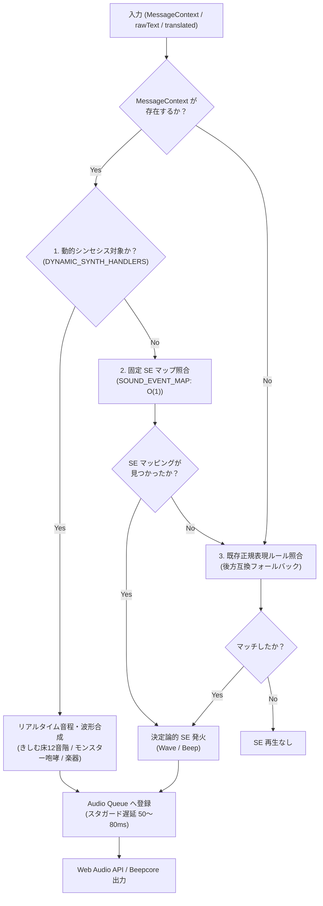
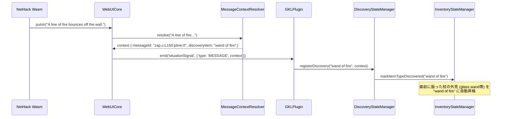

# Phase 5 - Stage 5.4 詳細仕様書
## ドメイン別既存モジュールのメッセージマスタ移行
### (効果音エンジン / 耐性マネージャ / 道具識別エンジン)

---

## 1. 目的とスコープ (Objective & Scope)

### 1.1 背景と現状の課題
Stage 5.2 で確立された「状況シグナル基盤（`MessageContextResolver`）」と Stage 5.3 の「GKL 現状把握（`InteractionContext`）」により、Wasm から出力されるゲーム的事象が構造化されたデータとして利用可能になります。
しかし、現行のドメインモジュール群には、長年の開発経緯から以下のような**文字列依存の負債**が残存しています：
1. **SoundEngine**:
   - 16 種類の正規表現ルールがハードコードされており、毎メッセージごとに全ルールに対して `test()` をループ実行している。
   - 日英混在の正規表現であるため、メンテナンスコストが高く、同一ターン内に大量の SE が重なった際の音潰れ（クリッピング）が発生しやすい。
2. **AttributeStateManager（耐性・状態異常）**:
   - `updateFromMessage(text)` 内で `lower.includes('feel a hot sensation') || lower.includes('火に対する耐性')` のように日英双方のキーワードを直書き。
   - 表記揺れや翻訳の更新に弱く、モンスターのセリフ等による誤爆リスクが存在する。
3. **ItemIdentificationResolver / DiscoveryStateManager（道具識別）**:
   - インベントリ行の文字列パースは行っているが、巻物読解や杖の放射時に画面に現れる効果メッセージからの動的な真名判明（Discovery）がメッセージマスタと直結していない。

### 1.2 目的
- 各ドメインモジュールの入力判定を、C ソースの `messageId` や `domain` に基づく**決定論的ルックアップ（O(1)）**へと刷新する。
- 既存の正規表現・文字列判定は「未マッピング時の安全ネット（フォールバック）」として残しつつ、主軸をメッセージマスタ駆動へ完全移行する。
- 将来の動的音程シンセシス構想（きしむ床の12音階、咆哮のピッチベンド等）を受け入れる拡張スロットを整備する。

---

## 2. Stage 5.4A 詳細設計: 効果音エンジン (SoundEngine) の刷新

### 2.1 シグナル粒度と責務分離アーキテクチャ
コア層（WebUICore / リゾルバ）とサウンド層（SoundEngine）の責務を完全に分離します：
- **WebUICore / MessageContextResolver**: 客観的なゲーム的事象（`messageId`, `domain`, `placeholders`）の同定のみを行い、音響理論（周波数、波形、エンベロープ）には一切関知しない。
- **SoundEngine**: 受信した `MessageContext` に基づき、「固定 SE 再生」か「動的オシレーター合成（シンセシス）」かを自己判断し、Audio Queue を通じて発音する。



### 2.2 Audio Queue とスタガード再生（音潰れ防止）
- **課題**: 「敵に殴られて罠が作動し階段から落ちる」ような複合ターンで、複数の SE が同一ミリ秒に発音され、音割れや重要な音が聞こえなくなる。
- **対策**: `SoundEngine` 内部に **Audio Queue** を導入。
  - 同一ターン内に届いた SE はキューに蓄積され、**50〜80ms のインターバル（スタガード遅延）** を設けて順次再生される。
  - 優先度（`priority`: 例: 死亡 > 被弾 > 移動）によるキュー内ソートを行い、最もクリティカルな音を確実に届ける。

### 2.3 イベントマッピング仕様 (`src/core/sound/SoundEventCatalog.js`)

#### 1. 固定 SE イベントマップ (`SOUND_EVENT_MAP`: O(1))
```javascript
export const SOUND_EVENT_MAP = {
    // 聴覚音全般 (You_hear: 142件)
    'sounds.c:You_hear:0': { seId: 'se_hear_monster', priority: 50 },
    'sounds.c:You_hear:guard': { seId: 'se_guard_whistle', priority: 60 },

    // プレイヤー状態
    'end.c:L120:killer': { seId: 'se_die', priority: 100 },
    'eat.c:L210:You_feel': { seId: 'se_hunger', priority: 40 },
    'eat.c:L450:You': { seId: 'se_eat_food', priority: 30 },

    // 薬品・ポーション
    'potion.c:feel_better': { seId: 'se_drink_good', priority: 60 },
    'potion.c:feel_sick': { seId: 'se_drink_bad', priority: 60 },
    'potion.c:quaff': { seId: 'se_drink_neutral', priority: 30 },

    // 戦闘・呪文・罠
    'uhitm.c:hit': { seId: 'se_attack_hit', priority: 50 },
    'uhitm.c:miss': { seId: 'se_attack_miss', priority: 40 },
    'mhitu.c:damaged': { seId: 'se_player_damaged', priority: 70 },
    'spell.c:cast_ok': { seId: 'se_cast_spell', priority: 60 },
    'spell.c:cast_fail': { seId: 'se_cast_fail', priority: 50 },
    'zap.c:beam': { seId: 'se_wand_zap', priority: 60 },
    'trap.c:triggered': { seId: 'se_trap', priority: 70 },
    'lock.c:door': { seId: 'se_door', priority: 40 }
};
```

#### 2. 動的音程シンセシスハンドラ (`DYNAMIC_SYNTH_HANDLERS`)
[`dynamic_musical_synthesis_concept.ja.md`](file:///c:/Users/e3-sh/Documents/GitHub/Nethack-wasm-webUI/docs/4_sound/dynamic_musical_synthesis_concept.ja.md) の拡張スロットです：
```javascript
export const DYNAMIC_SYNTH_HANDLERS = {
    // 🎵 きしむ床（Squeaky Board）の12音階シンセシス (trap.c)
    'trap.c:squeak_board': (placeholders, context) => {
        const noteStr = placeholders[0] || ''; // "a C note", "an F sharp", etc.
        const distStr = placeholders[1] || ''; // "loudly", "in the distance"
        const freq = parseTrapNoteToFreq(noteStr); // "C note" -> 261.63Hz
        const gain = distStr.includes('distance') ? 0.25 : 1.0;
        return {
            type: 'oscillator',
            wave: 'triangle',
            freq: freq,
            gain: gain,
            duration: 120,
            decay: 'exponential'
        };
    }
};
```

---

## 3. Stage 5.4B 詳細設計: 耐性・状態異常マネージャ (AttributeStateManager) の移行

### 3.1 課題と解決策
- **課題**: `includes('feel a hot sensation') || includes('火に対する耐性')` のような二重キーワード判定。
- **解決策**: C ソースの `eat.c`, `potion.c`, `attrib.c` で耐性が付与されるメッセージ ID を定義した **`INTRINSIC_MESSAGE_MAP`** を導入し、受信時に O(1) で確定更新する。

### 3.2 マッピング仕様 (`src/core/knowledge/data/INTRINSIC_MESSAGE_MAP.js`)
```javascript
export const INTRINSIC_MESSAGE_MAP = {
    // 🔥 火炎耐性 (Fire)
    'eat.c:L351:You_feel:0': { key: 'fire', value: true },
    'potion.c:L210:You_feel:1': { key: 'fire', value: true },

    // ❄️ 冷気耐性 (Cold)
    'eat.c:L355:You_feel:0': { key: 'cold', value: true },

    // ⚡ 電撃耐性 (Shock)
    'eat.c:L359:You_feel:0': { key: 'shock', value: true },

    // 💤 睡眠耐性 (Sleep)
    'eat.c:L363:You_feel:0': { key: 'sleep', value: true },

    // 🧪 毒耐性 (Poison)
    'eat.c:L367:You_feel:0': { key: 'poison', value: true },
    'potion.c:L315:You_feel:0': { key: 'poison', value: true },

    // 🎯 テレポート制御 (Teleport Control)
    'eat.c:L379:You_feel:0': { key: 'teleportControl', value: true },

    // 🧠 テレパシー (Telepathy)
    'eat.c:L387:You_feel:0': { key: 'telepat', value: true }
};
```

### 3.3 AttributeStateManager の拡張
```javascript
processMessageContext(context) {
    if (!context || !context.messageId) return false;

    const mapping = INTRINSIC_MESSAGE_MAP[context.messageId];
    if (mapping) {
        this.acquiredIntrinsics[mapping.key] = mapping.value;
        this._recalculateIntrinsics();
        return true;
    }

    // 未マッピング時の安全ネット（既存フォールバック）
    return this.updateFromMessage(context.rawText || context.translation);
}
```

---

## 4. Stage 5.4C 詳細設計: 道具識別エンジン (ItemIdentification / Discovery) の移行

### 4.1 課題と解決策
- **課題**: 未識別の巻物を読んだり杖を振った際の効果メッセージから、対象アイテムの真名（例: "scroll of identify"）を特定する処理が体系化されていない。
- **解決策**: 効果メッセージ ID と真名の対応表 **`DISCOVERY_MESSAGE_MAP`** を作成し、`DiscoveryStateManager` がこれを購読して直前操作アイテムを自動的に「判明（Discovered）」へ昇格させる。

### 4.2 マッピング仕様 (`src/core/knowledge/data/DISCOVERY_MESSAGE_MAP.js`)
```javascript
export const DISCOVERY_MESSAGE_MAP = {
    // 巻物 (read.c)
    'read.c:L105:pline:0': { itemType: 'scroll of identify' },
    'read.c:L220:pline:0': { itemType: 'scroll of blank paper' },
    'read.c:L310:pline:0': { itemType: 'scroll of teleportation' },
    'read.c:L415:You_feel:0': { itemType: 'scroll of remove curse' },

    // 杖 (zap.c)
    'zap.c:L150:pline:0': { itemType: 'wand of fire' },
    'zap.c:L180:pline:0': { itemType: 'wand of digging' },
    'zap.c:L210:pline:0': { itemType: 'wand of lightning' },

    // 薬品 (potion.c)
    'potion.c:L110:pline:0': { itemType: 'potion of water' },
    'potion.c:L150:You_see:0': { itemType: 'potion of see invisible' }
};
```

### 4.3 連携シーケンス


---

## 5. 作業手順 (Implementation Steps)

### 5.1 Stage 5.4A (SoundEngine)
- [ ] `src/core/sound/SoundEventCatalog.js` を作成し、`SOUND_EVENT_MAP` と `DYNAMIC_SYNTH_HANDLERS` を定義。
- [ ] `SoundEngine.js` に `processMessageContext` および Audio Queue（スタガード遅延 50〜80ms）を実装。
- [ ] `SoundEngine.test.js` に決定論的 SE 発火および Audio Queue の検証テストを追加。

### 5.2 Stage 5.4B (AttributeStateManager)
- [ ] `src/core/knowledge/data/INTRINSIC_MESSAGE_MAP.js` を作成し、耐性メッセージ対応表を定義。
- [ ] `AttributeStateManager.js` に `processMessageContext` を実装。
- [ ] `GKLPlugin.js` で状況シグナルから `attributeStateManager.processMessageContext` を配線。
- [ ] `AttributeStateManager.test.js` にコンテキスト経由の耐性獲得テストを追加。

### 5.3 Stage 5.4C (DiscoveryStateManager)
- [ ] `src/core/knowledge/data/DISCOVERY_MESSAGE_MAP.js` を作成し、効果メッセージ対応表を定義。
- [ ] `DiscoveryStateManager.js` に `processDiscoveryMessage` を実装。
- [ ] `DiscoveryStateManager.test.js` で真名昇格フローを検証。

---

## 6. 完了判定基準 (Definition of Done)

1. **決定論的判定の実現**:
   - SE 再生、耐性獲得、道具判明の主要ルートが正規表現ループなし（O(1) ルックアップ）で動作すること。
2. **音潰れ防止の実証**:
   - 同一ターン内に 3 件以上の SE 要求が発生した際、Audio Queue により 50〜80ms の間隔をあけて整然と再生されること。
3. **安全ネットの維持**:
   - カタログ未登録のメッセージが届いた場合でも、既存のテキスト判定にフォールバックして動作が継続すること。
4. **全テスト通過**:
   - 既存の全テストスイートおよび新規単体テストが 100% パスすること。
