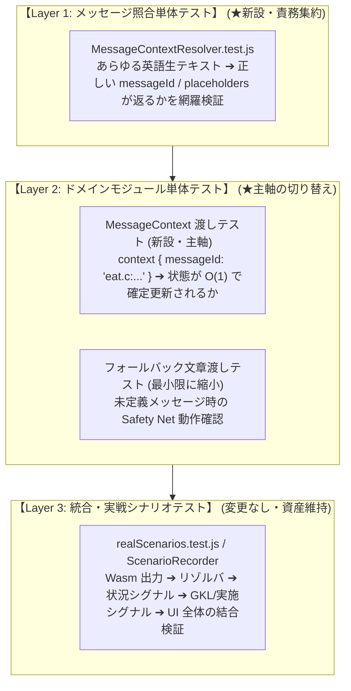

# Phase 5 - Stage 5.5 詳細仕様書
## 言語非依存ロジック（表示と判定の完全分離）と品質保証

---

## 1. 目的とスコープ (Objective & Scope)

### 1.1 背景と現状の課題
Stage 5.1 〜 5.4 を通じて、LORE、状況シグナル、実施シグナル、SE、耐性、道具識別が `messageId` 駆動の決定論的アーキテクチャへと移行しました。
しかし、コードベース内には長年蓄積された「UI 表示用（翻訳後日本語）テキストを覗き見してロジック判定を行う二重キーワード依存」が各所に残存している可能性があります。また、テストスイート（1037件以上）の中にも「日本語文字列を渡して状態変化をアサートする旧世代のテスト」が多く含まれています。

### 1.2 目的
- **表示と判定の 100% 直交化（Orthogonality）**:
  - UI 画面の表示言語（英語、日本語、将来の他言語）や辞書の改訂が、ゲームロジック・音響・状態判定に 1 ミリも影響を与えない構造を確立する。
- **二重キーワードの完全根絶**:
  - `AttributeStateManager`、`SoundEngine`、各種リゾルバから翻訳後文字列（日本語キーワード）への依存を完全に撤廃する。
- **テストピラミッドの再編と総合品質保証**:
  - 「文章渡しテスト」を整理し、「`MessageContext` 渡しテスト」を主軸とした 3層テストピラミッドへ移行する。
  - 辞書を意図的に空にした状態でも全機能が動作することを検証する「翻訳非依存性テスト（`robustness.test.js`）」を新設する。
  - 全テスト（1037件以上）および全 4 クライアント（Vue, React, Solid, Svelte）のビルドを 100% パスさせる。

---

## 2. 多言語透過性の実態と将来プロセス

### 2.1 2 つの明確なフェーズ
本プロジェクトにおける「多言語対応」には、混同してはならない 2 つのフェーズが存在します：

```
┌────────────────────────────────────────────────────────────────────────────────────────┐
│                        多言語・バリアント対応の 2大フェーズ                            │
└────────────────────────────────────────────────────────────────────────────────────────┘

 【フェーズ A: 現行 WebUI (Vanilla Wasm + フロントエンド翻訳)】★Phase 5 の対象スコープ
   ・Wasm コアは Vanilla NetHack 5.0（英語テキストを出力）
   ・課題: UI表示用テキスト（翻訳後日本語）と英語原文の「二重キーワード判定」がコードに散在
   ・Phase 5 の目的: 英語生出力 ➔ messageId ➔ 決定論的ロジックへと一本化し、
     「翻訳辞書（dictionary.csv）の改訂や他言語辞書の適用を行ってもロジックが一切壊れない」状態を確立

 【フェーズ B: 将来の他言語版 Wasm コア対応 (JNetHack Wasm 等)】★将来バリアント拡張時
   ・Wasm コア自体が日本語テキストを出力
   ・プロセス: JNetHack C ソースに対して `extract_source_messages.py` を実行し、
     日本語メッセージマスタおよびカタログ（MessageContextCatalog.ja.js）を新規作成する
   ・Phase 5 の成果の恩恵: ロジック層（GKL / Sound / 耐性 / 識別）が messageId 駆動で純化
     されているため、他言語マスタを差し込むだけでロジック本体の改修ゼロで動作可能となる
```

> [!IMPORTANT]
> **現時点での検証可能性に関する境界線**:
> 現段階では JNetHack 等の他言語版 C ソースに対するメッセージマスタは未作成であり、他言語版 Wasm コアも未配備です。したがって、**現時点で他言語版 Wasm を用いた動作検証を行うことは原理的に不可能であり、検証対象外**とします。
> 
> Stage 5.5 において現実に達成・検証すべき真のゴールは、**「フロントエンドの翻訳後テキスト（日本語）を覗き見している二重キーワード依存をコードベースから完全に根絶し、UI 表示層とゲーム状態判定層を 100% 疎結合にすること」**です。

---

## 3. 二重キーワードの完全撤廃手順

1. **残存キーワードの全数走査**:
   - `src/core/` 配下の全ファイルを走査し、日本語文字列に対する `includes()`, `indexOf()`, 正規表現パターンをリストアップ。
2. **決定論的リゾルバへの集約**:
   - 走査した判定箇所が `MessageContext`（`messageId` / `domain`）経由で判定されていることを確認。
   - `rawText`（英語生出力）のみをフォールバック対象とし、翻訳後文字列への依存コードを安全に削除。
3. **将来の他言語 Wasm 差し込み用ファクトリの準備**:
   - `MessageContextResolver` にバリアント注入インターフェース（`createForVariant(variant)`）を設け、将来 `MessageContextCatalog.ja.js` が投入された際に即座に対応できる拡張性を担保。

---

## 4. テストスイートのシグナル駆動再設計 (3層テストピラミッド)

### 4.1 テスト構造分類と見直し方針

| カテゴリ | 対象領域と代表テスト | テスト内容 | シグナル化による影響度と方針 |
| :--- | :--- | :--- | :--- |
| **カテゴリ A** | 純粋データ・ドメイン計算<br/>(`AllGlyphs`, `Artifact`, `TacticalAdvisor` 等) | glyph 変換、戦術評価、コンテナ計算 | **影響なし（永久資産）**<br/>文字列に依存しない純粋ロジックのためそのまま維持。 |
| **カテゴリ B** | 構造化テキストパース<br/>(`ItemIdentificationResolver`, `Inventory` 等) | インベントリ行、`^X` 画面のパース | **軽微〜中**<br/>インベントリ文字列パース自体は存続。道具判明部のみコンテキスト連携を追加。 |
| **カテゴリ C** | **生文章渡しによる事象検知**<br/>(`AttributeStateManager`, `LoreDetector`, `SoundEngine` 等) | `updateFromMessage('You feel...')`<br/>生の文字列を渡して正規表現や includes が反応するかを検証 | **★大（直撃・見直し対象）**<br/>シグナル化によって本番メインフローから外れ「フォールバック経路のテスト」に陳腐化する。日英二重キーワードテストを整理し、`MessageContext` 渡しテストへ主軸移行。 |
| **カテゴリ D** | 実機シナリオ・プロトコル統合<br/>(`realScenarios.test.js`, `SequenceProtocol` 等) | Wasm 下りイベント再生による全体結合 | **影響なし（回帰防止の砦）**<br/>全体疎結合の実証としてそのまま活用。 |

### 4.2 3層テストピラミッド



---

## 5. 総合品質保証と自動検証仕様

### 5.1 翻訳非依存性（Robustness）自動テスト設計 (`test/unit/robustness.test.js`)
フロントエンド翻訳とゲームロジックが完全に直交していることを客観的に実証するテストです：
1. **テスト条件 1（通常時）**:
   - 通常の `dictionary.csv`（日本語翻訳）を適用した状態で、シナリオを実行。
2. **テスト条件 2（空辞書 / 異言語ダミー辞書）**:
   - `dictionary.csv` を意図的に空、または全ての訳語が `"XYZ_TRANSLATED"` となるダミー辞書に差し替えて同一シナリオを実行。
3. **検証アサート**:
   - 条件 1 と条件 2 で、発行される状況シグナル・実施シグナル・耐性フラグ・SE 発火要求・道具判明結果が **完全一致（100% 同一）** することをアサートする。

### 5.2 全クライアントビルド検証
- Vue, React, Solid, Svelte の全 4 クライアントにおいて `npm run build` を実行。
- 型定義エラー、バンドル未解決、循環参照、サイズ警告が一切発生しないことを確認。

---

## 6. 作業手順 (Implementation Steps)

- [ ] **Step 5.5.1**: コードベース全域の日本語文字列依存（二重キーワード）の走査と除去
- [ ] **Step 5.5.2**: カテゴリ C（生文章渡しテスト）の整理と `MessageContext` 渡しテストへの主軸化
- [ ] **Step 5.5.3**: `test/unit/robustness.test.js`（翻訳非依存性テスト）の実装と検証
- [ ] **Step 5.5.4**: 全単体テストスイート（1037件以上＋新規テスト）の回帰検証
- [ ] **Step 5.5.5**: 全 4 クライアント（Vue, React, Solid, Svelte）のビルド検証

---

## 7. 完了判定基準 (Definition of Done)

1. **二重キーワードのゼロ化**:
   - `src/core/` 配下のロジックコード内に、UI 日本語翻訳テキストに依存する判定が 1 箇所も存在しないこと。
2. **翻訳非依存性の実証**:
   - `robustness.test.js` がパスし、辞書内容に関わらずゲームロジックが 100% 決定論的に動作することが証明されていること。
3. **リグレッションゼロ**:
   - 既存の 1037 件以上のテストが 1 件の失敗もなくパスすること。
4. **全クライアントビルド成功**:
   - Vue, React, Solid, Svelte の各ビルドがエラーなく完了すること。
