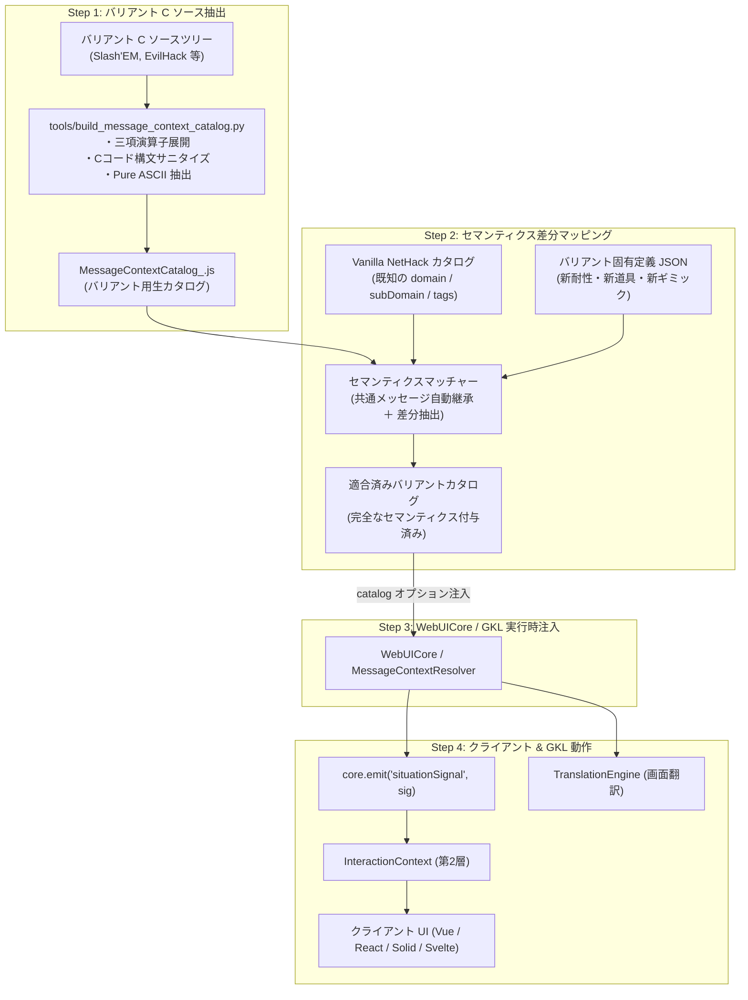

# バリアント用 MessageContextCatalog 生成とクライアント・GKL 適合ガイド
## Variant Message Context Catalog Extraction, Semantic Mapping & Client Adaptation Guide

---

## 1. 概要と基本理念 (Overview & Core Principles)

NetHack には Slash'EM, dNetHack, EvilHack, SporkHack, JNetHack などの多彩な派生バリアントやバージョンが存在します。
本プロジェクト（WebUICore / GKL）において、メッセージシグナル基盤（Stage 5.2〜5.3）は**「C言語原典の行番号やテキスト文字列そのもの」と「クライアント・GKL が解釈する客観的意味（セマンティクス）」を完全に疎結合化**しています。

そのため、新しいバリアントや新バージョンを本システムへ適応させる際も、**UI コンポーネントをバリアントごとに書き直す必要はなく、カタログの抽出と意味マッピング（差分適合）の手順に従うだけで完結**します。

本文書は、将来バリアント用の `MessageContextCatalog` を生成し、クライアント側と安全にマッチングさせるための**想定作業手順・規程**をまとめたものです。

---

## 2. 全体適応ワークフロー (End-to-End Workflow)



---

## 3. 具体的手順 (Step-by-Step Instructions)

### Step 1: バリアント C ソースからのカタログ抽出

1. **対象 C ソースの準備**:
   - バリアントのソースコード（`src/`, `include/`）をワークスペースに配置。
2. **抽出スクリプトの実行**:
   `tools/build_message_context_catalog.py` をパラメータ指定で実行します。
   ```bash
   python tools/build_message_context_catalog.py \
       --src-dir /path/to/variant/src \
       --output src/core/message/data/MessageContextCatalog_slashem.js \
       --variant-name slashem
   ```
3. **サニタイズ処理の確認**:
   - 静的解析ルールにより、C 言語の三項演算子（`cond ? "A" : "B"`）は自動展開され、ポインタ参照（`de->qbuf`）や改行（`\n`）を含む無効コードは自動排除されます。
   - 生成されたカタログが **完全な Pure ASCII（マルチバイト文字 0）** かつ目標ファイルサイズ（< 250KB）に収まっていることを確認します。

---

### Step 2: セマンティクス（意味情報）の差分マッチングとキュレーション

抽出された生メッセージに対し、クライアントや GKL が購読・判断するためのセマンティクスを付与・照合します。

#### 1. 共通メッセージの自動継承 (Auto-Inheritance)
NetHack バリアントのメッセージの 70%〜90% は Vanilla NetHack と同一です。
バニラカタログ（`MessageContextCatalog.js`）とテキスト突合を行い、同一メッセージについては既存の `domain`, `subDomain`, `tags`, `soundKey` を自動引き継ぎします。

#### 2. バリアント固有メッセージの分類付与
バリアントで新規追加されたメッセージ（例: Slash'EM の吸血鬼能力、新テクニック `#technique`、新耐性など）に対し、以下の共通スキーマに基づいてメタデータを付与します：

| 項目 | 型 | 例 | クライアント / GKL での役割 |
| :--- | :--- | :--- | :--- |
| `domain` | `string` | `'CONTAINER'`, `'DOOR'`, `'INTRINSIC'`, `'COMBAT'`, `'SPELL'` | 大分類シグナルルーティング |
| `subDomain` | `string` | `'LOCKED'`, `'RESISTANCE'`, `'TECHNIQUE'` | 中分類判定・アクション候補絞り込み |
| `soundKey` | `string` \| `null` | `'SND_VAMPIRE_BITE'`, `'SND_DOOR_LOCKED'` | SoundEngine 向け O(1) 発火キー |
| `tags` | `Array<string>` | `['vampire', 'undead', 'intrinsic']` | 多面的タグ検索・アドバイザー参照用 |

#### 3. 差分オーバーライドファイルによる管理
バリアント固有の追加・変更ルールは、コードを直接書き換えるのではなく、JSON 形式のオーバーライドファイル（例: `tools/variant_rules/slashem.json`）で宣言的に管理します：
```json
{
  "variant": "slashem",
  "overrides": [
    {
      "match": "You feel a sudden craving for blood!",
      "domain": "INTRINSIC",
      "subDomain": "VAMPIRISM",
      "tags": ["vampire", "hunger"],
      "soundKey": "SND_VAMPIRE_THIRST"
    }
  ]
}
```

---

### Step 3: WebUICore / MessageContextResolver への注入 (Dependency Injection)

WebUICore や照合エンジンへのバリアントカタログの引き渡しは、疎結合なオプション注入（DI）で行います。

```javascript
import { WebUICore } from './core/WebUICore.js';
import { MESSAGE_CONTEXT_CATALOG_SLASHEM } from './core/message/data/MessageContextCatalog_slashem.js';

// バリアント指定で WebUICore を起動
const core = new WebUICore({
    variant: 'slashem',
    messageCatalog: MESSAGE_CONTEXT_CATALOG_SLASHEM
});
```

`MessageContextResolver` 内部では：
- 渡された `messageCatalog` を基に $O(1)$ の `exactMap` および `patternTable` を瞬時にインデックス化します。
- カタログが省略された場合は、デフォルトの Vanilla NetHack カタログ（`MessageContextCatalog.js`）へ自動フォールバックします。

---

### Step 4: クライアント UI および GKL 側の適合と安全保証

#### 1. クライアント UI (Vue / React / Solid / Svelte) の無改造互換
クライアント UI は以下の分離設計により、**バリアントが変わっても UI コード自体の改修は不要**です：
- **操作・判断**: `ActionSignal`（`recommendedActions` や `ActionRecipe`）のみを購読。
- **画面表示**: `TranslationEngine`（`dictionary.csv`）または英語生テキストを表示。
- バリアント独自の新機能（例: `#technique` 専用ボタン）を追加したい場合のみ、UI 側でプラグイン的にボタンを追加します。

#### 2. 未登録・未知メッセージのフォールバック (Safe Fallback)
バリアント独自の未分類メッセージや Mod による未知メッセージが Wasm から届いた場合：
- `MessageContextResolver` は例外を投げず、`domain: 'UNKNOWN'` のプレーンシグナルを安全に発行します。
- 画面翻訳は `TranslationEngine`（辞書・原文そのまま）へフォールバックして通常表示されます。
- **「未登録メッセージのせいでゲームが停止する」事故は 100% 発生しません。**

---

### Step 5: 検証・テスト手順 (Verification & QA)

バリアント用カタログを整備した際は、以下の手順で動作を検証します：

1. **カタログ健全性チェック**:
   ```bash
   # マルチバイト文字、改行ノイズ、Cコード構文の混入がないか検査
   python -c "
   with open('src/core/message/data/MessageContextCatalog_<variant>.js', 'r', encoding='ascii') as f:
       print('Pure ASCII check: OK')
   "
   ```
2. **単体テストでの照合確認**:
   - `tests/core/message/MessageContextResolver.test.js` にバリアントカタログを読み込ませ、代表的な固有メッセージが正しく `domain` / `tags` として解決されるかをテスト。
3. **ベンチマーク確認**:
   - 10,000 件照合ベンチマークで平均レイテンシが **0.1ms 未満**（通常 0.002ms 程度）を維持していることを確認。
4. **全体回帰テスト**:
   - `npm test`（全テスト 100% PASS）および `npm run build:all-examples`（全 4 クライアントビルド PASS）を確認。

---

## 4. マルチバイトローカライズ版（JNetHack等）の特異性とスコープ境界 (Multibyte / Localized Variants)

> [!WARNING]
> **【設計上の境界結論】JNetHack 等のマルチバイト C コアは、通常バリアントの適用方法論が通用せず、事実上「全く別のクライアント基盤をゼロから再構築する」労力に匹敵します。**

Slash'EM や EvilHack 等の「英語圏派生バリアント」と異なり、JNetHack のように **「C 言語コア自体が日本語（UTF-8 / Shift-JIS / EUC-JP）を出力・要求するローカライズ版」** では、本システムが築いてきた前提のほぼ全てが崩壊するため、本手法のスコープ外（非推奨・別プロジェクト扱い）となります。

### 4.1 なぜ「全く別のクライアント構築」に匹敵するのか？

| 領域 | 本システム (Vanilla C + 外付け TranslationEngine) | JNetHack 等 (内部日本語化 C コア) | 波及する影響と再構築コスト |
| :--- | :--- | :--- | :--- |
| **メッセージ照合** | Pure ASCII テキストによる $O(1)$ 高速完全一致 | C コアから直接日本語文字列が出力される | 英語の `MessageContextCatalog`（1,071件）が 1 件もマッチせず全滅。日本語生テキスト用の専用カタログをゼロから再構築が必要。 |
| **かすれ文字推定<br>(床文字考古学)** | ASCII 英語辞書とレーベンシュタイン距離照合 (`El?ereth` ➔ `Elbereth`) | 日本語の床文字（「エル?レス」等）が出力される | 濁点・半濁点のかすれ、全角・半角の混在、形態素解析が必要となり、`EngravingArchaeologist` をゼロから完全再設計が必要。 |
| **願い・虐殺・書込<br>(Wish / Genocide / Write)** | UI は日本語選択 ➔ 内部で英語識別子に逆引きして Wasm へ安全送信 | C コアの内部パーサーが「日本語アイテム名文字列」を直接要求する | 逆引き辞書が使えず、Wasm C コアに直接日本語マルチバイト文字列を投入する専用パーサーと入力エミュレーションが必須。 |
| **文字幅とグリフ座標** | 半角 1 文字 = 1 マス（80×24 の厳密な格子） | 日本語全角文字（2マス幅）の混在 | ターミナル座標・マップグリフ描画、カーソル位置計算、ダイクストラ探索のマップバッファにズレが生じ、`AreaStateManager` 全面改修が必要。 |
| **画面翻訳レイヤー** | `TranslationEngine` が一元的に日本語化 | C コアがすでに日本語化されている | 外付け翻訳を通すと二重翻訳やキー破壊が発生するため、翻訳パイプラインを完全にバイパス・分岐制御が必要。 |
| **文字コード・Shim** | 1 byte = 1 char (ASCII) | EUC-JP / Shift-JIS / UTF-8 | Wasm/Shim の境界ですべての文字列送受信に双方向のエンコーディング変換層が必要。 |

### 4.2 本プロジェクトの確固たるアーキテクチャ方針

本プロジェクト（WebUICore / GKL）の圧倒的な堅牢性・高速性（カタログ照合 0.002ms、1,149テスト 100% PASS、4クライアントビルド互換）は、**「NetHack C コアは純粋な英語 ASCII インフラに徹し、日本語化・UI表示は JavaScript 側の TranslationEngine が一元統制する」** という完全な責務分離によって達成されています。

したがって、将来バリアントを拡張する際も、**「英語 ASCII ベースの Wasm バリアント（Vanilla, Slash'EM, EvilHack, dNetHack 等）」を対象とすることを基本原則**とし、内部マルチバイト C コアへの直接接続は行わないことを明記します。

### 4.3 推奨アプローチ: Cコアを動かすのではなく「対訳辞書 (dictionary.csv)」として抽出・統合する

もし将来「NetHack 5.0 に移植された日本語バリアント（JNetHack 5.0 等）」が登場した場合、C コアそのものを動かそうとする必要はありません。
そのソースツリーや po ファイルから **「英語原文（msgid）と日本語訳文（msgstr）のペア」を一括抽出し、本システムの [`TranslationEngine`](file:///c:/Users/e3-sh/Documents/GitHub/Nethack-wasm-webUI/src/core/TranslationEngine.js)（`dictionary.csv`）にインポート・統合する** ことが最もエレガントかつ安全な解決策となります。

これにより：
- Wasm C コアは安定した Vanilla 5.0（英語 ASCII）のまま変更不要。
- シグナル基盤（`MessageContextCatalog`）も 100% 稼働。
- 床文字考古学（`EngravingArchaeologist`）のレーベンシュタイン復元も 100% 稼働。
- 画面表示や願い（Wish）、図鑑だけが JNetHack 5.0 の高品質な最新日本語訳でフル対応されるという、理想的な恩恵を享受できます。

### 4.4 GKL 構造化ナレッジの差し替え性: 「別ゲームの知識だから作り直す」という健全な境界

バリアントを変更した場合、GKL の構造化ナレッジ（モンスター図鑑、アイテムスペック、耐性、戦術指南）は作り直しになりますが、**これは「バリアントとは実質的にルールが異なる別のゲームである」ため、アーキテクチャ上当然の責務境界**です。

```
┌─────────────────────────────────────────────────────────────┐
│ 共通インフラ層 (どのバリアントでも 100% 共通・再利用)         │
│  • WebUICore / Wasm Driver (入出力・描画・非同期制御)         │
│  • AreaStateManager (マップ記憶・チェビシェフ距離・経路探索)   │
│  • InteractiveRequestController (安全なシーケンス実行)       │
│  • TranslationEngine (辞書ベースの画面翻訳)                  │
├─────────────────────────────────────────────────────────────┤
│ 適合層 (カタログ差し替えで共通稼働)                          │
│  • MessageContextResolver (バリアント別 MessageContextCatalog)│
│  • InteractionContext (対峙フォーカス・TTL・戦闘警戒)        │
├─────────────────────────────────────────────────────────────┤
│ 純粋ドメイン知識層 (バリアントごとに独立パックとして差し替え)  │
│  • StructuredKnowledgeEngine (モンスター・アイテムスペック)  │
│  • TacticalAdvisor (戦術危険度・即死回避ルール)              │
│  • ChemistryKnowledge / PolymorphService (調合・変化ルール)   │
└─────────────────────────────────────────────────────────────┘
```

インフラ・シグナル・マップ探索（Level 1〜2）を一切壊さず、純粋なルール・図鑑（Level 3）だけを「知識パック」として差し替えることができる点こそが、GKL と WebUICore の設計における真の強みです。

---

## 5. チェックリスト (Adaptation Checklist)

バリアント適用作業時のセルフチェックシートです：

- [ ] 対象バリアントが「英語 ASCII ベースの C コア」である（マルチバイト C コアではない）
- [ ] バリアント C ソースコード（`src/`）が手元にある
- [ ] `build_message_context_catalog.py` で生カタログを生成した
- [ ] 生成カタログが Pure ASCII（マルチバイト文字 0、改行 0、C構文 0）である
- [ ] バニラ共通メッセージのセマンティクスが正しく継承されている
- [ ] バリアント固有メッセージ（主要な新ギミック）に `domain` / `tags` を付与した
- [ ] `WebUICore` / `MessageContextResolver` にオプションで差し替え注入できる
- [ ] 未登録メッセージが届いてもクラッシュせず `UNKNOWN` としてフォールバック動作する
- [ ] 全テスト（`npm test`）および全クライアントビルドが通過する

