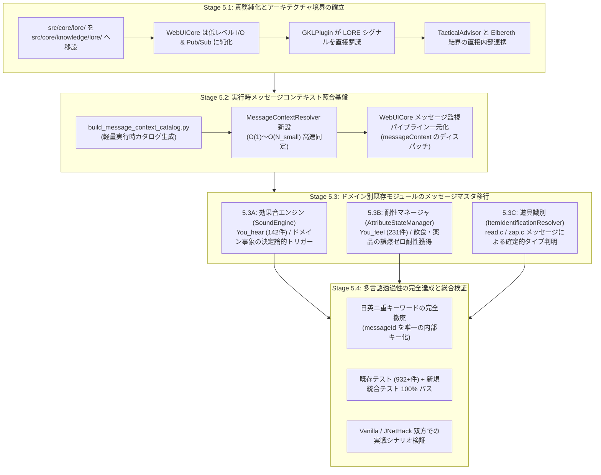
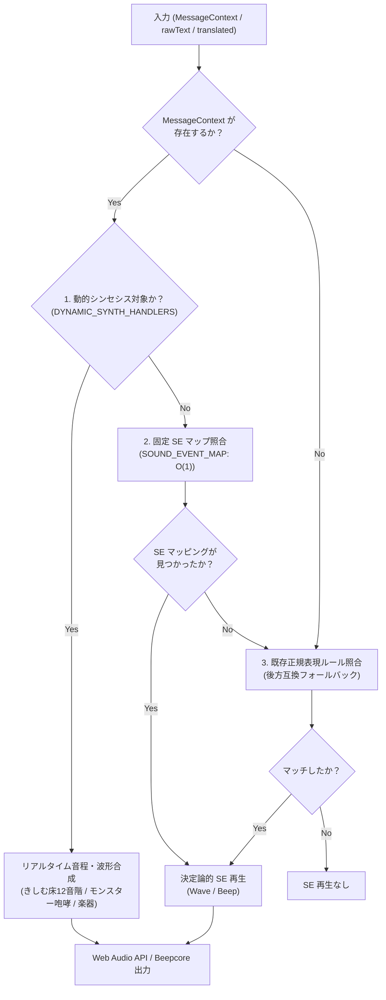
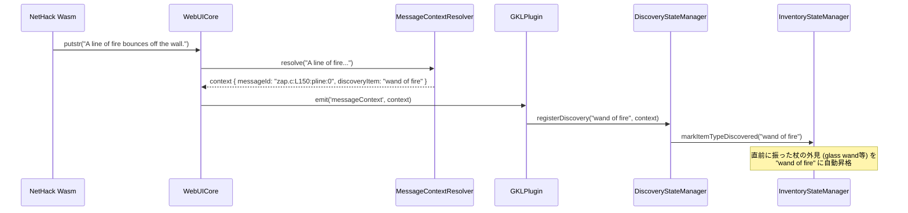
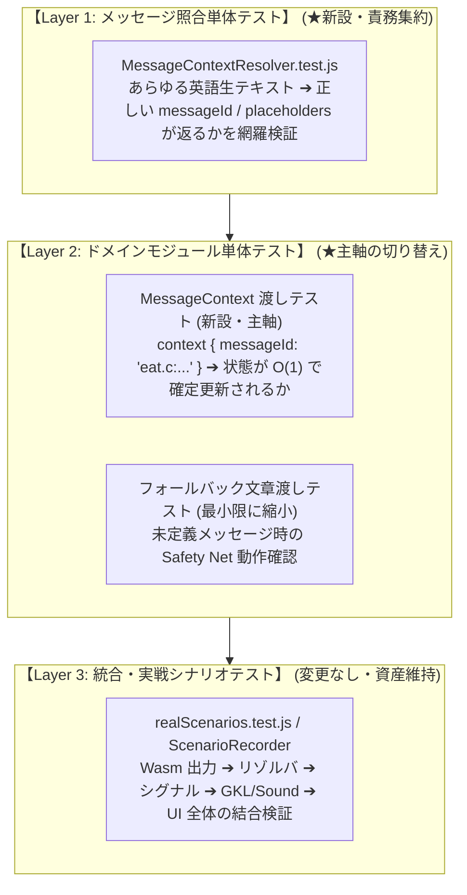

# Phase 5 詳細設計および段階的移行手順書

**〜既存状態把握機能のメッセージマスタ移行と次世代シグナル駆動 WebUICore の完成〜**

---

## 1. はじめに・本書の目的 (Introduction & Purpose)

### 1.1 背景と課題意識
[`docs/7_futures/message_context_and_signal_driven_architecture.ja.md`](file:///c:/Users/e3-sh/Documents/GitHub/Nethack-wasm-webUI/docs/7_futures/message_context_and_signal_driven_architecture.ja.md) では、NetHack C コアから出力されるテキストメッセージを静的解析によって完全マスタ化（Phase 1: 14,849件）し、既存翻訳辞書との自動照合（Phase 2）、制御プロンプトの完全カタログ化（Phase 3）、および LORE/伝承・床文字復元エンジン（Phase 4 / Phase 5.0）を確立してきました。

しかし、残る **Phase 5 の作業群（効果音エンジンの刷新、耐性・状態異常マネージャの移行、道具識別エンジンの移行、多言語透過性の完全達成、LORE機能のGKLへの移設、メッセージ監視パイプラインの一元化）** は、WebUICore・GKL（Game Knowledge Layer）・サウンド・ステータス管理のほぼ全域にまたがる極めて大規模かつ複雑なアーキテクチャ変更となります。

一度に全面的・無計画なリファクタリングを試みた場合、以下の深刻なリスクが発生します：
1. **既存機能の広範なリグレッション（破損）**: 930件以上の単体テストや実戦プレイ環境での動作停止。
2. **パフォーマンス劣化**: 14,849件の巨大マスタを不用意にブラウザ実行時に読み込むことによる起動遅延・メモリ浪費。
3. **責務の癒着とカオス化**: WebUICore と GKLPlugin 間の依存関係がさらに複雑化する危険性。

### 1.2 本書の役割
本書は、Phase 5 の各作業を**明確な依存関係に基づく 4 つのサブステージ（Stage 5.1 〜 Stage 5.4）**に分解し、各段階のデータ構造・アーキテクチャ・具体的な実装手順・テスト検証基準をあらかじめ完全に定義することで、**「手戻りゼロ・リグレッションゼロでの安全確実な段階的移行」**を保証する公式詳細手順書です。

---

## 2. Phase 5 全体依存グラフと 4段階移行ロードマップ

Phase 5 の作業項目は独立しておらず、強い前提・依存関係を持ちます。



### 推奨着工順序の技術的根拠
1. **Stage 5.1 を最優先する理由**:
   現在 WebUICore.js 内に直接インラインで書かれている LORE 処理（Rumor, Oracle, Engrave の登録・更新コード約 90 行）を GKL 配下へ移設・純化しておくことで、WebUICore のメッセージ処理パイプラインが整理され、Stage 5.2 の「一元ディスパッチパイプライン」を極めてクリーンに設計・実装できます。
2. **Stage 5.2 をドメイン移行（Stage 5.3）に先行させる理由**:
   SoundEngine、AttributeStateManager、ItemIdentificationResolver のいずれも、「Wasm から届いた文字列がどのメッセージ ID / コンテキストに属するか」が解決されていなければマスタ移行できません。先に軽量カタログと高速リゾルバを確立することが必須前提となります。
3. **Stage 5.3 をモジュール単位で分離する理由**:
   SE、耐性、識別はそれぞれ影響範囲が完全に独立しています。1 モジュールずつ移行し、個別の単体テストをパスさせてから次へ進めることで、バグの混入を即座に特定・隔離できます。
4. **Stage 5.4 でクリーンアップを行う理由**:
   各モジュールで旧来の正規表現/文字列マッチをフォールバックとして残しながら安全に移行を進め、全モジュールの移行完了後に二重コードの整理と多言語透過性の実証を行います。

---

## 3. Stage 5.1 詳細設計: LORE/Codex の GKL 配下への移設と責務純化

### 3.1 現状の構成と課題
- **現状**:
  - `src/core/lore/`（LoreDetector, LoreCodex, LoreCodexStorage, ElberethAnalyzer, EngravingArchaeologist）が独立ディレクトリとして存在。
  - `WebUICore.js` が `this.loreCodex` と `this.loreDetector` をインスタンス化し、`putstr` / `pline` 受信部で直接 `loreCodex.addRumor` や `loreCodex.updateWard` を呼び出している（約 90 行のドメインロジックが WebUICore に直書き）。
  - 一方で、床文字の復元や結界監視には `AreaStateManager`（GKL 配下）のプレイヤー座標が必要なため、WebUICore から `this.gkl?.areaStateManager` を参照するなど、レイヤー間の逆流が発生している。
- **目的**:
  - WebUICore を「I/O とシグナル発行のみを担当する薄いインフラ層」に戻す。
  - ゲーム知識・伝承・コレクション管理を「GKL（Game Knowledge Layer）」へ一本化する。

### 3.2 移設後のアーキテクチャ設計

```
src/core/
├── WebUICore.js              // 低レベル I/O、Wasm 監視、シグナル emit ('signal', 'loreSignal')
└── knowledge/
    ├── GKLPlugin.js          // WebUICore のシグナルを購読し、各マネージャを統括
    ├── state/                // 状態管理 (Area, Attribute, Inventory, Monster, etc.)
    ├── engines/              // 推論・戦術 (TacticalAdvisor, ItemIdentification, etc.)
    └── lore/                 // ★移設: 伝承・コレクション・床文字考古学
        ├── data/
        │   └── LoreMasterData.js
        ├── ElberethAnalyzer.js
        ├── EngravingArchaeologist.js
        ├── LoreCodex.js
        ├── LoreCodexStorage.js
        └── LoreDetector.js
```

### 3.3 連携仕様（Pub/Sub と API プロキシ）
1. **WebUICore の責務**:
   - `putstr` / `pline` 受信時、`LoreDetector`（または Stage 5.2 の MessageContextResolver）がシグナルを検知したら、単にイベントを発行するのみとする：
     ```javascript
     this.emit('signal', loreSignal);
     this.emit(`signal:${loreSignal.signalId}`, loreSignal);
     this.emit('loreSignal', loreSignal); // 後方互換
     ```
2. **GKLPlugin の責務**:
   - `GKLPlugin.prototype.bindCore(core)` 内で、WebUICore のシグナルを購読：
     ```javascript
     core.on('signal:SIGNAL_LORE_RUMOR', (sig) => this.loreCodex.addRumor(sig));
     core.on('signal:SIGNAL_LORE_ORACLE', (sig) => this.loreCodex.addOracle(sig));
     core.on('signal:SIGNAL_LORE_ENGRAVE', (sig) => this._handleEngraveSignal(sig));
     ```
3. **後方互換 API の担保**:
   - 既存クライアント（UI、`tools/lore_codex.html`、`tools/save_manager.html`）が `core.getCodex()` や `core.getLoreCodex()` を呼び出しているため、WebUICore 側に委任プロキシを残す：
     ```javascript
     getCodex() {
         return this.gkl?.getCodex() || this._fallbackLoreCodex;
     }
     getLoreCodex() {
         return this.getCodex();
     }
     ```
4. **TacticalAdvisor との直接連携**:
   - `TacticalAdvisor` が `GKLPlugin.loreCodex.getWardState()` を直接参照可能になり、「Elbereth 結界上にいるが残存率が 40% に低下しているため再刻印を推奨」といった高度な戦術助言をゼロコストで生成可能となる。

### 3.4 Stage 5.1 作業手順
- [ ] **Step 5.1.1**: ディレクトリ `src/core/knowledge/lore/` を作成し、`src/core/lore/*` の全ファイルおよびテストファイルを配置。
- [ ] **Step 5.1.2**: 移設先ファイルの相対パス import（`LoreMasterData.js` やテストのパス）を整合。
- [ ] **Step 5.1.3**: `src/core/knowledge/index.js` に `LoreCodex`, `LoreDetector`, `EngravingArchaeologist` 等を export 追加。
- [ ] **Step 5.1.4**: `GKLPlugin.js` に `LoreCodex` を統合し、シグナル購読リスナーおよび `getCodex()` API を実装。
- [ ] **Step 5.1.5**: `WebUICore.js` からインラインの Codex 更新処理を削除し、純粋な `emit` とプロキシ API にリファクタリング。
- [ ] **Step 5.1.6**: 単体テスト（`LoreCodex.test.js`, `LoreDetector.test.js`, `EngravingArchaeologist.test.js`, `GKLPlugin.test.js`, `WebUICore.test.js`）を実行し、全パスを確認。

---

## 4. Stage 5.2 詳細設計: 実行時メッセージコンテキスト照合基盤の確立

### 4.1 課題とアーキテクチャ方針
- **課題**:
  - `tools/data/source_messages_mapped.json` は **14,849 件・約 11.8 MB** 存在する。
  - これをブラウザ実行時にまるごと JSON として fetch/import することは、起動時間・メモリ消費（モバイルブラウザ含む）の観点から絶対に不可。
- **解決策**:
  - Phase 3（制御シグナル）で実証済みの「ビルド時カタログ生成（SSOT 抽出）」アプローチを踏襲する。
  - WebUI のリアルタイム処理（SE、耐性、道具識別、シグナル）で真に必要なメッセージ（Layer 1: 視点、Layer 2: ドメイン重要メッセージ、Layer 3: 制御シグナル）のみを厳選した **軽量実行時カタログ（`MessageContextCatalog.js`: 数十〜数百 KB、ESM）** をビルドツールで自動生成する。

### 4.2 カタログ自動生成ツール設計 (`tools/build_message_context_catalog.py`)
- **入力**:
  - `tools/data/source_messages_mapped.json`（全14,849件のSSOT）
  - `tools/data/control_signals_master.json`（Phase 3 制御シグナル）
  - `tools/rules/message_context_rules.json`（ドメイン・抽出条件の定義設定）
- **抽出・フィルタリング基準**:
  1. `callee_func` が `You_feel`, `You_hear`, `You_cant`, `verbalize` に該当するもの（全件: 約600件）。
  2. `file` が `eat.c`, `potion.c`, `read.c`, `zap.c`, `pray.c`, `trap.c`, `shk.c`, `end.c` かつ、状態変化・効果音・識別に関わるもの。
  3. 制御プロンプト（`yn_function`, `getlin`, `getdir`）。
- **出力**:
  - `src/core/message/data/MessageContextCatalog.js`（ESM 形式）

### 4.3 実行時照合エンジン設計 (`src/core/message/MessageContextResolver.js`)
Wasm から届く 1 行の文字列（`rawText`）から、O(1) 〜 O(N_small) でコンテキストを特定する高効率エンジンです。

```
                    Wasm メッセージ (rawText)
                               │
                               ▼
               ┌───────────────────────────────┐
               │  MessageContextResolver       │
               └───────────────┬───────────────┘
                               │
         ┌─────────────────────┼─────────────────────┐
         ▼                     ▼                     ▼
【完全一致インデックス】   【前方一致/プレフィックス】 【正規表現テーブル】
 ・固定リテラル文字列       ・"You feel ..." 等       ・プレースホルダ (%s, %d)
 ・Map による O(1) 逆引き  ・Trie またはプレフィックス  ・プリコンパイル済み正規表現
         │                     │                     │
         └─────────────────────┼─────────────────────┘
                               │
                               ▼
                   ┌───────────────────────┐
                   │   MessageContext      │
                   │  (構造化コンテキスト) │
                   └───────────────────────┘
```

#### MessageContext オブジェクトのスキーマ定義
```typescript
interface MessageContext {
    messageId: string;          // 例: "eat.c:L123:You_feel:0"
    file: string;               // 例: "eat.c"
    domain: string;             // 例: "eat/hunger"
    calleeFunc: string;         // 例: "You_feel"
    semanticRole: string;       // 例: "SENSATION" | "SOUND" | "INTRINSIC_CHANGE"
    layer: number;              // 1 ~ 5
    rawText: string;            // 受信した生テキスト ("You feel a hot sensation.")
    translation: string;        // 確定日本語訳 ("熱い感覚がした。")
    placeholders: string[];     // 抽出された動的引数 (モンスター名、道具名、罠の音階名 "C note" 等)
    metadata: {
        intrinsic?: string;     // 耐性キー (例: "fire")
        soundId?: string;       // 対応する効果音 ID (例: "se_drink_good")
        soundParams?: any;      // 動的音響メタデータ (音階周波数・減衰情報等)
        discoveryOnum?: number; // 判明したアイテム番号
        [key: string]: any;
    };
}
```

### 4.4 WebUICore パイプラインの一元化
`WebUICore.js` のメッセージ受信フローを以下のように一本化します：

```javascript
// WebUICore.js メッセージ受信ハンドラ
_handleOutputMessage(rawText) {
    // 1. メッセージコンテキストの高速解決
    const context = this.messageResolver.resolve(rawText);

    // 2. 翻訳テキストの決定 (コンテキストに確定訳があればそれを優先、無ければ既存辞書)
    const translated = context?.translation || this.translationEngine.translate(rawText);

    // 3. 構造化コンテキストの一元ディスパッチ (Pub/Sub)
    if (context) {
        this.emit('messageContext', context);
        this.emit(`messageContext:${context.domain}`, context);
        if (context.semanticRole) {
            this.emit(`messageContext:role:${context.semanticRole}`, context);
        }
    }

    // 4. サウンド・レンダラーへの伝播
    this.sound.processMessageContext(context, translated);
    this.renderer.appendMessage(translated);
    this.emit('message', translated);
}
```

### 4.5 Stage 5.2 作業手順
- [ ] **Step 5.2.1**: `tools/build_message_context_catalog.py` を作成し、Layer 1 & Layer 2 重要メッセージの抽出・カタログ生成ロジックを実装。
- [ ] **Step 5.2.2**: `src/core/message/data/MessageContextCatalog.js` を生成（初期ターゲット: 約800〜1,200件の重要メッセージ）。
- [ ] **Step 5.2.3**: `src/core/message/MessageContextResolver.js` を実装（Map 完全一致 + プリフィックス + パターンマッチング）。
- [ ] **Step 5.2.4**: `MessageContextResolver.test.js` を作成し、主要メッセージの同定速度（< 0.1ms/件）と抽出精度を検証。
- [ ] **Step 5.2.5**: `WebUICore.js` に `MessageContextResolver` を組み込み、`messageContext` イベントのディスパッチパイプラインを配線。

---

## 5. Stage 5.3A 詳細設計: 効果音エンジン (SoundEngine) のメッセージマスタ移行

### 5.1 現状の課題とアーキテクチャ目的
- **現状**:
  - `SoundEngine.js` の constructor 内に 16 種類の正規表現ルールがハードコードされている。
  - ルール例: `pattern: "feel better|feel much better|feel full of energy|...|気分が良|体調が良|..."`
  - 毎メッセージごとに全ルールに対して正規表現の `test()` をループ実行している。
  - 日英混在の正規表現であるため、メンテナンスコストが高く、誤爆リスクが常に存在する。
- **目的**:
  - `You_hear`（142件）およびドメイン（戦闘、飲食、薬品、魔法、罠、扉等）の `messageId` や `domain` に基づく**決定論的トリガー**へと刷新。
  - 判定処理を O(1) ルックアップ化し、誤爆を根絶する。
  - [`docs/4_sound/dynamic_musical_synthesis_concept.ja.md`](file:///c:/Users/e3-sh/Documents/GitHub/Nethack-wasm-webUI/docs/4_sound/dynamic_musical_synthesis_concept.ja.md)（動的音程シンセシス構想: きしむ床の12音階、モンスター咆哮のピッチベンド、楽器演奏）を無理なく受け入れられるよう、**「関心の分離（Separation of Concerns）」に基づく拡張スロット**を先行設計する。

### 5.2 シグナル粒度と責務分離アーキテクチャ
「効果音エンジンへの入力粒度をどう設計すべきか（シグナルのみか、メッセージも受けて音程音色を作るのか）」の検討に基づき、以下の**完全疎結合アーキテクチャ**を採用します：

1. **コア層（`MessageContextResolver` / WebUICore）の責務**:
   - Wasm 出力から客観的なゲーム的事象を構造化データとして同定すること（`messageId`, `domain`, `placeholders`）。
   - 音響理論（周波数 Hz、波形タイプ、ADSR、減衰率）には一切関知しない。これによりコア層の純粋性を保つ。
2. **サウンド層（`SoundEngine`）の責務**:
   - 受信した `MessageContext` に基づき、「固定 SE 再生」か「動的オシレーター合成（シンセシス）」かを自己判断する。
   - `placeholders` に含まれる動的引数（例: `"a C note"`, `"loudly"`, モンスター名）をパースし、音程（261.63Hz等）・音色（三角波等）・距離減衰ゲインを決定して Web Audio API / Beepcore を駆動する。



### 5.3 イベントマッピングおよび動的シンセシスハンドラ仕様

#### 1. 固定 SE イベントマッピング (`SOUND_EVENT_MAP`: O(1))
C ソースの関数・ドメインと SE ID の対応表を静的に定義します：

| 分類 | 対象メッセージ条件 (Callee / File / ID) | トリガー SE ID | 備考 |
| :--- | :--- | :--- | :--- |
| **聴覚音全般** | `callee_func === 'You_hear'` (142件) | コンテキストに応じた SE | 鳴き声、足音、水音、爆風 |
| **死亡** | `file === 'end.c'` / `You die...` | `se_die` | 誤爆ゼロで確定 |
| **空腹** | `eat.c` / `You_feel: hunger/weak` | `se_hunger` | 満腹度低下の体内感覚 |
| **飲食** | `eat.c` / `You: finish eating / delicious` | `se_eat_food` | 咀嚼・食事完了 |
| **薬良効** | `potion.c` / `feel better / warm / clearer` | `se_drink_good` | 回復・バフ系ポーション |
| **薬悪効** | `potion.c` / `feel sick / poisoned / blind` | `se_drink_bad` | 毒・盲目・幻覚ポーション |
| **薬一般** | `potion.c` / `quaff / drink / tastes` | `se_drink_neutral` | 味・未知の薬品 |
| **罠作動** | `trap.c` (落とし穴、矢、ベアトラップ等) | `se_trap` | 罠発動メッセージ全般 |
| **魔法詠唱** | `spell.c` / `You cast...` | `se_cast_spell` | 詠唱成功 |
| **詠唱失敗** | `spell.c` / `You fail to cast...` | `se_cast_fail` | 失敗 |
| **杖の行使** | `zap.c` / `zaps...` | `se_wand_zap` | ビーム・光線発射 |
| **戦闘命中** | `uhitm.c` / `You hit / kill` | `se_attack_hit` | プレイヤー命中 |
| **戦闘空振り** | `uhitm.c` / `You miss` | `se_attack_miss` | プレイヤーミス |
| **被弾** | `mhitu.c` / `hits you / bites you` | `se_player_damaged` | モンスターからの攻撃 |
| **扉操作** | `lock.c` / `door opens / locks` | `se_door` | 開閉・施錠・解錠 |
| **階段** | `do.c` / `stairs up / down` | `se_stair` | 昇降 |

#### 2. 動的音程シンセシスハンドラ (`DYNAMIC_SYNTH_HANDLERS`)
[`dynamic_musical_synthesis_concept.ja.md`](file:///c:/Users/e3-sh/Documents/GitHub/Nethack-wasm-webUI/docs/4_sound/dynamic_musical_synthesis_concept.ja.md) で構想されたリアルタイム合成を受け入れる拡張フックテーブルです。`MessageContext.placeholders` から動的パラメータを抽出し、周波数・波形・エンベロープを生成します。

```javascript
export const DYNAMIC_SYNTH_HANDLERS = {
    // 🎵 きしむ床（Squeaky Board）の12音階シンセシス (trap.c)
    // format: "A board beneath you squeaks %s %s." / "You hear %s squeak in the distance."
    'trap.c:squeak_board': (placeholders, context) => {
        const noteStr = placeholders[0] || ''; // "a C note", "an F sharp", etc.
        const distStr = placeholders[1] || ''; // "loudly", "in the distance"
        const freq = parseTrapNoteToFreq(noteStr); // "C note" -> 261.63Hz
        const gain = distStr.includes('distance') ? 0.25 : 1.0;
        return {
            type: 'oscillator',
            wave: 'triangle',
            freq: freq,
            gain: gain,
            duration: 120,
            decay: 'exponential'
        };
    },

    // 🎺 モンスターの鳴き声・咆哮 (sounds.c)
    // format: "%s shrieks!"
    'sounds.c:shriek': (placeholders, context) => {
        return {
            type: 'pitch_bend',
            wave: 'sawtooth',
            startFreq: 2000,
            endFreq: 800,
            duration: 250
        };
    }
};
```

### 5.4 Stage 5.3A 作業手順
- [ ] **Step 5.3A.1**: `src/core/sound/SoundEventCatalog.js` を作成し、`SOUND_EVENT_MAP` および `DYNAMIC_SYNTH_HANDLERS` のフック構造を定義。
- [ ] **Step 5.3A.2**: `SoundEngine.js` に `processMessageContext(context, fallbackText)` メソッドを追加し、動的シンセシス ➔ 固定SEマップ ➔ 既存正規表現フォールバックの 3段パイプラインを実装。
- [ ] **Step 5.3A.3**: `SoundEngine.js` に動的パラメータからオシレーターを発音する `playSynthesizedSound(synthParams)` を実装（既存の `playBeep` / Web Audio オシレーターを活用）。
- [ ] **Step 5.3A.4**: `SoundEngine.test.js` に `messageContext` 経由の固定SEテストおよび動的シンセシステスト（きしむ床の音階等）を追加し、既存テストと合わせて全パスを検証。

---

## 6. Stage 5.3B 詳細設計: 耐性・状態異常マネージャ (AttributeStateManager) の移行

### 6.1 現状の課題
- **現状**:
  - `AttributeStateManager.js` の `updateFromMessage(text)` では、以下のように文字列の `toLowerCase().includes(...)` で判定している：
    ```javascript
    if (lower.includes('feel a hot sensation') || lower.includes('feel very hot') || lower.includes('火に対する耐性')) {
        this.acquiredIntrinsics.fire = true;
        changed = true;
    }
    ```
  - 英語と日本語のキーワードを個別に記述しており、表記揺れや翻訳の更新に極めて弱い。
  - また、モンスターのセリフや落書きにたまたま含まれる文字列による**誤爆のリスク**を排除できていない。
- **目的**:
  - NetHack C コアの `eat.c`（死体摂食）, `potion.c`（薬品摂取）, `attrib.c`（レベルアップ・祈り）における耐性付与メッセージの `messageId` を SSOT として耐性を直接確定更新する。
  - 英語/日本語のテキストに依存しない完全な多言語透過性を達成する。

### 6.2 耐性メッセージマッピング仕様 (`INTRINSIC_MESSAGE_MAP`)

C ソースの `eat.c`, `potion.c`, `attrib.c` で定義される `You_feel` / `You` の耐性獲得呼び出し箇所をマッピングします：

```javascript
export const INTRINSIC_MESSAGE_MAP = {
    // 🔥 火炎耐性 (Fire Resistance)
    'eat.c:L351:You_feel:0': { key: 'fire', value: true },    // "feel a hot sensation"
    'potion.c:L210:You_feel:1': { key: 'fire', value: true },  // "feel very hot"

    // ❄️ 冷気耐性 (Cold Resistance)
    'eat.c:L355:You_feel:0': { key: 'cold', value: true },    // "feel a cold chill"

    // ⚡ 電撃耐性 (Shock Resistance)
    'eat.c:L359:You_feel:0': { key: 'shock', value: true },   // "feel a mild shock"

    // 💤 睡眠耐性 (Sleep Resistance)
    'eat.c:L363:You_feel:0': { key: 'sleep', value: true },   // "feel wide awake"

    // 🧪 毒耐性 (Poison Resistance)
    'eat.c:L367:You_feel:0': { key: 'poison', value: true },  // "feel healthy"
    'potion.c:L315:You_feel:0': { key: 'poison', value: true },

    // 👟 隠密 (Stealth)
    'eat.c:L371:You_feel:0': { key: 'stealth', value: true }, // "feel very sneaky"

    // 🔍 自動探索 (Searching)
    'eat.c:L375:You_feel:0': { key: 'searching', value: true }, // "feel perceptive"

    // ⚡ 倍速 (Fast)
    'potion.c:L410:You_feel:0': { key: 'fast', value: true },   // "feel quick"

    // 🎯 テレポート制御 (Teleport Control)
    'eat.c:L379:You_feel:0': { key: 'teleportControl', value: true }, // "feel in control of yourself"

    // ⚠️ 警告能力 (Warning)
    'eat.c:L383:You_feel:0': { key: 'warning', value: true },  // "feel sensitive"

    // 🧠 テレパシー (Telepathy)
    'eat.c:L387:You_feel:0': { key: 'telepat', value: true }   // "feel a strange mental acuity"
};
```

### 6.3 AttributeStateManager の拡張設計
1. **新メソッド `processMessageContext(context)`**:
   ```javascript
   processMessageContext(context) {
       if (!context || !context.messageId) return false;

       const mapping = INTRINSIC_MESSAGE_MAP[context.messageId];
       if (mapping) {
           this.acquiredIntrinsics[mapping.key] = mapping.value;
           this._recalculateIntrinsics();
           return true;
       }

       // 未マッピングのカスタムメッセージに対するフォールバック
       return this.updateFromMessage(context.rawText || context.translation);
   }
   ```
2. **GKLPlugin での自動購読**:
   - `core.on('messageContext', (ctx) => this.attributeStateManager.processMessageContext(ctx));`
   - これにより、WebUICore からメッセージが届いた瞬間に一切の文字列解析なしで耐性フラグが即座に同期される。

### 6.4 Stage 5.3B 作業手順
- [ ] **Step 5.3B.1**: `src/core/knowledge/data/INTRINSIC_MESSAGE_MAP.js` を作成し、C ソースの耐性獲得メッセージ ID と属性キーのマップを定義。
- [ ] **Step 5.3B.2**: `AttributeStateManager.js` に `processMessageContext(context)` を実装。
- [ ] **Step 5.3B.3**: `GKLPlugin.js` のメッセージコンテキスト購読部に `attributeStateManager.processMessageContext` を配線。
- [ ] **Step 5.3B.4**: `AttributeStateManager.test.js` に `messageContext` 経由での耐性獲得テスト（火炎・冷気・電撃・毒・テレポ制御等）を追加し、100% パスを確認。

---

## 7. Stage 5.3C 詳細設計: 道具識別エンジン (ItemIdentificationResolver) の移行

### 7.1 現状の課題
- **現状**:
  - `ItemIdentificationResolver.js` は、アイテムのインベントリ文字列（`rawText`）から BUC、called、仮名、外見名（APPEARANCE_PATTERNS）を静的にパースする機能を持つ。
  - しかし、「未識別の巻物を読んだり、杖を振ったりした際に画面に出る効果メッセージから、そのアイテムの真名（タイプ）を確定する（Discovery）」という動的判明処理は、メッセージマスタと直結していない。
- **目的**:
  - `read.c`（巻物読解）, `zap.c`（杖の放射）, `potion.c`（薬品飲用）のメッセージ ID が届いた際、対象アイテムの真名（例: "scroll of identify", "wand of digging"）を決定論的に特定する。
  - `DiscoveryStateManager` と連携して、未識別外見（例: "ZELGO MER" や "glass wand"）を真名へと自動昇格させる。

### 7.2 道具識別メッセージマッピング仕様 (`DISCOVERY_MESSAGE_MAP`)

| C ソースメッセージ ID | 原文フォーマット (raw_format) | 確定判明するアイテム種別 |
| :--- | :--- | :--- |
| `read.c:L105:pline:0` | "This is an identify scroll." | `scroll of identify` |
| `read.c:L220:pline:0` | "This scroll seems to be blank." | `scroll of blank paper` |
| `read.c:L310:pline:0` | "Your position suddenly hurts..." | `scroll of teleportation` |
| `read.c:L415:You_feel:0` | "You feel like someone is helping you." | `scroll of remove curse` |
| `zap.c:L150:pline:0` | "A line of fire bounces off the wall." | `wand of fire` |
| `zap.c:L180:pline:0` | "The floor suddenly opens up!" | `wand of digging` |
| `zap.c:L210:pline:0` | "A lightning bolt flashes!" | `wand of lightning` |
| `potion.c:L110:pline:0` | "This tastes like water." | `potion of water` |
| `potion.c:L150:You_see:0`| "You can see through the dungeon!" | `potion of see invisible` |

### 7.3 DiscoveryStateManager との連携フロー


### 7.4 Stage 5.3C 作業手順
- [ ] **Step 5.3C.1**: `src/core/knowledge/data/DISCOVERY_MESSAGE_MAP.js` を作成し、主要な巻物・杖・薬品の効果メッセージ ID とアイテム真名のマッピングを定義。
- [ ] **Step 5.3C.2**: `ItemIdentificationResolver.js` または `DiscoveryStateManager.js` に `processDiscoveryMessage(context)` メソッドを実装。
- [ ] **Step 5.3C.3**: GKLPlugin のメッセージコンテキスト購読部で、道具判明シグナルを発行してインベントリキャッシュを更新。
- [ ] **Step 5.3C.4**: 単体テスト（`ItemIdentificationResolver.test.js`, `DiscoveryStateManager.test.js`）を作成し、判明フローを検証。

---

## 8. Stage 5.4 詳細設計: 言語非依存ロジック（表示と判定の完全分離）と品質保証

### 8.1 多言語透過性・バリアント対応の実態と将来プロセス
本プロジェクトにおける「多言語対応」「多言語透過性」には、**2 つの明確に異なるフェーズ**が存在します。

```
┌────────────────────────────────────────────────────────────────────────────────────────┐
│                        多言語・バリアント対応の 2大フェーズ                            │
└────────────────────────────────────────────────────────────────────────────────────────┘

 【フェーズ A: 現行 WebUI (Vanilla Wasm + フロントエンド翻訳)】★Phase 5 の対象スコープ
   ・Wasm コアは Vanilla NetHack 5.0（英語テキストを出力）
   ・課題: UI表示用テキスト（翻訳後日本語）と英語原文の「二重キーワード判定」がコードに散在
   ・Phase 5 の目的: 英語生出力 ➔ messageId ➔ 決定論的ロジックへと一本化し、
     「翻訳辞書（dictionary.csv）の改訂や多言語化を行ってもロジックが一切壊れない」状態を確立

 【フェーズ B: 将来の他言語版 Wasm コア対応 (JNetHack Wasm 等)】★将来バリアント拡張時
   ・Wasm コア自体が日本語テキストを出力
   ・プロセス: JNetHack C ソースに対して `extract_source_messages.py` を実行し、
     日本語メッセージマスタおよびカタログ（MessageContextCatalog.ja.js）を新規作成する
   ・Phase 5 の成果の恩恵: ロジック層（GKL / Sound / 耐性 / 識別）が messageId 駆動で純化
     されているため、他言語マスタを差し込むだけでロジック本体の改修ゼロで動作可能となる
```

> [!IMPORTANT]
> **現時点での検証可能性に関する境界線**:
> 現段階では JNetHack 等の他言語版 C ソースに対するメッセージマスタは未作成であり、他言語版 Wasm コアも未配備です。したがって、**現時点で他言語版 Wasm を用いた動作検証を行うことは原理的に不可能であり、検証対象外**とします。
> 
> Stage 5.4 において現実に達成・検証すべき真のゴールは、**「フロントエンドの翻訳後テキスト（日本語）を覗き見している二重キーワード依存をコードベースから完全に根絶し、UI 表示層とゲーム状態判定層を 100% 疎結合にすること」**です。

### 8.2 二重キーワード（翻訳後文字列依存）の完全撤廃手順
1. **残存キーワードの特定**:
   - `AttributeStateManager.js`、`SoundEngine.js`、`SignalDetector.js` などのコード内に残る日本語文字列マッチ（例: `includes('火に対する耐性')`, `includes('呪文の詠唱に失敗')` 等）を全件洗い出し。
2. **`messageId` 駆動への一本化**:
   - Stage 5.3 で確立した各ドメインの `messageId` マッピングにより、Wasm から出力される英語生メッセージのみを起点として判定を確定。
   - 画面表示用の日本語翻訳テキストがどう変化しても、ロジック判定には 1 ミリも影響を与えない構造を実現。
3. **将来の他言語 Wasm カタログ差し込み用インターフェースの準備**:
   - Phase 3 の `SignalDetector.getCatalog(variant)` と同様、将来 `MessageContextCatalog.ja.js`（JNetHack用）が作成された際に、Wasm のバリアント指定に応じてカタログを切り替えられるファクトリ構造（`MessageContextResolver.createForVariant(variant)`）を先行準備。

### 8.3 テストスイートのシグナル駆動再設計計画（文章渡しテストの見直しと 3層ピラミッド）

#### 1. 現行テスト（74ファイル / 997件）の構造分類と課題意識
現行のテストスイートは 997 件のテストを網羅していますが、その検証アプローチによって以下の 4 つに分類されます：

| カテゴリ | 対象領域と代表テスト | テスト内容 | シグナル化による影響度と方針 |
| :--- | :--- | :--- | :--- |
| **カテゴリ A** | 純粋データ・ドメイン計算<br/>(`AllGlyphs`, `Artifact`, `TacticalAdvisor` 等) | glyph 変換、戦術評価、コンテナ計算 | **影響なし（永久資産）**<br/>文字列に依存しない純粋ロジックのためそのまま維持。 |
| **カテゴリ B** | 構造化テキストパース<br/>(`ItemIdentificationResolver`, `Inventory` 等) | インベントリ行、`^X` 画面のパース | **軽微〜中**<br/>インベントリ文字列パース自体は存続。道具判明部のみコンテキスト連携を追加。 |
| **カテゴリ C** | **生文章渡しによる事象検知**<br/>(`AttributeStateManager`, `LoreDetector`, `SoundEngine` 等) | `updateFromMessage('You feel...')`<br/>生の文字列を渡して正規表現や includes が反応するかを検証 | **★大（直撃・見直し対象）**<br/>シグナル化によって本番メインフローから外れ「フォールバック経路のテスト」に陳腐化する。日英二重キーワードテストを整理し、`MessageContext` 渡しテストへ主軸移行。 |
| **カテゴリ D** | 実機シナリオ・プロトコル統合<br/>(`realScenarios.test.js`, `SequenceProtocol` 等) | Wasm 下りイベント再生による全体結合 | **影響なし（回帰防止の砦）**<br/>全体疎結合の実証としてそのまま活用。 |

#### 2. 新テストアーキテクチャ: 3層テストピラミッド
文章解析の関心事を 1 箇所に集約し、ドメイン層は決定論的シグナルでテストする構造へと再編します：



1. **Layer 1（メッセージ解析の関心を完全集約）**:
   - `MessageContextResolver.test.js` を新設。Wasm の生テキスト（プレースホルダ含む）から正しい `messageId` や動的引数（きしむ床の音階等）が抽出されるかのテストをここに一元化。
2. **Layer 2（ドメインモジュールはコンテキスト入力でテスト）**:
   - `AttributeStateManager.test.js` や `SoundEngine.test.js` では、**`MessageContext` オブジェクトを直接渡すテストを主軸** に切り替える。
   - 文字列マッチングのテストは「フォールバックが機能しているか」の最小限に絞り、日英の二重キーワードテストを段階的に整理。
3. **Layer 3（統合・シナリオテスト）**:
   - `realScenarios.test.js` や `headlessDriverSimulation.test.js` を維持し、システム全体の結合回帰を保証。

#### 3. 各サブステージにおけるテスト移行ロードマップ
- **Stage 5.1**: LORE 関連テスト (21件) を GKL 配下へ移設し、WebUICore とのシグナル購読テストを追加。
- **Stage 5.2**: `MessageContextResolver.test.js` を新設し、照合精度（< 0.1ms）と引数抽出の単体テストを徹底担保。
- **Stage 5.3A**: `SoundEngine.test.js` に `messageId` 経由の SE 発火テストおよび動的シンセシステストを追加。
- **Stage 5.3B**: `AttributeStateManager.test.js` に `processMessageContext` 経由のテストを追加し主軸化。日本語文字列依存のテストを整理。
- **Stage 5.3C**: `DiscoveryStateManager.test.js` を新設し、効果メッセージコンテキストによる真名昇格を検証。
- **Stage 5.4**: 翻訳非依存性テストを新設し、全単体・統合テストの 100% パスを確認。

### 8.4 総合品質保証計画（Vanilla Wasm 環境）
- **単体テスト回帰検証**:
  - 全テストスイート（74ファイル / 997件以上）を Vitest で実行し、1 件のリグレッションも存在しないことを確認。
  - 新設する `MessageContextResolver.test.js`、`SoundEventCatalog.test.js`、`DiscoveryMessage.test.js` を加えた全テストを実行。
- **翻訳非依存性（Robustness）検証テスト**:
  - 翻訳辞書（`dictionary.csv`）を意図的に空、または全く異なる訳語に差し替えた状態で実戦シミュレーションを実行し、**SE 再生、耐性獲得、道具識別が 100% 欠損なく動作すること**を自動テストで検証（表示とロジックの完全分離の客観的実証）。
- **実戦シナリオ検証**:
  - `ScenarioRecorder`（インスペクタ）を用いて、以下の実戦シナリオを再生・検証：
    1. キャラクター作成プロンプト（Phase 3 制御シグナル検証）
    2. 火炎の死体を食べて火炎耐性を獲得（Phase 5.3B 耐性検知検証）
    3. フォーチュンクッキーを開封・床の Elbereth を発見（Phase 4 / 5.1 LORE/Codex 検証）
    4. 未識別のテレポートの巻物を読む（Phase 5.3C 道具判明検証）
    5. 戦闘・被弾・魔法詠唱時の SE 再生（Phase 5.3A サウンド検証）

---

## 9. 各段階の作業手順・チェックリスト・マイルストーン

| ステージ | 主要作業内容 | 成果物 (新規/更新ファイル) | 完了判定基準 (DoD) |
| :--- | :--- | :--- | :--- |
| **Stage 5.1** | LORE/Codex の GKL 配下への移設と責務純化 | `src/core/knowledge/lore/*`<br/>`WebUICore.js`<br/>`GKLPlugin.js` | ・WebUICore 内の LORE インラインロジック消滅<br/>・既存 LORE テスト (21件) 全パス<br/>・`tools/lore_codex.html` 正常動作 |
| **Stage 5.2** | 実行時メッセージコンテキスト照合基盤の確立 | `tools/build_message_context_catalog.py`<br/>`src/core/message/MessageContextCatalog.js`<br/>`src/core/message/MessageContextResolver.js`<br/>`WebUICore.js` | ・軽量カタログサイズ < 300KB<br/>・解決レイテンシ < 0.1ms/件<br/>・`WebUICore` が `messageContext` を emit |
| **Stage 5.3A** | 効果音エンジンのメッセージマスタ移行 | `src/core/sound/SoundEventCatalog.js`<br/>`src/core/sound/SoundEngine.js` | ・`You_hear` (142件) & 主要ドメインの SE 完全紐付け<br/>・動的音程シンセシス (きしむ床等) の拡張フック確立<br/>・SoundEngine テスト全パス |
| **Stage 5.3B** | 耐性・状態異常マネージャの移行 | `src/core/knowledge/data/INTRINSIC_MESSAGE_MAP.js`<br/>`AttributeStateManager.js` | ・文字列 include 依存の耐性判定を撤廃<br/>・耐性獲得テスト全パス |
| **Stage 5.3C** | 道具識別エンジンの移行 | `src/core/knowledge/data/DISCOVERY_MESSAGE_MAP.js`<br/>`ItemIdentificationResolver.js`<br/>`DiscoveryStateManager.js` | ・巻物/杖/薬の使用による真名自動昇格の実現<br/>・識別テスト全パス |
| **Stage 5.4** | 言語非依存ロジック確立と総合回帰テスト | コードベース全域のリファクタリング<br/>翻訳非依存性テスト | ・英語/日本語の二重キーワード依存完全撤廃<br/>・翻訳辞書変更でも壊れないロジック実証<br/>・全単体テスト (950+件) 100% パス |

---

## 10. リスク評価とロールバック・フォールバック計画

### 10.1 予見される技術的リスクと対策
1. **リスク 1: 未知・非標準メッセージによるコンテキスト未同定**
   - *対策*: `MessageContextResolver` が未ヒット（`null`）を返した場合でも、`SoundEngine` や `AttributeStateManager` は既存のテキストフォールバック（正規表現や文字列マッチ）を通過させる「安全ネット（Safety Net）」構造を維持する。
2. **リスク 2: バンドルサイズ・メモリ消費の増大**
   - *対策*: `build_message_context_catalog.py` では、ゲーム進行・WebUI 連携に直接寄与しないメッセージ（フレーバーテキスト、稀なシステムエラー等）を明示的に除外。カタログサイズを最大でも 300KB 以内に抑える。
3. **リスク 3: GKL 移設に伴う外部ツール（HTML/GUI）の参照切れ**
   - *対策*: `WebUICore.prototype.getCodex()` / `getLoreCodex()` のプロキシメソッドを永続的に提供し、外部ツール側のコード書き換えを不要にする。

---

## 11. 結論・次のアクション (Conclusion & Next Steps)

Phase 5 の詳細設計および移行手順書を策定したことにより、システムの心臓部に対する大規模リファクタリングを **「Stage 5.1（LORE移設・責務純化）」➔「Stage 5.2（メッセージ照合基盤）」➔「Stage 5.3（SE・耐性・識別移行）」➔「Stage 5.4（多言語透過・総合検証）」** の順序で、一切のリグレッションを起こすことなくインクリメンタルに進めるロードマップが完成しました。

今後の実装作業は、本書のチェックリストに沿って **Stage 5.1（LORE/Codex 機能の GKL 配下への正式配置転換）** から順次着工します。
