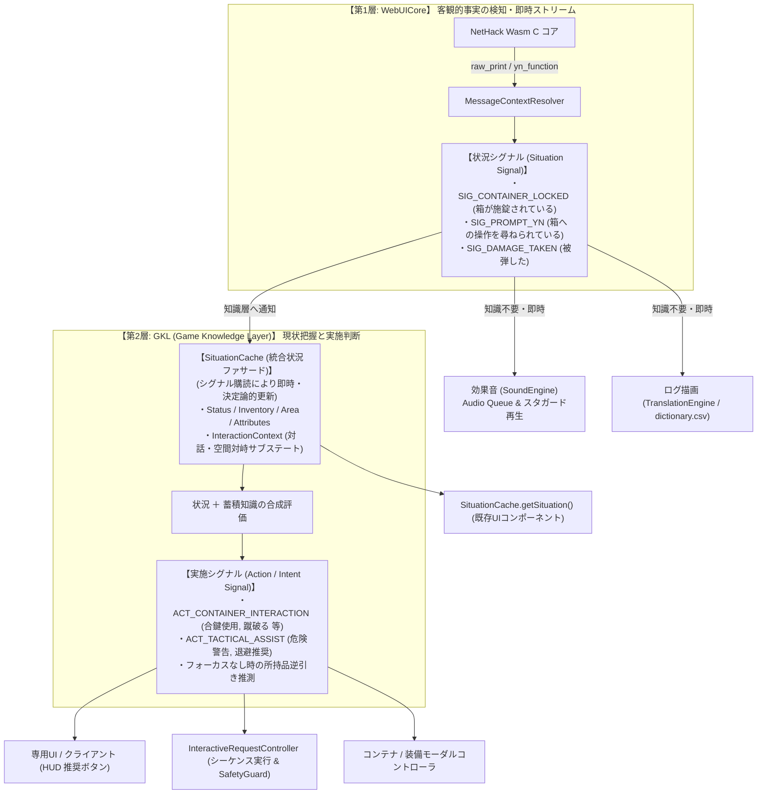
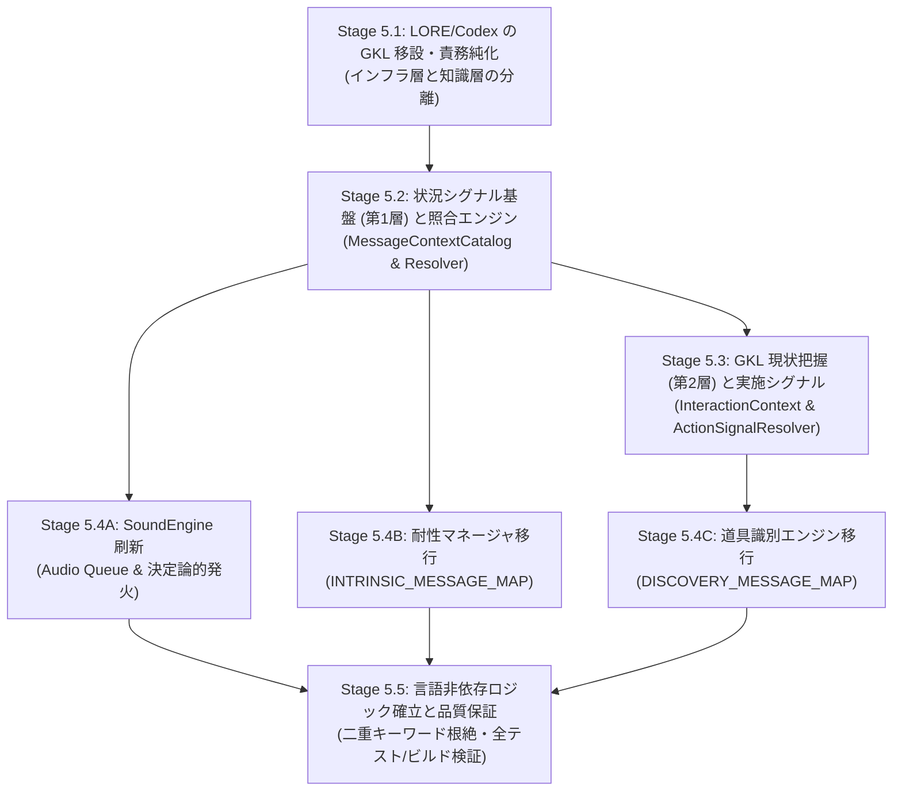

# Phase 5 マスタープランおよび段階的移行計画書

**〜既存状態把握機能のメッセージマスタ移行と次世代シグナル駆動 WebUICore の完成〜**

---

## 1. はじめに・本書の目的 (Introduction & Purpose)

### 1.1 背景と課題意識
[`docs/7_futures/message_context_and_signal_driven_architecture.ja.md`](file:///c:/Users/e3-sh/Documents/GitHub/Nethack-wasm-webUI/docs/7_futures/message_context_and_signal_driven_architecture.ja.md) では、NetHack C コアから出力されるテキストメッセージを静的解析によって完全マスタ化（Phase 1: 14,849件）し、既存翻訳辞書との自動照合（Phase 2）、制御プロンプトの完全カタログ化（Phase 3）、および LORE/伝承・床文字復元エンジン（Phase 4 / Phase 5.0）を確立してきました。

しかし、残る **Phase 5 の作業群（効果音エンジンの刷新、耐性・状態異常マネージャの移行、道具識別エンジンの移行、多言語透過性の完全達成、LORE機能のGKLへの移設、メッセージ監視パイプラインの一元化）** は、WebUICore・GKL（Game Knowledge Layer）・サウンド・ステータス管理のほぼ全域にまたがる極めて大規模かつ複雑なアーキテクチャ変更となります。

一度に全面的・無計画なリファクタリングを試みた場合、以下の深刻なリスクが発生します：
1. **既存機能の広範なリグレッション（破損）**: 1037件以上の単体テストや実戦プレイ環境での動作停止。
2. **パフォーマンス劣化**: 14,849件の巨大マスタを不用意にブラウザ実行時に読み込むことによる起動遅延・メモリ浪費。
3. **責務の癒着とカオス化**: WebUICore と GKLPlugin 間の依存関係がさらに複雑化する危険性。

### 1.2 本マスタープランの役割
本書は、Phase 5 の全体像・アーキテクチャ・依存関係・ロードマップ・総合進捗ダッシュボードを統括する **「マスタープラン（管制塔）」** です。
各作業段階（Stage 5.1 〜 5.5）の詳細仕様・コード設計・手順は、独立した 5 つのサブ仕様書（`docs/7_futures/phase5/stage5_*.ja.md`）に分離・体系化されており、本書からシームレスに参照・追跡できます。

### 1.3 最優先鉄則: 「今できていることを絶対に壊さない」非破壊的移行原則
リポジトリ整理が完了し、**全テスト（1037件）および全クライアント（Vue, React, Solid, Svelte）のビルドが100%通過している現在のクリーンな動作状態を絶対に後退させないこと**を開発の最上位制約と定めます。

1. **既存プロトコル・API の 100% 後方互換維持（Non-Breaking Protocol）**:
   - `WebUICore` の公開イベント（`message`, `putstr`, `inputRequired`, `loreSignal` 等）やプロキシメソッド（`getCodex()`, `getLoreCodex()` 等）は一切廃止・変更せず維持する。
   - 新規シグナル（`situationSignal`, `actionSignal`）は既存のデータフローを阻害しない「追加メタデータ」として非破壊的に流通させる。
2. **既存フォールバックの常時稼働（Safety Net）**:
   - `MessageContextResolver` や `InteractionContext` は、マスタ未ヒット時や未同定時に必ず既存の正規表現・文字列マッチへフォールバックする「二重安全網」を敷く。
3. **既存リッチ機能（コンテナモーダル・装備モーダル）の動作保証**:
   - 既存の専用モーダル操作（コンテナ内の一括操作、装備画面のアイテム選択など）の挙動を破壊せず、シグナル化は「安全なシーケンス実行と補助情報提示」の補佐に徹する。
4. **ステージごとの完全回帰ゲート（Zero-Regression Gate）**:
   - 各 Stage（5.1〜5.5）の完了ごとに、既存 1037 件の全単体テストおよび全 4 クライアントのビルドを必ず 100% パスさせ、1 件でも不合格や警告があれば次へ進まない。

---

## 2. 全体アーキテクチャ: 2段構えシグナルモデル

メッセージシグナル化の刷新にあたり、従来の「1つのシグナルですべて（判定・意味・行動）を表現しようとするアプローチ」から、**「WebUICore は客観事実の報告に徹し、身の回りの状況を踏まえた判断・実施は GKL が担当する」** という **「2段構え（Two-Tier）シグナルアーキテクチャ」** を採用します。

### 3大課題への解決指針
1. **先行メッセージと後続プロンプトのコンテキスト結合**:
   - WebUICore 側は「箱が施錠されている（状況 A）」と「箱に対する YN プロンプトが出た（状況 B）」を素直に通知する。
   - GKL の新設コンテキスト `InteractionContext` が直前メッセージや対峙対象の文脈を束ね、所持品（鍵の有無）を照合して `ACT_CONTAINER_INTERACTION` などの高次実施シグナルへ昇華する。WebUICore にゲーム知識を抱え込ませない。
2. **複数メッセージの発火タイミングと演出順序**:
   - ログ描画・耐性更新・SE は状況シグナルからの**即時ストリーム処理**。
   - SE の音潰れ防止には `SoundEngine` の **Audio Queue & スタガード遅延（50〜80ms）** を導入。
   - GKL 戦術助言やターンサマリは `poskey`（ターン完了）到達時にまとめて確定評価するデュアルパイプラインを採用。
3. **シグナルと表示テキスト（翻訳）の責務分離（二重管理の根絶）**:
   - シグナル層（状況・実施ともに）は機械メタデータ（ID、キー、パラメータ）のみを保持し、多言語テキストを一切持たない。
   - 描画テキストは `dictionary.csv`（`TranslationEngine`）および UI 側リソースに 100% 委任し、完全な直交性を達成する。

---

## 3. ステージ分割と依存関係グラフ (Roadmap & Dependencies)

Phase 5 は、依存関係に基づき以下の 5 つのサブステージに整流化されています。

---

## 4. 各サブステージの概要と詳細仕様書インデックス

各サブステージの設計仕様、内部クラス構成、具体的なコード例、テスト設計、および作業チェックリストは、以下の独立した個別仕様書に詳細化されています。

### 📘 [Stage 5.1: LORE/Codex の GKL 配下への移設と責務純化](file:///c:/Users/e3-sh/Documents/GitHub/Nethack-wasm-webUI/docs/7_futures/phase5/stage5_1_lore_gkl_migration.ja.md)
- **主目的**: WebUICore に直書きされていた伝承・Rumor・床文字解析（約90行）を GKL 配下（`src/core/knowledge/lore/`）へ正式移設し、WebUICore を純粋な I/O インフラ層へと純化する。
- **後方互換**: `core.getCodex()` / `getLoreCodex()` のプロキシメソッドを WebUICore に残し、既存ツール・画面の参照を一切壊さない。

### 📘 [Stage 5.2: 状況シグナル基盤（第1層）と実行時コンテキスト照合の確立](file:///c:/Users/e3-sh/Documents/GitHub/Nethack-wasm-webUI/docs/7_futures/phase5/stage5_2_situation_signals.ja.md)
- **主目的**: 14,849件の巨大マスタから主要メッセージ（約800〜1,200件）を厳選した軽量実行時カタログ（`MessageContextCatalog.js`: < 250KB）を自動生成。
- **照合エンジン**: 生テキストから超高速（< 0.1ms）に同定する `MessageContextResolver` と、直前履歴を管理する `ContextFrameBuffer` を導入し、客観事実としての「状況シグナル（`situationSignal`）」を発行する。

### 📘 [Stage 5.3: GKL 状況キャッシュ (SituationCache) のシグナル駆動化と対話コンテキスト (InteractionContext)](file:///c:/Users/e3-sh/Documents/GitHub/Nethack-wasm-webUI/docs/7_futures/phase5/stage5_3_interaction_context_and_actions.ja.md)
- **主目的**: 既存の統合状況ファサード `SituationCache` をシグナル購読駆動へと進化させ、そのサブステートとして対話・対峙コンテキスト `InteractionContext` を統合。
- **高度な文脈制御**:
  - **多重状況レイヤー管理**: 単一ターン減衰のジレンマ（迎撃による取りこぼし vs 離脱時の誤爆）を克服し、「即時プロンプト」「空間距離」「戦闘警戒」「直前意図」の4層で文脈を安全に管理。
  - **空間認識の2段階進化**: 直近は `AreaStateManager` による相対距離（同一マス/隣接8近傍）で対象との対峙を維持し、将来は `SpatialPatternEngine`（箱クラスタ・幾何学認識）とそのまま接続可能とする設計。
  - フォーカスなし直接実行時の所持品逆引き推測（ItemLetter 提案）。
  - モーダル内（コンテナ/装備モーダル内）のボタン操作シーケンス実行と受動的プロンプトの維持。

### 📘 [Stage 5.4: ドメイン別既存モジュールのメッセージマスタ移行](file:///c:/Users/e3-sh/Documents/GitHub/Nethack-wasm-webUI/docs/7_futures/phase5/stage5_4_domain_modules_migration.ja.md)
- **Stage 5.4A (SoundEngine)**:
  - 16種の正規表現ループを廃止し、`You_hear`（142件）等の決定論的 O(1) 発火へ刷新。
  - Audio Queue によるスタガード再生（50〜80ms遅延）で複合ターンの音潰れを根絶。動的音程シンセシス（きしむ床12音階等）の拡張スロットを先行配備。
- **Stage 5.4B (AttributeStateManager)**:
  - `INTRINSIC_MESSAGE_MAP` を導入し、死体摂食・薬品摂取・レベルアップ時の耐性獲得を O(1) 確定更新。
- **Stage 5.4C (DiscoveryStateManager)**:
  - `DISCOVERY_MESSAGE_MAP` を導入し、巻物や杖の効果メッセージから直前使用アイテムの真名を自動昇格。

### 📘 [Stage 5.5: 言語非依存ロジック（表示と判定の完全分離）と品質保証](file:///c:/Users/e3-sh/Documents/GitHub/Nethack-wasm-webUI/docs/7_futures/phase5/stage5_5_quality_assurance_and_i18n.ja.md)
- **主目的**: コードベース全域から UI 表示用（翻訳後日本語）テキストを覗き見している二重キーワード依存を完全に根絶。
- **テストピラミッド再編**: 生文章渡しテストを整理し、決定論的 `MessageContext` 渡しテストを主軸化。
- **品質保証**: 翻訳辞書を空にしてもロジックが 100% 動作する「翻訳非依存性テスト（`robustness.test.js`）」を実証。全テスト（1037件以上）および全 4 クライアント（Vue, React, Solid, Svelte）のビルドを 100% 通過させる。

---

## 5. マスタースケジュール・進捗ダッシュボード・総合 DoD

| ステージ | 主要作業内容 | 成果物 (新規/更新) | 完了判定基準 (DoD) | 状態 |
| :--- | :--- | :--- | :--- | :---: |
| **Stage 5.1** | LORE/Codex の GKL 配下への移設と責務純化 | `src/core/knowledge/lore/*` `WebUICore.js` `GKLPlugin.js` | ・WebUICore 内の LORE 直書き消滅 ・既存 LORE テスト (21件) 全パス ・既存 Codex ツール正常動作 | 準備完了 (仕様書済) |
| **Stage 5.2** | 状況シグナル基盤と実行時コンテキスト照合の確立 | `tools/build_message_context_catalog.py` `src/core/message/MessageContextCatalog.js` `src/core/message/MessageContextResolver.js` `src/core/message/ContextFrameBuffer.js` `WebUICore.js` | ・軽量カタログサイズ < 250KB ・解決レイテンシ < 0.1ms/件 ・`WebUICore` が `situationSignal` を emit | 準備完了 (仕様書済) |
| **Stage 5.3** | GKL 状況キャッシュのシグナル駆動化と対話コンテキスト | `src/core/knowledge/context/InteractionContext.js` `src/core/knowledge/engines/ActionSignalResolver.js` `src/core/knowledge/state/SituationCache.js` `GKLPlugin.js` `InteractiveRequestController.js` | ・SituationCache のシグナル即時更新 ・多重状況レイヤー・空間距離維持の動作 ・施錠箱＋鍵所持時の `ACT_CONTAINER_INTERACTION` 導出 ・モーダル内外シーケンス実行とプロンプト維持 ・IRC 連携テスト全パス | 準備完了 (仕様書済) |
| **Stage 5.4A** | 効果音エンジンの刷新 (Audio Queue & スタガード) | `src/core/sound/SoundEventCatalog.js` `src/core/sound/SoundEngine.js` | ・決定論的 SE 発火 (O(1)) ・同一ターン内 SE の音潰れ防止 (50〜80ms) ・動的シンセシス拡張スロット確立 | 準備完了 (仕様書済) |
| **Stage 5.4B** | 耐性・状態異常マネージャの移行 | `src/core/knowledge/data/INTRINSIC_MESSAGE_MAP.js` `AttributeStateManager.js` | ・文字列 include 依存の耐性判定を撤廃 ・耐性獲得テスト全パス | 準備完了 (仕様書済) |
| **Stage 5.4C** | 道具識別エンジンの移行 | `src/core/knowledge/data/DISCOVERY_MESSAGE_MAP.js` `ItemIdentificationResolver.js` `DiscoveryStateManager.js` | ・巻物/杖/薬の使用による真名自動昇格の実現 ・識別テスト全パス | 準備完了 (仕様書済) |
| **Stage 5.5** | 言語非依存ロジック確立と総合品質保証 | コードベース全域のリファクタリング `test/unit/robustness.test.js` | ・英語/日本語の二重キーワード依存完全撤廃 ・辞書差し替えでも壊れないロジック実証 ・全単体テスト (1037+件) 100% パス ・全 4 クライアントビルド成功 | 準備完了 (仕様書済) |

---

## 6. リスク評価とロールバック・フォールバック計画 (Risk Management)

### 6.1 予見される技術的リスクと対策
1. **リスク 1: 未知・非標準メッセージによるコンテキスト未同定**
   - *対策*: `MessageContextResolver` が未ヒット（`null`）を返した場合でも、`SoundEngine` や `AttributeStateManager` は既存のテキストフォールバック（正規表現や文字列マッチ）を通過させる「安全ネット（Safety Net）」構造を維持する。
2. **リスク 2: バンドルサイズ・メモリ消費の増大**
   - *対策*: `build_message_context_catalog.py` では、ゲーム進行・WebUI 連携に直接寄与しないメッセージ（フレーバーテキスト、稀なシステムエラー等）を明示的に除外。カタログサイズを最大でも 250KB 以内に抑える。
3. **リスク 3: GKL 移設に伴う外部ツール（HTML/GUI）の参照切れ**
   - *対策*: `WebUICore.prototype.getCodex()` / `getLoreCodex()` のプロキシメソッドを永続的に提供し、外部ツール側のコード書き換えを不要にする。
4. **リスク 4: 複数ターンの文脈引きずりによる誤爆**
   - *対策*: `InteractionContext` に TTL（1〜2ターン）および移動時減衰ロジックを義務付け、古い文脈の自動破棄を徹底する。

---

## 7. 結論・次のアクション (Conclusion & Next Steps)

Phase 5 の設計検討・合意形成、および全詳細ドキュメントの分割整理が完了しました。
親ドキュメントである本書は **「全体アーキテクチャ・非破壊原則・進捗ダッシュボード」を統括するマスタープラン** としてスリム化され、各サブステージ（Stage 5.1 〜 5.5）の詳細仕様書が体系的に整いました。

これにより、**「今できていること（全テスト1037件パス・全クライアントビルド・既存コンテナ/装備モーダル操作）を絶対に壊さない」** 状態を 100% 保証しながら、極めて見通し良く安全に刷新を進められる完全なドキュメント体系が確立されました。

今後の実装着工（Stage 5.1: LORE/Codex の GKL 配下への移設と責務純化）は、クォータ回復を待って、本書および個別仕様書の作業手順に沿って順次着手します。
