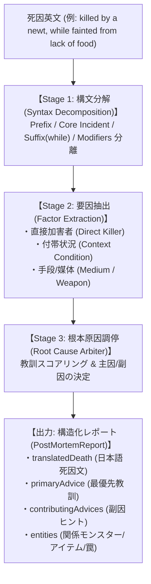

# 事後ナレッジ連携＆戦術アドバイザー刷新 設計構想 (Future Vision)

- **文書ID**: `DOC-FUTURE-POST-MORTEM-ADVICE-01`
- **対象領域**: Core Knowledge層 (`PostMortemKnowledgeResolver.js`, `ADVICE_DEFINITIONS.js`) / UI層 (`scoreboard.html`, ゲームオーバー画面)
- **ステータス**: `構想登録 (Draft / Future Feature)`
- **最終更新**: 2026-10-08

---

## 1. 背景と目的

NetHack 5.0対応の単体スコアボード画面 (`tools/scoreboard.html`) およびゲームオーバー画面において、NetHackが出力する生の死因テキスト（英文）を解析し、日本語化および戦術アドバイザー (`ADVICE_DEFINITIONS.js`) / GKL (Game Knowledge Layer) と連動する基盤 `PostMortemKnowledgeResolver.js` を導入した。

現状は主要な基本死因構文（`killed by`, `died of starvation`, `petrified`, `choked on`, `drowned`, `ascended`, `quit`）の翻訳と初期的なアドバイス接続が動作しているが、NetHack特有の多様で残酷な死因パターンに対しては、**「直接原因（トドメ）と根本原因（無力化）の二重構造」**や**「修飾句による辞書マッチ阻害」**といった課題が存在する。

本構想は、将来的な「アドバイスシステム全体の包括的刷新」のマイルストーンとして、死因解析の精度向上、プレイヤーにとって実用的で納得感のある「敗因分析・サバイバル教訓」の提供方式、およびアーキテクチャ設計を体系的にまとめたものである。

---

## 2. 設計原則とコアドメイン概念

### 2.1 SSOT (Single Source of Truth) の堅持
- ヒントやモンスター情報を個別ハードコードせず、既存マスターデータ（`ADVICE_DEFINITIONS.js`、`MONSTER_JP_MAP`、`OBJECT_JP_MAP`、`MONSTER_KNOWLEDGE_MAP` 等）を一元参照する。

### 2.2 直接死因 (Direct Finisher) vs 根本原因 (Root Cause) の分離
プレイヤーが知るべきは「何にトドメを刺されたか」だけでなく、**「何が致命的な隙を生み、回避すべき真の教訓だったのか」**である。
- **直接死因 (Direct Finisher)**: HPを0にした直接の攻撃者・事象（例: `a newt`, `a goblin`）
- **根本原因 (Root Cause)**: 回避可能かつ致命的な無力化状態・引き金（例: `fainted from lack of food`, `frozen by a floating eye`, 手袋なし死体接触）

---

## 3. 解析パイプライン アーキテクチャ

単一の正規表現マッチングから、多段パイプライン方式へと昇格する。

### 3.1 Stage 1: 構文分解 (Syntax Decomposition)
NetHack 5.0 の Cソース（`src/topten.c` の `formatkiller()`）の出力仕様に準拠して分解する：
$$\text{DeathString} = [\text{Prefix}] + [\text{Core Incident / Entity}] + [\text{Helpless Suffix}]$$

1. **Suffix (`while`) の先行分離**:
   - 末尾の `(?:,\s+)?while\s+(.+)` を抽出し、無力化理由（`gm.multi_reason`）を独立取得。
2. **Prefix（動詞句）の分離**:
   - `killed by `, `choked on `, `poisoned by `, `died of `, `drowned in `, `burned by `, `dissolved in `, `crushed to death by `, `petrified by `, `turned to slime by `
3. **修飾子のトークナイズ**:
   - 冠詞: `a`, `an`, `the`
   - 所有格: `his own`, `her own`, `their own`
   - 状態形容詞: `invisible`, `peaceful`, `tame`, `hostile`
   - 固有名詞/別名: `called "..."`, `, the shopkeeper`, `, priest of <God>`

### 3.2 Stage 2: 要因抽出 (Factor Extraction)
- クレンジング後のコア名詞を `MONSTER_JP_MAP` / `OBJECT_JP_MAP` / `MONSTER_KNOWLEDGE_MAP` で逆引き。
- 罠（Pit, Dart, Spikes, Drawbridge）、環境（Lava, Pool, Moat）、神罰（Wrath of...）等のキーワード辞書とマッチング。

### 3.3 Stage 3: 根本原因調停 (Root Cause Arbiter)
- 付帯状況と直接死因の危険度・学習価値をスコアリングし、最優先で提示すべきアドバイスを選出する。

---

## 4. 死因パターンの体系的分類（NetHack 5.0準拠マトリクス）

| カテゴリ | 英文パターン例 | 特徴・抽出ターゲット | 紐付けるべきアドバイス |
| :--- | :--- | :--- | :--- |
| **① 生理的・自滅死 (Physiological)** | `died of starvation` `choked on a meatball` `strangled by an amulet of strangulation` `system shock` | 飢餓、窒息、首絞め、過度なポリモーフショック | `ADVICE_SURVIVAL_STARVATION` 窒息・首絞め対策 |
| **② モンスター直接脅威 (Direct Monster)** | `killed by an orc` `killed by a master mind flayer` `killed by a floating eye` `crushed to death by a minotaur` | モンスター名、特殊攻撃（知性吸い・石化・麻痺視線・毒） | `ADVICE_THREAT_MIND_FLAYER` `ADVICE_THREAT_FLOATING_EYE` `ADVICE_THREAT_POISON` など |
| **③ 自爆・跳ね返り・操作事故 (Player Mishap)** | `blasted by a bolt of lightning bounced off a wall` `killed by exploding a wand of striking` `petrified by touching a chickatrice corpse without gloves` `killed by a wand of striking exploding in a bag of holding` | プレイヤー自身の行為が引き金。 ・杖過充電爆発 ・手品袋爆発 ・反射光線 ・手袋なし死体接触 | `ADVICE_HAZARD_BAG_OF_HOLDING_EXPLOSION` `ADVICE_HAZARD_PETRIFY_CORPSE` 跳ね返り注意ヒント |
| **④ 環境・罠・地形死 (Environmental & Trap)** | `fell into a pit of iron spikes` `crushed to death by a collapsing drawbridge` `burned by molten lava` `drowned in a moat` `caught in a fire trap` | 罠種別（落とし穴、鉄の杭、跳ね橋）、水場、溶岩 | `ADVICE_HAZARD_LAVA` `ADVICE_HAZARD_WATER` `ADVICE_HAZARD_TRAP` |
| **⑤ 神罰・禁忌行動 (Divine Wrath & Taboo)** | `killed by the wrath of Anhur` `killed by the anger of Tyr` `killed by kicking a wall` `killed by trying to pray too soon` | 神の怒り、祈りインターバル不足、壁キック事故 | 寺院寄付・祈りディレイ管理アドバイス |

---

## 5. 主因 vs 寄与要因の調停ロジック (RCA)

### 判定ルール例
1. **無力化状態優先原則**:
   - `killed by a newt, while fainted from lack of food`
     - 直接打撃: `newt`（脅威度: Very Low）
     - 付帯状況: `fainted from lack of food`（教訓スコア: 1000 - 飢餓・祈り教訓）
     - **判定**: `ADVICE_SURVIVAL_STARVATION` を最優先教訓（Primary）とし、死因文は「飢餓で気絶中にイモリに倒された」と翻訳。
   - `killed by a goblin while frozen by a floating eye`
     - 直接打撃: `goblin`
     - 付帯状況: `frozen by a floating eye`
     - **判定**: `ADVICE_THREAT_FLOATING_EYE` を最優先教訓とする。
2. **操作ミス・自爆事故優先原則**:
   - プレイヤー操作によって引き起こされた事故（手袋なしコカトリス接触、手品袋の異次元爆発など）は、モンスターの通常攻撃よりも回避可能性が高いため、最優先教訓とする。

---

## 6. 戦術アドバイザー (`ADVICE_DEFINITIONS.js`) 連動拡張一覧

### 6.1 既存定義へのマッピング
- 毒死 $\rightarrow$ `ADVICE_THREAT_POISON`
- マインドフレア脳食い死 $\rightarrow$ `ADVICE_THREAT_MIND_FLAYER`
- スライム化死 $\rightarrow$ `ADVICE_THREAT_GREEN_SLIME`
- 水没・溺死 $\rightarrow$ `ADVICE_THREAT_DROWNING` / `ADVICE_HAZARD_WATER`
- 溶岩死 $\rightarrow$ `ADVICE_HAZARD_LAVA`
- 手品袋爆発 $\rightarrow$ `ADVICE_HAZARD_BAG_OF_HOLDING_EXPLOSION`
- 店主の逆鱗 $\rightarrow$ `ADVICE_THREAT_PEACEFUL_SHOPKEEPER`

### 6.2 新規追加検討アドバイス
- `ADVICE_SURVIVAL_BOUNCED_RAY`: 壁反射による自爆光線対策（角度・反射の盾・耐性）
- `ADVICE_HAZARD_DRAWBRIDGE`: 跳ね橋開閉巻き込み即死対策
- `ADVICE_SURVIVAL_DIVINE_WRATH`: 神の怒り・祈りインターバル超過対策

---

## 7. TDD検証用コーパス仕様 (Corpus Benchmark)

| No | 入力死因英文 | 期待される分類 | 期待される最優先教訓 | 備考 |
| :--- | :--- | :--- | :--- | :--- |
| 1 | `killed by a newt, while fainted from lack of food` | `STARVATION` | `ADVICE_SURVIVAL_STARVATION` | 付帯状況優先 |
| 2 | `killed by a goblin while frozen by a floating eye` | `THREAT_MONSTER` | `ADVICE_THREAT_FLOATING_EYE` | 麻痺原因優先 |
| 3 | `killed by an elf while sleeping` | `THREAT_MONSTER` | 睡眠注意 / エルベレス | 行動不能フラグ |
| 4 | `blasted by a bolt of lightning bounced off a wall` | `BOUNCED_RAY` | 反射・耐電教訓 | 自爆光線 |
| 5 | `killed by exploding a wand of striking` | `ITEM_MISHAP` | 杖過充電教訓 | 杖爆発 |
| 6 | `petrified by touching a chickatrice corpse without gloves` | `PETRIFICATION` | `ADVICE_HAZARD_PETRIFY_CORPSE` | 手袋未着用 |
| 7 | `crushed to death by a collapsing drawbridge` | `HAZARD_ENVIRONMENT` | 跳ね橋注意教訓 | トラップ即死 |
| 8 | `dissolved in molten lava` | `HAZARD_ENVIRONMENT` | `ADVICE_HAZARD_LAVA` | 溶岩即死 |
| 9 | `killed by an invisible master mind flayer called Bob` | `THREAT_MONSTER` | `ADVICE_THREAT_MIND_FLAYER` | 修飾子・別名クレンジング |
| 10 | `killed by Mr. Morgan, the shopkeeper` | `THREAT_MONSTER` | `ADVICE_THREAT_PEACEFUL_SHOPKEEPER` | 店主識別 |
| 11 | `turned to slime by a green slime` | `TURNED_SLIME` | `ADVICE_THREAT_GREEN_SLIME` | スライム化 |
| 12 | `killed by the wrath of Anhur` | `DIVINE_WRATH` | 神の怒り教訓 | 天罰 |

---

## 8. 将来の実装ロードマップ (Implementation Phases)

- [ ] **Phase 1: 構文分解とクレンジング基盤の刷新**
  - `PostMortemKnowledgeResolver.js` を Stage 1〜3 に分離。
  - 接尾辞 `while ...` および修飾子のトークナイザーを実装。
- [ ] **Phase 2: TDDコーパスの実装と検証**
  - コーパスベンチマークテストの作成と回帰防止。
- [ ] **Phase 3: 根本原因調停器 (Root Cause Arbiter) の実装**
  - スコアリングによる主教訓・副因の二重構造化。
- [ ] **Phase 4: ADVICE_DEFINITIONS 拡張とUI反映**
  - 跳ね返り・跳ね橋等の新規アドバイス追加。
  - スコアボード画面およびGameOverモーダルでの多層ナレッジ表示の洗練。
