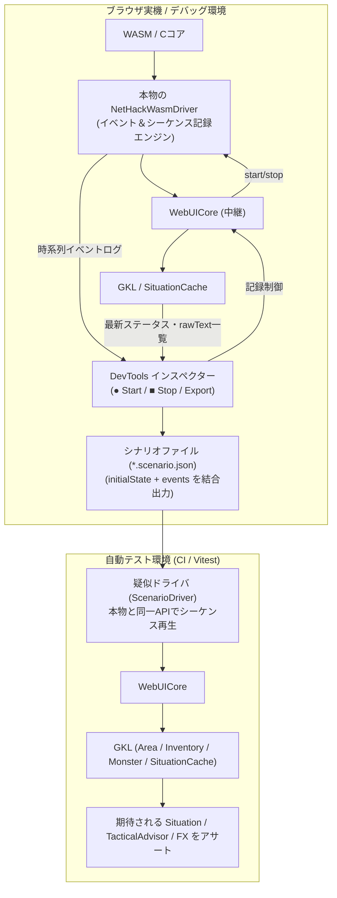

# イベントキャプチャ ＆ 疑似ドライバによる統合・シナリオテスト設計構想書
(Scenario Testing and Event Capture Architecture)

本文書は、NetHack WASM WebUI において、**実ゲームのイベントストリームをキャプチャし、疑似ドライバ（ScenarioDriver）で再生することで、WebUICore および Game Knowledge Layer (GKL) の複数機能連携を一気通貫で検証する「統合・シナリオテスト基盤」** の設計構想および運用方針をまとめた仕様決定書である。

---

## 1. 背景と目的 (Background & Motivation)

### 1.1 現状のテスト基盤（単体テスト）の到達点と課題
現在、プロジェクトには 338 件の単体テスト（Unit Test）が存在し、全件 PASS を維持しています。これらは個別のモジュール（パース計算、辞書引き、ナレッジ変換など）の正確性を高精度に保証しています。

しかし、実際のゲームプレイでは以下の **垂直統合パイプライン（システム縦串）** が常時連動して動作します：

```
[WASM/Cコア] 
   ⬇ (低レベルイベント: print_glyph, curs, status_update, messageText)
[NetHackWasmDriver] 
   ⬇ (イベント中継)
[WebUICore] 
   ⬇ (公開イベント自律購読)
[GKL (AreaStateManager / MonsterTracker / InventoryStateManager)]
   ⬇ (統合現況データ生成)
[SituationCache] 
   ⬇ (戦術・行動評価)
[TacticalAdvisor & AssistSignalSynthesizer] 
   ⬇ (演出・通知)
[UI & Visual FX (fx_trigger)]
```

単体テストだけでは、「マップ描画・ステータス変動・メッセージログが連続して流れた際、各マネージャーが矛盾なく連携し、最終的に正しい戦術助言やシグナルを組み立てられているか」という **時系列・複数機能連携の整合性** を保証することが困難でした。

### 1.2 ナレッジ連動型テストファクトリ（5章）との関係・レイヤー分離
ドキュメント（`docs/3_gkl/GKL_Knowledge_SSOT_and_Tactical_Integration_Architecture.md` 5章）で定義されているテストファクトリ（`createTestItem` 等）は、**「単体テストにおいて、関数に渡すモックオブジェクトの型安全性・完全性を担保する（部品レベル）」** ための仕組みです。

対して本文書が定義する構想は、**「時系列のイベントストリームを流し、システム全体を通しで検証する（結合・シナリオレベル）」** というテストピラミッドの上位レイヤーに位置づけられ、互いに補完し合う関係となります。

---

## 2. コア設計原則 (Core Architecture Principles)

1. **通信最前線（NetHackWasmDriver）をイベント＆シーケンス記録エンジンとする**:
   * Cコアとの生の I/O 通信と `queueSequence`（および解決済みバッファ）を直接握っている `NetHackWasmDriver` を記録の実体とする。
   * WebUICore はドメイン知識を持たない純粋なインフラとして記録制御をドライバーへ中継するのみに徹する。
   * 記録フラグ OFF 時は 1 行のフラグチェックのみとし、通常プレイ時のオーバーヘッドをゼロにする。
2. **インスペクターによる initialState スナップショット統合とエクスポート (SoC)**:
   * WebUICore はドメイン情報を持たないため、DevTools インスペクターが常時購読・保持している自己の情報（最新ステータス、GKL / SituationCache の `rawText` 一覧）から `initialState` を組み立てる。
   * インスペクターは「開始 / 終了 / 結合エクスポート」に専念し、編集機能やスライサー等の余計なロジックを抱え込ませない。
3. **ピンポイントキャプチャの原則**:
   * 長時間の録画ではなく、「目的の行動の直前に開始し、結果が出たら終了する（1〜2ターン）」運用を基本とし、ノイズ混入を初期段階で最小化する。
4. **盤面再現を GKL の既存資産に委譲する (Leverage GKL SSOT)**:
   * シーケンスからテスト側で盤面を独自に再構築しようとせず、キャプチャした生のイベント列をダミードライバ経由で WebUICore に流し込む。
   * これにより、既存の `AreaStateManager` や `SituationCache` が本番と全く同一のコードパスで自走し、完璧に盤面と現況を復元する。

---

## 3. システム構成 (Architecture Overview)



### 3.1 NetHackWasmDriver: イベント＆シーケンス記録エンジン (Driver Layer)
Cコアとの低レベル I/O 通信の最前線である `NetHackWasmDriver` が、実際の通信ストリームを直接キャプチャします。

* `driver.startRecording()`: 記録フラグを ON にし、イベントバッファを初期化。
* `driver.stopRecording()`: 記録を停止し、収集された時系列イベント列（配列）を返却。
* **素のシーケンスとバッファの完全捕捉**:
  * 受信イベント（`print_glyph`, `curs`, `status_update`, `messageText`, `inputRequired` 等）を時系列順に記録。
  * `queueSequence(tokens)` の呼び出し時、渡された `tokens` と、Cコアから収集して解決した `lastSequenceBuffer`（テキスト配列）をペアとして同一タイムライン配列へ正確に記録。

### 3.2 WebUICore: 記録制御中継 (Infrastructure Layer)
WebUICore はゲーム知識を持たない純粋なインフラ層として、インスペクターからの記録要求をドライバーへ中継するファサードに専念します。

* `core.startRecording()` ➔ `this.driver.startRecording()`
* `core.stopRecording()` ➔ `return this.driver.stopRecording()`

### 3.3 専用モジュール: `ScenarioRecorder` (Recorder & Message Debugger)
既存の `DebugInspector`（未翻訳収集・ログ監視等の多機能ツール）の肥大化を防ぐため、シナリオ処理に特化した独立モジュール **`ScenarioRecorder.js`**（プラグインまたは独立ツール）として分離・実装します。

* **役割と機能**:
  * **極小コントロールバー**: 画面隅に邪魔にならないフローティング UI（[● REC] [■ Stop] [💾 Export]）を配置。
  * **リアルタイム・シーケンスプレビュー (メッセージデバッガー機能)**:
    * キャプチャ中、ドライバーを流れるイベント（`print_glyph`, `curs`, `status`, `messageText`, `queueSequence`）がリアルタイムに 1 行ずつパラパラとプレビュー表示される。
    * **効果**: 「いま目的の敵の出現や攻撃、インベントリ同期がちゃんとキャプチャに含まれたか」をその場で目視確認でき、録り逃しや無駄な手戻りを 100% 防止できる。
  * **`initialState` の自動抽出 ＆ 結合エクスポート**:
    * 記録終了時、GKL / SituationCache から最新のステータス情報および所持品 `item.rawText` 配列・習得魔法をサッと抜き出して `initialState` を構成。
    * ドライバーから回収した時系列ストリームと結合し、`scenario_[timestamp].json` として一発出力。

### 3.4 疑似ドライバ: `ScenarioDriver`
テスト実行環境（Node.js / Vitest）で、本物の `NetHackWasmDriver` の代役を務める軽量モック。

* `loadScenario(scenarioDataOrPath)`: シナリオ JSON を読み込む。
* `playInit()`: `initialState` に記録された初期イベント（`status_update`, `curs`, 周辺の `print_glyph`）を WebUICore へ `emit` する。
* `playUntilTurn()`: `inputRequired: POSKEY`（ターン入力待ち）に達するまで時系列イベントを順次 `emit`。
* `stepNextTurn()`: 
  * **ステップ実行（ターン送りモード）**: 次の `inputRequired: POSKEY` に達した瞬間に一時停止（Promise を resolve）する。
  * **効果**: 一気に最後まで流してしまうと途中の状態変化が上書きされてしまう問題を防ぎ、**「MonsterTracker の確信度減衰（Decay Model）」や「ターン経過に伴うメッセージ・警告の推移」を 1 ターンずつ観察・検証可能** にする。
* `queueSequence(tokens)`: 
  * 複雑なコマンド解釈・翻訳ロジックは持たず、初期スナップショット（`initialState.silentBuffers.i` 等）やタイムラインに記録された `resolvedBuffer` をそのまま即座に返却（即答型モック）。
* **SituationCache の自律再現**:
  * SituationCache（完成品）を直接無理に流し込むのではなく、**初期イベントと rawText バッファをドライバから流すことで、GKL の各マネージャーが自然に自走して必要な範囲の SituationCache を自動生成** します。

---

## 4. シナリオデータ形式 (Scenario JSON Schema)

```json
{
  "version": "1.0",
  "meta": {
    "title": "浮遊する目玉遭遇と麻痺警告",
    "description": "目隠し未装備の状態で浮遊する目玉に隣接した際の戦術助言およびアシストシグナルの検証",
    "createdAt": "2026-08-29T18:00:00.000Z",
    "turn": 142
  },
  "initialState": {
    "status": { "hp": 15, "maxHp": 15, "dlevel": "dungeon:1", "x": 10, "y": 5 },
    "initialEvents": [
      { "type": "status_update", "data": { "field": 18, "value": 15 } },
      { "type": "curs", "data": { "x": 10, "y": 5 } }
    ],
    "silentBuffers": {
      "i": [
        "a - a blessed +1 long sword (weapon in hand)",
        "b - an uncursed blindfold",
        "c - 2 potions of extra healing"
      ],
      "+": [
        "a - force bolt          1      5%  unknown"
      ]
    }
  },
  "events": [
    { "type": "print_glyph", "data": { "x": 11, "y": 5, "glyph": 300, "glyphInfo": { "char": "e", "type": "MONSTER" } } },
    { "type": "messageText", "data": { "text": "You see here a floating eye." } },
    { "type": "inputRequired", "data": { "category": "POSKEY" } }
  ]
}
```

---

## 5. 運用フローと活用サイクル (Operational Workflow)

```
[1. ピンポイント記録]
実機プレイ中、テストしたい盤面の直前に「開始」➔ 行動後に「終了」➔ JSONエクスポート
   ⬇
[2. テンプレート化・派生シナリオ生成]
取得したリアルな JSON を「金型」として、Glyph ID やステータス値を書き換えてエッジケースを量産
   ⬇
[3. テストコードへの組み込み]
tests/scenarios/ または test/fixtures/ に配置し、Vitest で通しアサーションを記述
   ⬇
[4. CI/ローカルでの自動回帰防止]
WASM不要・ミリ秒実行で、機能改修時にも一気通貫パイプラインのデグレードを 100% 防止
```

### 派生シナリオ（クローン生成）の活用例
1 つの基本戦闘キャプチャ（例: ゴブリン遭遇）から、JSON の一部を差し替えるだけで多種多様なテストケースを瞬時に作成できます：
* **Glyph ID を差し替える**:
  * 浮遊する目玉（麻痺警告テスト）
  * コカトリス（素手石化警告テスト）
  * ガス胞子（近接爆発警告テスト）
  * 銀弱点の悪魔（銀特効提案テスト）
* **HP フィールドを差し替える**:
  * HP 15 ➔ HP 2（瀕死・緊急回復シグナルテスト）
* **インベントリの所持状態を差し替える**:
  * 目隠し「所持中・未装備」vs「未所持」

---

## 6. テストコードの実装例 (Vitest Integration Example)

```javascript
import { describe, it, expect } from 'vitest';
import { WebUICore } from '../../src/core/WebUICore.js';
import { ScenarioDriver } from '../helpers/ScenarioDriver.js';
import floatingEyeScenario from '../fixtures/scenarios/floating_eye_adjacent.json';

describe('GKL 統合シナリオテスト: 浮遊する目玉遭遇', () => {
    it('目玉隣接時に TacticalAdvisor と AssistSignal が正しく連携すること', async () => {
        // 1. 疑似ドライバにシナリオをロード
        const driver = new ScenarioDriver(floatingEyeScenario);
        
        // 2. WebUICore を初期化（GKL も自動で attach される）
        const core = new WebUICore({ driver });

        // 3. シナリオを再生（ターン入力待ちまでイベントを流し込む）
        await driver.playUntilTurn();

        // 4. 複数マネージャーが連携した結果の「最終 Situation」を検証
        const situation = core.gkl.getSituation();

        // TacticalAdvisor の警告内容を検証
        const hasParalysisWarning = situation.tacticalAdvice.warnings.some(
            w => w.id.includes('PARALYSIS') || w.textJa.includes('麻痺')
        );
        expect(hasParalysisWarning).toBe(true);

        // AssistSignalSynthesizer が推奨する最優先アクションを検証
        expect(situation.assistSignal.level2Text).toContain('目隠し');
        expect(situation.assistSignal.recommendedAction).toBeDefined();
    });
});
```

### 6.2 ステップ実行 ＆ テスト用一括診断サマリー (`getDiagnosticSummary`)
テストごとに `silentSyncTracker` の回数やログ配列、モンスター追跡変数を個別に探索・手動記述する負担を解消するため、**GKL 側にテスト用の一括診断サマリー API（`core.gkl.getDiagnosticSummary()`）** を設けます。

これを Vitest の **スナップショットテスト（`toMatchInlineSnapshot`）** と組み合わせることで、**「記述量を最小限にしつつ、ターン経過に伴う同期回数・追跡確信度の減衰・演出トリガーの推移」** を 1 行で丸ごと検証できます。

```javascript
describe('MonsterTracker 減衰モデルの経過テスト (ステップ実行)', () => {
    it('視界外離脱からターン経過に伴う確信度減衰と警告解除を1ターンずつ追跡すること', async () => {
        const driver = new ScenarioDriver(lostSightScenario);
        const core = new WebUICore({ driver });

        // 【Turn 1】 敵と隣接 (確信度 100% / 警告発出)
        await driver.stepNextTurn();
        expect(core.gkl.getDiagnosticSummary()).toMatchInlineSnapshot(`
          {
            "assistAction": "EQUIP_BLINDFOLD",
            "emittedFx": [],
            "lastMessage": "You see here a floating eye.",
            "syncCounts": { "inventory": 1, "skills": 0, "spells": 0 },
            "trackedMonsters": [{ "confidence": 1, "isAdjacent": true, "name": "floating eye" }],
            "turn": 1,
            "warnings": ["THREAT_FLOATING_EYE_PARALYSIS"]
          }
        `);

        // 【Turn 2】 角を曲がって視界外へ (確信度が 0.8 に減衰)
        await driver.stepNextTurn();
        const diag2 = core.gkl.getDiagnosticSummary();
        expect(diag2.trackedMonsters[0].confidence).toBeCloseTo(0.8);
        expect(diag2.warnings).toHaveLength(1); // まだ警戒中

        // 【Turn 3】 足踏み待機 (さらに減衰)
        await driver.stepNextTurn();
        const diag3 = core.gkl.getDiagnosticSummary();
        expect(diag3.trackedMonsters[0].confidence).toBeCloseTo(0.5);

        // 【Turn 4】 完全消滅 (追跡終了・警告クリア)
        await driver.stepNextTurn();
        const diag4 = core.gkl.getDiagnosticSummary();
        expect(diag4.trackedMonsters).toHaveLength(0);
        expect(diag4.warnings).toHaveLength(0);
    });
});
```

---

## 7. 今後の導入ステップ (Implementation Steps)

1. **ステップ 1: `NetHackWasmDriver` への記録機能実装**:
   * `startRecording()`, `stopRecording()` を追加し、イベントストリームおよび `queueSequence` の呼び出し・解決済みバッファを時系列配列に蓄積可能にする。
2. **ステップ 2: `ScenarioDriver`（疑似ドライバ）の実装**:
   * `test/helpers/ScenarioDriver.js` を作成し、一括再生（`playUntilTurn`）、ステップ実行（`stepNextTurn`）、即答型 `queueSequence` を実装。
3. **ステップ 3: GKL 側の一括診断サマリー（`getDiagnosticSummary`）の実装**:
   * ターン数、同期回数、追跡モンスター、警告、助言を 1 つのオブジェクトとして取得可能にし、スナップショットテストを支援。
4. **ステップ 4: 代表的シナリオの作成と CI 統合**:
   * 主要な脅威（目玉遭遇、コカトリス、ニンフ盗難、瀕死回復、MonsterTracker 減衰）のシナリオを作成し、統合テストスイートとして常時検証体制を確立。
5. **ステップ 5: 専用 UI（`ScenarioRecorder`）の整備（必要に応じて）**:
   * 画面上の軽量コントロールバーおよびメッセージデバッガー（リアルタイムストリームプレビュー）を整備し、開発体験（DX）を最大化。
