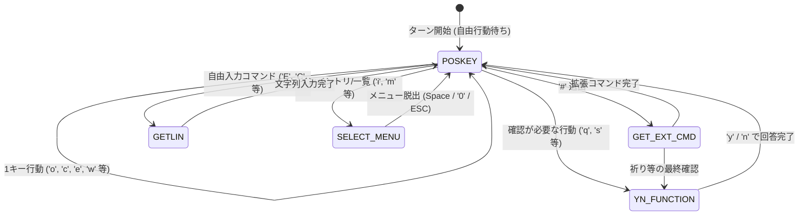
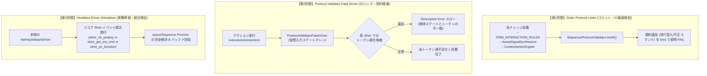
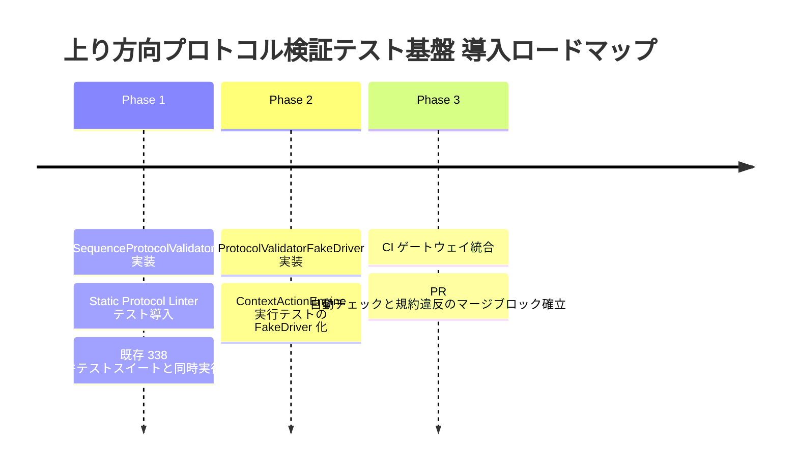

# 上り方向キーシーケンス・プロトコル検証テスト基盤 構想設計書
(Sequence Protocol Validation Architecture)

本文書は、NetHack WASM WebUI において、UI や Game Knowledge Layer (GKL) が発行する **「上り方向（Uplink）キーストローク・シーケンス」が NetHack C コアおよびドライバーの入力ステートマシン規約に適合し、実機で不発・誤爆することなく最後まで確実に完走することを恒久的に保証するテスト基盤** のアーキテクチャ設計構想および運用仕様書である。

---

## 1. 背景と目的 (Background & Motivation)

### 1.1 「単体テスト 338 件 全 PASS」の盲点と実機トラブル
当プロジェクトでは、Vitest による単体テストが 338 件構築されており、全件 PASS を維持していました。しかし、ブラウザ実機上でアシストボタンやコンテキストアクションを実行した際、以下のような重大なキーストローク不発・誤爆トラブルが発生しました。

* **具体例 1: 神への祈り (`#pray`) の不発・無効化**
  * アシスト機能（`AssistSignalSynthesizer`）において、瀕死や石化からの脱出アクションとして `['#pray\n', 'y']` というトークン列が定義されていた。
  * `NetHackWasmDriver` の `queueSequence` はプロンプトごとに 1 トークンを消費するステートマシンであるため、先頭の通常ターン（`poskey`）で `'#'` のみが消費され、続く拡張コマンド待ち（`get_ext_cmd`）に誤って `'y'` が渡されて無効コマンド（不発）となり、祈りが発動しなかった（正しくは `['#', 'pray', 'y']`）。
* **具体例 2: エルベレス刻み (`Elbereth`) における不要な改行コード混入**
  * `ITEM_INTERACTION_RULES` において `['E', '${writeTool}', 'Elbereth\n']` のように末尾に `\n` が付与されていた。
  * C コアの `getlin`（行入力）は渡された文字列を直接メモリバッファへ書き込むため、明示的な改行コード `\n` は不要であり、文字化けや意図しない動作を引き起こす要因となっていた。

### 1.2 原因分析：モック一致検証の限界
従来の単体テストは以下のようなコードで構成されていました：
```javascript
// 従来の単体テスト（モック一致テスト）
const result = AssistSignalSynthesizer.synthesize(context);
expect(result.primaryAction.actionKeySequence).toEqual(['#pray\n', 'y']); // PASSしてしまう！
```
このテストは**「コード作成者が書いた期待値と、実装が一致しているか」**を確かめているだけであり、**「そのトークン列が NetHack C コア / ドライバーの入力プロトコルに適合しているか」**は一切検証していませんでした。

さらに、`docs/8_testing/Scenario_Testing_and_Event_Capture_Architecture.md` で設計された `ScenarioDriver` は、実機からキャプチャしたイベントログを再生して GKL や UI の状況解釈を検証する **「下り方向（Downlink）」** のテスト基盤であり、UI や GKL が発行したキーストロークが C コアのステートマシンで正しく受理されるかという **「上り方向（Uplink）」** を検証する仕組みが欠落していました。

### 1.3 双方向テストピラミッド（Downlink vs Uplink）の確立
堅牢な Rogue-like WebUI を成立させるためには、情報の「下り」と「上り」の双方が独立して検証されなければなりません。

```
【双方向テストピラミッド】

  ┌─────────────────────────────────────────────────────────┐
  │                 WebUI / Player / Touch                  │
  └───────────────▲─────────────────────────┬───────────────┘
                  │                         │
     [Downlink: 下りテスト]        [Uplink: 上りテスト (本文書)]
     Scenario Testing 基盤         Sequence Protocol Validation
     ・実機イベントキャプチャ      ・プロトコル規約リント (静的)
     ・ScenarioDriver による再生   ・仮想ドライバーによる遷移検査
     ・GKL / Advisor の現況解釈    ・Headless 完走エミュレーション
                  │                         │
  ┌───────────────┴─────────────────────────▼───────────────┐
  │         NetHackWasmDriver / C-Core State Machine        │
  └─────────────────────────────────────────────────────────┘
```

### 1.4 動的型付け言語におけるランタイム規約検査（Design by Contract）の意義
TypeScript などの静的型システムでは `Array<string>` 以上の制約を課すことが難しく、「`'#'` の次には必ず `DEFAULT_EXTCMDS` の要素が来なければならない」「`poskey` で消費される文字列は 1 文字または `DIR_*` でなければならない」といった**文脈依存ステートマシン制約**をコンパイル時に完全に表現することは困難です。
したがって、プロトコル規約を明文化し、自動テストスイート内で実行時に契約検査（Contract Validation）を行う仕組みが不可欠となります。

---

## 2. NetHackWasmDriver 入力ステートマシンのプロトコル規約
(The Protocol Contract)

`NetHackWasmDriver` は、C コアから発生する Shim コールバックに応じて `tryConsumeSequenceToken` を呼び出し、待機中のキューからトークンを 1 つずつ消費して C コアに返答します。
各入力コンテキスト（Shim）が要求するトークンフォーマットおよび制約は以下の通り厳密に規定されます。



### 2.1 入力コンテキスト別トークン規約 (Context Specifications)

| 入力コンテキスト | C コア側 Shim | 想定される操作 | 許容されるトークンフォーマット | 禁止事項・違反例 |
| :--- | :--- | :--- | :--- | :--- |
| **`poskey`** | `shim_nh_poskey` | メインターン自由行動入力 | ・長さ 1 の文字列（ASCII 1 文字: `'a'`〜`'z'`, `'#'`, `'E'`, `'i'`, `'\x1b'` 等）<br>・抽象方向コード（`'DIR_N'`, `'DIR_E'`, `'DIR_S'`, `'DIR_W'`, `'DIR_NE'`, `'DIR_NW'`, `'DIR_SE'`, `'DIR_SW'`, `'DIR_SELF'`） | ❌ 改行コード（`\n`, `\r`）を含む文字列<br>❌ 複数文字（`'#pray'`, `'apply'` 等）<br>❌ 長さ 0 の空文字 |
| **`get_ext_cmd`** | `shim_get_ext_cmd` | `#` 入力後の拡張コマンド名入力 | ・`NetHackWasmDriver.DEFAULT_EXTCMDS` に含まれる有効なコマンド名（例: `'pray'`, `'engrave'`, `'chat'`, `'jump'`, `'sit'`, `'tip'` 等）<br>※先頭の `'#'` はドライバー側で除去されるため付与可能だが、推奨はプレーン名 | ❌ 末尾の改行コード（`'pray\n'` ➔ テーブル引きに失敗し `-1` となる）<br>❌ `DEFAULT_EXTCMDS` に存在しない未知のコマンド文字列 |
| **`yn_function`** | `shim_yn_function` | `[yn]` や選択肢付き確認プロンプト | ・単一の回答文字（`'y'`, `'n'`, `'q'`, `'a'`, `'\x1b'` 等）<br>※プロンプトの `choices` 文字列に含まれる文字 | ❌ 複数文字の文字列<br>❌ 改行コード（`'y\n'`） |
| **`getlin`** | `shim_getlin` | 刻み文字・名前・任意文字列の入力 | ・任意の文字列（例: `'Elbereth'`, `'Excalibur'`） | ❌ 末尾改行コード（`'Elbereth\n'`）<br>※ドライバーが `strToUTF8` で C メモリへ直接複写するため `\n` は不要 |
| **`select_menu`** | `shim_select_menu` | インベントリ・スペル選択メニュー | ・選択レター（`'a'`, `'b'`, `'*'` 等）<br>・数値入力（数量指定）<br>・終了コード（`' '` (Space), `'0'`, `'\x1b'` (ESC)） | ❌ メニューに存在しない無効なキー |
| **`getch`** | `shim_nhgetch` | More プロンプト、方向確認等 | ・単一キー（`' '`, `'\x1b'`, 方向キー等） | ❌ 複数文字 |
| **`display_file`** | `shim_display_file` | ヘルプ・テキストモーダル表示 | ・ページ送り（`' '`）または終了（`'\x1b'`） | ❌ 制御不能な長文 |

### 2.2 トークン消費モデルの原則 (Token Consumption Principles)
1. **1 プロンプト = 1 トークン消費の原則**:
   * `queueSequence([t0, t1, t2])` に投入された配列は、C コアが新しい入力を要求する Shim に到達するたびに `shift()` されて 1 つずつ消費される。
   * 1 つのトークンの中に複数の入力を詰め込む（例: `'#pray\n'`）と、最初の `poskey` で先頭文字 `'#'` しか読まれず、残りが破棄されるか後続プロンプトを破壊する。
2. **プレースホルダー解決の原則**:
   * アクション定義内の動的トークン（例: `'${writeTool}'`）は、実行前にインベントリ内の実際のスロット文字（例: `'b'`）または指（`'-'`）に置換された上でドライバーに渡されなければならない。
3. **改行コード（`\n`, `\r`）不要の原則**:
   * WebUI のドライバーレイヤーは C コアの関数を直接 Hook しており、TTY 端末のような行バッファリングを介さないため、いかなるコンテキストにおいても `\n` をトークン末尾に付与してはならない。

---

## 3. 検証アプローチの比較検討とアーキテクチャ設計
(Verification Approaches & Architecture)

キーシーケンスの整合性を保証するために、網羅性・実行速度・精度の異なる 3 つの検証アプローチを比較検討します。

### 3.1 アプローチ比較

| 項目 | アプローチA: Static Protocol Linter | アプローチB: Protocol Validator Fake Driver | アプローチC: Headless Driver Simulation |
| :--- | :--- | :--- | :--- |
| **検証対象** | 全アクション定義のトークン配列（静的定義） | アクション実行時のトークン消費シーケンス | 本物のドライバー + モック C コアによる完走 |
| **実行速度** | **極小 (1〜5 ms)** | **極小 (5〜20 ms)** | **中 (50〜200 ms)** |
| **検知できる問題** | ・末尾 `\n` や `\r` の混入<br>・不正な拡張コマンド名<br>・`poskey` での複数文字トークン<br>・不正な方向コード | ・ステート遷移とトークンの不整合<br>・トークン不足（途中で止まる）<br>・トークン過剰（入力後にゴミが残る） | ・ドライバー内部のバッファリング不整合<br>・非同期イベントディスパッチの不具合<br>・実際の `eventHook` の破壊 |
| **実装・保守コスト** | **低**（スキーマ検証ルールの記述のみ） | **中**（軽量ステートマシン作成） | **中〜高**（C コア Shim 挙動のエミュレーション） |
| **テストの場所** | 単体テスト（全ルール走査） | コンポーネントテスト・ActionEngine テスト | ドライバー統合テスト |

---

### 3.2 アーキテクチャ設計：3層ハイブリッド防壁体制 (Defense in Depth)

本設計では、3つのアプローチを競合させるのではなく、**「3層のハイブリッド防壁」**として統合運用します。



---

## 4. 各レイヤーの詳細設計

### 4.1 【第1防壁】静的プロトコルリンター (`SequenceProtocolLinter`)
GKL およびアクションエンジンに登録されている全ルール・全シグナルから `keySequence` や `actionKeySequence` を抽出し、静的ルールに基づいて一括検証します。

#### 検証ルール一覧:
1. **No Newline / Carriage Return (`RULE_NO_NEWLINE`)**:
   * トークン内に `\n` または `\r` が含まれていないこと。
2. **Poskey Token Length (`RULE_POSKEY_FORMAT`)**:
   * 先頭トークン（通常ターン入力）は、長さ 1 の文字であるか、`DIR_*` 形式の抽象方向コードであること（プレースホルダー `${...}` を除く）。
3. **Extcmd Validity (`RULE_EXTCMD_VALID`)**:
   * 先頭が `'#'` の場合、第 2 トークンは `NetHackWasmDriver.DEFAULT_EXTCMDS` に実在するコマンド名であること。
4. **Valid Direction Codes (`RULE_VALID_DIR_CODES`)**:
   * 方向コードを使用する場合、`DIR_N`, `DIR_E`, `DIR_S`, `DIR_W`, `DIR_NE`, `DIR_NW`, `DIR_SE`, `DIR_SW`, `DIR_SELF` のいずれかであること。

---

### 4.2 【第2防壁】契約検査フェイクドライバー (`ProtocolValidatorFakeDriver`)
テスト環境において `NetHackWasmDriver` のインターフェースを満たしつつ、トークン消費のたびに厳密なステート遷移検証を行うダミードライバ。

#### ステートマシン遷移モデル:
* `queueSequence(tokens)` を呼び出した際、内部トークンリストを保持。
* 各ステップでシミュレートされる C コアコンテキスト（`poskey`, `get_ext_cmd`, `yn_function`, `getlin` 等）を呼び出すメソッドを提供：
  * `stepPoskey()`
  * `stepExtCmd()`
  * `stepYn(choices)`
  * `stepGetlin()`
* トークンがコンテキストの規約に反している場合、またはトークンが足りない／余っている場合に**詳細な診断情報（Descriptive Error）**を出力して例外を投げます。

---

### 4.3 【第3防壁】Headless 結合シミュレーション (`HeadlessDriverSimulation`)
既存の `NetHackWasmDriver.test.js` の知見を活用し、モック化された C コアメモリ環境で本物の `NetHackWasmDriver` を駆動させます。
* 本物の `driver.queueSequence(tokens)` を実行。
* `driver.eventHook('shim_nh_poskey', ...)` などを順次ディスパッチ。
* トークンが正しく消費され、`queueSequence` が返した Promise が正常に resolve されるかを検証。

---

## 5. 実装プロトタイプとテストコード例 (Prototypes & Test Suites)

Vitest ですぐに導入・実行可能な具体的なプロトタイプコードおよびテストコードの仕様を示します。

### 5.1 プロトコルバリデータモジュール (`src/testing/SequenceProtocolValidator.js`)

```javascript
/**
 * SequenceProtocolValidator.js
 * 上り方向キーシーケンス・プロトコル検証エンジン
 */
import { NetHackWasmDriver } from '../driver/NetHackWasmDriver.js';

export const VALID_DIR_CODES = new Set([
    'DIR_N', 'DIR_NE', 'DIR_E', 'DIR_SE',
    'DIR_S', 'DIR_SW', 'DIR_W', 'DIR_NW', 'DIR_SELF'
]);

export class SequenceProtocolValidator {

    /**
     * トークン配列のフォーマットを静的に検証
     * @param {Array<string|number>} tokens 
     * @param {Object} [context={}] 
     * @returns {{ valid: boolean, errors: string[] }}
     */
    static validateSequence(tokens, context = {}) {
        const errors = [];
        if (!Array.isArray(tokens)) {
            return { valid: false, errors: ['tokens must be an array'] };
        }
        if (tokens.length === 0) {
            return { valid: false, errors: ['tokens array cannot be empty'] };
        }

        tokens.forEach((token, index) => {
            const strToken = String(token);

            // 1. 改行文字の混入検査
            if (strToken.includes('\n') || strToken.includes('\r')) {
                errors.push(`Token[${index}] "${strToken}" contains forbidden newline characters (\\n or \\r).`);
            }

            // 2. 抽象方向コードの妥当性検査
            if (strToken.startsWith('DIR_') && !VALID_DIR_CODES.has(strToken)) {
                errors.push(`Token[${index}] "${strToken}" is an invalid direction code.`);
            }
        });

        // 3. 拡張コマンド (#) のシーケンス検査
        if (tokens[0] === '#') {
            if (tokens.length < 2) {
                errors.push('Sequence starts with "#" but is missing the extended command token.');
            } else {
                const extCmdToken = String(tokens[1]).trim().toLowerCase().replace(/^#/, '');
                const validExtCmds = NetHackWasmDriver.DEFAULT_EXTCMDS;
                if (!validExtCmds.includes(extCmdToken)) {
                    errors.push(`Token[1] "${extCmdToken}" is not a valid NetHack extended command.`);
                }
            }
        }

        // 4. 先頭トークン (poskey) の単一文字検査 (プレースホルダーは除外)
        const firstToken = String(tokens[0]);
        if (!firstToken.startsWith('${') && !firstToken.startsWith('DIR_') && firstToken !== '#') {
            if (firstToken.length !== 1) {
                errors.push(`Token[0] "${firstToken}" in poskey must be a single character or direction code.`);
            }
        }

        return {
            valid: errors.length === 0,
            errors
        };
    }
}
```

---

### 5.2 Vitest テストコード例 (`tests/protocol/sequenceProtocol.test.js`)

```javascript
/**
 * sequenceProtocol.test.js
 * アクションシーケンスの規約適合テストスイート
 */
import { describe, it, expect } from 'vitest';
import { SequenceProtocolValidator } from '../../src/testing/SequenceProtocolValidator.js';
import { ITEM_INTERACTION_RULES } from '../../src/core/knowledge/ITEM_INTERACTION_RULES.js';
import { AssistSignalSynthesizer } from '../../src/core/knowledge/AssistSignalSynthesizer.js';
import { NetHackWasmDriver } from '../../src/driver/NetHackWasmDriver.js';

describe('Sequence Protocol Validation Suite', () => {

    // -------------------------------------------------------------------------
    // 【第1防壁】静的リンターテスト: 全 ITEM_INTERACTION_RULES の走査
    // -------------------------------------------------------------------------
    describe('Approach A: Static Linter on ITEM_INTERACTION_RULES', () => {
        it('全アクションルールの keySequence がプロトコル規約に適合していること', () => {
            const violationReport = [];

            ITEM_INTERACTION_RULES.forEach(rule => {
                if (rule.action && Array.isArray(rule.action.keySequence)) {
                    const result = SequenceProtocolValidator.validateSequence(
                        rule.action.keySequence,
                        { ruleId: rule.id }
                    );
                    if (!result.valid) {
                        violationReport.push({
                            ruleId: rule.id,
                            sequence: rule.action.keySequence,
                            errors: result.errors
                        });
                    }
                }
            });

            expect(violationReport, `プロトコル違反が検出されました:\n${JSON.stringify(violationReport, null, 2)}`).toEqual([]);
        });
    });

    // -------------------------------------------------------------------------
    // 【第1防壁】静的リンターテスト: AssistSignalSynthesizer 生成シーケンスの検査
    // -------------------------------------------------------------------------
    describe('Approach A: AssistSignalSynthesizer Action Sequences', () => {
        it('神への祈り (#pray) シーケンスが正しく分割されていること', () => {
            // 瀕死・治療手段なしのコンテキストを模擬
            const context = {
                statusAccessor: {
                    hp: { current: 1, max: 20, percent: 0.05 },
                    turns: 100,
                    conditions: ['ill']
                },
                inventoryStateManager: { getItems: () => [] }
            };

            const assist = AssistSignalSynthesizer.synthesize(context);
            expect(assist.primaryAction).not.toBeNull();
            
            const seq = assist.primaryAction.actionKeySequence;
            const result = SequenceProtocolValidator.validateSequence(seq);
            
            expect(result.valid, `Errors: ${result.errors.join(', ')}`).toBe(true);
            expect(seq).toEqual(['#', 'pray', 'y']); // 改行なし、3トークン分割
        });
    });

    // -------------------------------------------------------------------------
    // 【第3防壁】Headless Driver シミュレーションテスト: #pray の完走エミュレーション
    // -------------------------------------------------------------------------
    describe('Approach C: Headless Driver Simulation for #pray', () => {
        it('本物の NetHackWasmDriver で #pray シーケンスが正常に消費・完走すること', async () => {
            const driver = new NetHackWasmDriver();
            const seqTokens = ['#', 'pray', 'y'];

            let sequenceFinished = false;
            const seqPromise = driver.queueSequence(seqTokens).then(() => {
                sequenceFinished = true;
            });

            // 1. poskey 入力待ち発生 -> '#' が自動消費される
            const poskeyRes = await driver.eventHook('shim_nh_poskey', []);
            expect(poskeyRes).toBe('#'.charCodeAt(0));

            // 2. get_ext_cmd 入力待ち発生 -> 'pray' が自動消費される
            const extCmdRes = await driver.eventHook('shim_get_ext_cmd', []);
            const prayIdx = NetHackWasmDriver.DEFAULT_EXTCMDS.indexOf('pray');
            expect(extCmdRes).toBe(prayIdx);

            // 3. yn_function 入力待ち発生 ("Are you sure you want to pray?") -> 'y' が自動消費される
            const ynRes = await driver.eventHook('shim_yn_function', ['Are you sure you want to pray?', 'yn', 'y']);
            expect(ynRes).toBe('y'.charCodeAt(0));

            // 4. シーケンスが完了し、Promise が resolve されること
            await seqPromise;
            expect(sequenceFinished).toBe(true);
        });
    });
});
```

---

## 6. 実装ロードマップと CI 自動検知体制
(Implementation Roadmap & CI Strategy)

本アーキテクチャをプロジェクトへ段階的に導入し、今後の機能追加時におけるリグレッションを 100% 防止するためのロードマップを策定します。



### 6.1 各フェーズの作業項目
1. **Phase 1: 静的プロトコルリンターの配備 (即時導入)**
   * `src/testing/SequenceProtocolValidator.js` を作成。
   * `tests/protocol/sequenceProtocol.test.js` を追加し、全アクション定義の一括リントを実施。
   * `npm test`（Vitest）に組み込み、テスト件数を 338 件から増強。
2. **Phase 2: FakeDriver によるアクション実行契約テストの配備**
   * アクションの動的パラメータ解決（`${writeTool}` ➔ `'b'` 等）後のシーケンスが規約に違反しないかをテストするヘルパーを整備。
3. **Phase 3: CI ゲートウェイ化と新規開発ガイドライン策定**
   * GitHub Actions などの CI パイプラインにおいて、テスト失敗時に PR マージをブロック。
   * `docs/3_gkl/` や `docs/8_testing/` に「キーシーケンス追加時のプロトコル規約チェックリスト」を明記。

---

## 7. まとめ (Summary)

本構想の実現により、下り方向（Downlink）のイベント再生を検証する `ScenarioDriver` と、上り方向（Uplink）の入力規約を検証する `SequenceProtocolValidation` が両輪として揃い、NetHack WASM WebUI のテスト信頼性は完全なものとなります。
「単体テストが通っているのに実機で動かない」という Rogue-like 特有のステートマシン不整合問題を、開発初期の段階でミリ秒単位で検知・根絶できる開発環境を実現します。
